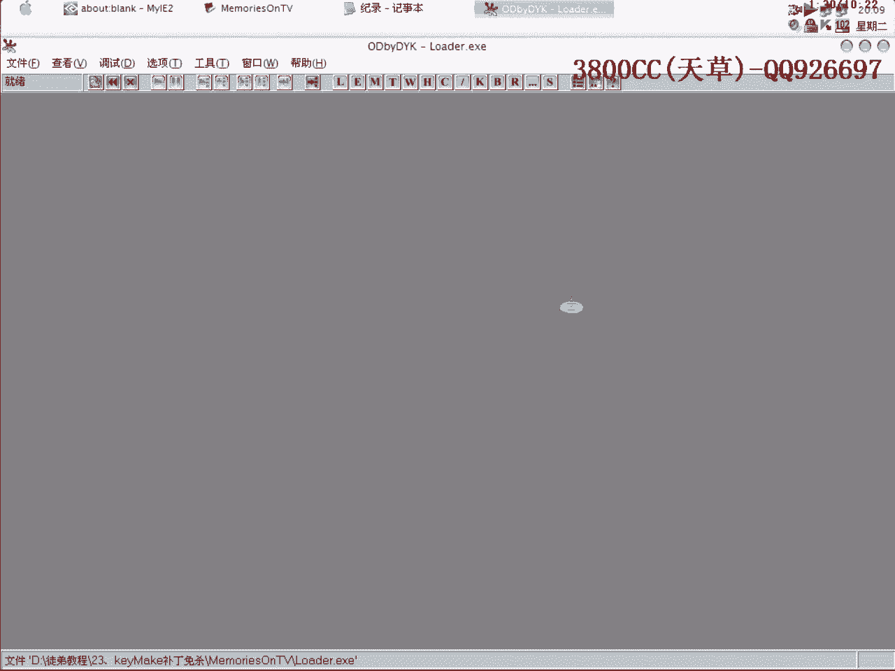
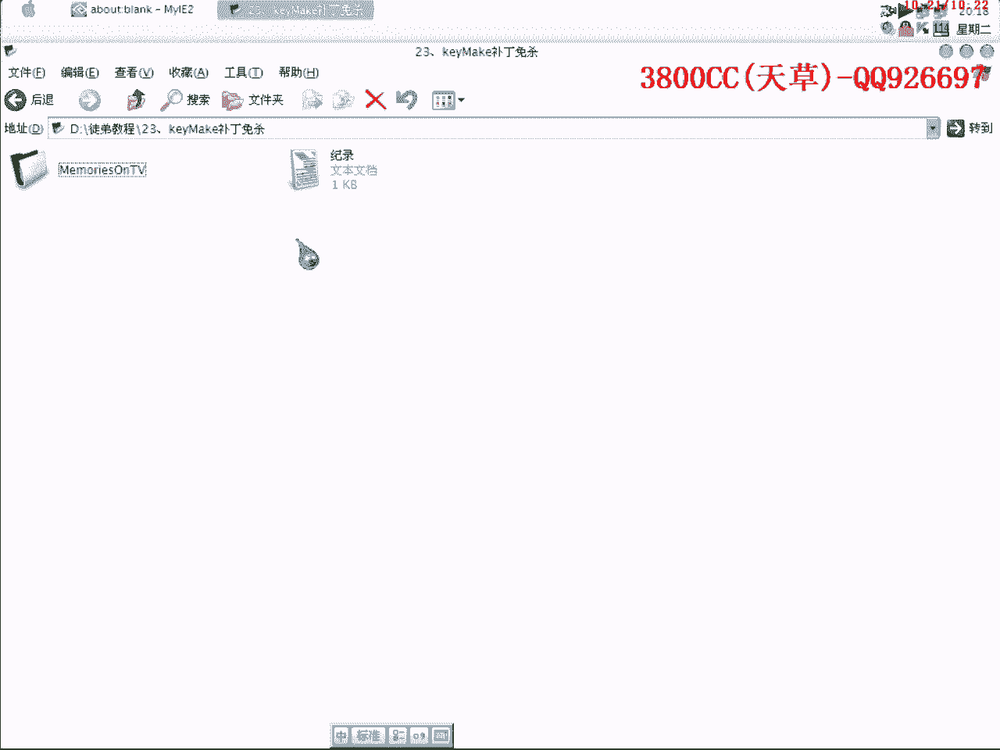

# 3800cc(天草)-天草流初级 - P24：23、keyMake补丁免杀 - 白嫖无双 - BV1qx411k7qA

大家好。

这几课我们就做那个，这个我还是拷过来吧，第23课，第23课，第23课，第23课，第23课，第23课，然后呢，这两个是我做的另外一个程序，一个游戏外挂的，是一个游戏外挂的，一个补丁，我们来看一下。

这个是我做好了一个免刷的，用卡吧来扫一下，他这里提的是什么什么，QQ密码病毒，来看一下这个，是一样的，免刷的，然后我们来看一下，用这个我们这节课里面做的，那一个补丁，卡吧现在开着了，我们还是来。

先来扫一下，大家看到了，这个是被，这个是被查杀的，这个呢，是我做的一个免杀的，那我们这节课就来做一下，那我们这节课就来做一下。

这个和上一节课的那个什么，这个和上一节课的那个什么，手动派系也有点相似的。

手动派系也有点相似的，我们先到OEP附近，快到OEP那个地方去，先到这里来吧，大家看到了，大家看到了，他这里就是说这个是OEP了，他直接跳到OEP，我们就是说卡吧，卡吧他就是有一些很好，其实是非常好。

非常好欺骗的，我们把那个路口改一下，就OK了路口改一下就OK了，我们从这个地方可以开始改，这节课介入，我介入一下那个看一下这个是什么程序，这个，VC++的，我们来打开VC++，我就借助这个程序。

借助VC++的前面三个，这三个，我按我的方法来修改，先修改掉，然后呢，然后大家看到了，那个OSPARK，OSPARK 2。12，他是怎么样回到，怎么样回到OEP的，我们来找一个OSPARK的，手动派系。

这个程序没有安装，打开不了，这个，不是的，哪个是，看一下，这个是，这个是吗，这个是的，我们来看一下他怎么样回到OEP去的，怎么样回到OEP去的，咱们直接，硬件端点，大家看到了，他是把，把这个什么。

OEP给压占，大家看，注意这里，开始压占，然后通过这个REND，我们也可以，借用这个方法，好，这个OEP是多少，他这个OEP刚才，00400100，然后通过REND，返回，我们先把这个保存。

这大家看到了，因为我们这是代可的，有的时候就复制的时候，我们来看一下和上一期可以，也有相似，他这个，这里，这个好像看不出来，看不出来，看不出来，就是说在OEP附近的，快跳到OEP附近，因为这里是动态的。

我们都可以复制的，这个不用管了，嗯，就是说因为他是一个，LOD，我们就是说要做的一个目的，并不说并不只是，并不仅仅是，程序免杀就够了，而且还要让他能够正常运行，因为他里面有，不停的数据。

有的朋友可能会说我在上面加一层可，其实你可以试一下，你要是在上面加一层可的话，这个LOD就用不了了，因为他那5D数据被压坏了，被压坏了，好我们来看一下我们做的这个，可以正常使用的，可以正常使用。

那我们来看一下，大家看到了，就是用我们的一个PE头，用我们的那个，VC++的一个头部，替换上去就可以了，然后呢我这里还有一个，带花指令的一个方法，带花指令的，这个大家也可以试一下，这里，直接复制下来。

幸好这个后面有很多空数据，有很多空数据让我们利用，他这个也是一样，带花指令的这个也是一样的，诶，不对啊，怎么多了，我把这个，重新来吧，这个，无所谓的，这个把上面移上去就可以了，这个路。

好我们可以单步来走一下，这个也是一个VC++头，大家可以试一下用什么，用那个，derviz的头部啊，或者其他程序的头部都可以来试一下，这都是带花指令的，这个是带花指令的，然后这个意思也是差不多的。

首先把这个放到，Eax里面去，把那个OEP啊，放到Eax里面去，然后再压占，然后再压进来了同时返回，这个也是一样的，这个大家可以回去试一下，照样可以成功的，照样可以成功的，这个我就不演示了。

我就不演示了，方法是这个样子的，但是这个要注意的一点就是，上面有PropoEax，然后下面肯定有一个ProxyEax，这个是对战平衡的，大家一定要知道，像刚才我用我这个方法，就是说不加花指令的方法。

直接的话，就这样，只是替换一个头，偏向卡巴，怎么连贴不了，重新这个样子，只是连那个一下，偏向卡巴，然后再Proxy一下，然后再通过Return，这个也可以就是说，我们可以这个样子来试一下，Jump。

通过Jump来看一下，那就不需要这个了，我们直接通过Jump，0。4。0。1，看一下，我们可以这个样子来看一下，看行不行，直接通过Jump，这也可以的，也就是说方法非常非常多，方法非常非常多。

方法非常非常多，我们看一下行不行，我们看一下行不行，好像有点不行，看一下，再来看一下，可以的，这个程序没有安装，所以就有点问题，今天这个课程，也就这么多，思路就是这个样子的。

也是通过修改快要跳转到OEP的地方，修改快要跳转到OEP的地方，修改快要跳转到OEP的地方，修改快要跳转到OEP的地方，然后我们接触的当然就是一些，可以不带花指令的，也可以带花指令的，当然就是说。

这个骗卡巴是可以骗过去，但是其他的上头软件我就不知道了，但我原先用Lodon的话，它是不会，不会把这个报毒的，不会把这个报毒的，今天课程就到这，这个是带花指令的，这两个就不要了吧，只是做一个演示。

