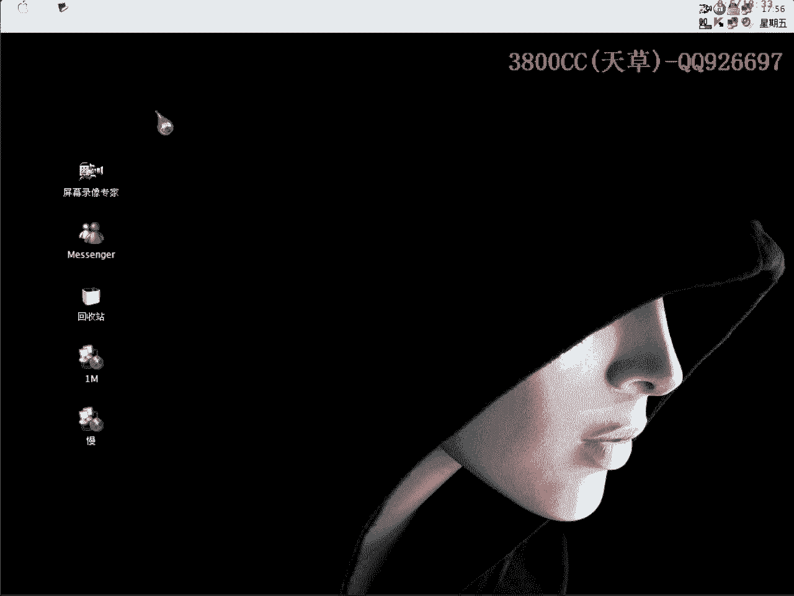
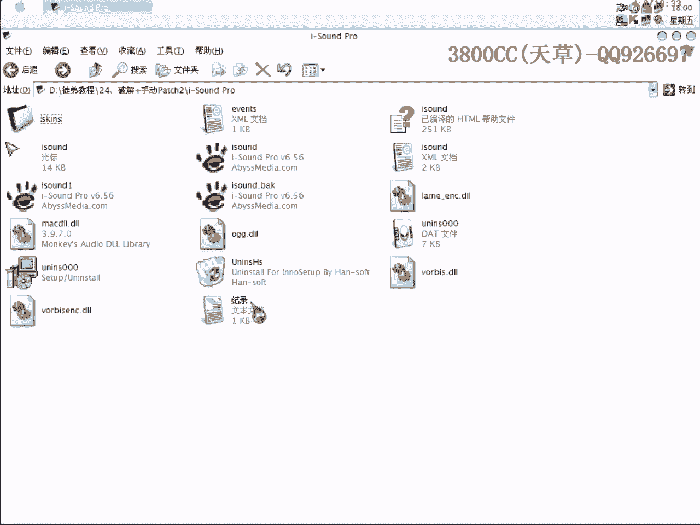
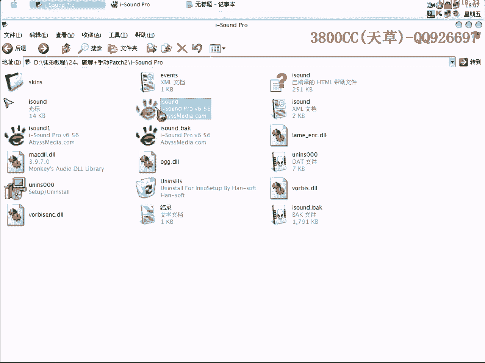
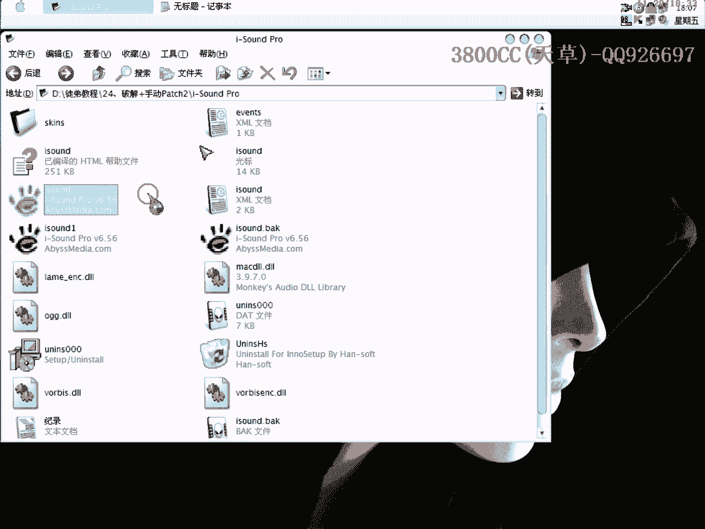
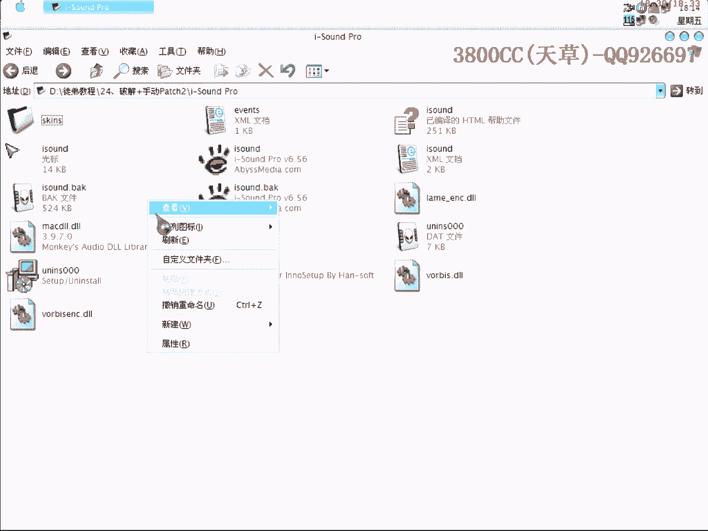

# 3800cc(天草)-天草流初级 - P25：24、破解+手动Patch2 - 白嫖无双 - BV1qx411k7qA

大家好啊，现在来进行我们的第二时刻。

我们这个初级版是安排26颗，这节课是破解加手动patch2，因为前面有朋友说手动patch1有点没看懂，再做一个实例，当然这手动patch呢，也只是局限于一些压缩壳，加密壳有的也可以。

但就是说有些壳有CRC验证，有校验，就比如说ASProtect，ACProtect，穿衣甲的这些壳，是有CRC验证的，但是也有办法去手动patch它，当然像ASProtect手动patch就比较麻烦。

需要大家自己去写非常多的代码，所以大家首先必须把这些基础给弄懂，这另外说一下，有人泄露教程，虽然我知道是谁，但是还是出于面子上，我也不多说了，仅此一次，但是我发现第二次的话，我这个人是有些爱恨分明。

虽然说是非常不高兴，但是毕竟我把大家当兄弟看，要是大家也不认为我这个人是兄弟的话，那我也没办法了，进入正题吧，这是这么一个软件，这两个文件是一样的，我只是把它备份一下，这个也是一个脱壳，也是一个加壳的。

然后这个是我脱了壳的，我们先来脱壳，先用脱壳来调色一下，因为你看一下，我们要运行这个的话，你看一下会有什么提示，找不到这个什么XML，因为他还调用这两个文件，所以运行之前都会有这么一些错误提示。

所以我们就必须把这个名字给改一下，这样就是方便我们调色了，这是没问题的，大家再点上面，点上面右键Settings，Settings设置的，这里有一个This copy is unregistered。

这个呢，大家看到我这输入了一个，然后因为我在做调色之前试了一下，这里我输入之后它保存了，至于保存在哪里我也没有去找，因为我们这个破解是比较简单一点的，包括吧，我们就利用这个标志。

This copy is unregistered，就是这个版本是一个没有注册的版本，这有点奇怪，直接载入。

插到这边，输入我们的This，就打这里吧，这里就可以找到了，大家看到下面有个registered version，双击进入，这里就非常非常明显了，大家看到了，就是这个跳了，这个跳了它肯定就是说。

因为我们刚才显示了这是一个没有注册的版本，这个跳肯定就没有跳了，我们在这个地方直接下段，然后就运行，成运行了，我们要怎么样让它断下来了，那就我们右键吧，大家看到了，因为当出现这里的时候。

就是说程序出现这个This copy is unregistered，这里的话它就会显示一个，它就会显示这么一个东西，显示这个文件，所以这里就会断下来，大家看到这是我在实验的时候输入了一个假的注册码。

它肯定是有记录的，至于在哪里记录我们就不用去管了，所以说大家在实验之前，在试运行的时候假注册一下，在我们破解的时候就方便，它直接就读取了，我们这里可以进去看一下，注意到因为这个是AL，AL控制这个跳转。

我们在进去的时候注意AL，AL就是后面这两位，你看现在这里是00，大家看到这里有这么一堆字符串，大家再可以来看一下它一个算法，其实搞破解多了像出现这堆字符串的时候，之后就会知道有哪些算法。

这个是典型的MD5的一堆字符串，这里有MD4也有MD2，是LC验证的，所以说我们要以现在阶段的水平去分析，它这个算法的话是非常非常难的，对大家而言是非常非常难的，大家可以把这个复制下来，这些都复制下来。

有可能是我们的注册码，至于是不是现在还不好说，大家看到这里要循环，大家看一下是Compare ESI和381进行对比，大家看到ESI是1，我们这个地方要循环的话要循环很多次，要循环381次。

非常非常的麻烦，我就不循环了，大家可以自己去循环一下，这个调转，直接把它弄过去，所以在这里我们就看不到这个算法了，这里它就是会每循环一次这个字符串会变的，这个样子应该就是说可以算出我们的注册码了。

但是基本上没有来信了，大家看到了，是这么一个字符串，大家再仔细可以找一下，这个781这个字符串的字符呢，是在这个里面抽取的，而且还是有一定的规律，好，我也不多说了，注意看，这里。

Move E BX放到E C E X里面去，然后AL呢要控制我们的一个，要控制我们的一个调转，我们这里要走慢一点，走慢一点，E B X这里，E B X里面一直都是，一直都是那个，0啊，大家看到了，3。

我们在这个地方呢，大家看到了，我们在这个地方呢，大家看到了，此时的EDX，是这么一个字符串，那我们来找一下，E C X是唯一的，我们可以把这里改成E C X看一下，这里我删掉，不要了，算了，看一下。

原先的是这个，我们把它改成E C X，这里也copy一下，大家看到E X就唯一了，这里它就调转了，大家看到了吧，这里就是我们的一个包袱点了，当然方法还有很多，方法还有很多，大家可以自己去试验。

这只是一种而已，因为我们等一下要手动patch，在上一节课里也说过，我们要以修改最少的字节，就是说我们的目的，要以修改最少的字节达到破解的目的，那一个就是最少了，这里只修改了一个，直接覆盖。

因为你要改其他的名字等一下又要改一下，覆盖。

registered to winning，这里显示是registered，这里就开始可以升级了，大家看到了，它有一个交应，有一个交应比较麻烦，删掉，我们现在关键的地方找到了，关键的地方找到了。

大家看一下，0045，4D5D2，8B，C3，自然是D3，就这么一个对应的关系，在前面那个QQ糖给我说了，不知道怎么算来的，没想到这个还是，大家还是有那么一点不懂，这个字节就是这个位置了。

我们还可以重新来看一下，大家可以来数着看一下，从这里也可以数一下，大家看到了，555是一个字节嘛，这是354，然后接下来这个8B就是355了，然后1C就是356，然后接下来的83就是357。

358 359，然后这是35A 35B 35C，最后这个B8是35D，然后04呢35F，35E，然后CF是35F嘛，然后4D呢自然就是60，00是61嘛就这样数嘛，刚才这个也是一样的嘛，8B是52嘛。

是D2嘛，C3就是D3了嘛，好，我们可以把这个脱壳的文件给删掉了，现在用我们夹壳的，在手动patch，看是不是夹壳了，是的啊，好，我们这里用那个，ESP定律啊，直接到要跳转到OEP那个位置去啊。

这个我在上期可以说过了，接下来我们需要找一个空余的位置，空闲位置，在上期说了啊，找那个SFX的一个段，但是大家看一下，UPX这个没有这么一个段啊，没有这么一个段，这个没有这么一个段，那我们现在看一下。

可以来对照一下，我们现在这个位置，现在所在的这个0065，BDA3是哪个，在哪个区段里面，我们来看一下，65BD，这个是65C0，那就是在UPX1这个区段里面啊，在这个区段里面。

那我们大家看到这下面都是一些空数据，UPX非常方便啊，给了我们很多空余的空闲，我们就在这个里面啊，在这个里面直接改，好，选一个整数位置啊，C0，好，我们现在呢，是要把那个C3改成C1啊。

在输入的时候这个大家要注意，这个在会变第一节课里面也说过啊，这里它是以字母开头的，这里要加上一个0，不然的话你等一下，我不加0看一下是什么一种情况，是D3啊，这个位置，大家看到了，没有定义啊。

加0就可以，然后直接跳到OEP去，把这一句复制过来，这里呢，让它跳到这里来，跳到我们Patch的这个位置，是0065，BDC0，大家看到了，直接跳到这里面来，那我们现在来走一下看一下，我们用转存窗口啊。

数据窗口来观察一下，大家看到了，原始的是C3啊，是C3，我们等一下走过这里看一下情况，跳到这里来，走过这一步之后，C1变成C1了啊，然后再跳到OEP，程序就可以运行了啊，我们把这个复制一下。

我们现在来运行，卡Bug退了吧，大家看到了，这样就可以了啊，事先你要夹注册一下，夹注册一下，因为这个夹注册了之后，你的一个注册信息会保存到，具体是哪里，我也没找啊，不用去找了，就这样，可以了啊。

这个要安装的啊，这个文件好像损坏了，大家回去自己安装一下吧，还是安装一下，看一下，是哪一个，今天这节课的内容啊，就这么多，就这么多，大家要，怎么说呢，要把基础的，要把基础的给打扎实好。

那个基础要打扎实好，因为后面会讲到像一些强客，AC啊，AC ProTech的，AC ProTech之类的一些，可能一些直接手动Patch，好 再見了。

