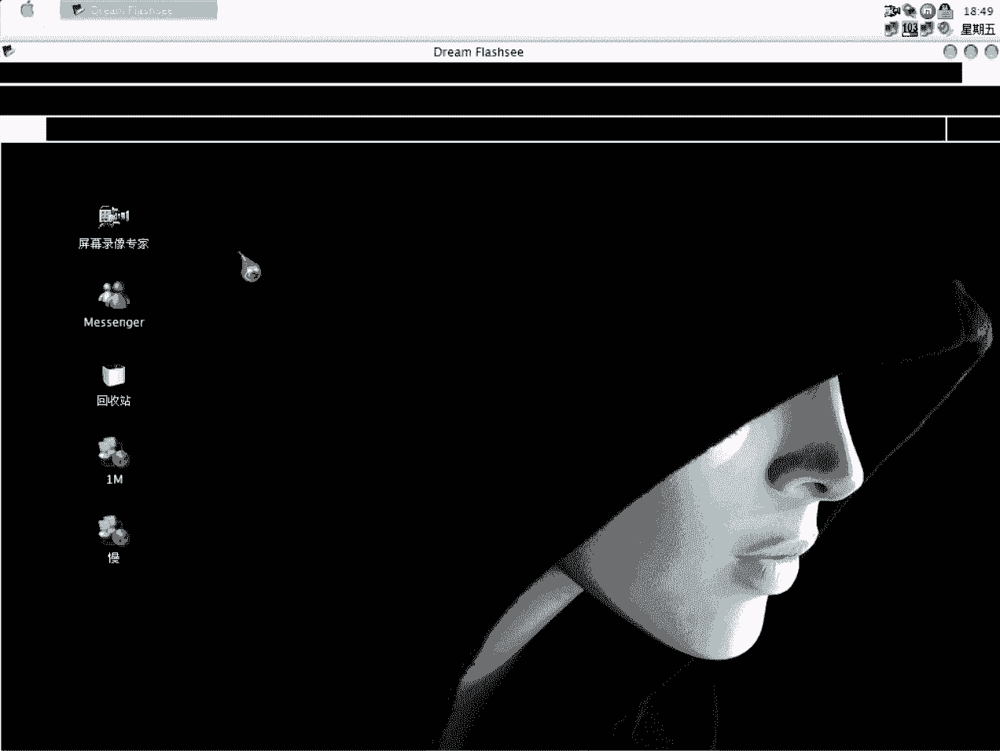
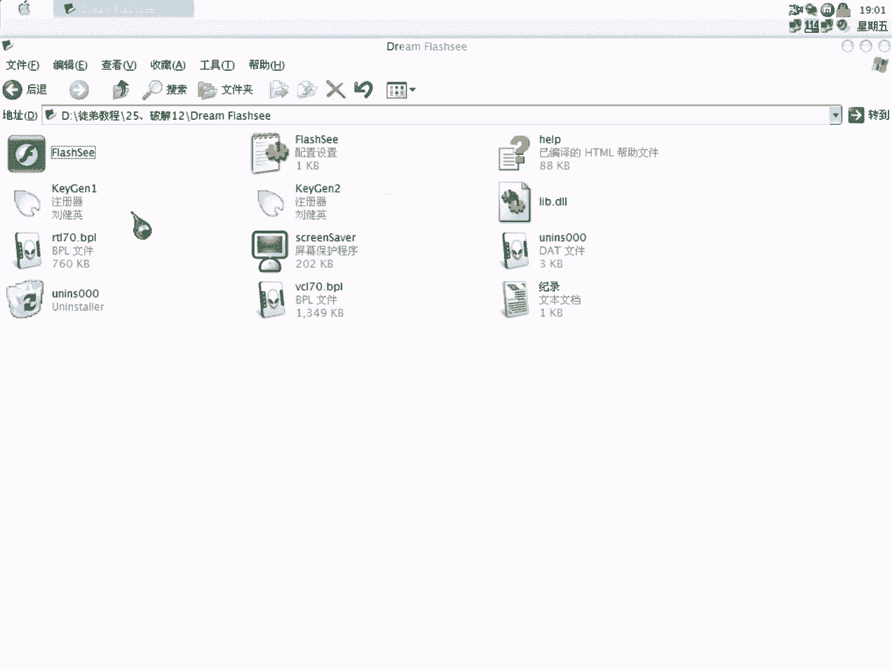

# 3800cc(天草)-天草流初级 - P26：25、破解12 - 白嫖无双 - BV1qx411k7qA

大家好，现在来进行我们的第25课，倒数第2课，先来查一下可。

没有可的，我们来注册一下吧，就这样，程序点了register之后，什么反应都没有了，那我们就可以判断，程序是重启验证的，那重启验证我们首先的出发点就是说，在这个目录里面，看一下有没有可疑的文件。

大家找一下，这里有一个配置文件，这个当然是首先要找的，这里很明显了，我们刚才输入了假码，说明它是这个，这个是NI文件，那我们就用到这个断点了，我们直接载入它，大家看到了。

它在读取这个文件的user name，就是用户名，没有什么可行性，我们再运行一下，这样读完，现在在读那个注册码，那我们现在返回，因为刚才读了个用户名，我们基本上找不到什么东西，它读完注册码之后。

这个才是我们后面要找的，大家看到了，它这里有这么一个字符串，这里是把我们的用户名转换，通过算法转换为字符串，我们要是要分析算法的话，这个进去就可以找得到了，当然我们现在不需要，大家看到右边有这些字符串。

就是刚才我们这里，把我们的注册名转换为字符串之后，然后再右转换一下，大家看到这里有一个字符串，接下来呢，咱们来看一下，是tween cut，tween就是字符串，cut是相连接。

它就是要把这两个字符串连接在一起，大家看一下结果，没错吧，连接在一起，这里又通过一种算法，把我们的注册名转换一下，那就说明这个程序有点可疑，等一下大家就知道为什么了，大家看对照，它现在取我们的字符串。

不好意思，它又取了几位，这个是有规律的，大家可以自己找一下，再取几位，大家看7710是前面5位，然后后面5位，这个D04呢，后面5位是从这里，中间隔了4位，再取5位，再来看一下，中间隔两位，再取5位。

这个就是我们的规律了，在每台机上规律都是这样，只不过就是说你的用户名不同的话，这个就不同了，这个也是一样的，它也是取，大家看到它首先把字符串全部转后位大写，字母是，取前面3位，然后呢，接着中间隔一位。

这个D2没有取，取9717，然后F7，再取F6，中间又隔一位，它就是说这个是353结构，然后呢，没取中间，就是中间空一位，如果这个字符串有多少位呢，比如说这个字符串有20位，那我们到时写注册码。

写注册集的时候，就是把它写成，取前面3位，就是这个，怎么说呢，大家不懂那个，字符串，S代表字符串，然后呢，这个代表第一位，从第一位开始取，然后呢，后面代表取，上位是代表那个长度。

那它后面这个就组成了一个，等一下，这里到时怎么样，这个后面就可以看得出来了，然后这个也是一样的，也是这个字符串，这个S代表这个字符串，然后这是代表说第5位开始取了，大家看到了，F是你1嘛，09。

这个D2是第4位，第5位，第5位开始取，这个会取5位，这个也是一样的，它这个字符串是这样组成的，这个我还没有填，等一下大家就知道会填什么了，然后这是5位，大家再看一下，12345678910。

从第11位开始取，然后呢，它代表3个，这个就是W里面的那个格式了，大家看到card，又是有一个card，N呢，这个N代表什么，我们可以进去看一下，大家看到这三个都齐全了，看一下，没有什么东西。

大家看到了，以这个横杠相接，连接在一起了，大家看对战里面的变化，计算器里面开始变了，这里很明显，这个就是以横杠，代号，在D2里面就是字符串类型的用代号来括起来，代号来引起来，大家看到这里也有一个。

这里呢，记录下来，我们的加码和真正的入手码进行比较，这里呢，也是一样，大家看到了，它有两个注册码，我们把这两个给复制下来，做一下记录，现在我们来试一下这两个注册码是否正确，大家看到了，注册成功了。

这个时候把这个注册码给删掉，直接把这个注册码给替换进去，看一下是否注册成功就知道了，这两个都是注册成功了，刚才我已经跟大家说过，它就是帮我们用户名用两套算法，都分别算出字符串来，分别又算注册码。

所以有两个注册码，我们现在可以做一下内存注册机，所以说呢，我跟大家说，现在要把基础打好，不然后面分析算法就完全不懂了，它出现在EAX里面，这里是出现第一个注册码，这里是出现第二个注册码。

我们可以做两个内存注册机，中段次数为1，第一字节是18，指令长度，大家看到这里有十个字母，每两个字母为一个字节，所以就是说是5，内存方式，因为注册码是出现在EAX里面的，刚才大家看得很清楚了。

接着我们来做第二个，第二个地址是这个，然后呢，也是18，也是5个，这都不用改，大家可以来运行，这是我们的第一个注册码，把这个复制过来，注册就OK了，不注册了，这是我们的第二个注册码。

当然它是对应的一个用户名的，大家看到了，因为我们的用户名已经写入这里了，所以刚才内存注册机算出来的注册码，自然就是对应的用户名的，大家下去可以自己实验一下，用自己的名字来试试。

