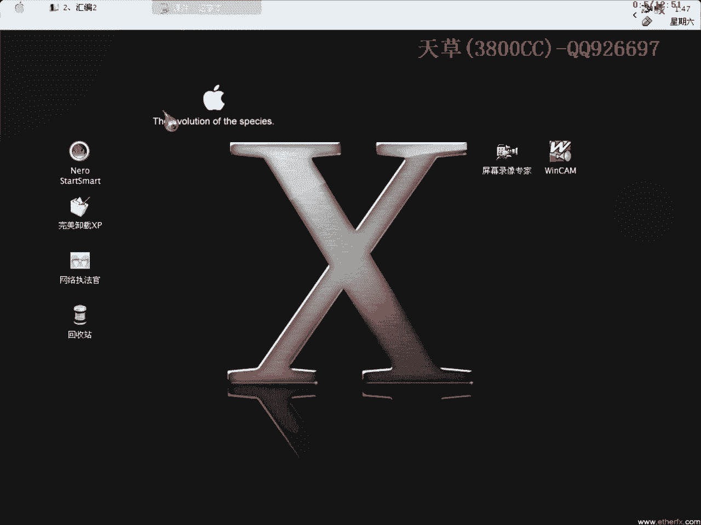

# 3800cc(天草)-天草流初级 - P2：2、汇编2 - 白嫖无双 - BV1qx411k7qA

大家好，现在来进行我们的第二课，也是汇编。

这节课主要是讲一下数据传送指令，因为汇编里面的操作指令非常非常多，我们就分段来进行，就是说在破解里面经常遇到的或者怎么样的，就分段来进行，分每个课式不一样，我们今天这节课是讲数据传送指令的。

数据传送指令，Move，就是英文缩写，英文单词，Move，懂这个英文的意思就是说是移动的意思，在汇编里面把它理解为传送，传送数据之类的，传送指令是使用非常频繁的，相当于高级语言中的复制语句。

指令的格式有Move，reg就是register，这个缩写，我这是缩写，计算器的意思，memory就是存储器，imm是立即数，就是一个操作数，比如说，Move，ex，1234。

1234就可以理解为立即数了，传送填充指令，这跟上面又有不一样了，传送填充指令是把位数短的圆操作数，传送到位数长的一个目标的操作数里面去，它这个格式有两种，Move，Sx，Jx，这个后面也是一样的。

它这个分为符号填充和零填充，S是single，是single信号的意思，符号的意思，第一个就是符号填充了，第二个是0，这个就是零填充了，符号填充指令，看一下，这个自己看一下，再看一下这个例子。

Al=87h，经过这条指令之后，Cx和Dx里面值呢？Cx里面值是多少呢？大家可以看到，这是Single符号填充，也就是说在最高位填充符号位，符号位是F，大家会说这个0呢？

因为这会员里面有一个约定输成的惯例，就比如说1234h，你可以写成就是1234h，如果是0，1，b，a，c，d，h的话，这前面必须加一个0，如果是b134，你用它来表示，这么一个16音字。

必须要加一个0，在前面加一个0，为什么呢？因为当第一位数为字母的时候，会员里面要辨认是有符号还是没符号的，所以我们用0来表示为正的，这里可以看一下用，这里用OD来对比一下就知道了，先不管。

我们就是说随便汇变一个位置吧，大家可以看到，这里提示，这里提示位置的标志符，就是说OD会员里面检测到的状况，不知道是有符号还是无符号的，我们在前面加一个0，就可以汇变进去了，大家应该清楚了。

就是说当第一位数为字母的时候，前面必须要添加一个0，因为第一位数为数字的话，可以添加也可以不添加，也可以表示为0，2，3，4，H，这个是一样的，就是说经过了一个符号填充指令之后，就变为FF8H。

填充的是像他的最高位，填充的是符号位，在这里要加一个0，这也是一种规范吧，然后再执行第二条DLL，执行的是0填充，也就是说像最高位填充0，这样就是00了，大家可能会说，为什么前面不加一个0呢？

其实你加也可以，因为0是数字嘛，你可以不加，看一下交换指令，交换指令是两个计算器里面的，计算器或者是内存中的一个变量，进行交换的，它的格式就是这样的，这个是非常简单的，这个我不用多说，看一下后面的。

取有效地址指令，L1A，你可以把它理解为装载的，load，大家可以把它理解为load，1A呢就是有效地址，这个是汇表里面的一个字，所以它这个L1A就是取有效地址的指令，取断计存器呢，这个也是一样的。

DS1SFSGSSS，这些都是一些断计存器，加上一个L就是取的意思，load就是装载的意思，这个呢，看一下对战的一个操作指令，对战是一个重要的数据结构，这个我们在破解的时候，和计存器是利用的是相当多的。

它具有先出先进后出的一个特点，通常用来保存程序的返回地址，这里呢对战操作肯定是一般就是，这两种两大类型，一个是进战和出战，也可以说是压战或者弹战，可以这样去理解，进战操作，大家可以看得到。

这个我在给黑银上的节课里面，专门讲ESP定律的一个理论的时候，有专门讲过，这里还是来稍微说一下，首先载入了之后，计存器的值是这么一堆，单步走，注意看这里，注意看对战，单步走，大家可以看得到。

刚才的值全部都压到这里来了，这是EX， ECX， EDX， EBX，刚开始的是ESP，大家再看清楚，全部都压进来了，把最初始的计存器压进来，这里不是说了吗，通常是用来保存程序的返回地址的，大家可以说。

再看一下这个，一个一个来，刚才说的是PUSH A，来看一下，找一个PUSH的，到这里来看一下，大家看清楚，此时的你可以看一下，一个字一个字进战的时候，SP，这个是对16进制16位的操作而言。

我们现在是32位的，可以不用去看它，当然你要是懂这个ESP，就说32位的话，16位的就非常非常容易了，一个双子进战，系统自动完成两步操作，完成两步操作，一个是ESP值，ESP减去4。

就是说当前的当前的ESP值，变为ESP减4，然后呢，操作数操作数放到ESP的值里面去，这里大家可以看到，他这个EDI的指示，也就是说他把004010000压入EDI，我们单步走一下，看清楚。

ESP的指示，0012FFS，按这里所说的，就是他应该，单步走过这一行之后，走过这一行代码之后，他的ESP值，因为变成0012FFSA0，没错了，没错了，没错了，这里有一个括号ESP值，是什么意思呢。

就是说他一个类层地址，类层位置，这是EDI值，大家可以看到，右键，点一下那个转存窗口，Country家居来到0012FFSA4，可以看一下，可以来看一下会有什么变化，大家可以看到，刚才我们。

他这里也就说了，操作数，方语，类传的位置，类传地址，再来看一下，看清楚，走到这里来，这里是0012FFSA4，单步走，这里的一个操作数，是004010000，走过之后，ESP值-4，然后操作数指向。

我们现在所在的ESP指向，刚才所在的操作数，0012FFSA0，大家可以看到，是正确的，是正确的，已经指向了，把这个弄懂后面就容易了，后面就容易了，PUSH A，还有PUSH A，这个一般。

见的比较少一点，见的比较少一点，这就是PUSH A的，这个我刚才也说过，另外就是POPO，POPO，出站，这个跟刚才那个是相反的，一样的，意思理解，理解的方法是一样的，理解的方法一样，大家自己看一下。

看一下，还要说一下，这个是对应出现的，如果前面出现PUSH，后面一定会有一个POPO，这也是要满足一个对站平衡，这里PUSH A，这里也是，后面程序后面肯定会有一个POPO，PUSH A，POPO。

我们所用的ESP定律来脱壳的时候，也就是用了这个原理，用了这个原理，今天咱们的课程就到这，到这，大家自己回去再好好悟一下吧，悟一下吧，再见，再见。

