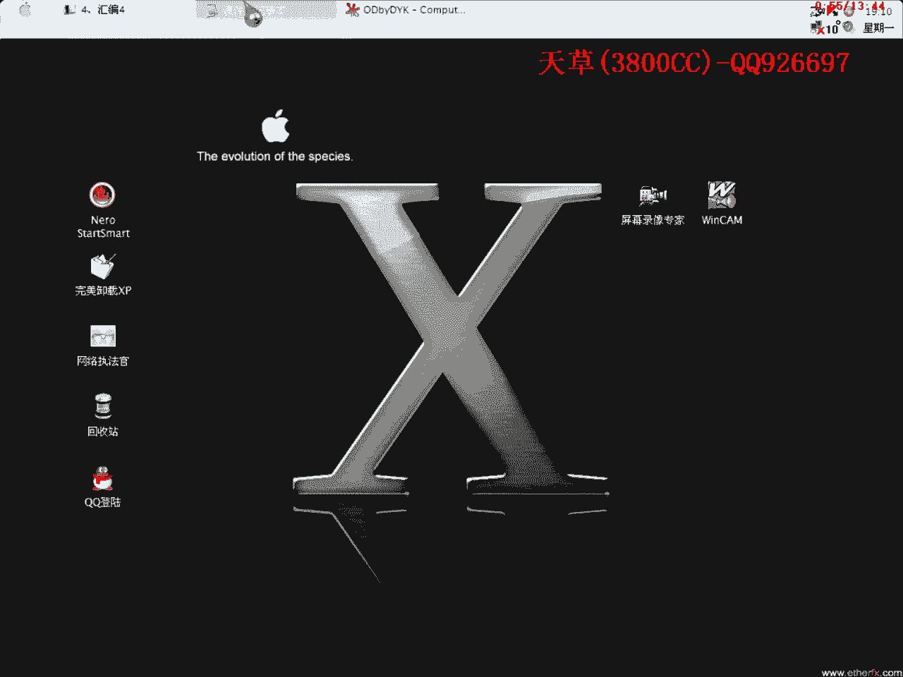
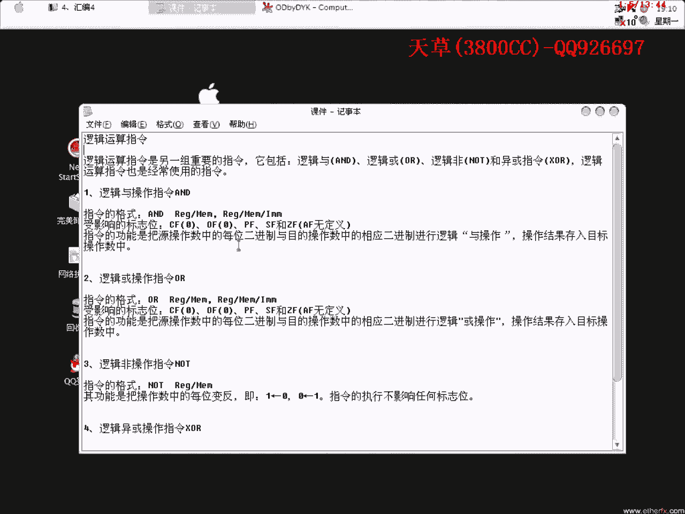
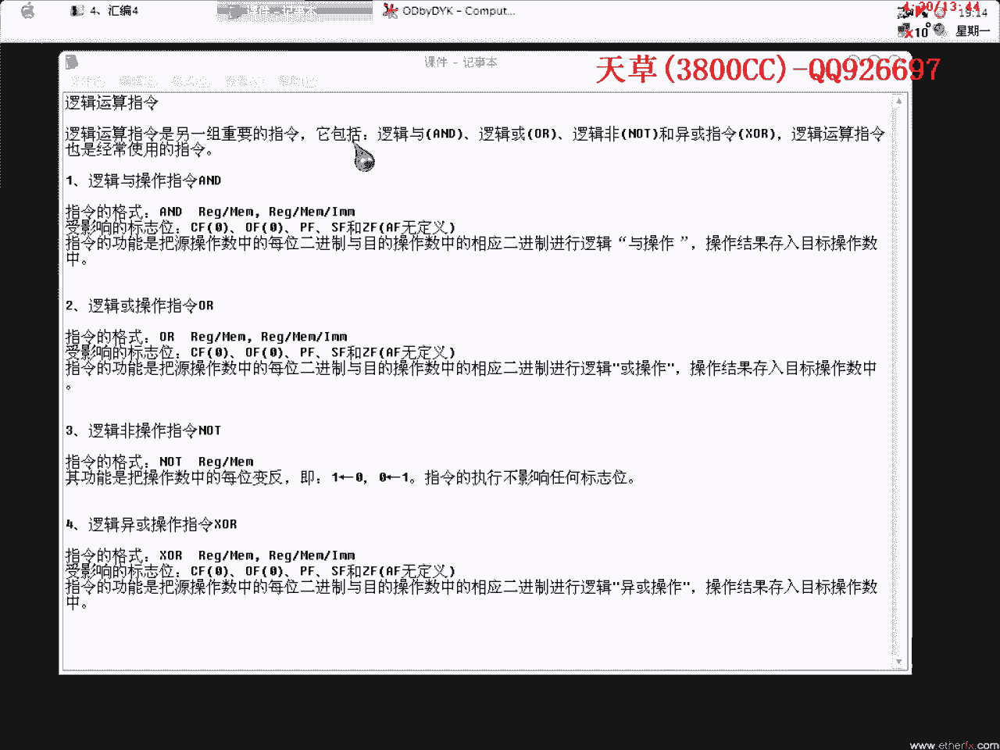
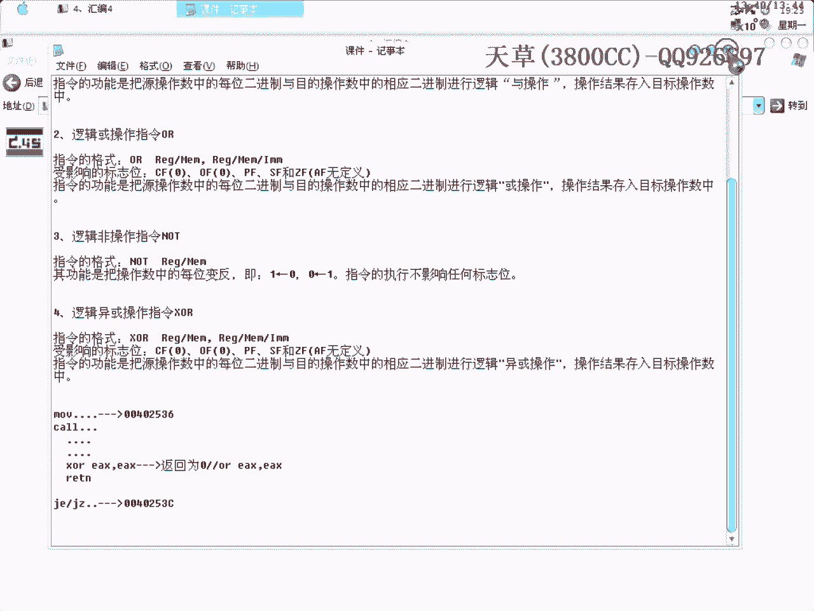

# 3800cc(天草)-天草流初级 - P4：4、汇编4 - 白嫖无双 - BV1qx411k7qA

大家好，现在来进行我们的第四课，第四课也是讲汇编的，昨天有朋友提出，每节课的课程时间拉长一点，多讲一点内容，这个我开始也考虑过，因为我们现在情况比较特殊嘛，因为我们是在QQ群里面发布嘛。

QQ群只有256兆，这样一来就不够了，所以就把课程就是说稍微精简了一点，后面使用空间的话，昨天我问问老哥已经弄到网通的空间了，电信的空间也快弄好了，等我们用空间的时候我会把课程加大，这个大家请放心。

今天我们这个课程是讲一个逻辑运算指令的。

我们这几天一直都接触一些汇编里面的算术指令，转移指令之类的。

这是汇编的基础，废话不多说了。

逻辑运算指令是另一组重要的指令，包括逻辑语是AND，逻辑或是OR，这些都是一些英文单词，还有就是逻辑非NOTE，这就是异或XOR，逻辑运算指令也是经常使用的指令，逻辑语操作指令，把原操作数的每位二进制。

以目的操作相对应的二进制进行，逻辑语，也就是说这里要求了，不管是十进制还是二进制，要求首先把它转换为二进制，逻辑语就相当于相同的话就不变，比如说我这里来，你1111和100000，这里对它进行相加。

相同的就不变，接下来等于出来的相与，我想一下，等一下，就是这个样子，逻辑或是对应的相反的话就为一，也就是说在这里的话，这里得出来的是1，因为这一位0和1是不一样的，然后再把它转换为16进制，逻辑非呢。

这里是非常明显的，比如说note4，4的二进制是多少呢，0100，最后结果自然就是相反的，1011，就是这个样子，逻辑误会，逻辑误会，这里说的比较抽象，就是说，如果我们在进行操作的时候。

一般是在分析算法的时候会用到计算器，这里要说明一点，因为我们在OD里的数字我已经说过了，它是默认为16进制的，所以这里达到16进制，这里要来看几个有趣的现象，比如说，16进制的5和16进制的5一或。

16进制5和16进制5and，大家看，为什么要这样呢，因为在我们进行算法分析的时候，会经常看到这一类，两个相同的计算器，这个肯定是一样的，这个操作为0，然后把这个0返回之后，这个0就控制了。

上一节课我也给大家说过，G标志位它控制了G1，G0，G1，G，G，G，它返回为0，返回为0，然后J1或者JG，就是受这个0标志位影响的，受这个0标志位影响的，比如说有这样的一段代码，Move一类操作。

然后CALL指令，CALL到一个子程序里面去，子程序里面也是一堆指令，最后，最后对它进行译获，这里返回为0，然后它再通过一个GNT返回，返回到比如说这里是虚拟地址，这里的虚拟地址是多少，然后返回了之后。

返回到虚拟地址，这就是跟着接在一起的，要看这里有多少个字节，一般这个就是6个字节，返回到虚拟地址，这里是J1，J1和JG，然后J1和JG，它决定是跳到哪里去，是跳到正确的位置还是错误的位置。

这个大家应该清楚，所以我们就可以通过，把这里修改为相反的，让它返回为1，这是什么呢，这个我在黑鹰的那一节课程里，好像第40几课，本来是分析算法的，本来是追踪注册码的，EAX就可以达到完美爆破的目的。

这个后面大家肯定会看得到，还有一就是我们刚才给大家说了，可以通过计算器计算工具来计算，另外就是可以通过OD，这里大家可以看得到，我特地找了一个我们今天一个逻辑指令的语句，这里呢，大家可以看到注视窗口。

这里呢，最后的两位，我们怎么样可以通过不用计算器来知道呢，我们在这里L为01，相当于就是说，反会边窗口加上注视窗口再加上计算器窗口，相当于我们的一个计算工具了，三个地方都要看着，EAX，这里。

也是一个地址，也是没变的，两个相同的五货是没有变的，大家看到了是没有变的，再来看一下有没有其他的指令，这里看一下这里，大家看到这里，EDX是00008，咱们当步走过之后变为0，两个相同的一货。

变为0大家可以看得到，注意这三个窗口，记下来之后可以像这样，可以把它做一个记录，70，这个样子我们在做第二次分析的时候，有时候一次分析肯定是分析不出来的。

做第二次分析或者第三次分析的时候就可以不用那么慢了，因为第一次分析的时候我们要慢慢的分析，比如说有些东西还是没有分析出来我们就进行第二次分析，再利用上一次做好的笔记做好这个记录，再往下面走一下。

这里有AND指令，大家不要眼睛看花了不要跟这个，弄混笑了，这里大家看到ECX里面的指，0A280105和0FF，我们先来用计算工具来看一下，货，雨，0A280105，这里结果是5，来看一下。

把货之后的结果保存到ECX里面去，大家看清楚ECX的值，所以说我们可以不通过计算工具了，眼睛就这样看，我就不多说了也就是这几个指令了，大家回去下去之后自己再好好体会一下，今天课程就到这里再见。

