# 3800cc(天草)-天草流初级 - P6：6、汇编6 - 白嫖无双 - BV1qx411k7qA

大家好，這幾課是第六課，也是講匯變的。我在上幾課也給大家提到過，這幾課要給大家講一下調用子程序。因為在分析算法的時候，經常要遇到。先看一下理論的，因為我這裡用derivative稍微寫了一個小的程序。

子程序的調用和返回指令。為什麼有返回指令，等一下大家就知道了，現在用理論來說也不太好說了。子程序的調用和返回是一對互利的操作，也是一種特殊的轉移操作。一方面，之所以說是轉移呢。

是因為當調用一個子程序的時候，程序執行的順序會改變的。因為我們等一下會用到F7來進入Core，所以它的順序是改變的。在這個方面，調用子程序的操作還有轉移指令的功能。另外，轉移指令是一種一去不復返的操作。

當子程序執行完之後，還要求CPU能轉而執行調用指令之下的指令。它是一種有去有回的操作。這裡有回就是通過返回指令來返回。調用指令，Core，它這個格式是這個樣子的。子程序的調用可以分為近和遠的調用。

如果被調用子程序的屬性是近的，那麼Core將調用一個近調用。它把該指令之後地址的偏移量押入對戰中。因為到時候它返回的時候，需要根據押入對戰的偏移量來返回。如果被調用子程序的屬性是遠的。

那麼Core指令將產生一個遠調用。這時調用指令不僅要把該指令之後地址的偏移量押入對戰，而且也要把斷基層器的CS值押入對戰。這個大家想一下就知道了。程序在運行的時候，進入Core之後。

它會返回到Core下一行的代碼。但是它根據什麼來返回呢？根據它押入對戰的偏移量，然後再以一個ESP值，在C裡面，在匯片裡面可以用指針來說。通過一個指針，比如說它把Core的地址是0040，寫一下。

是這麼一個地址。然後呢，它Core這一個地址。然後呢，這下面一般Core是四個長度。它Core進去之後，然後要通過Rent返回，返回到這一行。它通過怎麼樣的返回呢？就是它把這一行的偏移地址。

然後複製給對戰，押到對戰裡面去。然後呢，再通過一個ESP值，就是說把這個對戰，把這個值操作一下。還是隨便來找一下，說不太清楚。比如說，隨便進一個Core，它會把這個Core的一個偏移地址。

押入到對戰裡面，進去。進去，大家看到了，這麼一個地址。然後再複製一個ESP值，複製一個ESP值。好，但不走。然後再通過一個返回，通過返回，好，大家看到了，返回的時候，它會把這個又送上去了，又彈出來了。

然後再返回到下一行，返回到下一行。就大概就是這個道理，大概就是這個道理。好，例如，這一個，就是說，是我寫的一個小例子，一個小例子。這個大家可以自己看，自己看，很簡單的。好，返回指令呢，就是ret。

ret，retn，retn，在那個OD裡面，顯示的是retn。這個是無雙大雅的，就是說差不多。好，現在來看一下我們的實例，現在看一下我們的實例。我這個呢，先看一下我這個工程文件吧。好，def有點大。

打開的時候會有一點卡這個樣子。我這個例子呢，就是說，你輸入註冊碼是正確的話，那麼它這個框框呢，就不是灰色的了，就不是灰色了。好，隨便輸入一個看一下，直接退出，如果錯誤的話就退出。大家先來大概看一下代碼。

看一下代碼，很簡單的，很簡單的。這一句啊，給大家也稍微提一下derivative啊。這一句呢，就是說如果edit2嘛，看一下哪個，這個是edit2。它有一個text的屬性，如果是空的話。

就是說我們沒有輸入註冊碼的話，然後就不動啊，external，看一下，不動。就是說程序沒有任何反應，external就是沒有反應。我在這裡呢，定義兩個變量啊，定義兩個變量，一個是reg。

一個是tempo，把它定義為real型，就是實型的啊，實型的。然後呢，這裡呢，就是說，把edit2，就是我們輸入的註冊碼，轉換一下類型。因為edit2。text，它那個屬性是string。

就是說字符串型的，把它轉換為，我這裡把它轉換為實型的，float型的，float型的。也可以就是說，在OD裡面的意思就是說，把它轉換為浮點型的，float，複製給reg，reg。然後呢，edit1呢。

就是說我們的這個記憶碼，這個記憶碼，也是轉換為實型的，複製給tempo。如果怎麼怎麼樣，如果這個一個算法，很簡單一個算法，就是說在這裡主要的目的呢，就是達到一個講課的一個效果。然後呢。

就是說如果註冊碼正確的話，這個memory，就是這個框，它的一個屬性，屬性就是choose，就是因為我們在這裡的時候，大家看到了啊，它是fixed，就是說假。它那個屬性就是，不蘭特質，它這個屬性是假質。

所以就是灰色了。如果我們這裡是正確的話，就把它複製為choose，就是複製為真，然後就會變色了，就不是灰色了。如果錯誤的話，成語就退出。好，在這裡重新編譯一下，把這個關掉。這裡呢，就是說它很明顯嘛。

是derivate寫的，我這裡是用derivate寫的，這裡就是derivate的。在這裡就可以用到第一第一啊，第一第一。好，用第一第一的目的啊，就是為了找一個按鈕事件，找這個註冊啊，註冊按鈕。

找我們這個註冊按鈕的一個註冊相關代碼所在的位置啊。

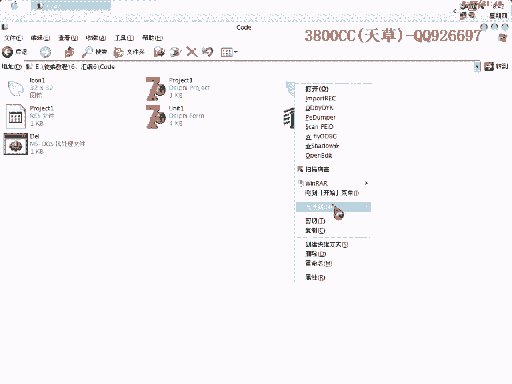

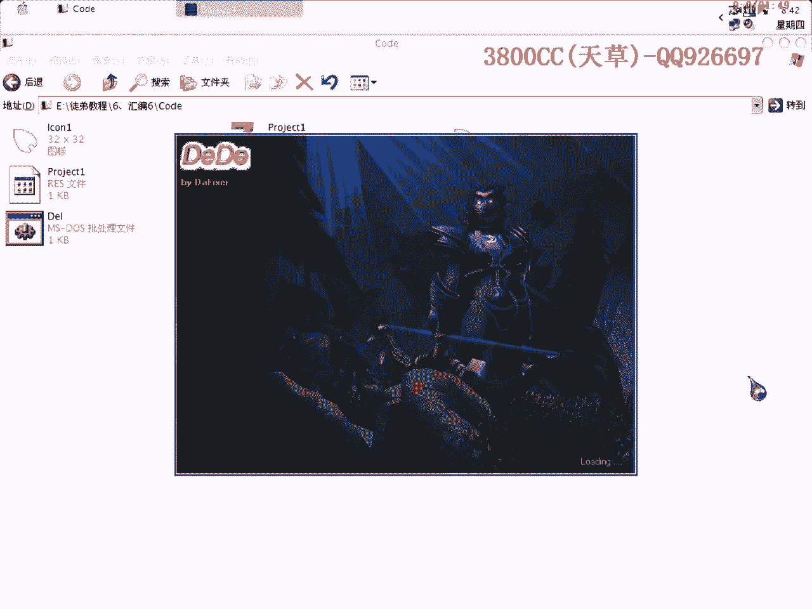

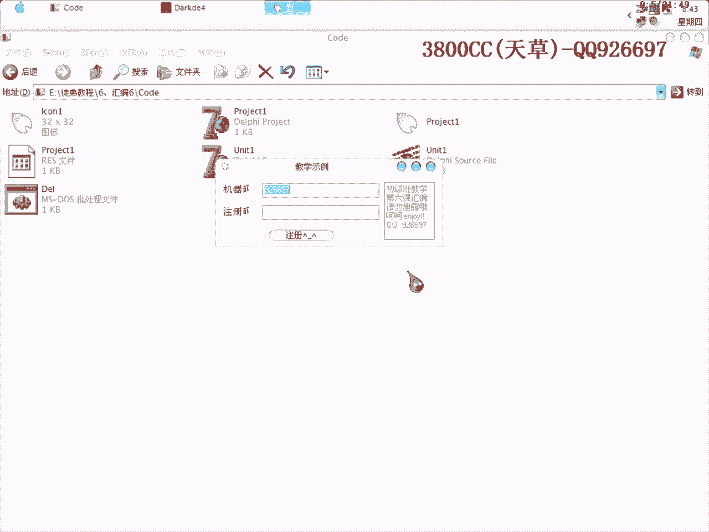

好，第一第一載入之後啊，它需要一下加載，然後這裡會提示版本號為第一七，就是derivate七。第一第一可以適用於BC++和derivate啊，是非常好的一個輔助軟件。好，裝置成功，OK，NO，NO。

就OK了，對，創體。大家可以看到，這裡只有一個創體啊，再點一下過程，看一下過程。在這裡呢，我這個是非常小的一個東西啊，如果是大型的軟件或者軟件稍微大一點的，這裡面會有很多事件。大家可以看到。

這裡只有一個button1 click事件，大家會說，如果一個程序有很多按鈕，也就是button1，button2，button3，那怎麼區分呢？還有一個輔助的軟件，給大家看一下。

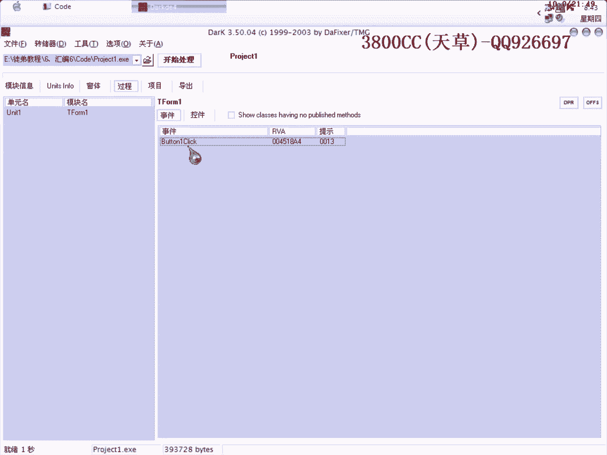

用它來打開啊，好，點RC數據，form，就是我們所在要查找的form相對應的，相對應的一個form窗口。

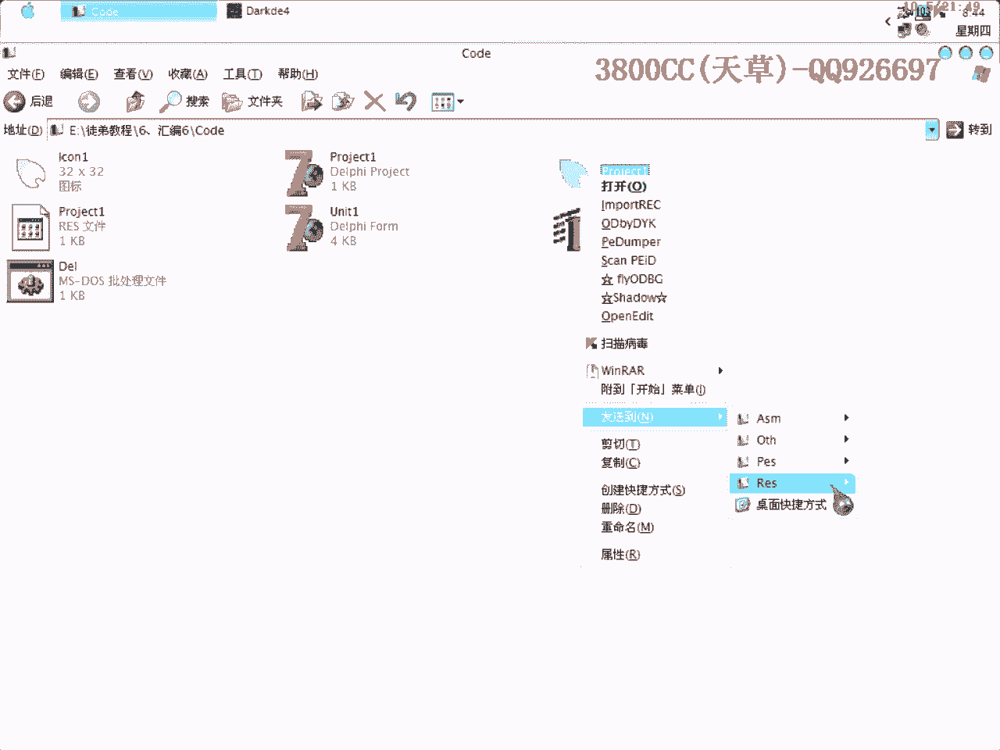

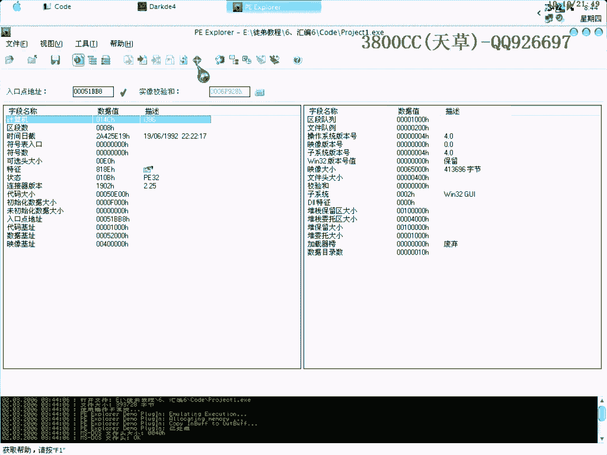

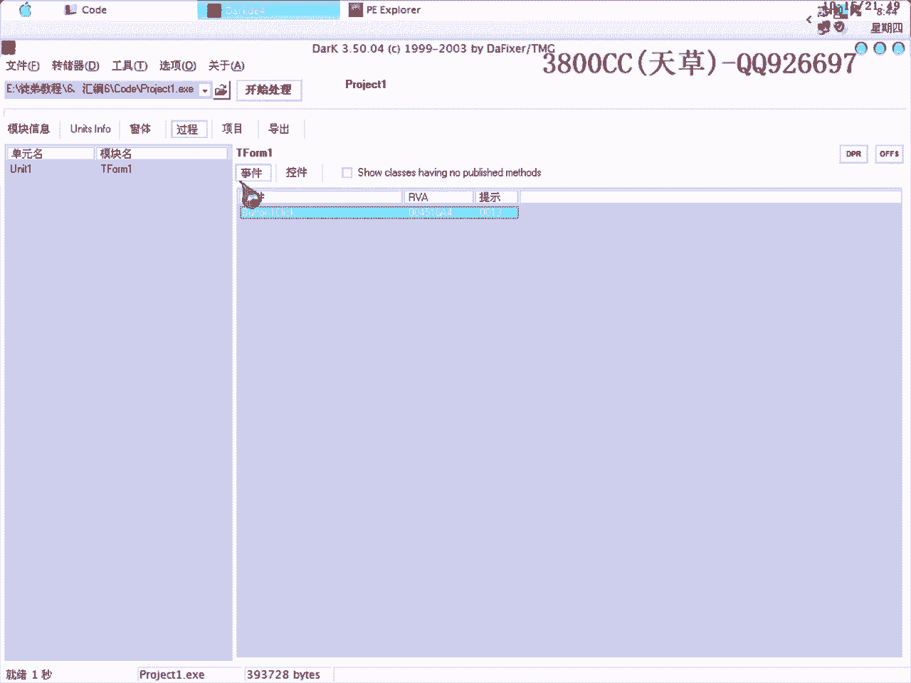

然後雙擊，可以看一下啊，button1，然後點這一下啊，Copy，這就可以看到中文了，這樣就可以區分是不是我們要找的了啊。大家可能會問，為什麼這裡是這個樣子，是幾個號什麼什麼的，這裡啊。

它是unicode的一個代碼。相當於就是，我們平時見的是ASCII代碼嘛，它這裡就是unicode的代碼，所以我們看到的是這樣的。但是，點一下啊，點一下，大家就可以看到是中文了。

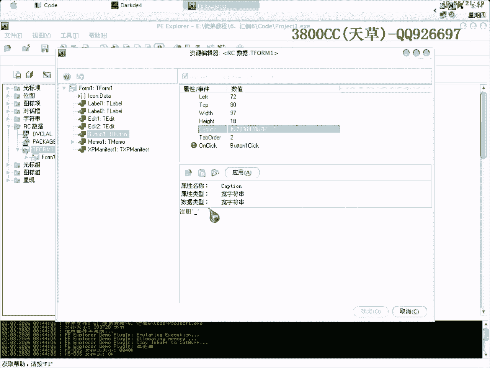

好，因為button1就是我們要找的一個按鈕事件，好，雙擊，哎，不行，怎麼不行呢？

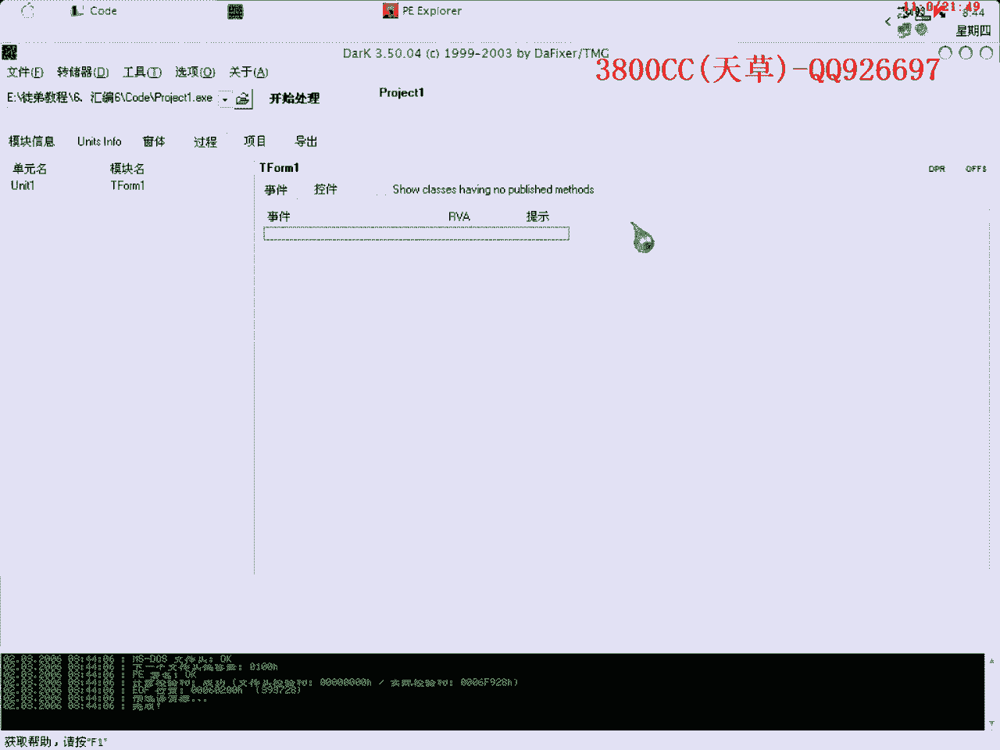

好，有一點問題啊，剛才有一點問題，好，雙擊，這就是我們那個button啊，就是我們那個註冊那個按鈕的一個起始位置啊，起始位置。

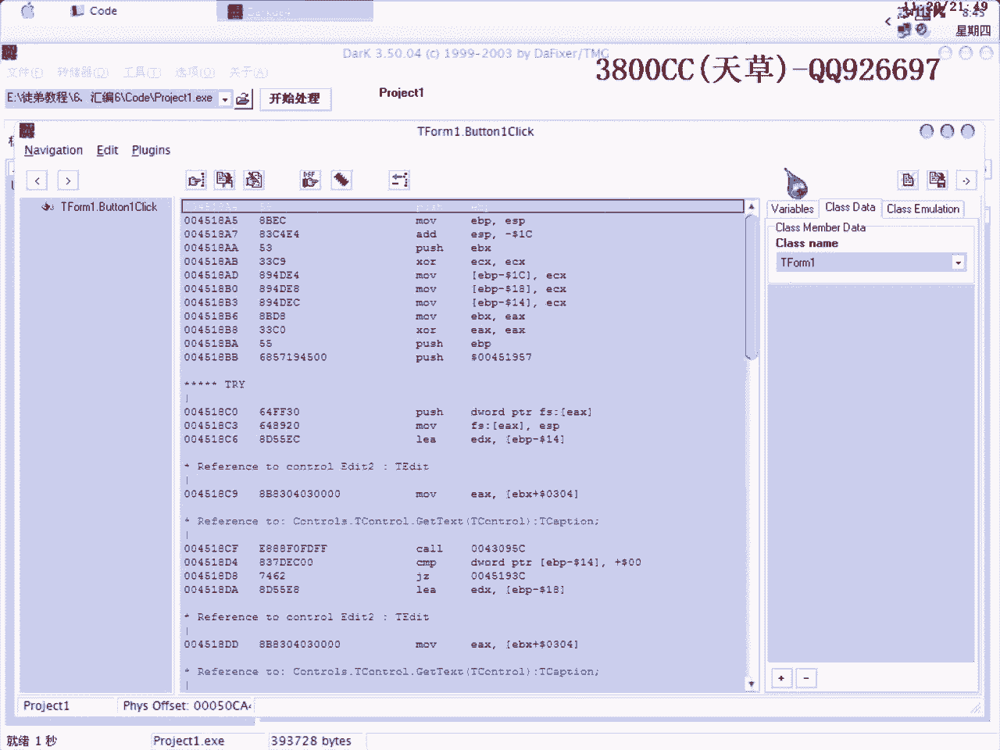

好，複製下來之後就可以推出來了，因為OD來載入。好，Ctrl+G，拿到這麼一個位置，拿到這麼一個位置。好，在這裡下好端點，我這裡已經下好了啊，然後直接F9運行啊。好，程序運行，程序運行之後。

我們輸入假的註冊碼，假的註冊碼。點，大家剛才可能會說，我在這裡輸入假的註冊碼，按了之後會推出啊，但是這裡呢，因為是程序的一個按鈕事件，按鈕事件的起始位置，我們在這裡點，就不會，是不會推出的。

是不會推出的。我們單步走，因為今天講的是那個只程序調用，只程序調用，那我們這裡框呢，最好是兜進去一下，兜進去一下，看一下。好，按F7進去，看一下有沒有什麼收穫啊，有沒有什麼收穫。這個框是沒有什麼收穫啊。

它已經這裡，對戰裡面開始出現我們的假註冊碼了啊。好，大家可以看到，這裡返回呢，是返回到這下一行。這裡呢，大家可以知道啊，這裡，它就是取啊，要有一個良好的習慣啊。這個只程序調用呢，它的一個目的。

它有一個目的，功能呢，就是取假碼，取假碼。然後呢，這裡會比較，會比較，輸入假註冊碼，是不是，就是說，看一下我們輸入是，輸入和沒有，是，是，有沒有輸入啊，有沒有輸入。這裡呢，它和0比較嘛，和0比較。

它通過怎麼樣來比較有沒有輸入呢，大家可以看到啊，假註冊碼呢，它這裡是有9位，然後，它這裡剛才通過取了這9位啊，把這個就是說，取了它我們這個假碼的一個支付長度，支付長度9位，然後0，如果沒有輸入的話。

自然就是0了，9和0進行比較嘛。這裡呢，因為不相等嘛，不相等，所以就沒有跳了。好，在單五走，可以再進去看一下，進去看一下這一行有什麼好的，也可以進去看一下這裡啊。當然，大家可能會說，這麼多code啊。

怎麼用來判斷哪個是關鍵，哪個不是關鍵呢，當然這個也是需要經驗啊，需要經驗。好，假的，仍然是取假的啊。仍然是取假註冊碼。好，假註冊碼，放到EX裡面去，然後我們再進去，啊，進去。再進去。

發現EX和EBX裡面都是假註冊碼啊。好，這裡呢，EAX，可以看一下。好，大家可以看到，FLD，就是浮點，浮點形式，因為我們剛才看了一下，原代碼是以浮點形式，float形，就實形，實形來轉換的。

所以在OD裡面會出現，就是說是浮點形式的，浮點形式。這裡他就是把我們假註冊碼浮點化，浮點化。FLD呢，FLD就是把浮點，就是把整數，就是實數，整數，轉換為浮點形式，浮點形式存儲起來。好，大家可以看到。

存儲到浮點集成器裡面去了。這裡可以看一下，這裡有八個浮點集成器，這裡是沒有存之前是empty，空的意思，空的意思。存了之後，FLD就是有效。好，大家可以理解，可以知道，這裡呢。

他就是說是把我們的假註冊碼浮點化，浮點化。好，這裡呢，FST呢，FST就是保存，保存起來，保存起來。P，FST是保存，P呢，是pop，pop，就彈出來，彈出來這裡就變成空的了。wait。

這是一個系統的一個，CPU的一個暫停指令，就是休息的意思。好，這裡我們就不進去了，不進去了，但不走。好，看一下這裡就知道，這裡是取機械碼。當然我們今天用的這個實例是非常簡單的。

關鍵是讓大家了解那個只存一定要用啊。這裡，仍然是機械碼，浮點化。這裡浮點化，這裡跟上面一個指令是一樣的啊，這裡開始是Failure，當走過這一行指令之後，就算是彈出來了。FLD呢，就是把，呀呀呀。

我們說的假註冊碼這個浮點存到EBP-8裡面去。大家可以看一下EBP-8會是多少呢？好，這裡，點一下我們這個數據窗口也是轉存窗口啊，Control+G，EBP啊。EBP-8啊，把它轉為Helix形式的。

大家可以看到，等一下可以看到。它這裡已經保存起來了，已經保存到這個裡面去了。這裡大家可以看到，1112，919，就是我們機械碼和假註冊碼。FMUL呢，MUL是相乘嘛，FMUL就是浮點相乘。浮點相乘之後。

放到這個裡面去，放到第一個浮點記存器裡面去。然後保存起來，它這裡會提取我們這個。Compare，大家可以看到，這裡比較了，開始比較了。這是我們剛才相乘的結果，就是機械碼和假註冊碼相乘。好，彈幕走。

這裡就不用管了，這裡也是一個系統暫停指令。它跳了，這裡跳了，好，我們走一下，看一下會有什麼結果。這彈幕走啊，彈幕走。注意這裡啊，注意這裡，因為剛才這裡跳了，可以注視一下。看一下會有什麼結果啊。

大家可能會說，這樣走，走到什麼時候去呢？還有一個方法就是直接運行，直接運行，程序就退出來了。我們再重新來過，重新來過。點註冊啊。這裡啊，剛才給大家說了，要有一個良好的習慣，就是說做好注視，做好注視。

還有呢，就是說寫一個記錄，寫一個記錄。這個樣子我們在進行第二次操作第三次操作的時候就方便一些啊，方便一些。直接到我們剛才的關鍵地方啊，這裡，我們改掉它的標誌位啊，改掉一下標誌位。

然後再直接運行看一下效果啊，這裡就出現了。算法很簡單啊，就是說相乘，跟一個固定的數比較啊，跟一個固定的數比較。就是通過，跟這個比較，跟這個比較。8啊，823729842936啊，000，先比較啊，比較。

當然通過相反的算法就可以除以它嘛，就可以得到注冊碼，注冊碼最後是88888嘛，6個8。好，我們用6個8來走一下就知道了啊。這裡是不能跳的啊，不能跳的，看到了沒。如果有6個8的話，就沒有跳啊，沒有跳。

很簡單啊，就是說今天這個內容啊，內容就這麼多啊，內容就這麼多。就是為了讓大家啊，體會一下那個子程序調用。有的程序呢，它不只是像我這個啊，寫的這樣，是一層調用啊，它有一層再進一層，然後再又進一層。

又幾層調用啊，非常非常麻煩。好，今天課程就到這兒啊，再見。再见。

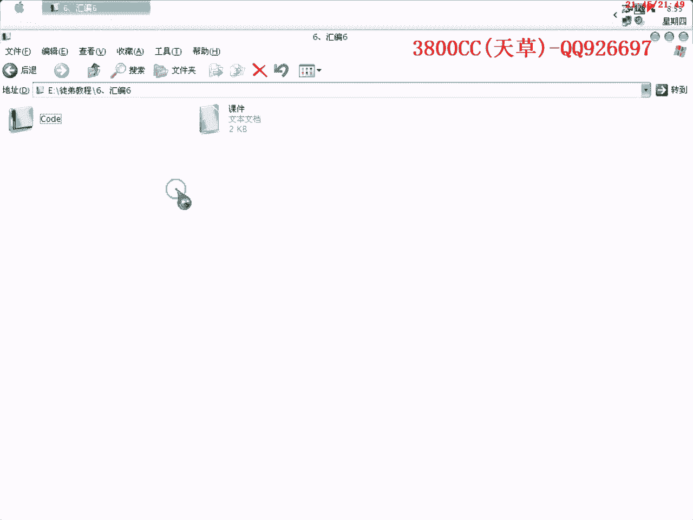

【音量注意】。