# 3800cc(天草)-天草流初级 - P7：7、破解1 - 白嫖无双 - BV1qx411k7qA

大家好，现在来进行我们的第七课，我第六课的课程，讲的是一个，就是子群调用，然后呢，在实例，就是我编写了一个小的程序，大家可能刚开始接触，感觉有点高，有点怕高那样，多看几遍，现在只是让大家接触一下。

能够开窍就行了，今天这节课程呢，因为我上一节课的课程，讲的是关于Delphi或者BCB，上一节课的方法可以适用于BCB，就是我们在用PID查课得到的BC++，也可以适用于BC++的程序，我这节课呢。

就讲一下关于VC的一个，它的一个按钮事件，今天那个好像是在群里面的一个叫，Fesadzor，Fesadzor的哥们说了一句就是说，为什么不从头开始找，代码太多了，从头怎么找呢？他又说。

因为那个程序是Delphi的嘛，他说，我找的那个头，找那个按钮事件的头，和那个路口一样，差不多的，样子差不多，这个呢，因为每个程序里面有很多程序段，它那个开头和OEP的结构特征是有些相像，这个是一定的。

好，那我们就看一下这个VC++的这个，用那个PID查得，查的是VC++6。0的，那我们在用，要学会用这一个插件，这个插件是干嘛呢？就是来查这个软件的一个算法，是什么算法？是Base64还是MD5之类的。

它可以查到，效果还可以，大家可以看到，它是这么一个算法，当然有的程序，它没有利用一些比较有名的算法，就查不出来了，现在这就是教大家用这个插件，很简单的，我们直接ODP来载入吧。

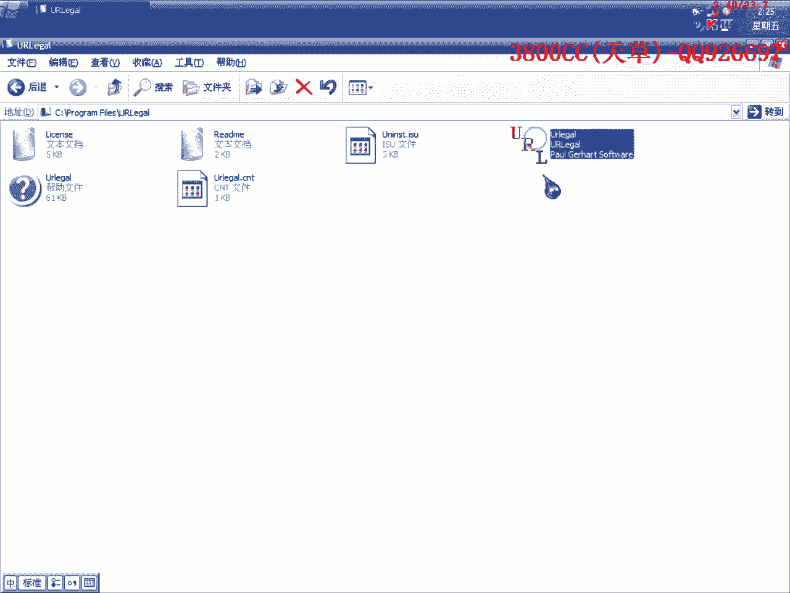

有的一些破解教程里面，给大家介绍就是说，不准的。

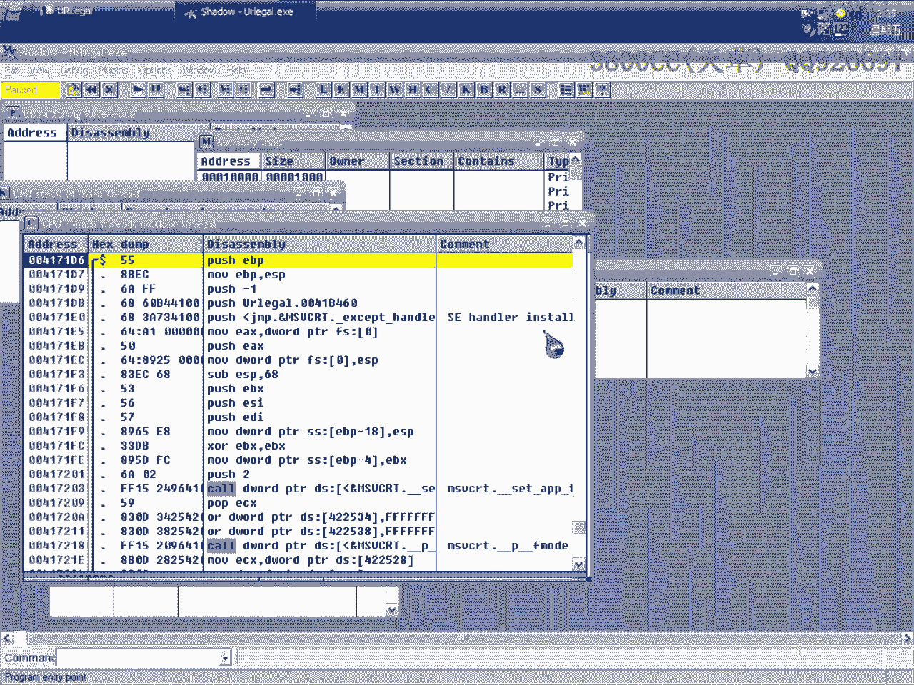

首先，试运行，首先查可，有可就脱可，没可就试运行，试运行，然后呢，试注册，试注册了，然后再看一下有没有提示，有提示就找参考支付串，这么一个步骤，我一般不按这个步骤来，大家看清楚，我是查可之后。

直接ODP载入。

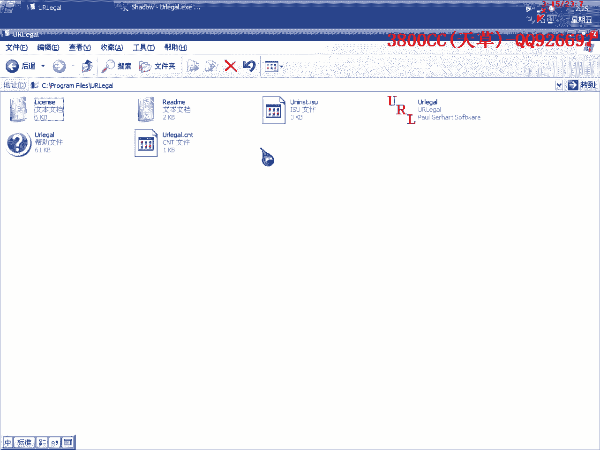

我现在是直接运行，直接F9运行，好，程序运行了，在这个里面注册，3800cc123456789，输入我们的假码，点一下这个提示，错误了，它这个是用户名或者是code，或者就是注册码，不匹配。

重新尝试一遍，大家可能会说，现在就可以来查找这个LAM支付串了，我第一种方法，就把它当做第一种方法。

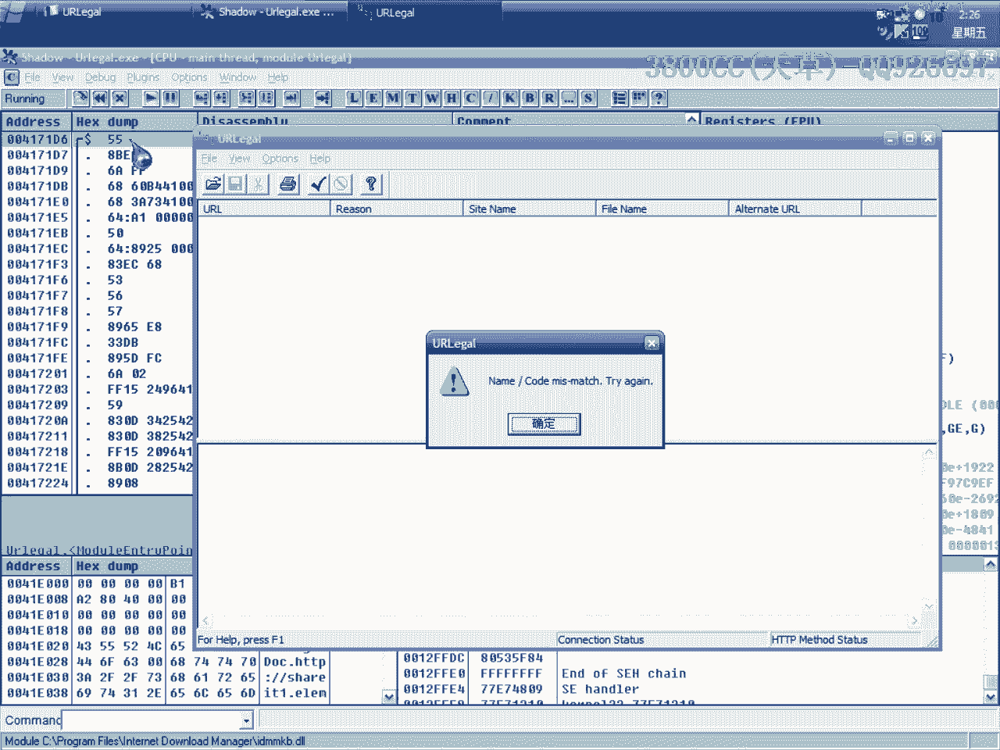

来教大家怎么样来查，我现在用的是英文版，大家用中文版的时候就可以看到，这个是搜索，这里，所有支付参考，所有支付参考，刚才有一个LAM，我们就来查找LAM，这里的意思就是，所有范围，这个是全匹配。

把它给去掉，按Ctrl+L，找到这里了，大家可能说，上一集进去吧，就在这里了。

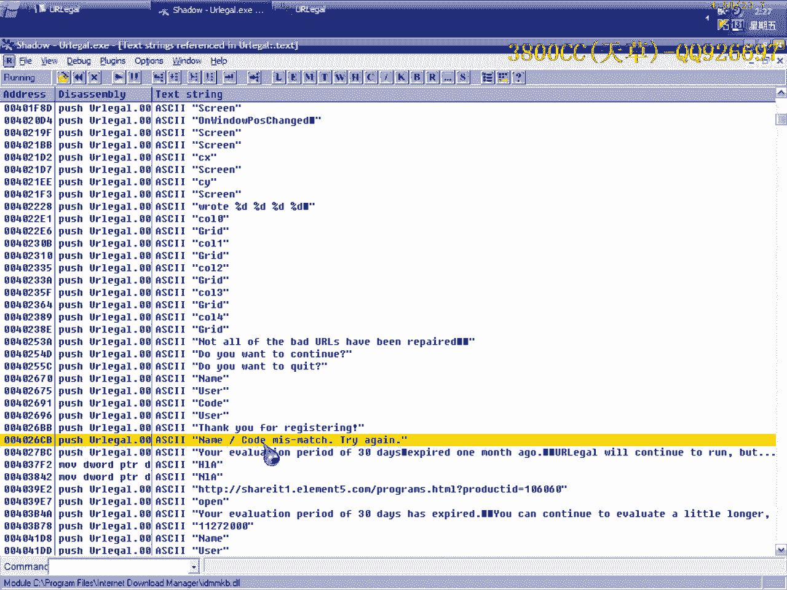

再看一下这里，这里是3Q，Full register，注册成功了，我们现在就找关键call和关键跳了，怎么找，先给大家介绍一个思路，大家可以看到，这里有一个跳，原本，要是这个跳转能够实现的话。

那么肯定就是说，可以跳过这个错误提示了，有的朋友会说，这是一个无条件跳转，为什么没有实现呢，那肯定就是说，上面有一个call，跳到这里来，或者这里来，或者这里来，至于是哪里来，在这一行看一下。

这里有一个跳，有一个跳是跳到这里来了，上面这一个跳，肯定就实现了，跳到这里来了之后，程序就往下执行，就出现错误提示，这里我先就不分析这里了，找到这里来了之后，咱们往上面找，找到这一段的开头。

这个rent是上一段的结尾，找到这一段的开头，那么这就是按钮事件，我们首先在这里，F2，下断点，然后再来看一下，重新注册，这里注册了，大家看到了，这里就重新注册了，提示错误，我们在这里下断点。

这里就注册了。

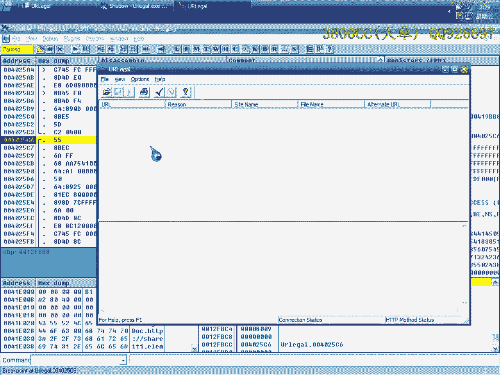

它在这里就断下来了，咱们就可以单步走了，现在出现我们的注册框框了。

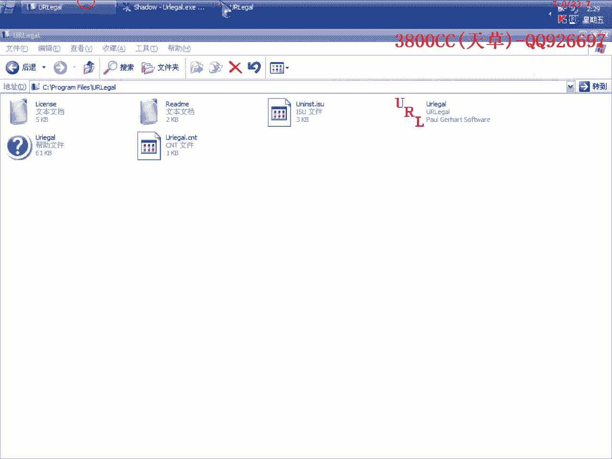

继续，咱们就继续，OD里面断下来之后就继续了，这样就可以找了，大家可以看到，直接就跳到这里来了，错误了，这就是查找按钮事件的一个方法，我们现在找注册码，很容易，这个跳，实现了，到这里来，大家看到。

关键跳，上面的call，就是关键的call，咱们在这一行，F9运行，现在来输入我们的假注册码，断下来了。

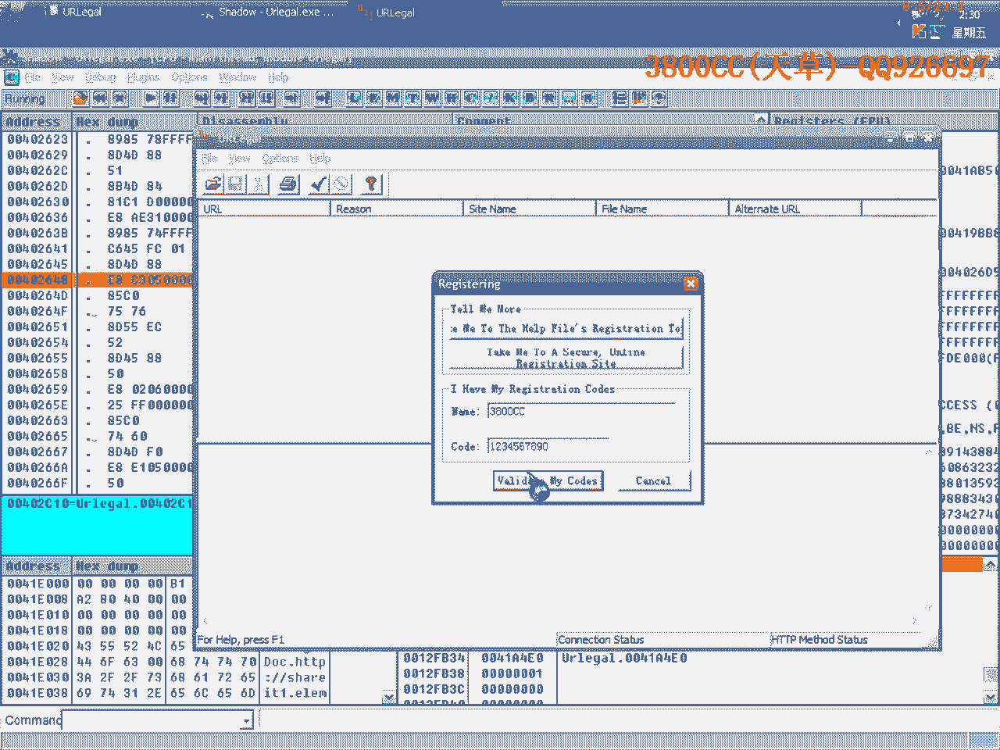

大家可以看到，这是我们的注册码，相对应的3800cc，大家可以看得到，这是我们的假注册码，相对应的，这个我们就先保存起来，这里咱们来弹幕走一下吧。

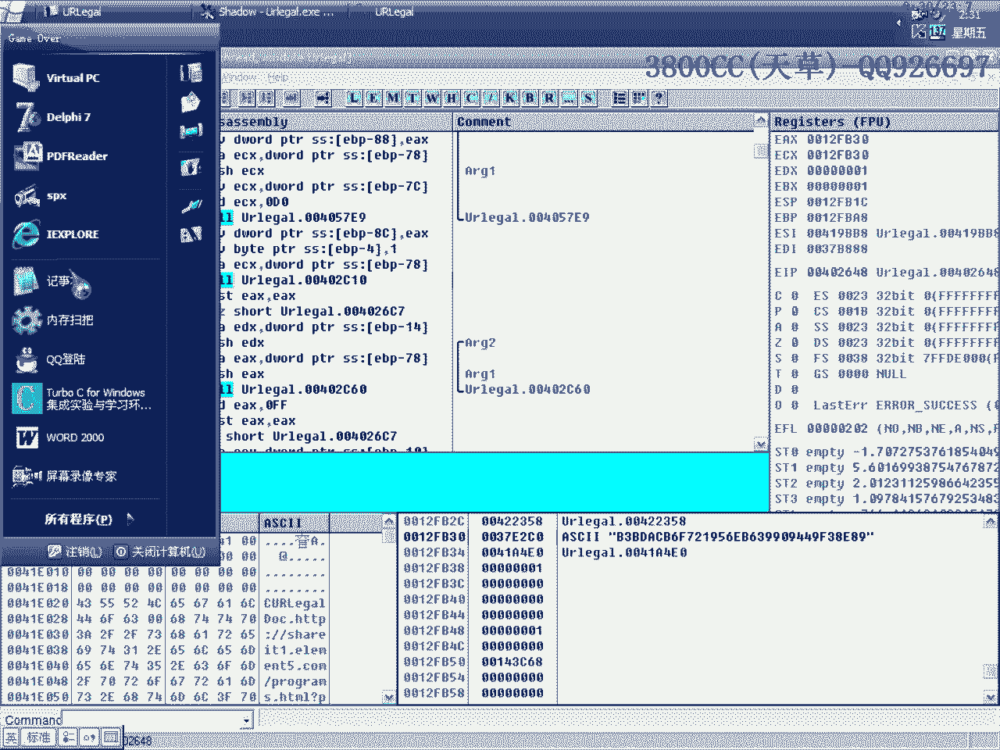

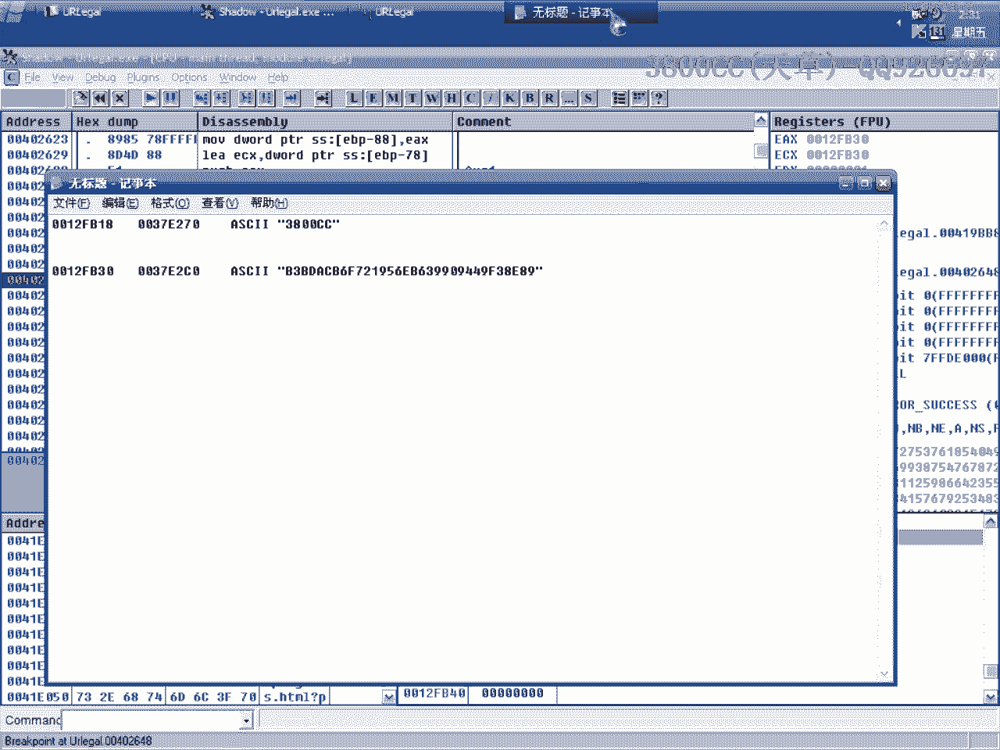

这个跳，这个跳是没有跳的，没有跳转的，这个跳它跳转了，这个跳，大家可以看到，这里有一个小红线，往右的，就说明这个跳或者这个跳，跳转了，既然这个跳没跳转，这个跳就跳转了，大家可以看到，那我们也就是说。

改掉这个loop掉，就可以实现我们的爆破，我们这里就不爆破了，既然注册码找到了就不爆破了，不爆破这里咱们call进去，因为我们上一个学了一个程序，call进去，大家可以看到，看到了吧，其实错误了。

其实错误了，其实错误了。

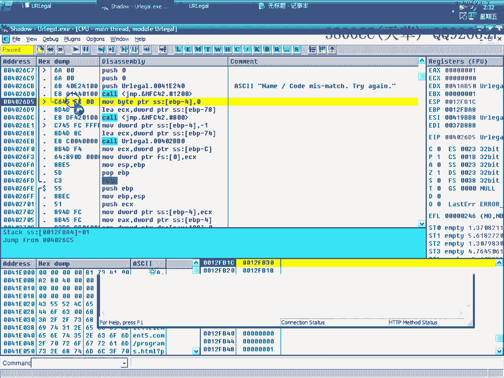

再重新来一下吧，再重新来一下吧，再重新来一下吧。

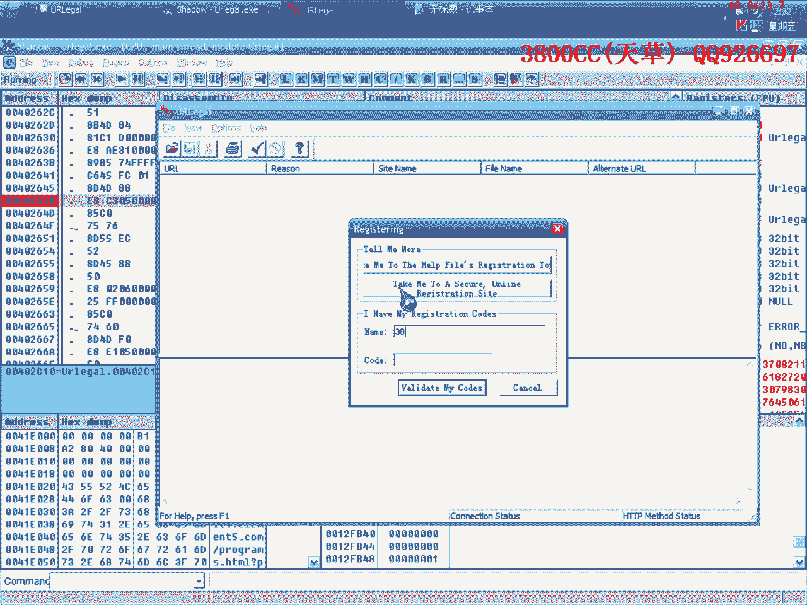

再重新来一下吧，咱们直接call进去之后，来到这里，走走走走走，在这里大家看清楚，在这里面返回来的，返回之后，锁在计算器里面的一些值，看清楚，EX0， EX001，EX0， EX001，这个没有跳转。

咱们往下走，既然是这个跳转了，才让我们，注册提示错误了咱们这个也进去看一下，看下这个会返回一个什么东西，加码，这里在提取加码，按的EX0FF，零和0FF，零和0FF，这里呢，大家可以知道。

这里如果是1的话，这个跳转肯定就没有跳了，这个如果是1的话肯定就没有跳了，咱们再重新在这里来下转，咱们再重新在这里来下转，大家看到这里首先是零，在这个地方来下转，这里重新来下转。

现在就是教大家一个分析的思路，分析的思路，好，断下来了，咱们把这里改成1来看一下，好，没有跳，大家看到了，改成1之后就没有跳了，注册成功，完蛋了，注册了，注册了，注册了现在怎么办呢，要删注册表咯。

重新来看一下，我们课程怎么样继续下去，现在要删注册表。

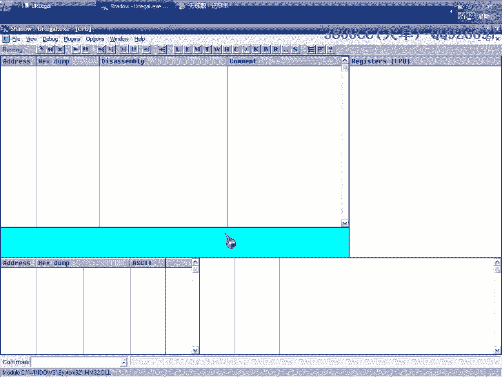

看一下怎么样，刚才是假注册，这里是零，它就跳转了，咱们在这里重新来下转，让它返回为1来看一下吧，大家进这个core的目的就是让它返回为1，EX返回为1。

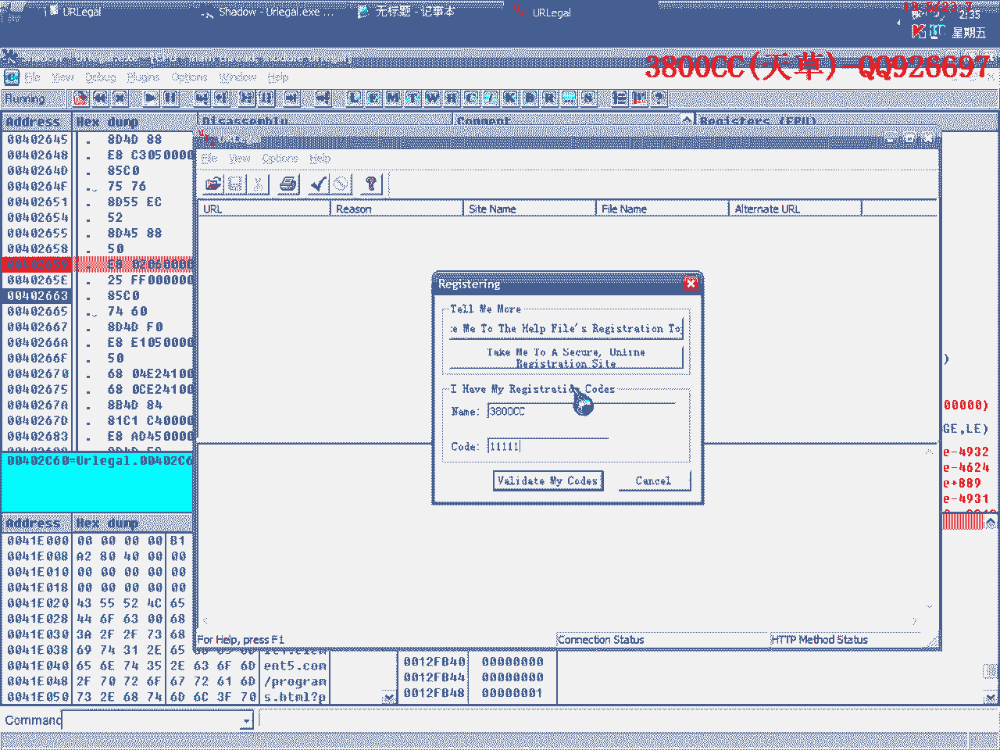

看一下这里，sub EX-EX，就降为0了，它是进位，带进位相减，它是进位相减，它是进位相减，它是进位相减，它是进位相减，这里呢，加1，就变为1了，咱们这里呢不用管它，看一下，看一下，看一下。

看一下有什么效果，这里是清零，这里是清零，重新来过吧，重新来过。

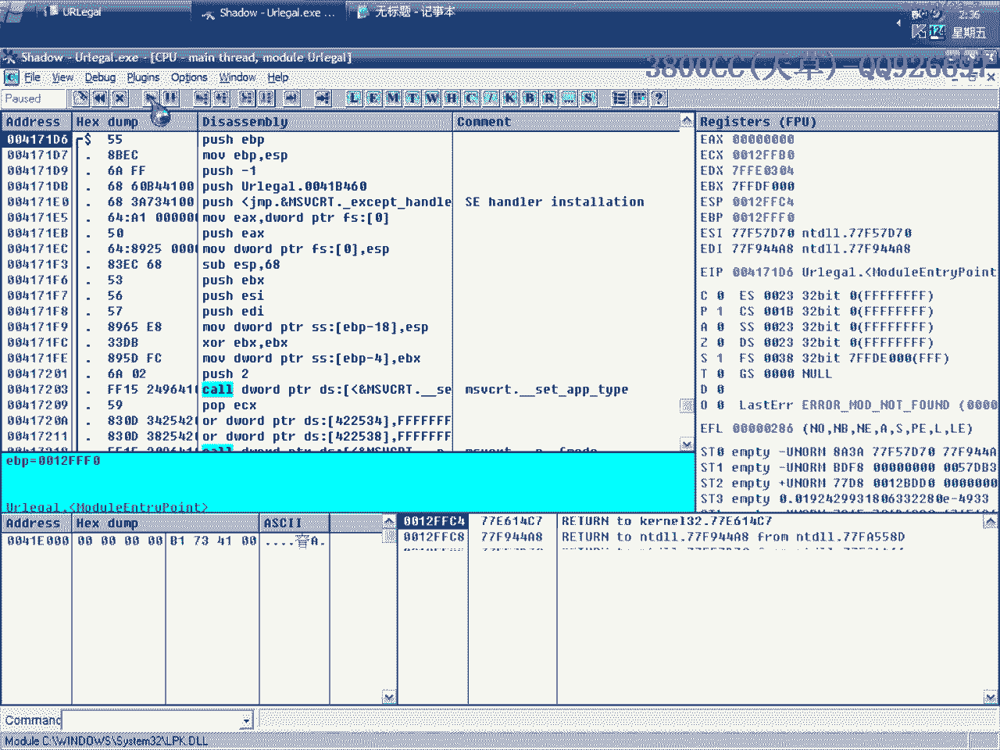

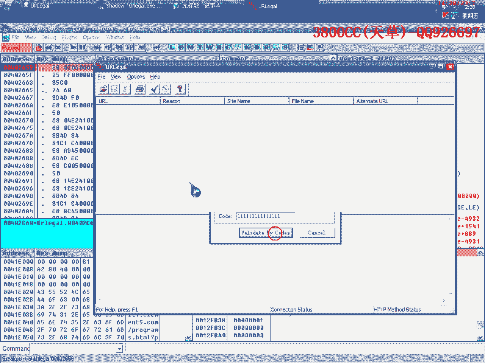

这里是清零，大家看到了，这一句，本来呢前面这里EX是1了，然后通过这一句取反，就变为FFF了，相减保持FFF，然后这个呢，INTEX，INTEX，直接复EX，INTEX，INTEX，这不行。

代码指令不够，好这里，咱们单步走到这里来看一下吧，如果把这一行漏掉呢，这个情况会怎么样，反复为FFF，FFF相和，大家看到了，也是一样的结果，可以让它不跳，咱们直接运行，咱们刚才可以达到，改那个的效果。

好了废话不多说，现在来进行。

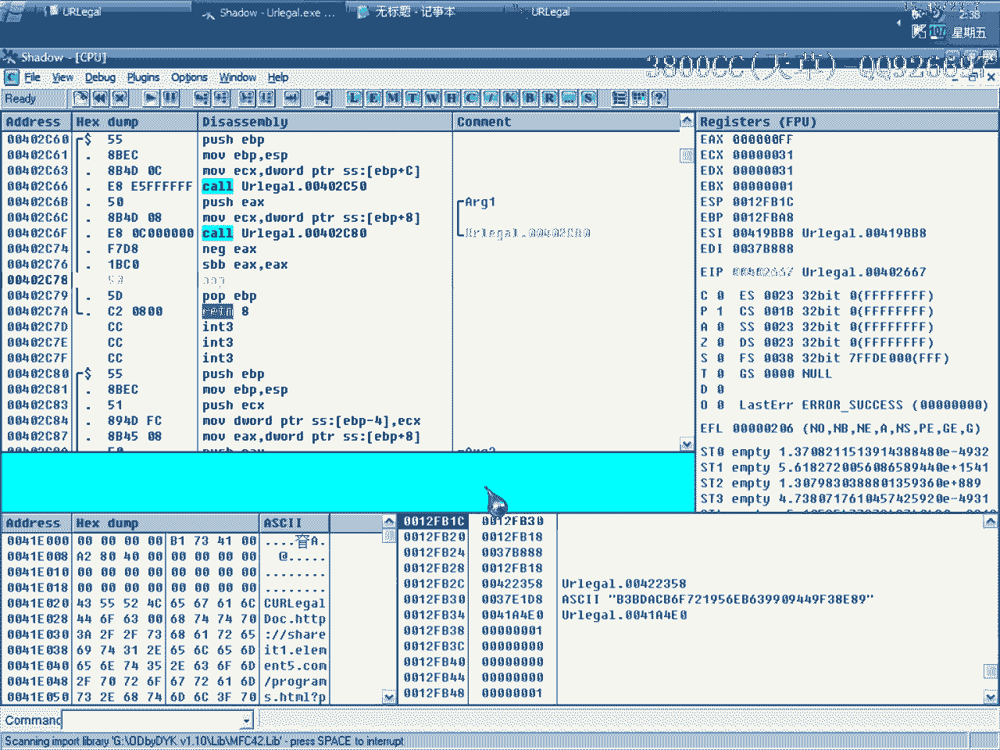

我来给大家讲一下，刚才不是说通过查查字符串是方法一吗，咱们现在，现在来，用第二种方法，也是直接来运行，这个方法在，破外挂的时候会经常用到，这个大家一定要好好理解和掌握，看清楚，这个不要点确定了。

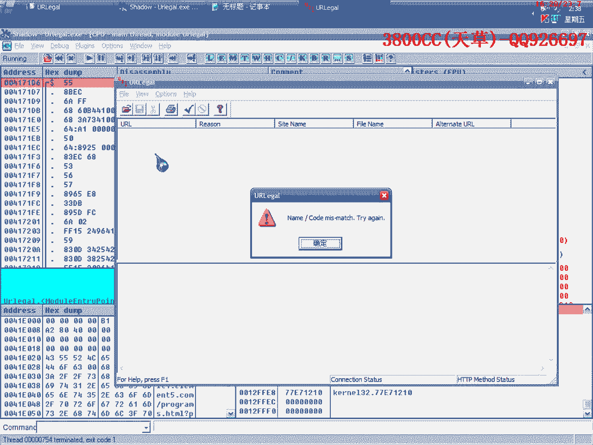

现在咱们按F12，暂停，也就是中文版的OD里面的一个调试菜单，然后FACE暂停。

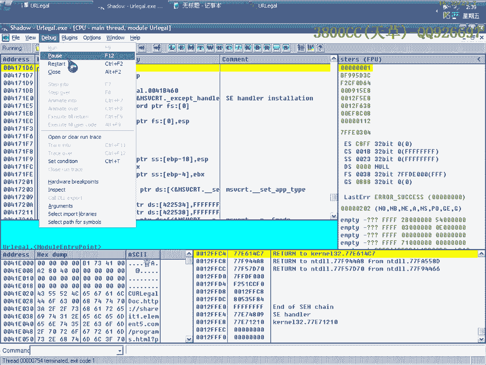

暂停之后OD的一个左上角或者是右下角，有的OD会在右下角提示，因为OD是左上角会提示FACE暂停的，点K，K的意思是，调用对战的意思，调用对战的意思，点它，大家可以看到这里有提示，我们这个提示。

这个是MAXGBOSS，咱们要找的就是这个MAXGBOSS，右键。

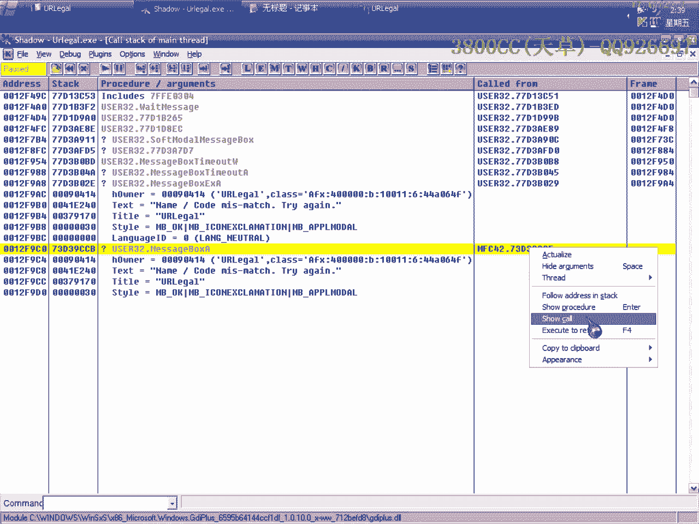

SHOW CALL，进去之后咱们在这一段，这是一个程序段，上面我们就不用看了，从这里到这里是一个程序段，这里提示我们的一个错误，然后再按F9让程序运行起来，咱们再点这个。

程序就中断在OD里面了，咱们直接F8走，大家可以看到，现在咱们这里是系统的领空，系统的领空和程序的领空有什么区别，因为大家可以看到这个OD，这里有提示CPU MAX线程，在系统的DLL里面，现在呢。

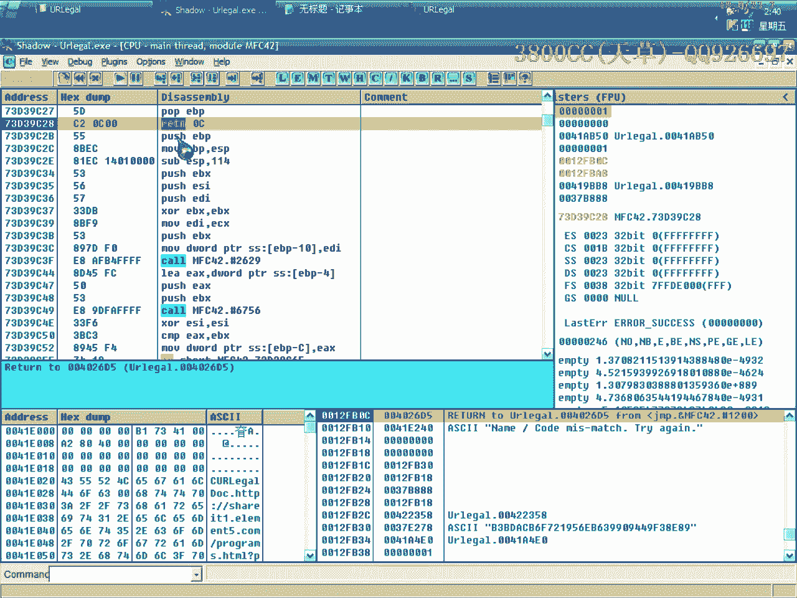

返回到了程序的领空，程序的领空就是包括这些位置，这些位置，这些位置，这些位置，其他都是系统的领空，这里就是返回到我们程序的领空，大家可以看得到，非常明显，又返回到这里来了。

就是我们用第一种方法来查找到的一个位置，这也是一样的，就是我们找到了，然后分析方法和上面的一样，这个很简单吧，在破坏挂的时候经常要用到，这个大家要会，还有一些LAG，就是有警告窗口的一些。

CRAVME或者是程序，也可以通过这个方法，去掉这个LAG窗口，去掉这个LAG窗口，看清楚了吧，今天第七节，讲破解，主要就是让大家熟悉前面几节课的内容，后面呢，我打算，我打算，再讲一到两节课的会变。

再插一到两节课的会变，所以我在讲破解，就是为了让大家把前面的几节课给巩固一下，巩固好一点，这个样子后面才会有基础，这个大家要花时间，大家可以用这个来注册一下，看一下是否是正确的。

一个用户名对应一个注册码，直接就注册了，看一下，这个是，看一下，至于那个，他的那个注册码怎么找，大家可以来看一下这里面会有没有，会不会在这些程序的目录下面，或者是注册表，咱们在注册表来找一下。

这也是学破解要掌握的一个思路，怎么样来找他那个注册的位置，存放注册码的位置，直接用插招来找一下吧，因为有时候可能找不到，因为程序可能就是说，注册成功了之后，把你的用户名和注册码。

用各种各样的算法进行加密，加密了之后呢，在存放的注册表里面，所以你直接查找你输入的注册码是查找不到的，这里查到一个3800cc，不是我们要找的，直接按键盘上的F3，看一下，大家看到了就在这里了。

在这个目录里面，那咱们现在就可以来导入，导出我们的注册码，想多玩几次，可以把这个删掉，然后再来运行一下，没有注册的，大家看到了，这里呢，I will register soon，就是我等一会再注册。

上机就可以达到注册的目的，然后呢，这里也可以删掉它，再运行，大家可以就这样多玩几次，注册码的存放位置，就是这个目录下面，这个才是主要的目录，这个跟下面，那今天课程就到这，文本我就不写了，我就多说一些话。

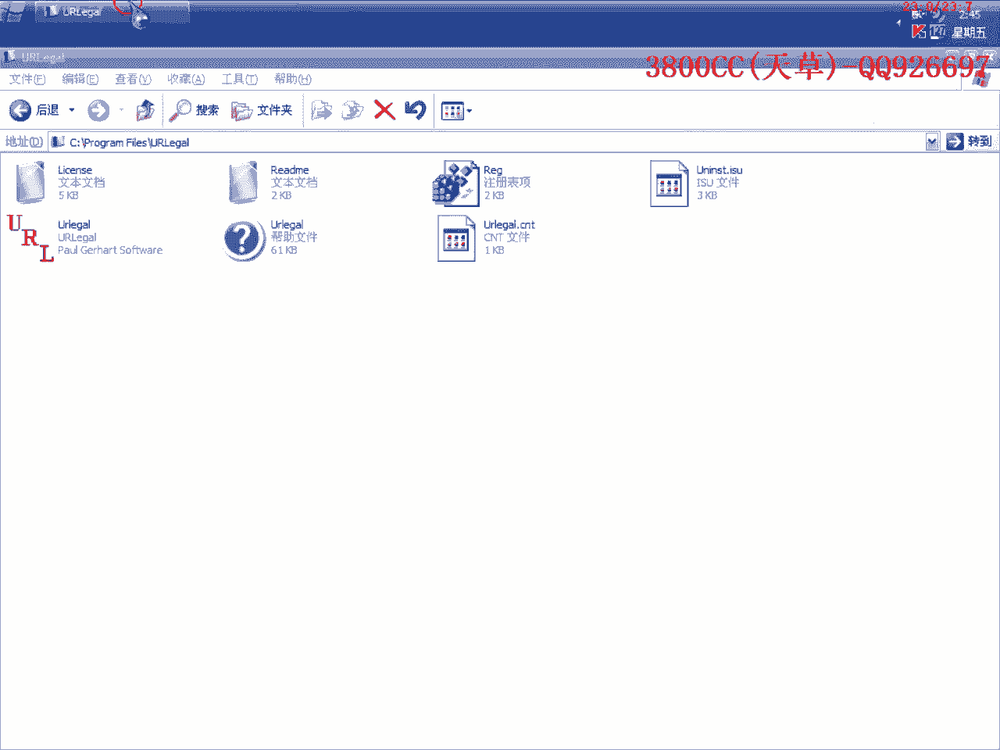

文本我就不写了，再见。