# 3800cc(天草)-天草流初级 - P9：第7-8课补充 - 白嫖无双 - BV1qx411k7qA

好，来看一下，你说那个不知道在哪里下段啊，现在来就是说着重讲一下这里啊，首先直接运行，直接运行，出现这个框之后，然后F12，这里双击进去啊，这里你可以这里可以看得到啊，再给大家说一下。

这里有一个getMessageBoxA，就是说他调用了一个系统函数，get是获取嘛，Message就是信息，他就是说开始调用了啊，开始调用了，开始调用，然后到这里，这里这里这里啊，都是一些系统的领空。

咱不用管，因为我们是要到那个，那个就是程序的领空就好，咱们双击，双击这里啊也可以，或者是右键，修框啊修框，这样就直接到了调用那个啊，调用那个对话框的这个地方，这里就开始调用对话框，好了。

现在再分析一下啊，分析一下，先拿到上面来啊，拿到上面去，找到这个段的啊，这个段的开头，找到这个段的，这里是这个段的开头，你想一下啊，想一下，他程序从这里开头执行啊，就是说调用了这个段。

调用了这个对话框之后，之后啊，从这里开始执行了，开始执行了，慢慢走，慢慢走，走走走走，走到，走到这里来啊，走到我们调用这个对话框这个地方来之后啊，就调用了啊，那就出现对话框，那我们现在可以看一下啊。

上面啊，看一下上面哪一个，上面哪一个，跳转可以跳过它呢，这个是可以直接跳过去的啊，既然它出现了对话框，那就说明这个跳转肯定是没有实现的了啊，再往上面看一下，或许在上面也有啊。

或许在上面也有对话框可以跳过去啊，这个也可以跳过去，它这个是一个无条件跳转，之所以又出现了对话框，你逆向想一下，它出现了对话框，那就说明这个就没有跳了，那也就是说这个跳了啊，因为这个跳了之后。

这个就把这个，这个无条件跳转给屏蔽了，这个呢，这也是一样的啊，它也是，它跳了之后就把它给屏蔽了，所以一路上就走，直接就走下去了，咱们先从这个地方来瞎断看一下啊，就是说，出现对话框这个断的开头，断的开头。

看清楚，瞎断，好，然后再重新启动一下，好，直接F9运行了，好，这样就直接断下来了啊，看到了啊，这样直接断下来了，但是那个对话框没有出现，就是因为对话框是从这里开始执行的啊，通过。

肯定就是通过上面的一个call来执行，调用它，执行好，咱们单步走，单步走，看一下会有什么样的情况，看一下我们刚才分析的是不是对的啊，看到了吧，就是说这个跳转实现了，所以打断了这个，直接往下跳啊。

打断了它，打断了，好，这个也打断了啊，看到了吧，这是刚才分析的，没错的吧，好，好，好，单步走啊，单步走，好，刚才我们分析这个是没有跳的啊，的确是没有跳，的确是没有跳啊，这个看到了啊，没有跳的，所以呢。

刚才我们就可以直接在这个地方啊，在这个地方，直接在这个地方下断，不用在这里去下断了，刚才我在这里下断呢，就是为了方便啊，为了方便给你们讲清楚到底是怎么回事，这里呢，在这个地方直接下断就可以了啊。

这个地方，好，咱们又重新来，重新来，再重新来看一遍，好，也是直接运行，好，这样还是断下来了啊，断下来了，在这个地方可以走进去看一下，F7进去看一下，看一下有没有什么情况，这里啊，这里，这里啊。

它这里就是开始，看到了啊，Eax原先的值是0042248，28，然后呢，这个，就是这个对战的值啊，这个对战的值是0，它这样就把那个0给Eax了，0给Eax就直接控制住了刚才那个跳了啊，刚才那个跳。

咱们在这里就可以直接把它给loop掉啊，loop掉，loop掉了之后，Eax就不会了啊，这里就跳过去了，看到了吧，就跳过去了，跳过去了之后就不会掉这个对话框了，好，再来走一下，好，再来走一下啊。

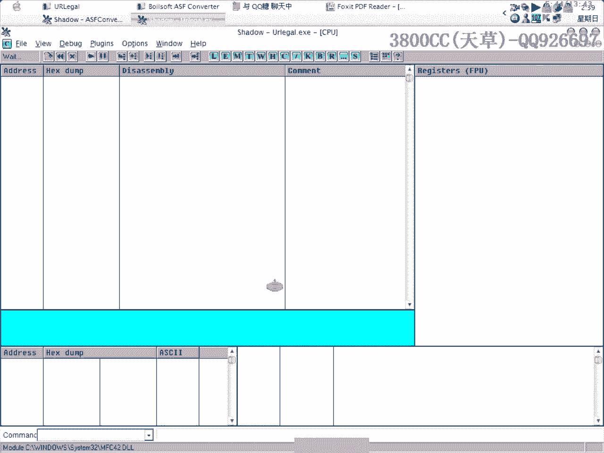

我们可以也可以啊，也可以直接在这个地方，在这个地方把这个改成降破啊，降破，所以说我们来包括啊，就是说来处理这个事情的手段是很多的，手段很多，但是唯一的目的就是说让它跳啊，在这里让它跳，好，看一下。

没有出现了吧。

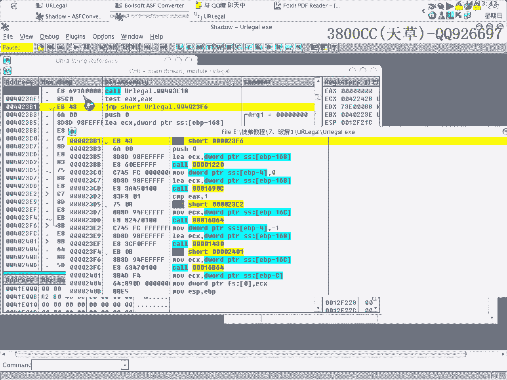

你刚才说不知道在哪里下段啊，不知道在哪里下段，咱们分析的过程就是这个样子，怎么去分析的啊，怎么去分析的，好，咱们再来分析一次啊，看清楚一点，看清楚啊，出现这个框之后啊，在这里啊。

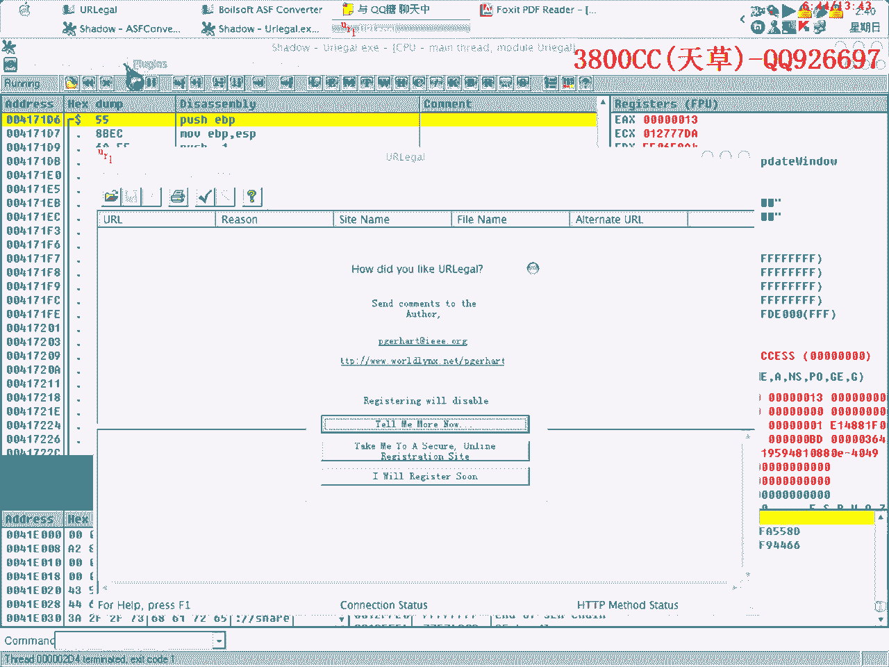

修靠或者双击，这里就开始掉运对话框了，咱们就可以从上面开始分析了，从上面开始分析了，咱们咱们的目的啊，是要去掉这个对话框，也就是说让它代码在执行的过程当中啊，要跳过这个调用，要跳过这个调用。

跳过的方法很多很多啊，这里也可以啊，是吧，这上面也可以啊，好，咱们从上面来走一下，看一下会有什么结果啊，从这里，把这个啊，把这两个给录不掉啊，把这个录不掉，看一下，只要需要录不掉这个就可以了。

就是说录不掉之后，程序就执行执行执行，一下子就跳过去了，看一下是不是可以跳过去，可以跳过去，看到了吧，嗯，看一下啊，看一下，啊，我们现在做的就是要回溯啊。

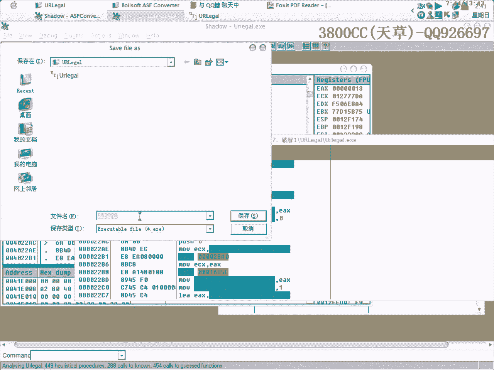

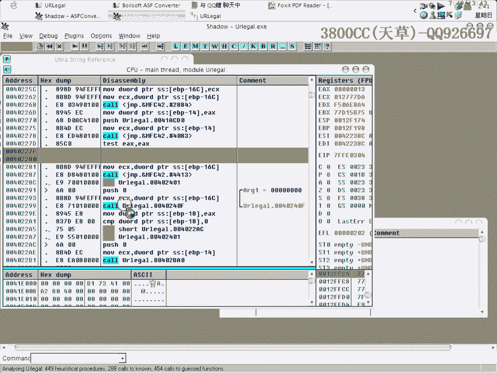

这也可以看到吧，这也可以，好。

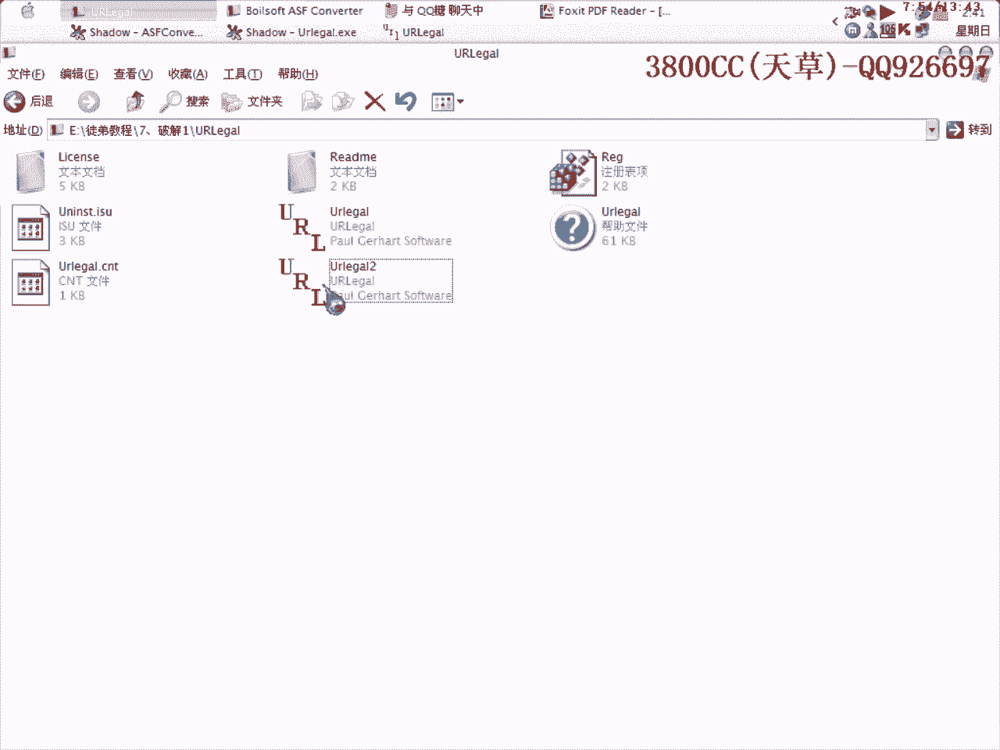

咱们这个不管他，把这个给录不掉啊，就说，咱们的目的就是要让他跳过去啊，目的就是让他跳过去。

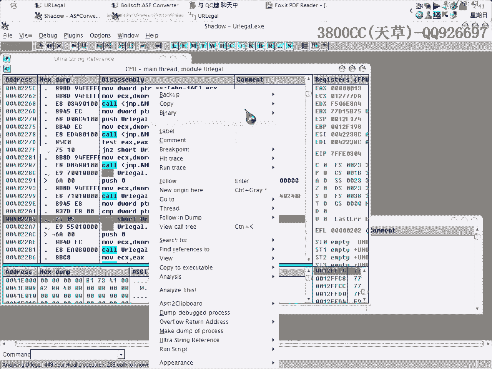

目的是目的是唯一的目的是唯一的，好，看一下，他这个就不行了。

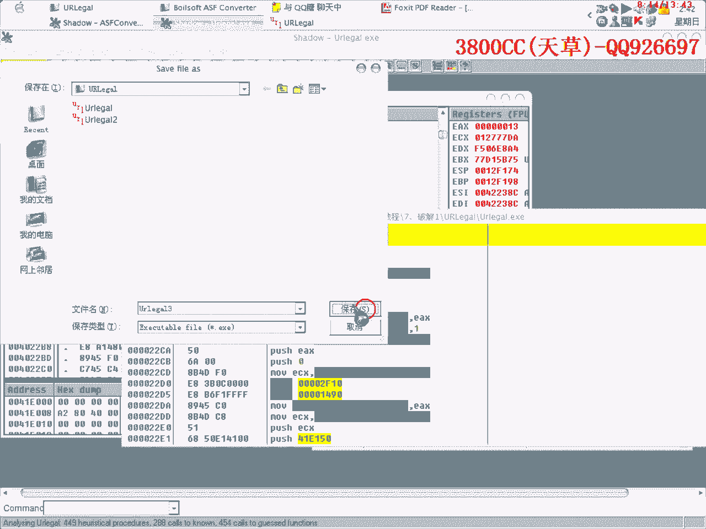

看到了吧，就是说，这里关闭就关闭不了，但是就是说，但是他不不会出现多少光，为什么啊，看到了吧，要把这个给，哎，看一下，哇塞，这里啊。

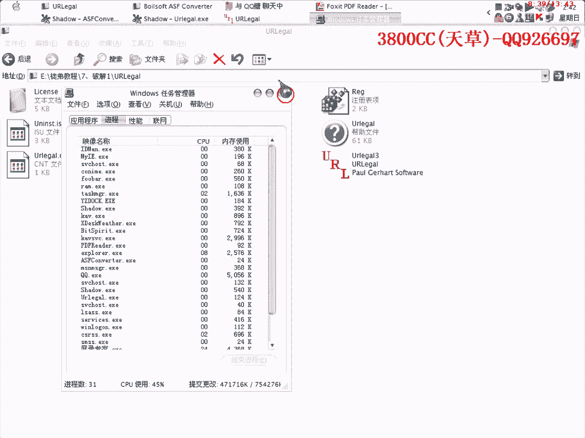

这里看一下。

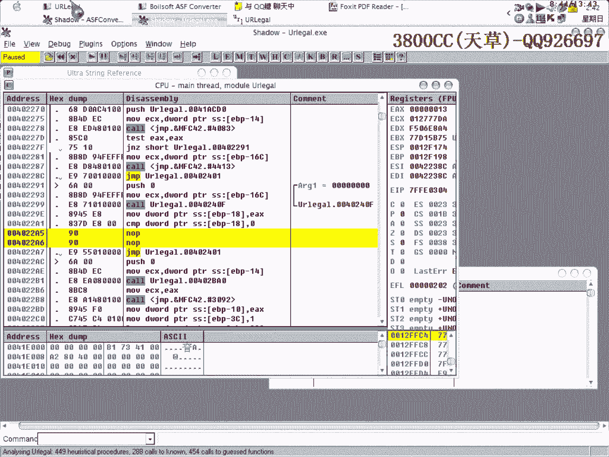

可以来看一下，这里为什么把这个地方录不掉之后，他就死掉了。

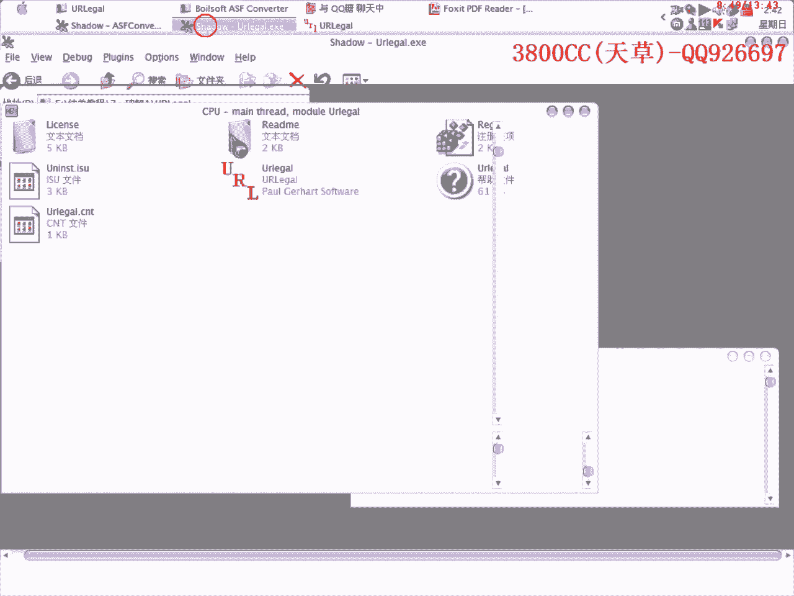

就像死掉了一样啊，这里，大家你来可以来看一下哈，咱们来弹幕走一下，弹幕走下来看一下情况啊，因为刚才有什么样的一些反应啊，就是说，啊，你弹幕走了之后啊，弹幕走了之后，不管这个框框跳过没跳过啊。

就说在没有跳过的时候来看一下啊，来看一下这个顺序就是程序执行的顺序，好点一下呢，然后他就出现最后框，咱们来点这个呢，程序就退出了啊，后面接了一个程序退出了这么一个指令啊，好，咱们来看一下。

看一下哪个指令会是程序退出啊，好，这里咱们就不管了，就让他直接跳吧，让他直接跳，好，刚才那个跳转的那里，我们还是要给他跳过去的啊，跳过去的，好，这里咱们就不跳过去了吧，不跳过去了啊，看一下走到这里啊。

开始出现了，好咱们点这个，L1输啊，L1就是说等一下再注册，好咱们再来看一下OD会是怎么样的一种情况，会是怎么样的一种情况呢，好，看清楚啊，看清楚，因为他后面接了一个退出的事件，不是这里就是这里啊。

不是这里就是这里，咱们看一下走过去之后，哎，这里没有啊，这里没有，这里也没有啊，这里也没有，好，看到了吧，程序这里就退出来了，退出来了啊，再来看清楚一点啊，再来看清楚一点，再来看一遍，弹幕，弹幕。

弹幕走走快一点，走快一点，这里，这里啊，你可以看到啊，可以看到看到这个任务栏这里看到任务栏这里，程序这个在这个地方呢，是还还在的还在的咱们弹幕走，看一下到走过哪个哪个哪个哪一句代码之后，程序就不见了啊。

不见了啊，不见了，也就是说这个地方是调用退出的啊，调用退出，那咱们再来看一下上面我们修改的时候啊，修改那个地方为什么会出现啊，咱们关闭的时候关闭不了的情况啊，好，来看一下这个啊，看一下这个这个。

他这里呢，他是直接跳到了，跳连连退出啊，连调用退出的跳过去了，连调用退出的跳过去了，这次完我怎么我们怎么样关都关不了的哈，这个是怎么关都关不了的，很明显的是吧，嗯很明显的，啊，咱们再来走一下就知道了。

啊等一下啊，再来走一下，啊，啊走，咱不走啊咱不走，咱们刚刚是修改这个地方啊，修改这个地方，把它给录不掉，咱们修改跳，那这里是直接跳过去，这里呢，他就直接连那个退出都跳过去了啊，连退出的跳过去。

所以咱们就没有办法了，啊，没有办法啊，啊，没有办法的哈，这是，看到了吧，没有办法退出了啊，这里就没有办法退出了，咱们这里修改了修改了之后啊，啊运行一下就知道，这里是没有办法退出的，看到了吧。

就是说情况是这种，就是这样去分析了，啊，咱们在这里来走一下，看一下啊，我把这个地方，跳过去，跳过去之后再直接运行啊，直接运行，啊，成绩就出来了，所以说呢，啊，就是这样去分析，咱们要回溯，就是往上面去找。

在哪个地方出现，就是说我们我们发现的那个对号框，然后往上面去分析，目的就是让他跳过去啊，就这么简单了，好，那课程就到这啊。

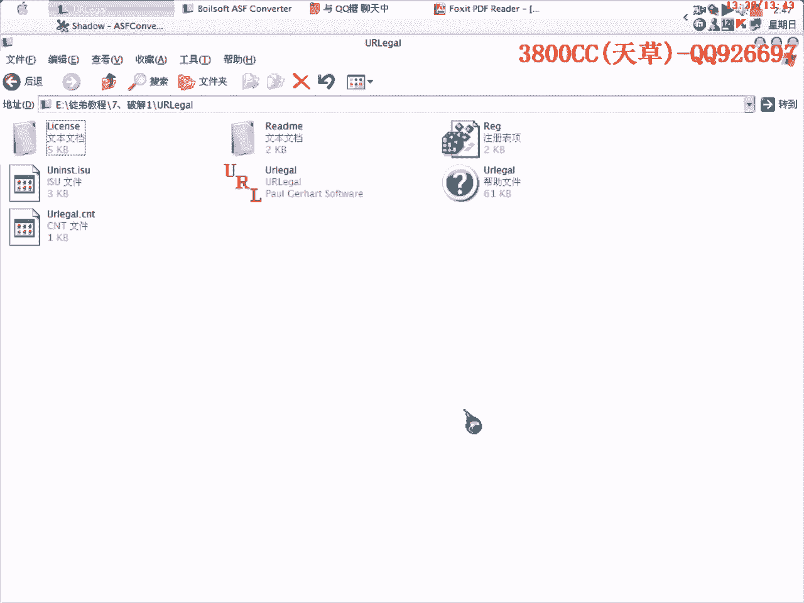

分享給朋友吧~。