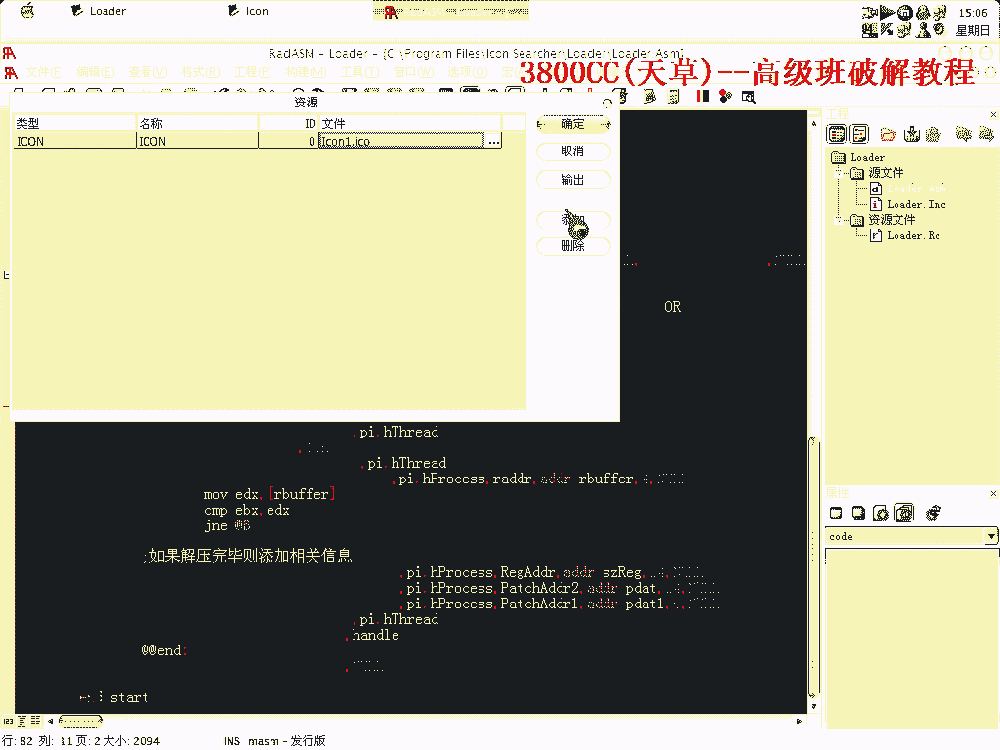

# 3800cc(天草)-天草高级班 - P14：14、直接给ASPr 2.X做内存补丁 - 白嫖无双 - BV1qx411k7kJ

大家好，这一刻做一个关于S-Protect 2。X的一个，直接给他打六星布丁，可以看一下这是我已经做好的一个布丁，做的给我，布丁源码在这，在这，好，那我就现在讲一下怎么一个思路啊。

(咳)，首先呢。

直接忽略除了內存訪問之外的所有遺產，然後按shift+f9，注意看對戰，咱們需要找硬盤指紋的出現，首先讓它第二次出現，第一次 第二次，好 第二次出現之後，咱們在，0040100這個區段。

下載然後shift+f9，大家看一下這裡，(咳)，EBP，EBP是F0137884，就這一個我們的一個，硬件號，一個硬件號，大家看這個硬件號，就是我們的一個，我們可以把這個硬件號，替換為註冊名。

那也就是說，如果我們把EBP+8這個地方，替換我們的一個註冊名的話，然後，它就放入EAX，最後EAX又放到這麼一個位置裡面去，那麼就完成了我們的一個註冊，好 現在我們就需要找到，派系代碼的一個地方。

然後shift+f9，一下，這相當於第三次，(咳)，硬盤指紋出現，好 再同樣shift+f9，這樣，好，我們現在是，現在的ESP是，0012FF20，我們找到0012FF，就是20-4。

也就是1C的地方，好，14的地方，這個地方，(咳)，-11，(咳)，-多少，(咳)，就是找到這個下面一個call就可以了，(咳)，那這個地方就是我們的一個，需要派系的地方，需要派系的，但是我們需要放。

放那個派系代碼，放派系代碼，那哪，什麼地方可以放派系代碼呢，那這個樣子，(咳)，獲得所有的異常，然後打開，再升級一下，最後一個區段，好，我們滴滴一下，7，滴，B，1，2，3，好，選上這個區段所有的代碼。

右鍵，用FF填充，然後shift+f9，(咳)，大家看到了啊，原先填充的一些FF被清零，啊被清零，也就是說，這一段啊，這一段被清零的這一些地址的話，就是說程序運行的時候會占用，那下面沒有被清零的。

我們就可以用來填充代碼啊，可以用來被填充代碼，好(咳)，我就選啊，選這個地址，放入我們的一個註冊名，然後選下面一個地址，放入我們的一個派系代碼，好，還是同樣的啊，或者除了類準訪問之外的所有一場。

直接按shift+f9，第三次出現，3，好，單步走，單步走到這，因為我是選這個地方放我們的派系名，放我們的註冊名的，這裡呢就是放，註冊的，放，代碼的啊，那比如說就這個樣子啊，放著家居來到這裡。

然後右鍵點擊，Wyny，好，那我們這裡就需要要求啊，這個他跳到這裡去，好，跳到這裡來了之後，這個我們要做記錄啊，這個要我做記錄的，啊，這裡已經做好記錄的，做好記錄了，剛才我們分析了啊，eVp+8。

放那個可以放我們的一個用戶名的，好，我們這個樣子，dWrD，CtrSs，現在我們這個地方放的是用戶名，我們把這個用戶名放到這裡面去啊，然後接著呢，因為我們改了這一行的代碼，改了這一行的代碼。

我們現在必須等這一行，在我們派去的代碼運行完之後啊，運行完之後，把這一行的代碼還原啊，還原怎麼樣還原就這樣啊，morph，dWrD，這個行代碼原先是1B82000啊，0000，我們就可以把它不管不管。

因為我們用dWrD的話啊，但是可以這樣這樣去理解，8218，因為我們本身用的就是dWrD啊，但是我們現在只是填充兩個字節啊，dWrD是四個字節，我們現在只是填充兩個字節，那麼因為程序本身啊。

就是說這個OD了本身它會給，如果就是我們這剩下的兩個字節，它會默認給它填充為零的，默認後給它填充為零，這就這就不需要我們來管了啊，我們現在直接跳回去，現在我們來檢驗一下啊，彈幕走檢驗一下。

看一下是否還原了啊，沒錯啊，是已經還原了啊，還原回去了，我們現在就需要把這一行代碼給記錄下來，重新來到這裡記錄，把它記錄下來啊，這樣拉開，不要遮著啊，現在複製下來啊，我這裡已經複製了的。

現在幾樣都找到了啊，幾樣都找到，唯一的一樣就是，因為OSPOTEC它有一個內存交易和CRC交易啊，CRC交易，就是我們用loadapp，就是用一個booting來加載它的時候啊，它會出現這麼一個錯誤。

可以來看一下，出現這麼一個錯誤，所以我們這個樣子來處理，找到一個找到一個API，就是說當這個API來實現的時候，當這個API解碼成功了的時候，然後就打，然後就這個booting呢。

就自動注入我們的booting代碼，現在忽略了所有的一場，這個地址啊，然後內存訪問，ShareJet F9，這裡就開始解碼了，再一次，到這裡就基本上完全解碼，我們來到00401 0000這個區段。

然後com+b，25，找到一個但是它沒有解碼開，沒有解碼開怎麼辦呢，我們這樣，找到它的一個名字，找到它的一個名字，清除原先的一個內存端點，然後下內存寫入，剛才是內存訪問，在對這個新的地址下內存寫入。

ShareJet F9，可以看到這個地址是Create File，Create File，做好記錄，現在我們要找的都找到了，現在是來修改我們的loader，我這個loader當然是不用修改。

我事先已經修改好了的，就是說你要是拿到其他程序去，想用這種方式破解其他程序的話，你可以相對應的修改，這一行，這一行，自然就是我們顯示我們的一個用戶名的，這個就是loader by誰誰誰，這個是無所謂。

然後接著，這就是派去我們的一個用戶名的，這個是對應這一行的，這裡放入也就是說程序它會自動，這個loader會自動識別的，自動識別，首先對它進行放，把這個用戶名放入它，然後接著，這是630fd。

就是我們派去的地址了，這是我們派去的地址，我們派去地址對應的是這麼一個地址，因為我們派去地址把它改成了19，改成jump之後，19618714，19，而且19這裡要用要前面加0，因為它前面第一位是字母。

00H，H是代表16進制，好，在第二位，這是放入派去代碼的，派去代碼對應的是這一部分，就是我們剛才寫入這一些代碼，就是0C7H045H08H50，這個是對應的，接尾要有兩個0，這兩個0不要動了。

兩個0接尾，就是說你要是碰到其他程序，就替換前面一部分，替換前面一部分，後面一部分就不要動了，最後就是我們的一個，剛才找到的一個API，6C92F4，它就是對應的這個，這個就是我們布丁的一個程序的名字。

最後需要修改的就是這兩個地方，這個5是這裡的五個字節，這裡有多少個字節，你就在下面填幾個字節，然後這個24代表這裡24個字節，1234567891011121314151617181920，24個字節。

上面這個24，是我們的一個註冊名的一個長度，當然我這裡長度沒有24，我在這裡寫25方的，然後用RADAR，ASM打開。

這裡需要編輯字樣，編輯一下，編輯手法錯誤。

我重新來新建一個，順便教大家怎麼用。

關掉它，我來新建一個新建工程，工程名稱model，然後呢，放到，我們這個程序目錄，這點確定就OK了，完成，打開我們這個代碼。

放進這個ASM這個代碼，連貼，保存一下，保存了之後，這裡有一個像我們需要圖標。

需要圖標，我們就複製一個圖標過來，這個圖標，它會自動建這麼一個目錄的。

工程裡面資源，點添加，選擇ISO，這是一個圖標的意思，名稱就隨便你填，一般填這個就可以了，ID就隨便，選擇就選擇這個。

點確定，現在編輯資料，編輯完成沒有任何錯誤，再編輯，再連接。

然後最後構建一下，都沒有任何問題，我們這個load就是這個，因為我把這個系統給改了，系統後面這個改了，現在顯示不了圖標了，顯示不了圖標了，我把這個兼容性這裡改了一下，現在不知道怎麼樣改過去了，可以了。

複製過來吧，這個名字又不行了，而且像這樣內存補丁的，有時候就有出現一些問題，就是有時候會顯示不出來，有時候會顯示不了，這個可以顯示。

當然我們這個地方還可以先改一下，好 保存一下。

重新構建，名字都改過來了，這個radarasm，我已經給大家了，那個比較大，是因為功能非常強的，因為在我試了一下，在網上找那些什麼綠色版的，什麼什麼版的都不行，都不行，因為功能被精簡了，運起來總有問題。

像這種編輯器的話，最好大家還是用原版的。

好了這期課就到這，再見。