# 3800cc(天草)-天草高级班 - P15：15、WinMPG VideoConvert破解 - 白嫖无双 - BV1qx411k7kJ

好大家好，這期課來講一下這個，原先不打算講這個，這個是後來想著還是把它補上吧，就這麼一個東西，我這裡有一個主鍵沒有裝，懶得裝它，這裡有一個註冊，在下面填一下，註冊碼錯誤，第一次運行沒有這個。

運行之後它會有這個，註冊碼是保存在這個地方，我們就可以想得到，可以用這麼一個，但是這個程序有那麼一些不同，破這個程序的時候，有幾種思路，後面才發現有幾種思路才可以的，我們先來載入它，沒有可的。

但是它非常不一樣，看到了，它現在讀取這個，language就是語言，不用管它，這裡過去，這裡有在讀ready name，我們還是F9，read code過了我們就開始返回。

返回大家就可以看到有什麼不一樣，這裡就是不一樣，不一樣，跳轉非常非常多，大家下去自己試一下就知道，非常非常多的跳轉，非常非常多的跳轉，看到這些跳轉就有點頭暈的那種感覺，我通過這種方法走過是沒有辦法的。

因為太迷茫了，找不到什麼東西，最後我就不試驗了，這是我的第一種方案，現在來看，另外的，它居然有錯誤提示，我們就來看一下，用F4對戰雕用暫停的方法，看行不行，暫停，暫停，暫停，暫停，這裡有個錯誤。

我們在這一行，斷下來了，這裡就開始，這裡開始就是我們一個錯誤提示，往回走，這種程序，我假設，假設這個程序有這麼一個頭，從開始，往下面走，往下面走，然後有兩個分支，這個是一種思路，思路對不對。

得靠你自己去驗證，這個是我驗證的，錯誤，這是正確，通過發現，通過這樣發現，大家看到了，這裡有非常非常多的漸迴，大家看，漸迴來漸迴去，它這樣分，分怎麼分呢，哪個正確哪個錯誤，我就假設它，假設。

這是我的一種假設，我假設它有一個J，或JNG，這之類的，就是說除了，除JUMP外的，這麼一個跳轉，來決定，這麼一個東西，我假設它有一個J，來決定這麼一個東西，至於哪一種是正確的，思路是否正確。

這個得靠我們自己去摸索，因為這個程序的確有難度，那怎麼找呢，我們現在找到了這麼一個錯誤的地方，那我們就回溯，找到除JUMP之外的這麼一個跳轉，看行不行，那我們現在回溯，思路就是回溯。

既然這個是調用綜合碼的錯誤，這裡開頭就是斷手，這裡開頭就是斷手，我們正好這個地方下好斷點，重新來，註冊，這裡斷手，這裡斷手，那就是說這個地方是從哪個地方跳過來的，我們可以彈幕走一下看一下。

這裡開始就提示錯誤了，重新來過，我們這裡，看一下，好像是沒有這個跳轉形式的，我們這樣，查查查看，這裡有一個跳轉，按基本上的減號就可以回去，這個地方沒有任何提示，我們分析一下，下面的提示，分析一下。

這裡就有提示了，從這個地方跳過來的，同樣找這個斷手，這一段是從這個地方跳過來的，我們同樣再回去，是這個地方跳過來的，因為跳轉太多了，你要是跟著跳早就暈了，這個斷手，這裡是這個斷手，它這是一句。

兩三句一兩句接一個跳，非常非常的煩，這樣，慢慢往上跟，慢慢往上跟，這個就是我們所說的回溯的過程，回溯的過程，在這個地方下一個斷點，免得到時候我們跟錯了，因為跳轉太多了，跟錯了就前功盡棄了。

下一個跳轉可以幫我們引路，這裡有兩個，這裡有兩個，這裡有兩個，兩個跳轉引導我們到這裡來的，引導我們到這裡來繼續F9運行，同樣，收錄，大家看到了，同時我們下好了這兩個跳轉，它斷在這個跳轉這個地方了。

那就說明我們不用管，那就說明它是從這個跳轉往下面跳的，我們再繼續回跳，走斷手回跳，這個是有難度，我承認這個是有難度的，繼續，你們大家下去，在自己試一下看有沒有簡單的方法，等一下我會講我的正確的思路。

這個思路當然就是說只是一種，我們後面用到的思路的一個，基礎，這裡要看清楚，這裡也是有兩個跳轉，我們先把前面下的兩個斷點，全部都刪掉。

免得眼迷惑，能源是抗焦加L，這裡有兩個，這兩個，152和440，我們下的152和440，我們再重新來看下到底是哪個跳轉。

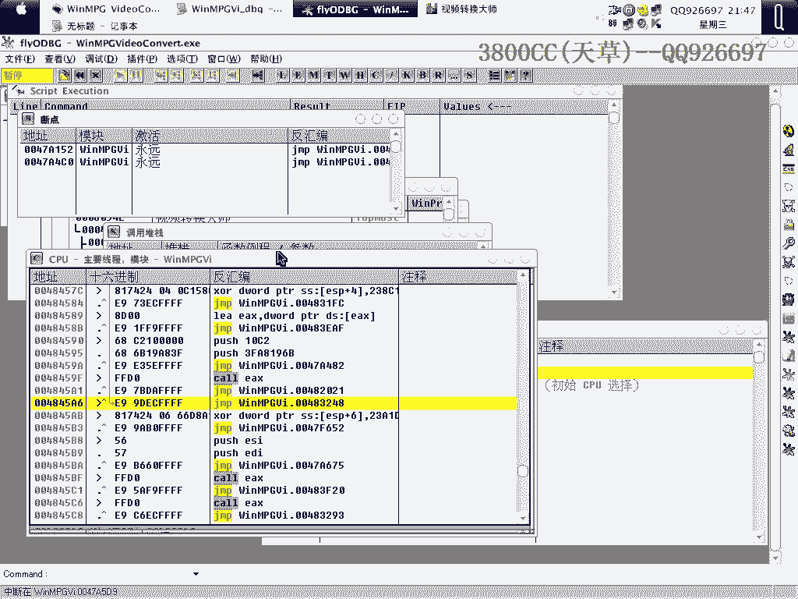

跟前面也是一樣的，因為兩個有岔路口，我們不知道到底是哪個，這個才是我們跳轉的來源，現在在這個地方也是下好斷點，大家看到了，這裡有一個email，我們剛才看到了錯誤的時候，它會提示需要向什麼email。

聯繫什麼什麼email，那就是說明這個也快了，我們人員是回去，看到這一句了吧，回溯，這個12對3調用，只能對我們這麼一點點幫助，把距離縮小，至於回溯的過程我們還是得自己來，因為這個的確是跳轉太多。

全部是jump，這個相當於把call，只成為調用，用jump來調用，如果要真正的用call來調用的話，因為太多只成非常小，用call的話還真不好辦，如果用call的話我們需要進很多層。

而且你又不知道哪一層是正確，該進哪一層不該進哪一層，這裡也是有兩個跳轉，我們來確認到底是哪一個，好，是這一個，我們把另外一個刪掉。

找對手，回去，回去，再回去，好，最好是這一段，最好是這一段，好，這個是這一個的，因為跳轉非常多，你要是點錯一個回溯，回錯了一個的話那就欠攻擊技了。

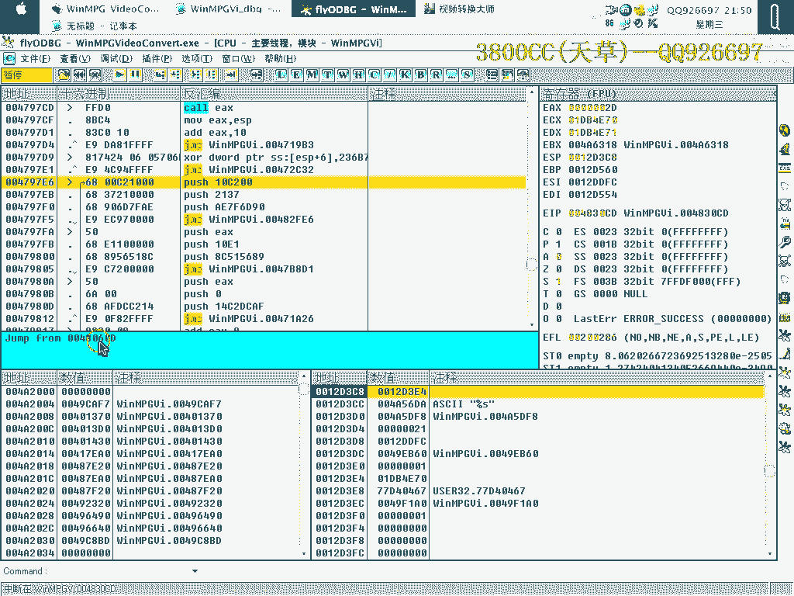

所以說如果你確認前面回溯的，沒有錯誤的話，最好是留一個斷點，像我現在就留了一個，在這個斷點之前的都沒有錯誤，找對手，我現在做前面這些，就是給大家引導思路，好，這裡也是有兩個，也是有兩個。

我們看那一招也要，下好斷點再重新來過，好，OK，那我們就把其他的兩個斷點給刪掉，這裡仍然是回溯，回溯，像剛才我一下點錯了一個，再回來，好，OK，好，好，好，好，看清楚，眼睛要是看累了的話。

把腰挺起來離屏幕遠一點，這樣看的更清楚，這一次這個跳過來，好，看到了，這裡有個接儀，這跟我們前面預想的是一樣的。

那也就是說剛才是這個接儀跳了，跳過去了，我們在這個地方下好斷點，我們來看一下，這裡AR為0，AR為0，AR為0，為0這裡雖然就跳了，不讓他跳看一下，這個跳斷改一下，做成成功，但這裡還是顯示為註冊版。

為註冊版，好我們重新來過。

這個，調轉就在留著吧，重新來，看到了註冊之後雖然提示做成功，但是第二次啟動的時候仍然會有這麼一個錯誤，仍然需要我們註冊，看到了，我們這個地方改一下，我們來看一下。

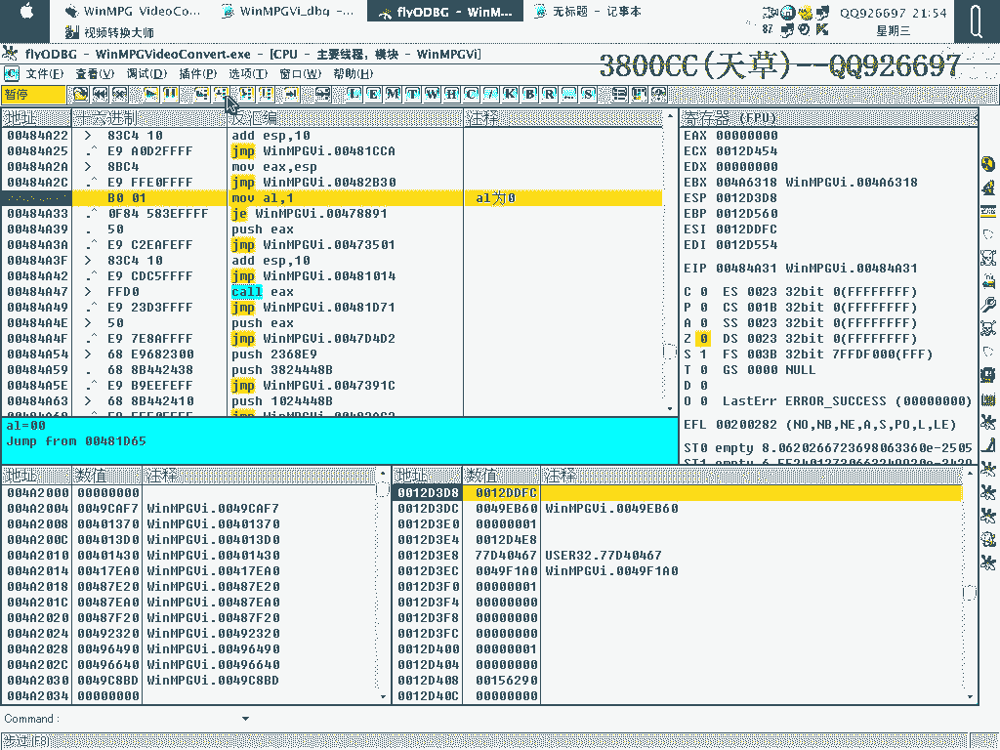

這裡就沒有跳了，我們現在把它修改一下。

做好記錄，現在來運行。

這成功。

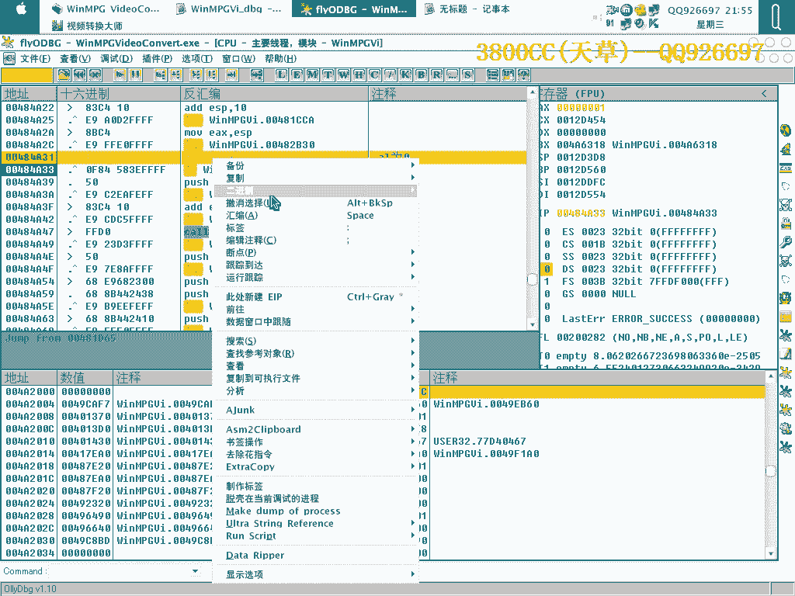

然後我們再重新啟動一下，仍然是需要我們註冊，但是就是說，這個樣子就已經可以用了。

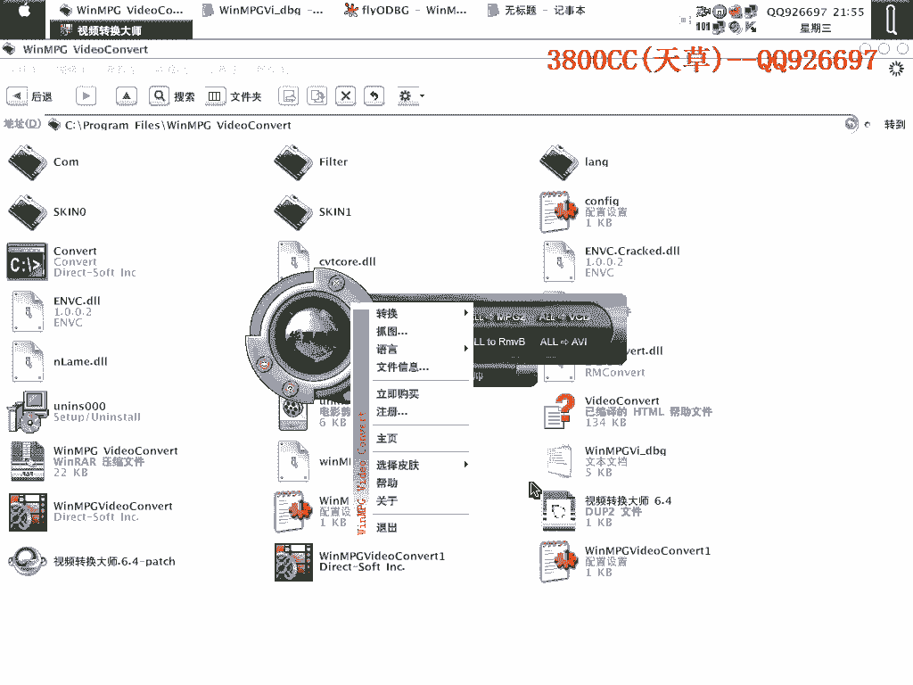

在後面需要轉換的時候。

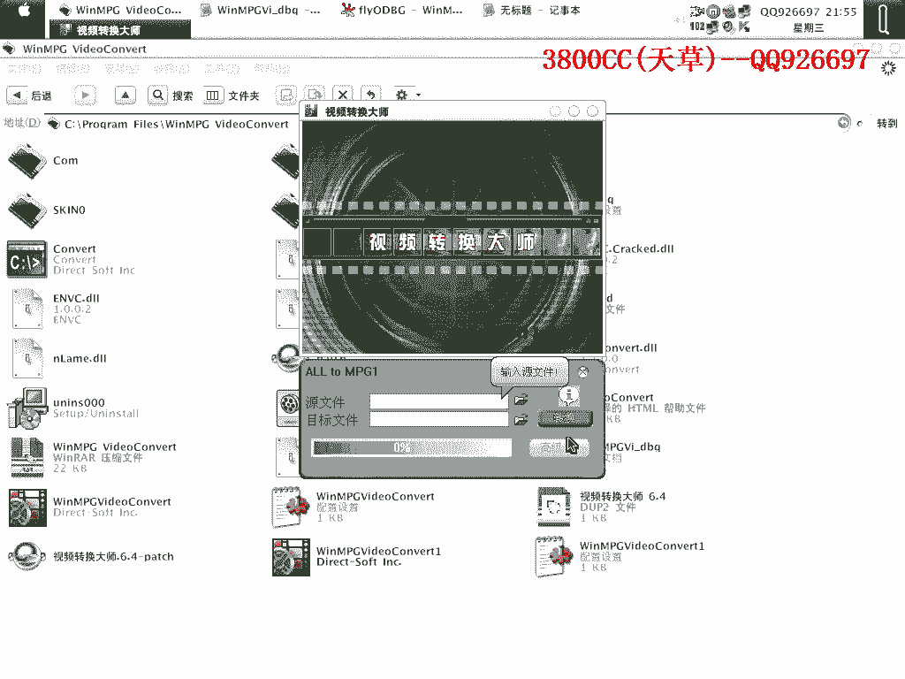

你這樣註錯過一次之後，那麼一個視頻轉換錯了視頻上面就沒有，為註冊字樣，但這明顯是非常麻煩的，也就是說它是有重啟驗證的，但是這個重啟驗證又有別於其他的，我們來看一下，現在就開始說到我們後面的一個，思路了。

大家看到了現在是華軍購買，我們來註冊，註冊成功之後就變成訪問主頁，這就是我們的一個突破口，我們現在看到這裡，這裡是華軍購買，這個是訪問主頁，我們就可以知道程序就是說，當註冊成功之後，它會。

就是說它會把這個。

換成這個，互相調用，OK我們現在就是一個突破口了，搜索，搜索。

就是要搜索這個，訪問主頁的這個。

這裡有一個，我們看下面一個，看下面一個，那現在要確定是哪一個，我們在這個地方呢，先雙擊進去，把第一個雙擊進去。

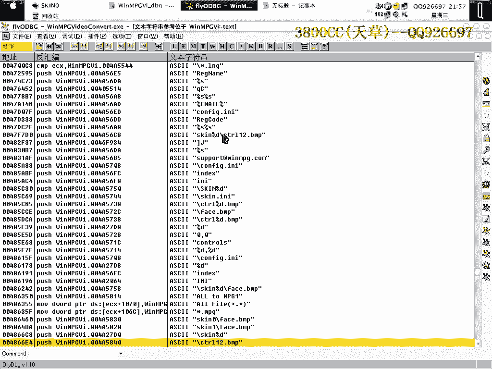

這裡，這裡全都是在跳轉的這個位置，我們可以不防，在這個地方下好單點，接著呢。

這個下面。

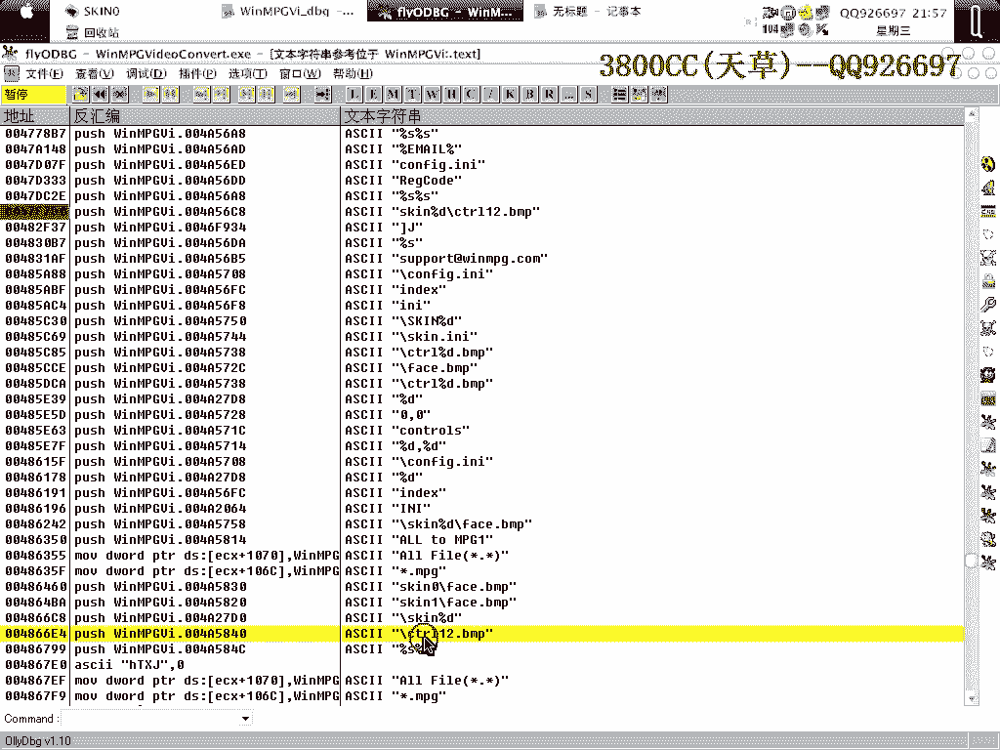

這裡還有一個，這裡是調用，我們在這個地方下好單點，或者是這個地方，斷首和斷尾都下一個，這個是我們F9運行，看到先斷下來一個，都沒斷，都沒斷下來，非常非常奇怪。

都沒斷下來，很明顯，他這裡就沒有調用到，我們直接在這個地方調用，直接在這個地方下好單點。

這裡也是這樣，人員，人員，我們再來看一下，是怎麼回事，看一下，看一下，是不是我這裡註冊過了，華據購買沒有，沒有，那他首先是華據購買，那我們就先找華據購買吧，我這個地方，這個地方也做好記錄了，是找這個。

是找這個，這個斷首怎麼現在斷不下來，我倒是要找一下原因，剛剛這個斷首，這裡，這裡，我們來看一下，現在可以斷下來，不知道為什麼，我們現在來走，這裡沒什麼重點，沒什麼重點，這裡他開始調用我們註冊信息。

說明重點快了，這裡是調用index，就是皮膚了，皮膚為0就代表默認的，他這裡0是可以0，然後如果是1的話。

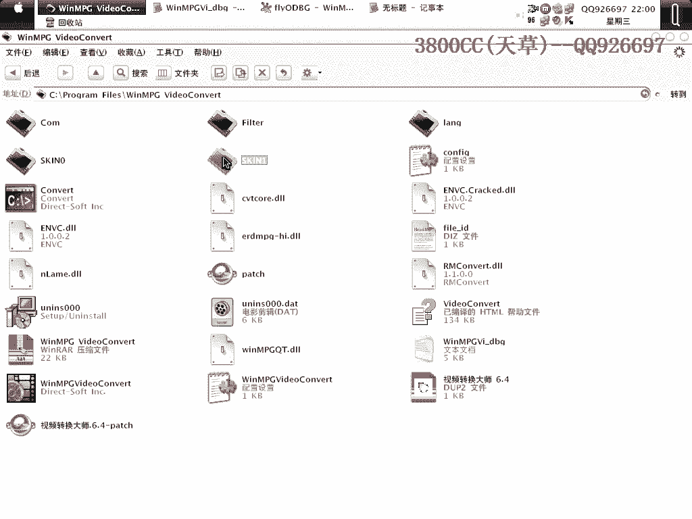

他會調用這個皮膚，有兩種皮膚可選擇，很明顯，這裡一直都沒有跳轉，這個地方有一個跳轉，我們可以單步走，他跳了，他這裡開始調用，我們需要，我們需要的就是讓他不要跳，不要讓他跳了，調用，我們來走，這個地方。

沒有調用，這個地方消耗斷解，重新來過，好，他原來是F9在這個地方，這裡呢，不要讓他跳，好單步走，看一下他調不調用他。

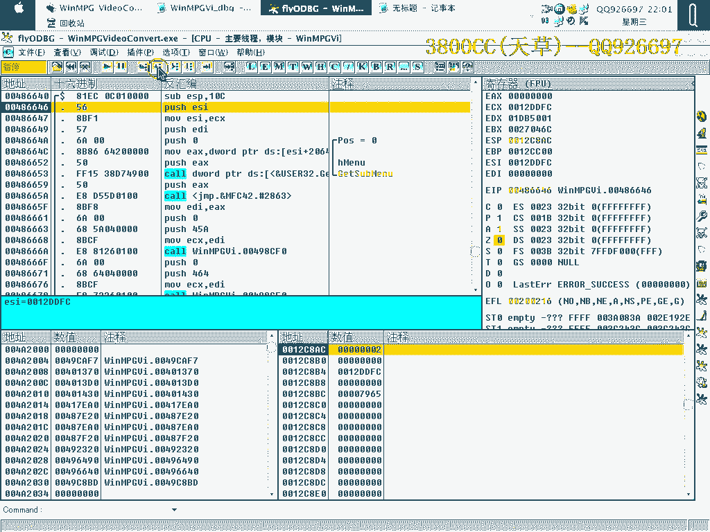

調用，調用，CountryJobs，CountryJobs，是訪問主頁。

F9運行，F9運行，看一下，人員存活金購買，但是這個地方，這個地方有一個問題就是說，註冊信息已經沒了，但是仍然是顯示的這個未註冊版，看到了沒有註冊了，那就是說這個地方是我們的一個突破口，是一個突破口了。

好，那這裡是EAX來控制，控制這個介意我們這裡要進去，單步走，好，這裡很明顯，好單步走這裡他跳過去了，但是這裡有一些字不串，我們不讓他跳看一下，好，就是我們的一個關於了看到了，就說明這裡就是一個關鍵了。

把這個斷點取消掉，既然我們範圍已經縮小了，那就是這個這個調整是關鍵，那就是這個口，進去這裡進去，到這裡來大家就應該非常非常的清醒，非常非常的清醒，這裡是跟ENVC也就是說是這個DLL相關的，DLL相關。

我們再來看一下下面，來看一下，這裡是，ESP+8，ESP+8關心說這個DLL，那ESP+8是多少，我們先來記一下，是0012C8B8，我們先轉內存地址中跟隨，看到了，這裡6579就是我的一個註冊名。

註冊名後面的兩個字母，前面的WYNNEYR，就前面四個字母全部被清零了，那自然的話這裡自然就不行了，自然就是零清零了，這裡是清零了，我們這裡就是說如果把這個地方改成01的話，那就非常完美了。

這裡已經過去了，過去了我們回來再改吧，先把這個地址記著，重新來過，就是說我們現在離，成功越來越近，好，拿到這麼一個位置，好，先彈步走，這裡放了這麼一些字，我們把它改成01，再彈步走，這樣就沒有跳。

我們這樣就達到我們這裡，看到了，這裡又變成01了，這裡又變成01了，繼續彈步走，這裡又變成01了，這回是他的地址是12CD60，我們再改，好，再運行，變成訪問主頁，這個我們不用管。

這個call是要調用多少次的，好，既然我們目的確定了，這個call我們當然要進去走一走，我們這個時候，要觀察這個內存地址的變化，進去。

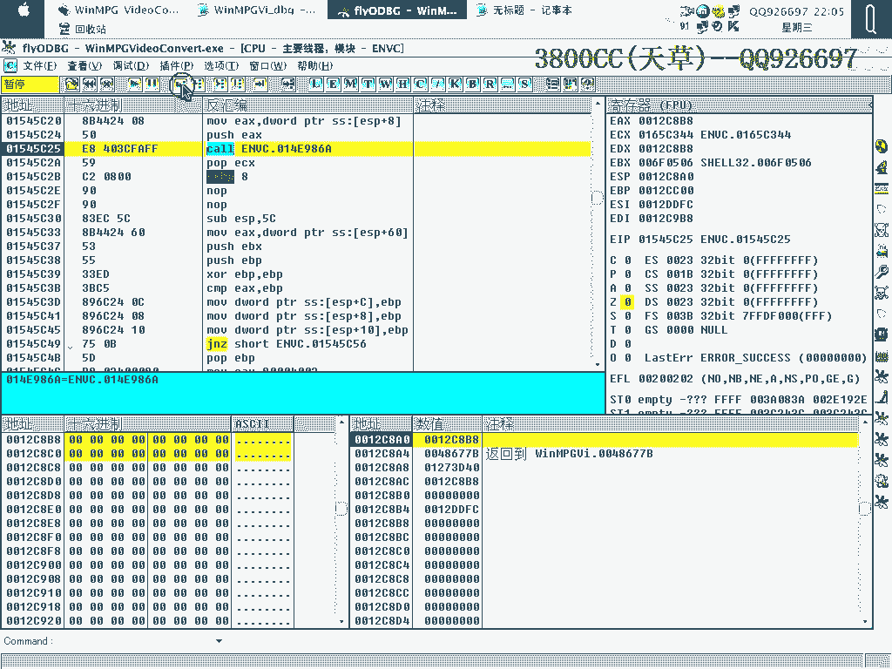

進到這裡來了，這裡是C8B8，12C8E8，這裡是C698，不是我們要的，這三個明顯不是我們要的了，EX的值是C8B8，我們等一下看著，什麼東西在給，這個EX值，這個ESP在給，但ESP是把這個地址。

內存地址在給他，這個無傷彈不管，EX是12C6，他這個地址是12C8E8，給ESP+8，好，繼續彈步走，ESP+8，現在這個地址，沒有任何變化，一直都是0，我們繼續彈步走，ESP+8，放EX。

這個沒有關係，好，大家看清楚，這個地方，ESP裡面的值，是12C8E8，就是我們現在看到的這個值，然後呢，給EX，然後這裡有個0給EX，0給12C8E8，這裡有一個關鍵，其中的一個關鍵，在這裡下好彈點。

這裡開始放入，因為後面這麼一個值，他會經過多次變化，多次變化，彈步走，第一個關鍵找到了，我們就需要到最後面，相當於非常接近尾聲的一個地方，因為思路是這樣，首先呢，程序，給關鍵，點，負語，錯誤值。

然後接尾，中間，就是一堆什麼東西，程序，人員，會檢測，這些關鍵點，我們剛剛找到了一個位置，就相當於是，關鍵點負一個錯誤的0值，然後我們現在就可以稍微，步伐放快一點，注意眼睛要尖，這三個地方，接尾。

接近尾聲的時候，程序肯定還會繼續檢測，不檢測的話，這裡呢，他就開始讀這個，那我們就可以更快一點，不用找了，因為我們前面下了一個斷點，會影響到我們後面的運行，F8，一直按著，開始讀。

他現在讀我們的一個用戶名，但一直沒有出現我們的假碼，這個我們還可以稍微放快一點，等計算器出現假碼的時候，我們要放慢腳步了，看到了啊，這裡他就開始放入我們的一個，我們的一個註冊名，出現了，假碼出現了。

這個時候我們可以慢慢的走，慢慢的走，這裡，這裡，都複習一些規則，不用管他了，這裡看清楚，然後呢，ESP值，放入EX，他既然這樣放來放去，把這些東西放來放去，就說明後面肯定有動作，EX ESP放這個值。

好，大家看清楚，大家看清楚，這裡的EX就是77，79 6161，就是我們的這個776，W1N1的一個ASCII值，這裡，這裡，要看清楚，我們在這個地方下好斷點，因為這個地方必定是一個關鍵。

必定是一個關鍵，為什麼說這個地方是一個關鍵，ESP+8放EX，我們可以彈幕走一下，好，那個0值非常危險，0，他這裡是把0，放入61617977，61617977，很明顯這裡就是一個關鍵。

他會把前面四個清零掉，我們在這個地方下好，做好記錄，這裡就是我們的一個結尾，那我們的一個開頭呢，是這裡，調用DLL，這些類似值會變化，你看我前面調色的這些類似值，不是類似值DLL值，是1419931。

這裡呢，EC都會變的，只要你OD一關他就會變，等下開OD他就會變，走過去了，那我們這樣，浪費一次機會，我們應該在這個地方修改，現在已經走過去了，浪費一次機會，看一下我們的一些想法是否正確，繼續F9。

這裡呢，我們可以當步走一下，F9也行，當步走，看到了他一直都在放，往裡面放0，我們就把它改，上回這個AL是1，就是我們說明我們上一次，在這個地方中斷之後放的是1，F9也行，關於呢，這裡放1我們改了。

這裡呢仍然要放1，3800CC天草，當然這個3800CC天草，這個地方是我修改的一個地方，等一下告訴大家怎麼去修改，那就說明我們猜想的是正確的，OK我們放回，繼續，在這個地方中斷了，修改為1。

這裡就要注意了，因為這個地方，因為這裡沒有代碼進行修改，那我們就可以這樣去修改，在後面，需要自己放一些代碼，拉到最後面來，找這裡吧，找一個空位置，我們這樣，因為這些代碼不夠，FFD08B44R408。

這裡只有6個字節可用，那我們就把它修改為這樣吧，因為我們的目的是要，讓ESP值，讓ESP+8，給EX放1，我們就jump到這裡去，好，jump到這裡來了，這裡呢我們這個跳轉肯定要保留的。

這個跳轉肯定要保留，好，F9，F8，那我們現在，就是把Morph，這樣這樣，Morph，1，然後呢，然後呢同樣，這一句，即使這一行調用也可以，不用這一行也可以，好，最後呢，跳回去，這個大家不要忘記了。

跳回去，我們現在F9運行，程序無法處理，錯誤無法處理，這說明是哪個問題呢，看一下，噢它這裡調用0012，0012這麼一個位置，我們不應該把那個輪迴掉，繼續，調整一下，位置，剛剛修改的那一些呢。

剛剛修改的那一些呢。

這個，消耗斷點。

消耗斷點，39，39，39，39，39，39，39，39，39，39，39，它調用了0012這麼一個地址，調用0012這麼一個地址，所以這個框我們不能把它弄掉了，我們在這個地方修改，在這個地方修改。

好下一步，OK，斷步走。

在這個地方呢，我們要放，給esp+8，給esp+8放這些字，morph，同樣是這一句，同樣是這一句，好放回。

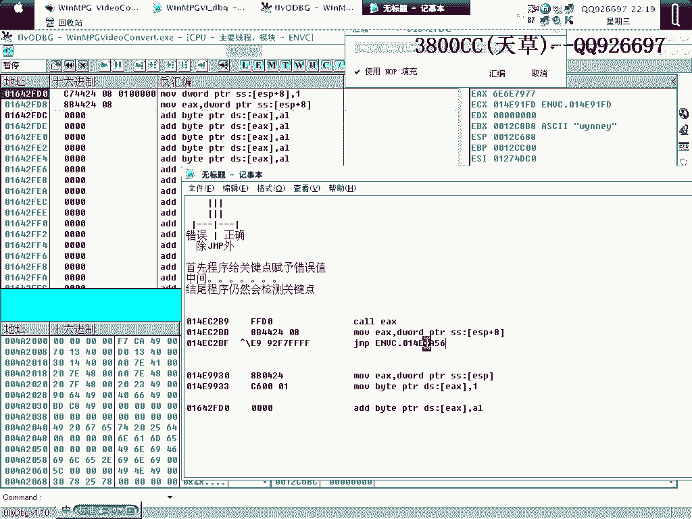

我們這樣寫就是寫這幾行代碼了，寫這幾行代碼，看到了，可以我們單步走一下，這裡單步走，開始放放於ex字了，一直都在放ex字，一直都在放ex字，這裡alway是上面一次經過這裡給的。

這裡alway是上面一次經過這裡給的，可以，關於呢。

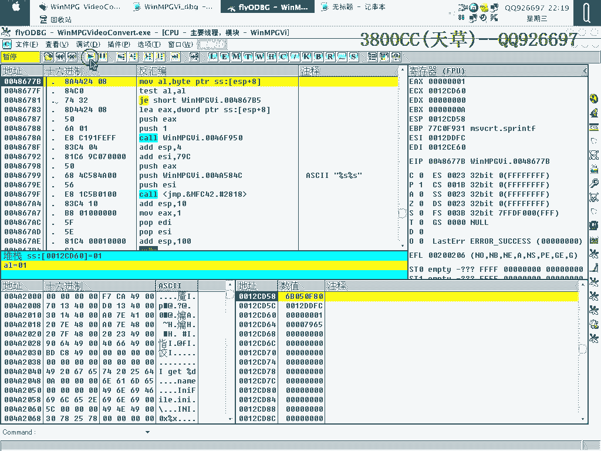

留言室的，註冊給，那就說明我們修改是完全正確的，所有改動，全部複製，覆蓋，覆蓋，留了一個備份。

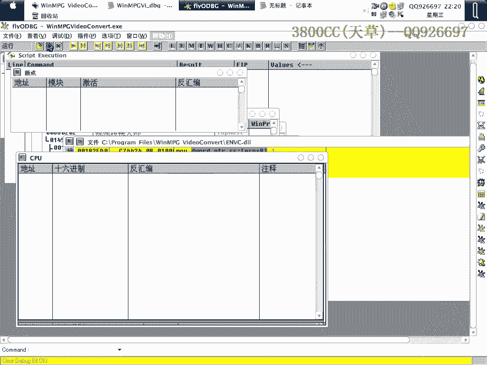

留了一個備份，OK，可以。

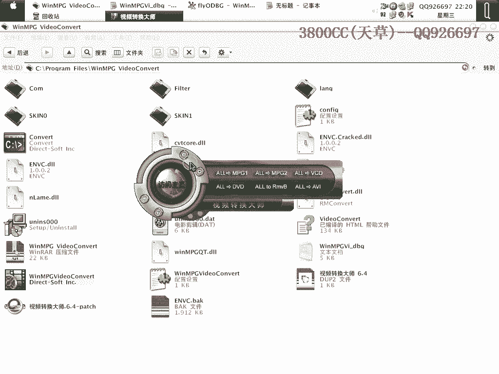

因為大家剛才看到，給他為一直把我們WY、EY前面的字母給去掉了，給他為一直把我們WY、EY前面的字母給去掉了，所以我們剛剛看一下。

剛剛看到的關於後面有一個r，就是後面的兩個字母，用另外一種unicode。

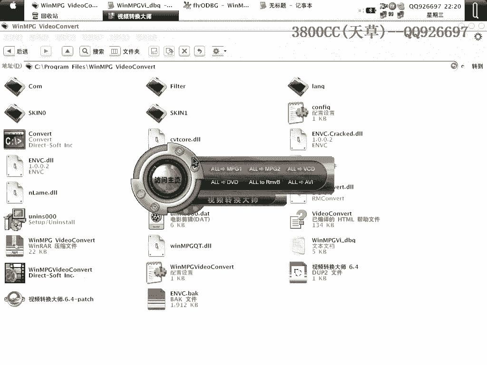

因為我在跟蹤的時候會發現它會轉化成unicode，因為我在跟蹤的時候會發現它會轉化成unicode。

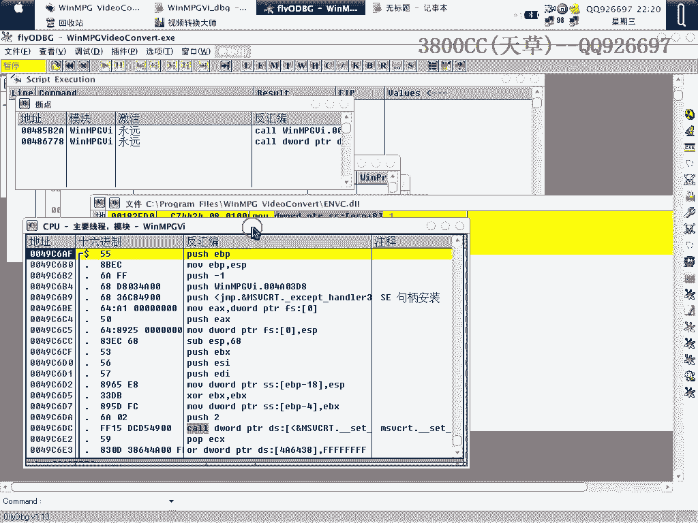

就是WY、EY後面EY它用unicode，然後就是有一個r，因為前面的四個字母全部都被抹掉了，因為前面的四個字母全部都被抹掉了，關於這個上半天草是在這個地方改的，關於這個上半天草是在這個地方改的，這裡。

註冊改，在這個地方加的，如果我這個地方不加的話，不加的話，註冊就是一個不太好看，就這個地方加就可以了。

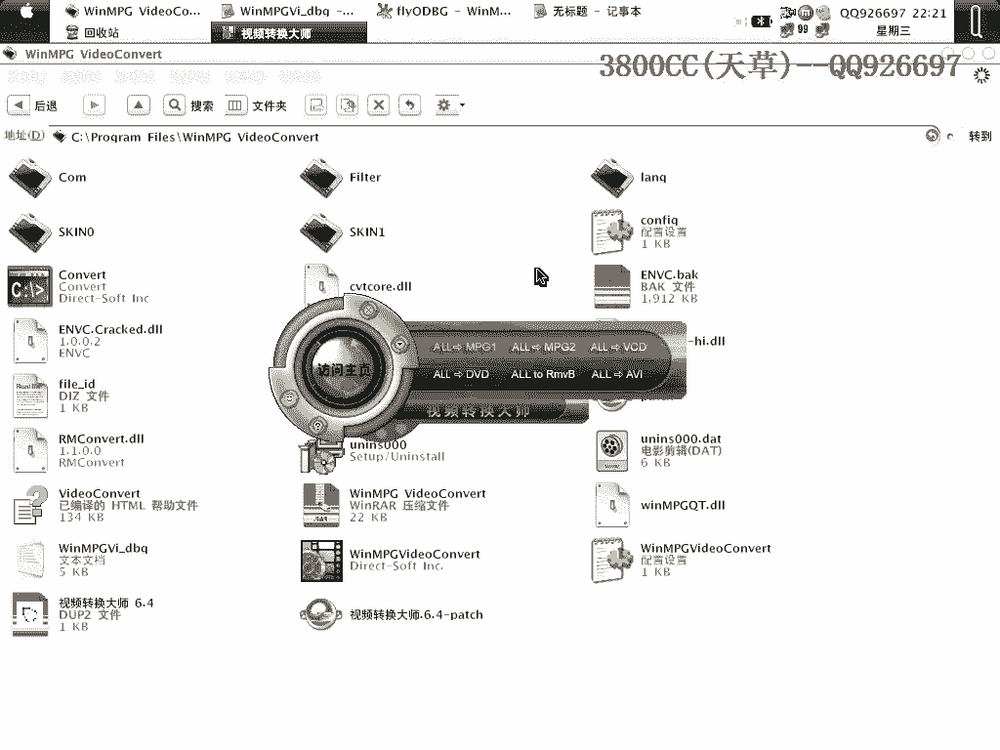

我們來看一下轉換，我這還沒東西轉。

就轉這個吧，就轉這個吧，就轉這個吧，一個小黃片，一個小黃片。

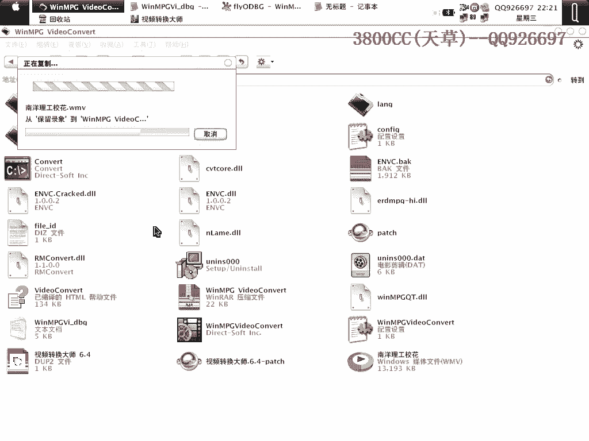

轉換，轉換，沒有那個。

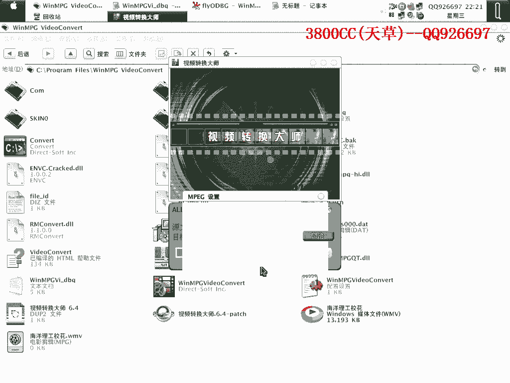

沒有那個，沒有那個，我們來看一下沒有註冊的話，我們來看一下沒有註冊的話，它會有一個未註冊資料，這裡我原先留了一個就把這個刪掉了，這裡我原先留了一個就把這個刪掉了，刪掉，刪掉，看一下。

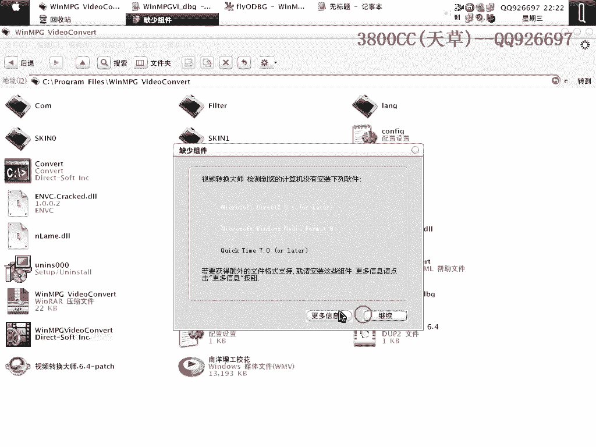

看一下，有這個未註冊資料。

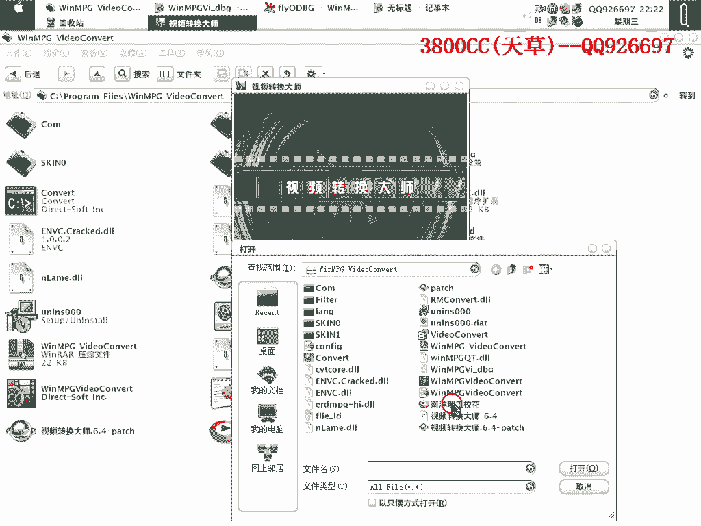

有這個未註冊資料，屏幕上會有這個未註冊資料，那就是說我現在已經完全破解了，那就是說我現在已經完全破解了，另外我做了一個patch，這個也是一樣的，patch這個東西，patch這個東西。

這個是用這個做的，這個是用這個做的。

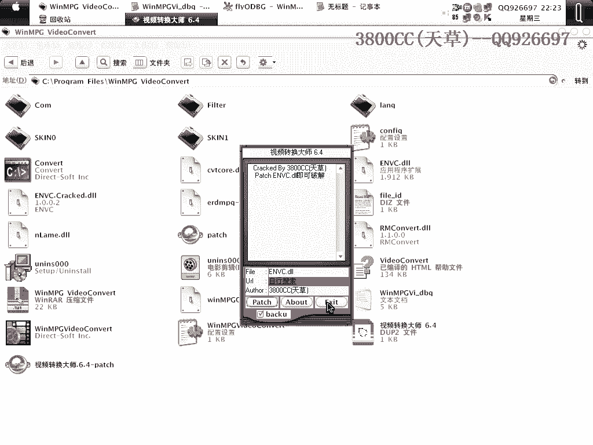

怎麼樣做呢。

我這裡這個，我這裡這個，公開文件保存在這裡了，我們就打開它吧，選擇這個，自己在添加的時候可以，我就隨便演示一下吧，剛好把這個關掉了，6。

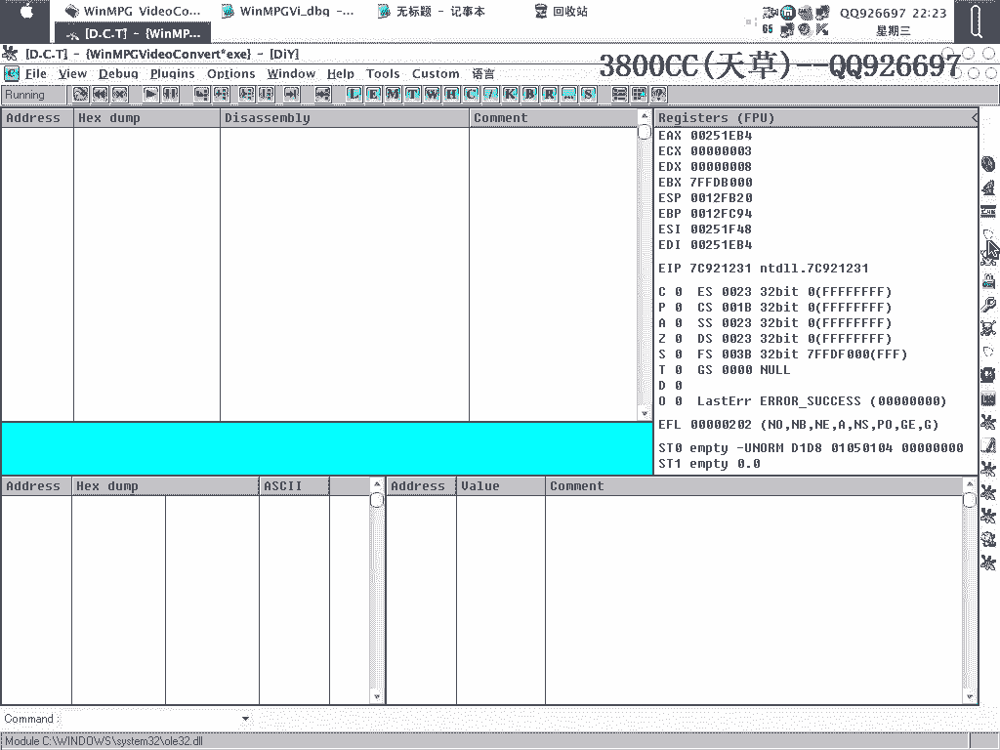

這裡填吧，我要破解的是這個就選擇它，我要破解的是這個就選擇它，然後這裡呢你都可以填，填了點了個save，這裡就是再一個setting，關於這個介面，皮膚啊，這裡選這個皮膚，這裡選圖標的，選皮膚的。

其他的可以不用選，音樂倒是沒必要加，再點add添加，是選它，選上它點edit，file name呢這裡當然還是這個文件，然後orange呢就是原始的文件，原始的文件，然後touch呢就是破解了的。

破解了就選你破解的那個，compare一下，這就是我修改之後的一些字節，新的一些字節，看到了原先是0000，被我修改了之後就是這些東西，這樣加了之後，我們點save就可以了，當然我可以把這個換一個皮膚。

為了好看隨便吧，隨便換一個皮膚，create patch。

patch1，就這一個了，這有些信息我沒填，沒填點patch就可以了。

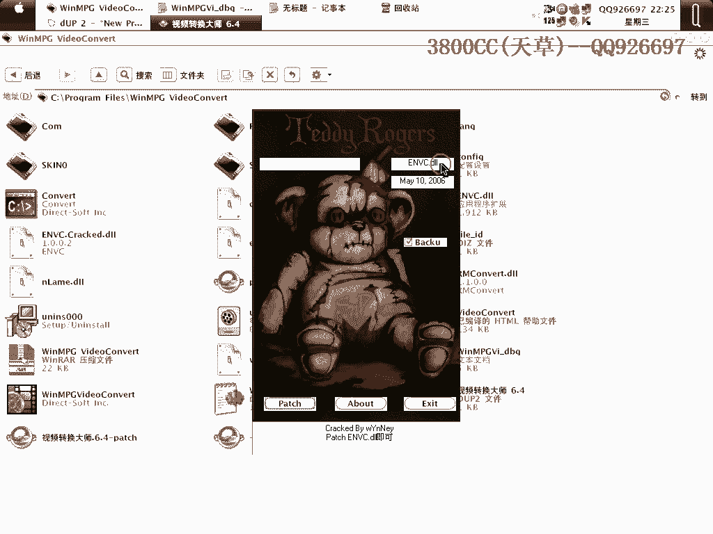

就這麼簡單的。

就這麼簡單的，然後這皮膚你可以隨便自己換，當然這些都是一些國外的風格，國外的人做的，是這麼一個東西，那這裡呢就是說，給大家講這麼一個東西的目的，一個目的，思路非常非常重要，就是首先第一步。

剛才我講這個完全是靠我自己在破解的時候的一個思路，剛才我講這個完全是靠我自己在破解的時候的一個思路，剛才我講這個完全是靠我自己在破解的時候的一個思路，我的第一個思路當然就是用那個斷點。

因為需要調用到這麼一個文件，所以我就用這個斷點，太長了，我的第一步就是這個斷點，發現了什麼呢，發現了什麼呢，加密化太多，加密化太多，跟著煩，我們第二個思路，就是我們的一個F-12對戰調用的這麼一個方法。

那這個方法就是要回溯，那這個方法就是要回溯，回溯，回溯，回溯，回溯跟蹤發現那個介意，回溯的思路就是在這個地方，有懷疑才有進步，有懷疑才有進步，回溯，找到一個介意，註冊修改介於發現的確是一個關鍵的挑戰。

同樣又發現了重啓驗證的地方，而且同樣發現了一個問題，註冊成功後，由華軍購買變成了訪問主頁，既然這裡有皮膚可用，由他得來的，我們正確的思路，圖片，註冊成功後，圖片會換，我們就通過圖片入手，最後就是跟了。

轉存，轉存中發現，我們剛才看到了，我是在轉存中跟，轉存跟隨之後，注意發現，發現我們在什麼地方變化，我們剛剛找到這個地方，我們走過去之後，轉存的地址，馬上就前面四個字節被清零，那就說明這個地方是關鍵的。

所以就修改這個地方，加上他這裡位置非常狹小，非常狹小，那我們就通過寫代碼，當然就是找一個空位置，這個軟件，沒有對DLL，或者是主程序，進行大小校驗，我們來看一下，這個原程序是9578888。

我這個破解了，大家看一下，應該是多了幾個字節，也沒有，幸好我們寫的只是兩行代碼，沒有大小區別，轉存中發現，這個就是用的一個技巧，後面的一個技巧是自己寫代碼，寫代碼的目的就是要實現我們剛才的。

我們要實現我們剛才像在剛才就說，這裡他開始原程序會給EX裡面放0，那我們要實現的目的，就是把EX放1，所以這樣我們就可以達到破解的目的，這個大家仔細要跟，要自己仔細跟，大家按我的這種前面的兩種思路。

兩種思路都跟一遍，第三種思路你要跟N遍，要多跟幾次，不然的話，這個你學不到什麼東西的，因為這個的確難度有的，是有難度的，下去之後就按我說的，第一種思路就是下段點的思路，你要跟幾遍。

第二種思路就是用F2對戰雕用，然後回溯的方法，這個也要跟幾遍，後面的正確的就是說能夠打完，能夠完全完成我們破解的一個目的，這個要跟好幾遍，要多跟幾遍。

不然的話，你想不到有些東西，裡面該怎麼樣，為什麼要那麼去做，這集課就這麼多，再見。