# 3800cc(天草)-天草高级班 - P16：16、不脱壳破解ACProtect - 白嫖无双 - BV1qx411k7kJ

大家好，這節課呢還是講一個不妥可破解的，S-ProTax這麼一個課，先來運行一下，我這個沒安裝啊，所以啟動之後他就會出現這麼一個東西，我們把這個框框，法人的框框給去掉，我這個是安裝之後的。

我們先到OEC去看一下會怎麼樣的一種情況，清圖，清圖啊，我們用類成單點，很明顯啊，這裡並不是OEP，而且OEP是被偷掉了，我們來看一下，PID來查的肯定就是這麼一個客了。

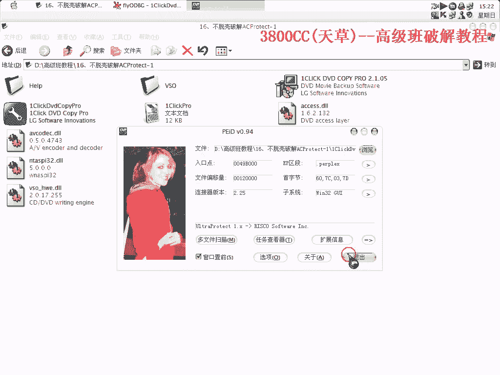

然後用FI來看一下到底確認一下版本號，1。32還算比較高的。

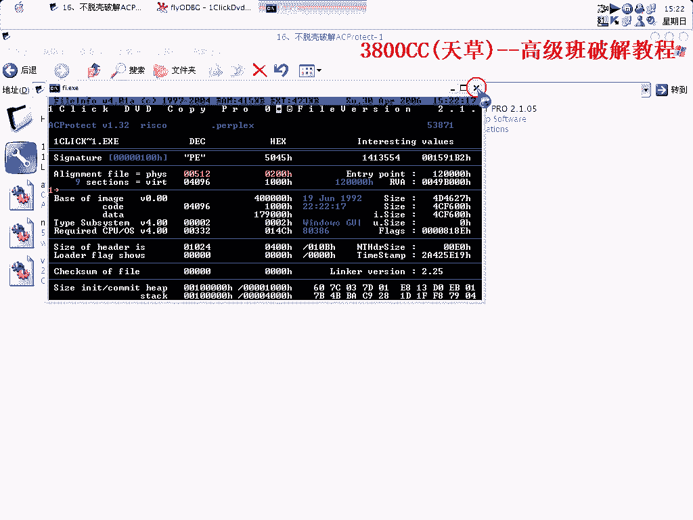

1。32 1。35然後這就是1。41還算比較高的，我們在這個地方這樣來，怎麼運行不起來，重新來過，還是有那麼一點強度，又無法調色了，我們換一個奧迪。

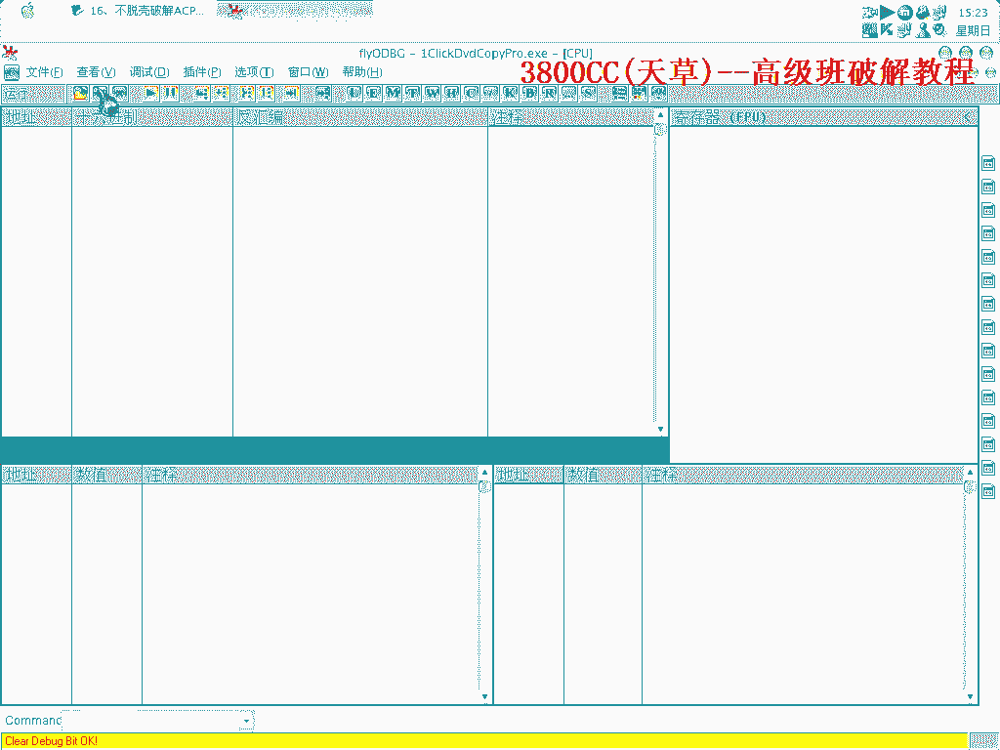

看來繼續要換系統。

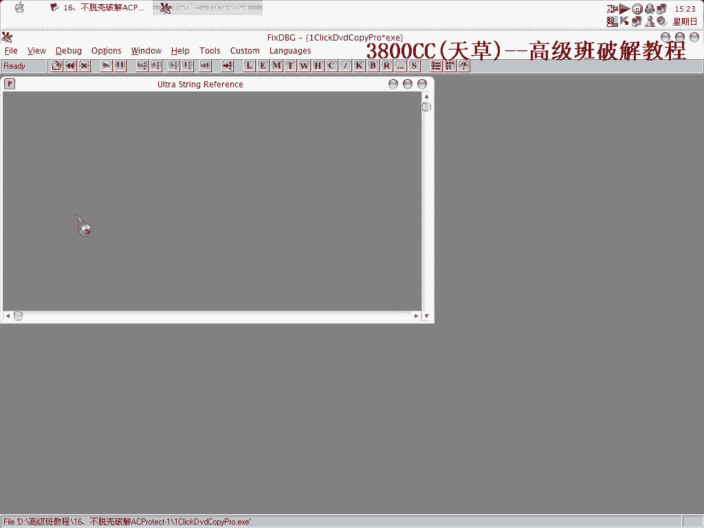

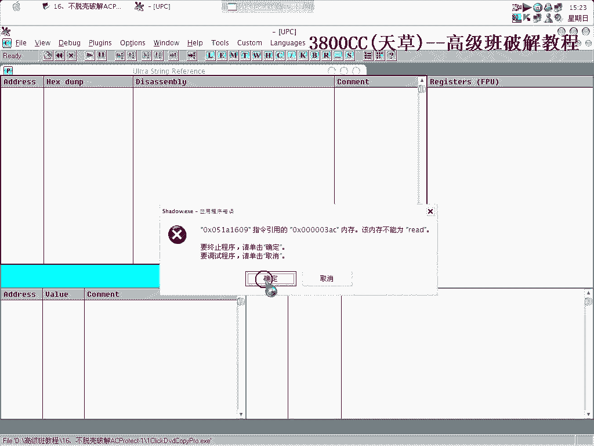

繼續要還原一下。

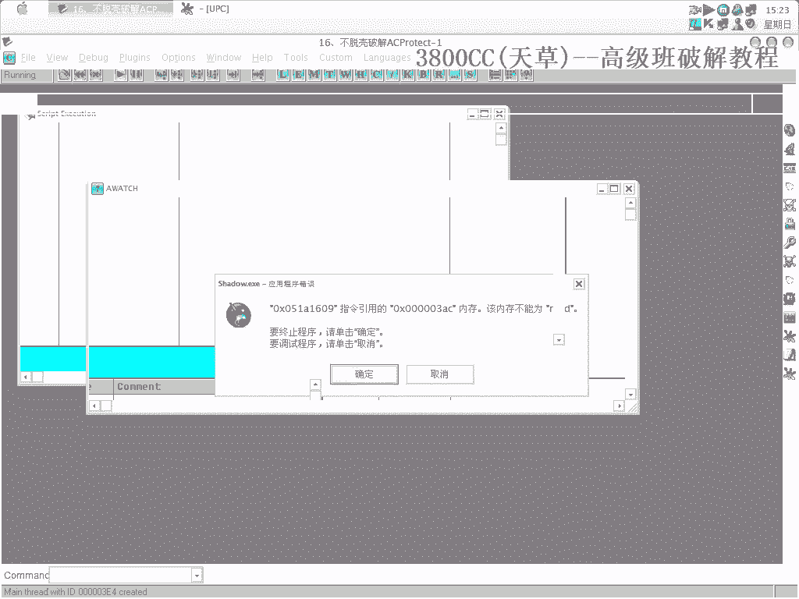

忽略所有的異常，在IDAT斷，下類成寫入，在Code斷，下類成訪問，刪除斷點，這個提示是因為我沒安裝啊，但程序是每回啟動啊，你要破解每回啟動都會出現這個，我們用斷，暫停法看一下，找到斷首，記得啊。

待可調色要下類成，硬件執行，要下硬件執行斷點，這個是常識，中斷下來了，看到了他在獲取我的一個名字，找斷首，這裡了，這裡，記號，就在這裡下斷吧，刪除前一個，重新來過，像我們的待可調色的這些手段啊。

不管對軟件的一些操作手段，都可以用到，都可以用到在，對外掛的一些操作上，我們可以來看一下，用後面啊，熄火碼，看一下，這裡，這裡他跳了啊，把它錄掉看一下，繼續的加油9，連接服務器，直接就退出啊。

直接就退出，那就是說這個地方，並不是我們要找的啊，並不是我們要找的，重新來一下看一下，看一下，我剛才那個直接錄不掉，直接熄火的加油9，看到了啊，再來一次，我們可以單步走一下，單步跟一下看一下。

為什麼會退出啊，為什麼會退出，(畫面開始變慢了，又誤會了。)，(畫面開始變慢了，又誤會了。)，(畫面開始變慢了，又誤會了。)，(畫面開始變慢了，又誤會了。)，(畫面開始變慢了，又誤會了。)。

(畫面開始變慢了，又誤會了。)，(畫面開始變慢了，又誤會了。)，(畫面開始變慢了，又誤會了。)，(畫面開始變慢了，又誤會了。)，(畫面開始變慢了，又誤會了。)，(畫面開始變慢了，又誤會了。)。

(畫面開始變慢了，又誤會了。)，(畫面開始變慢了，又誤會了。)，(畫面開始變慢了，又誤會了。)，(畫面開始變慢了，又誤會了。)，(畫面開始變慢了，又誤會了。)，(畫面開始變慢了，又誤會了。)。

(畫面開始變慢了，又誤會了。)，(畫面開始變慢了，又誤會了。)，(畫面開始變慢了，又誤會了。)，(畫面開始變慢了，又誤會了。)，(畫面開始變慢了，又誤會了。)，(畫面開始變慢了，又誤會了。)。

(畫面開始變慢了，又誤會了。)。

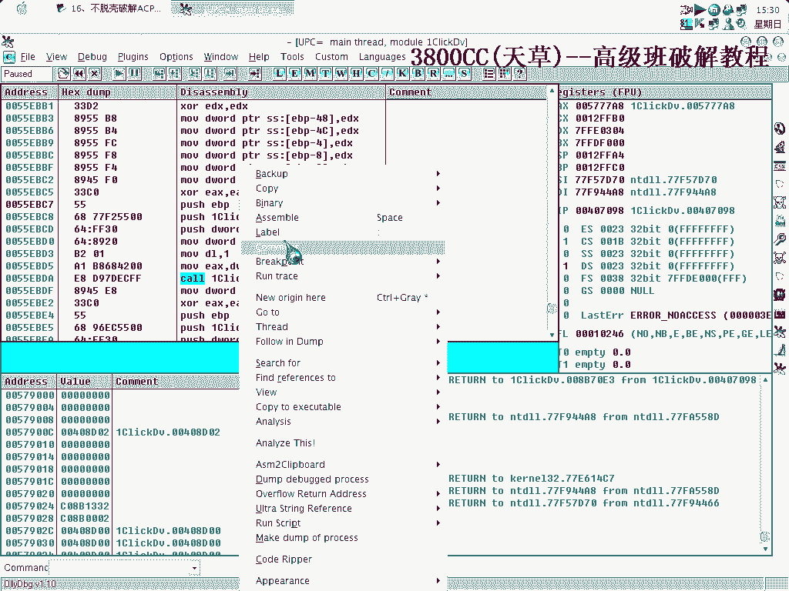

(畫面開始變慢了，又誤會了。)，(畫面開始變慢了，又誤會了。)，(畫面開始變慢了，又誤會了。)，(畫面開始變慢了，又誤會了。)，(畫面開始變慢了，又誤會了。)，(畫面開始變慢了，又誤會了。)。

(畫面開始變慢了，又誤會了。)。

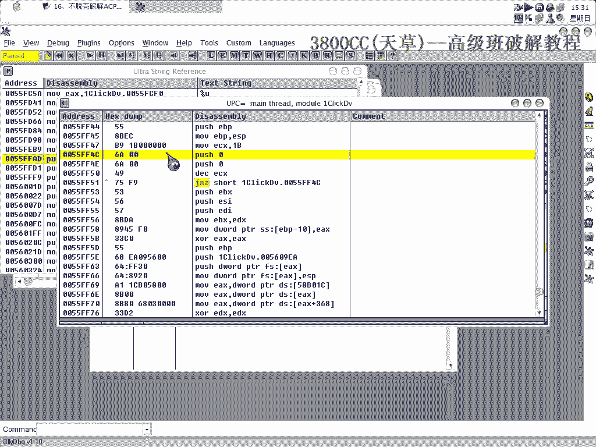

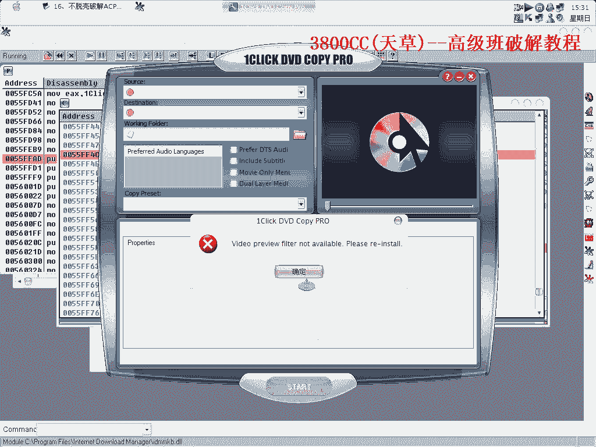

(畫面開始變慢了，又誤會了。)，(畫面開始變慢了，又誤會了。)，(畫面開始變慢了，又誤會了。)，(畫面開始變慢了，又誤會了。)，(畫面開始變慢了，又誤會了。)，(畫面開始變慢了，又誤會了。)。

(畫面開始變慢了，又誤會了。)，(畫面開始變慢了，又誤會了。)，(畫面開始變慢了，又誤會了。)，(畫面開始變慢了，又誤會了。)，(畫面開始變慢了，又誤會了。)，(畫面開始變慢了，又誤會了。)。

(畫面開始變慢了，又誤會了。)，(畫面開始變慢了，又誤會了。)，(畫面開始變慢了，又誤會了。)，(畫面開始變慢了，又誤會了。)，(畫面開始變慢了，又誤會了。)，(畫面開始變慢了，又誤會了。)。

(畫面開始變慢了，又誤會了。)，(畫面開始變慢了，又誤會了。)。

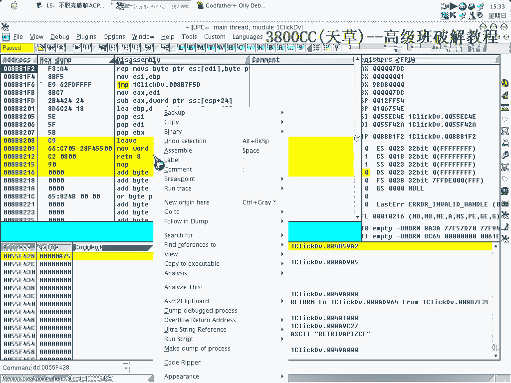

(畫面開始變慢了，又誤會了。)，(畫面開始變慢了，又誤會了。)，(畫面開始變慢了，又誤會了。)，(畫面開始變慢了，又誤會了。)。

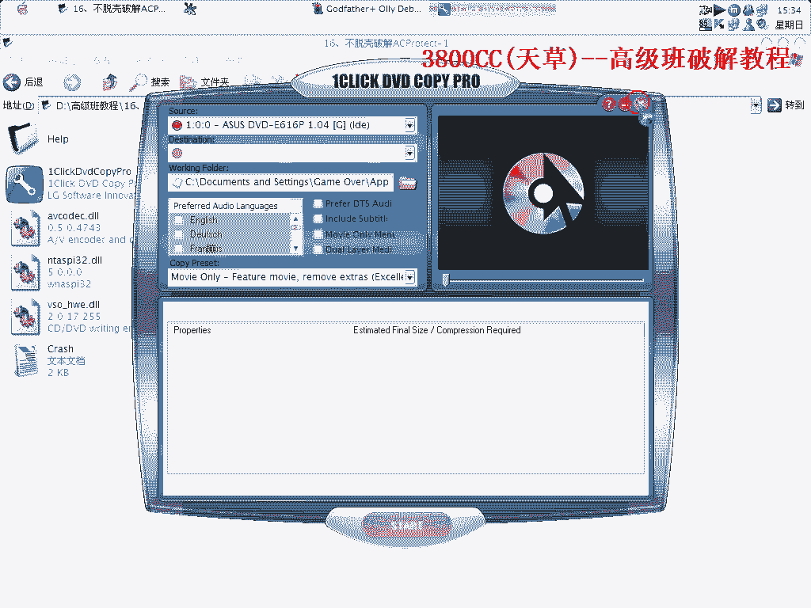

(畫面開始變慢了，又誤會了。)。

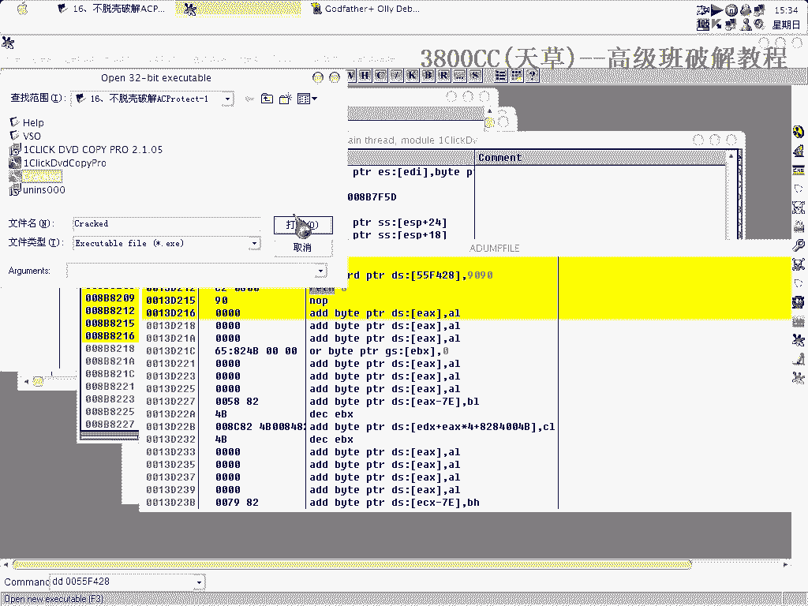

(畫面開始變慢了，又誤會了。)，(畫面開始變慢了，又誤會了。)，(畫面開始變慢了，又誤會了。)，(畫面開始變慢了，又誤會了。)，(畫面開始變慢了，又誤會了。)。

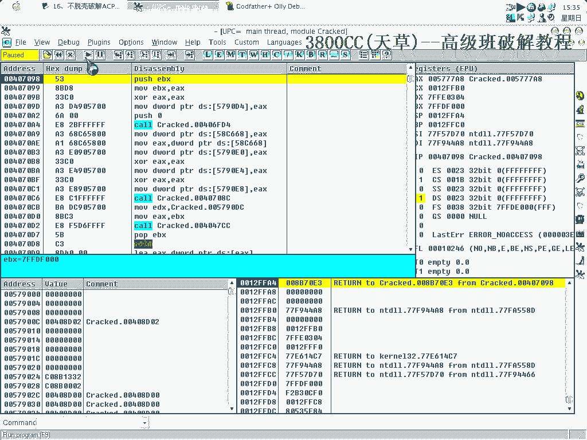

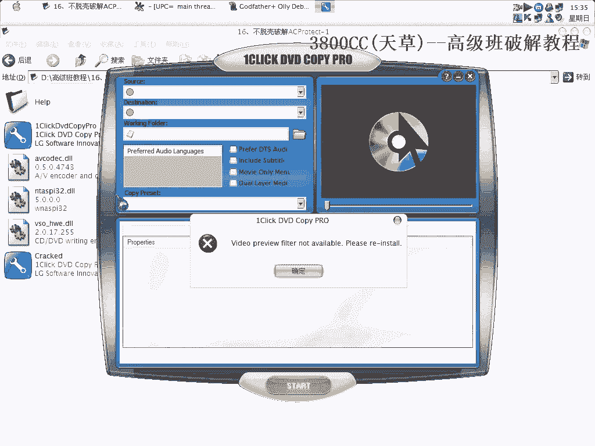

(畫面開始變慢了，又誤會了。)，(畫面開始變慢了，又誤會了。)，(畫面開始變慢了，又誤會了。)，(畫面開始變慢了，又誤會了。)，(畫面開始變慢了，又誤會了。)，(畫面開始變慢了，又誤會了。)。

(畫面開始變慢了，又誤會了。)，(畫面開始變慢了，又誤會了。)。

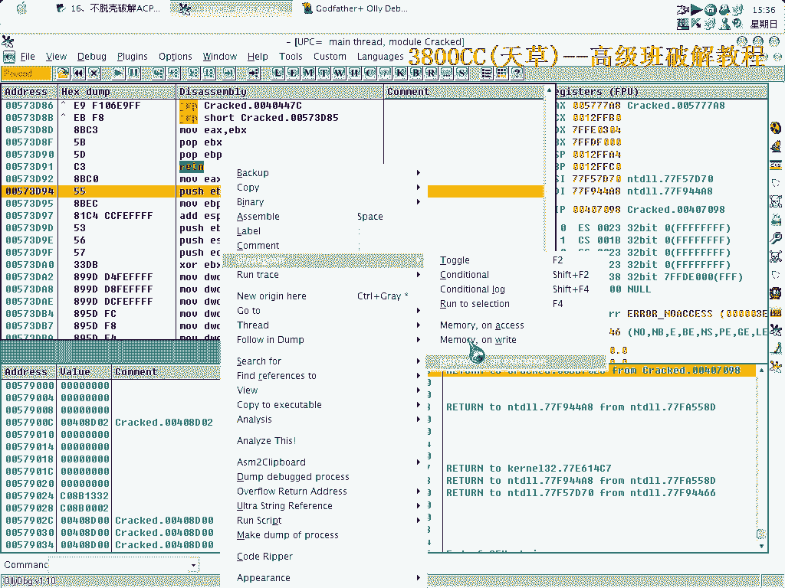

(畫面開始變慢了，又誤會了。)，(畫面開始變慢了，又誤會了。)。

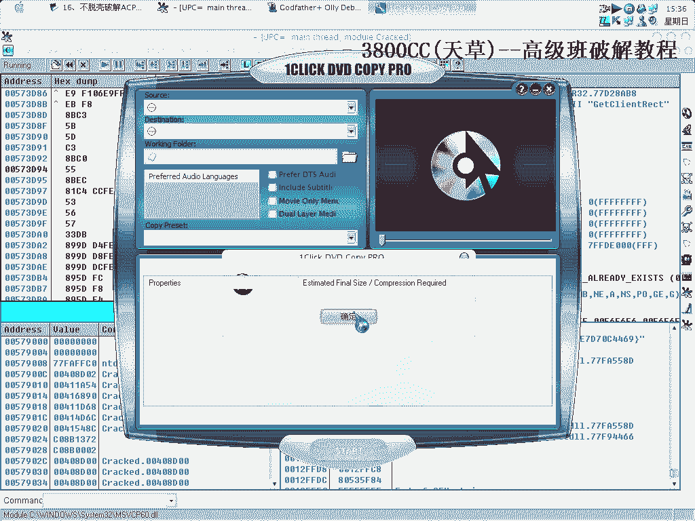

(畫面開始變慢了，又誤會了。)，(畫面開始變慢了，又誤會了。)，(畫面開始變慢了，又誤會了。)，(畫面開始變慢了，又誤會了。)，(畫面開始變慢了，又誤會了。)，(畫面開始變慢了，又誤會了。)。

(畫面開始變慢了，又誤會了。)，(畫面開始變慢了，又誤會了。)，(畫面開始變慢了，又誤會了。)，(畫面開始變慢了，又誤會了。)，(畫面開始變慢了，又誤會了。)，(畫面開始變慢了，又誤會了。)。

(畫面開始變慢了，又誤會了。)，(畫面開始變慢了，又誤會了。)，(畫面開始變慢了，又誤會了。)，(畫面開始變慢了，又誤會了。)，(畫面開始變慢了，又誤會了。)，(畫面開始變慢了，又誤會了。)。

(畫面開始變慢了，又誤會了。)，(畫面開始變慢了，又誤會了。)，(畫面開始變慢了，又誤會了。)，(畫面開始變慢了，又誤會了。)，(畫面開始變慢了，又誤會了。)，(畫面開始變慢了，又誤會了。)。

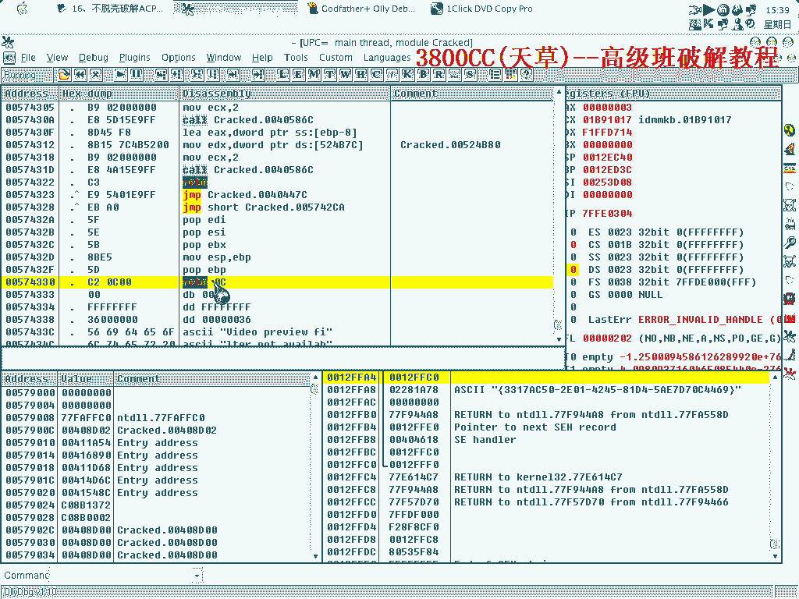

(畫面開始變慢了，又誤會了。)。

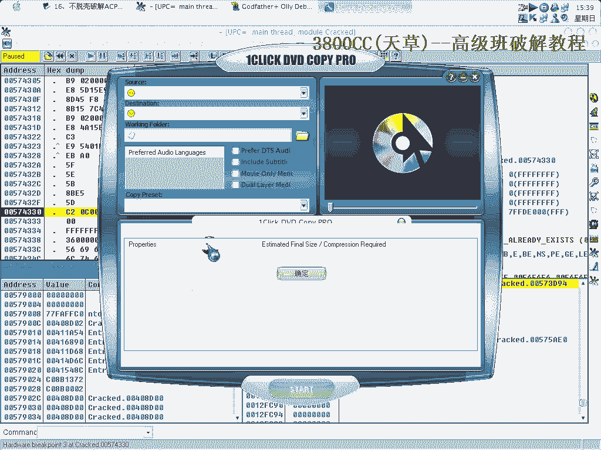

(畫面開始變慢了，又誤會了。)，(畫面開始變慢了，又誤會了。)，(畫面開始變慢了，又誤會了。)，(畫面開始變慢了，又誤會了。)，(畫面開始變慢了，又誤會了。)，(畫面開始變慢了，又誤會了。)。

(畫面開始變慢了，又誤會了。)，(畫面開始變慢了，又誤會了。)，(畫面開始變慢了，又誤會了。)，(畫面開始變慢了，又誤會了。)，(畫面開始變慢了，又誤會了。)。

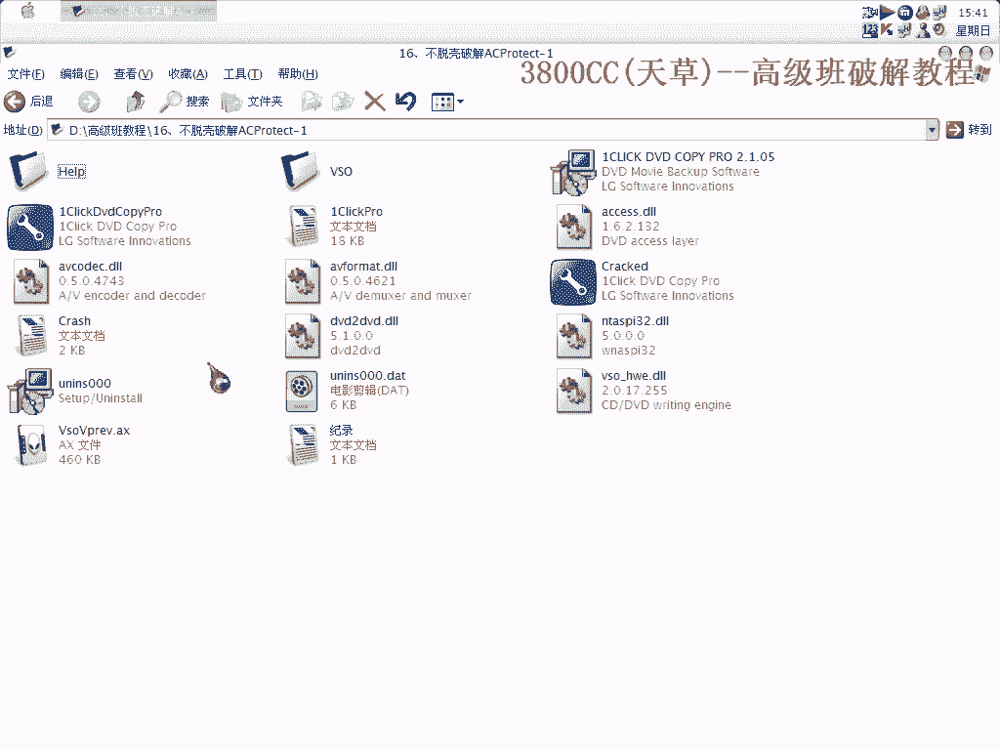