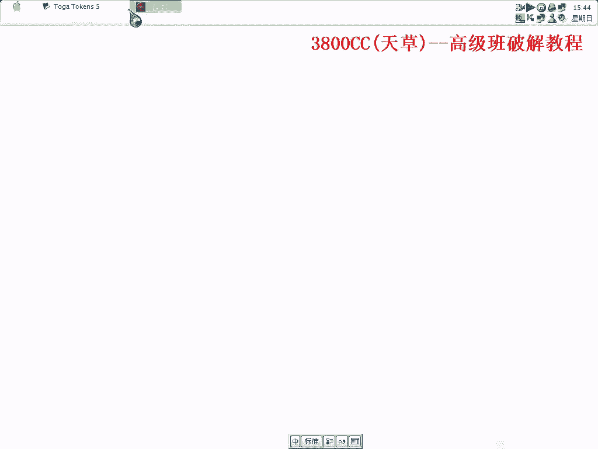
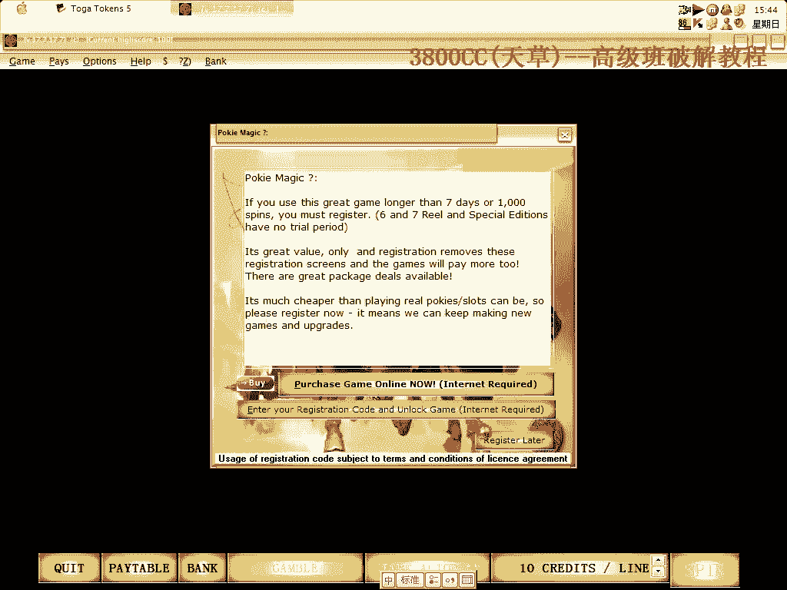
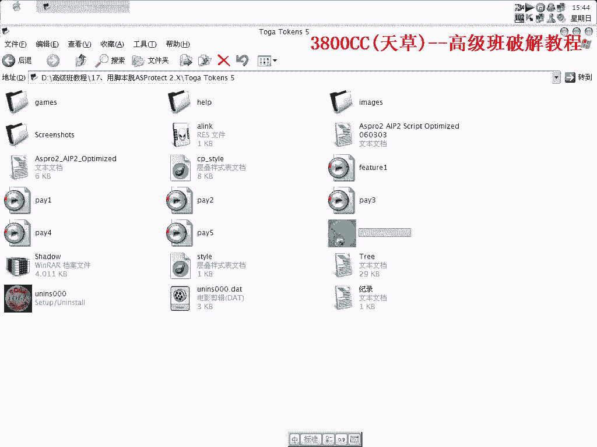
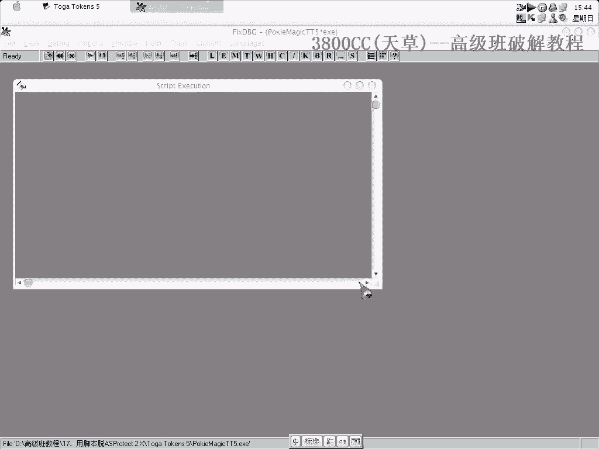
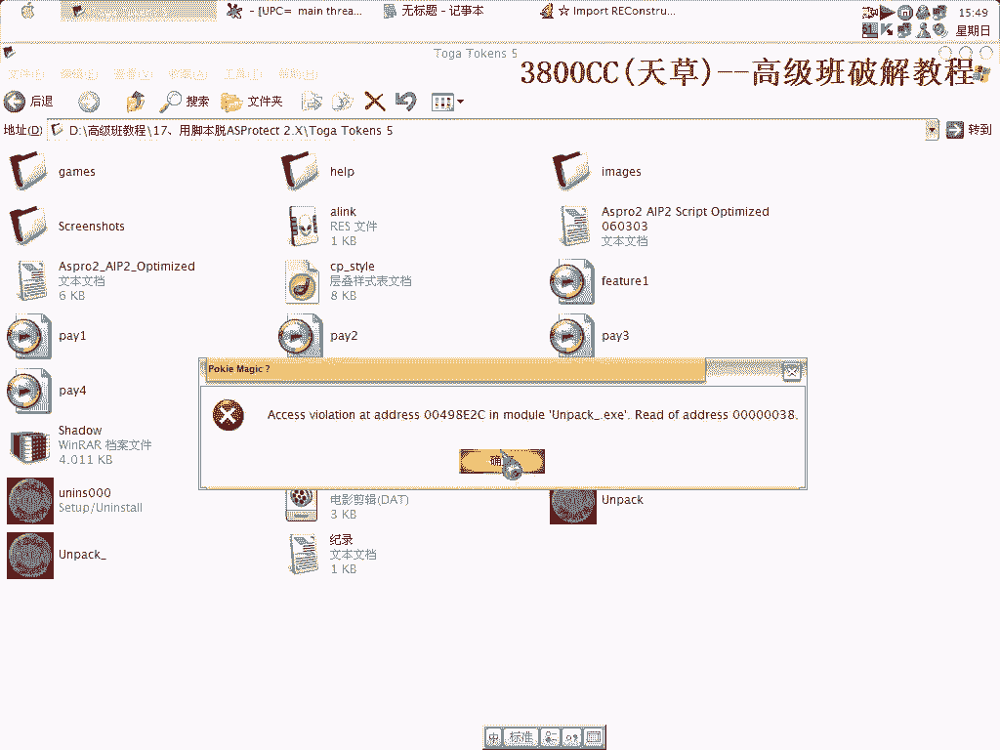
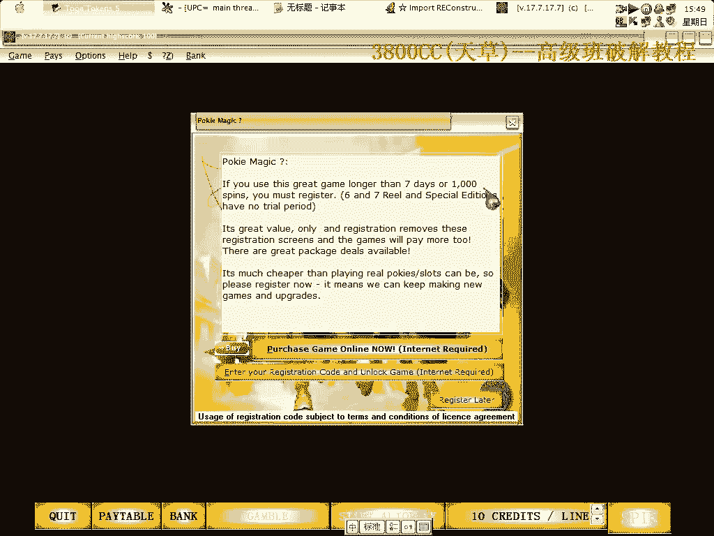
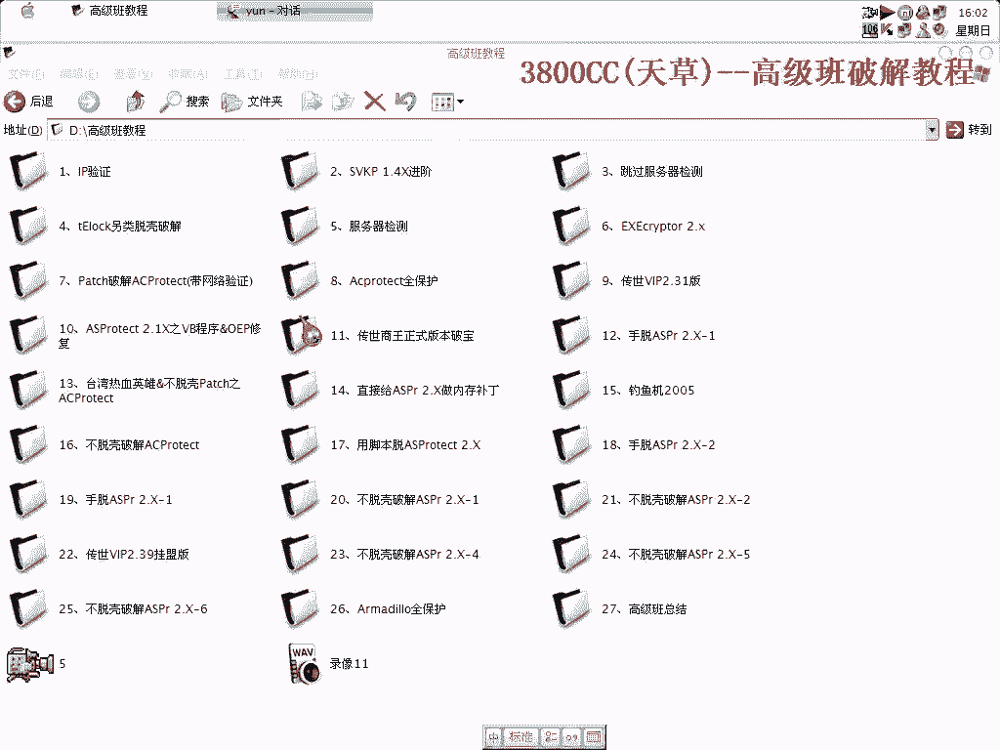

# 3800cc(天草)-天草高级班 - P17：17、用脚本脱ASProtect 2.X - 白嫖无双 - BV1qx411k7kJ

好大家好，这几个来介绍，用脚本来拖，这里有两个脚本，这个脚本是我跟一个老外，我跟一个老外，弄的但是这个，有那么一些问题，这个是，国内的一个家伙写的，非常完美，这个我们在3月份的时候才，3月份弄出来的。

3月份修改出来的，后面就没搞了，现在看一下，这是一个游戏，我这个也是没有安装的，不知道能不能跑得起来，没事就这样了。

跑起来，可以跑起来但是有那个错误。

无所谓了，只是为了演示而已。

我们要后退载入了，重新载入一下。

检测到调试器了，好，互联硬的3号指定，两次，F9，然后打开，再002，这个是这个开头的，41了，这就是OEP了，我们现在接下来，需要找的是什么呢，FF25，抗压B，我们首先用这个脚本。

这个脚本的使用方法，这个做一个记录，然后这里呢，也记录一下，IAT的启示，是这里开始的，然后呢，邮件，搜索所有的，找到最后一个，50F0C0，F0C0，找到这三样之后，我们开始运行脚本，用这个，点试。

这里呢就搜录，IAT的启示位置，点OK，确定，接下来，要搜录的是这一个，最后，要搜录的就是，这个，最后就退出了，退出了，这个好像成员，跟运行不起来有关系，我们这个先看一下，第二个脚本，这个可以。

这个可以，这个可以，这个可以，这个可以，这个可以，这个可以，这个可以，直接当吧，直接当吧，然后接下来呢，OEP，OEP刚刚没忘记记录了，就先用它来代替一下，全部都有效，保存一下，OK 重新来过。

重新来过，像这种没StunCounter的，就用这个脚本，非常完美可以用得了，程序本身就这样。

国外的游戏，我们还是接着来看一下，我弄的那个脚本，有些是没有文字的，不知道是什么文字，看一下，查一下，OK，OK，OK，OK，OK，(！@#$%^&*^&*(@$#@)，有問題啊 有問題，(！

@#$%^&*^&*(@$#@)，3月3號的 用這個3月3號的這個吧，(！@#$%^&*^&*(@$#@)，大家看到了啊 這個是隨機都在變的啊 隨機變的，其他這兩個地址啊 這其他兩個地址沒有 沒有變化。

我們這個是到了17克啊，用這個，5GB，(！@#$%^&*^&*(@$#@)，Main 50 F0 CD，可以的，這個樣子 剛剛忘記這樣給大家看了啊，好，現在搜索到了，(！

@#$%^&*^&*(@$#@)，看這個是非常宏偉的啊，(！@#$%^&*^&*(@$#@)，(！@#$%^&*^&*(@$#@)，(！@#$%^&*^&*(@$#@)，(！

@#$%^&*^&*(@$#@)，(！@#$%^&*^&*(@$#@)，(！@#$%^&*^&*(@$#@)，已經修復了很多了啊，一個個的修復，開始應該打開給大家可以看到啊，可以看到。

可以看到全部的修復過程，(！@#$%^&*^&*(@$#@)，這個修復有點慢啊，(！@#$%^&*^&*(@$#@)，就是跟國外的這個傢伙啊，這個傢伙也，(！@#$%^&*^&*(@$#@)，(！

@#$%^&*^&*(@$#@)，(！@#$%^&*^&*(@$#@)，(！@#$%^&*^&*(@$#@)，(！@#$%^&*^&*(@$#@)，(！@#$%^&*^&*(@$#@)，(！

@#$%^&*^&*(@$#@)，(！@#$%^&*^&*(@$#@)，這兩個腳本有點不同啊，一個是，到OEP之後修復，另外一個是，到OEP之前修復，當然，他那個當然要完美一些，經過好多修。

經過好多糾正的，我這個，沒有糾正多少啊，也懶得去弄了，有他那個用就夠了啊，(！@#$%^&*^&*(@$#@)，最後的幾個，比較來，修復比較慢一點，前面那麼多，全部都已經修復了，(！

@#$%^&*^&*(@$#@)，(！@#$%^&*^&*(@$#@)，(！@#$%^&*^&*(@$#@)，(！@#$%^&*^&*(@$#@)，(！@#$%^&*^&*(@$#@)，(！

@#$%^&*^&*(@$#@)，很多網友留言，都會問我現在說的東西，你知道嗎？因為我現在學的東西都是用很長的時間反覆重覆，不停的在轉中文字，不停的在轉中文字，幾乎一次的轉中文字，(親愛的聽眾。

我在這樣的狀態下做出了什麼。)，(我想給予你們很多信心。謝謝你們)，(我現在需要想辦法撐住，我會努力的把握這些機會)，(我希望大家能夠一直支持我，我覺得這是最好的一件事情)，(我會努力的把握這些機會。

我會努力的把握這些機會)，(我會努力的把握這些機會，我會努力的把握這些機會)，(我會努力的把握這些機會，我會努力的把握這些機會)，(我會努力的把握這些機會，我會努力的把握這些機會)。

(我會努力的把握這些機會，我會努力的把握這些機會)，(我會努力的把握這些機會，我會努力的把握這些機會)，(我會努力的把握這些機會，我會努力的把握這些機會)，(我會努力的把握這些機會。

我會努力的把握這些機會)，(我會努力的把握這些機會，我會努力的把握這些機會)，(我會努力的把握這些機會，我會努力的把握這些機會)，(我會努力的把握這些機會，我會努力的把握這些機會)。

(我會努力的把握這些機會，我會努力的把握這些機會)，(我會努力的把握這些機會，我會努力的把握這些機會)，(我會努力的把握這些機會，我會努力的把握這些機會)，(我會努力的把握這些機會。

我會努力的把握這些機會)，(我會努力的把握這些機會，我會努力的把握這些機會)，(我會努力的把握這些機會，我會努力的把握這些機會)，(我會努力的把握這些機會，我會努力的把握這些機會)。

(我會努力的把握這些機會，我會努力的把握這些機會)，(我會努力的把握這些機會，我會努力的把握這些機會)，(我會努力的把握這些機會，我會努力的把握這些機會)，(我會努力的把握這些機會。

我會努力的把握這些機會)，(我會努力的把握這些機會，我會努力的把握這些機會)，(我會努力的把握這些機會，我會努力的把握這些機會)，(我會努力的把握這些機會，我會努力的把握這些機會)。

(我會努力的把握這些機會，我會努力的把握這些機會)，(我會努力的把握這些機會，我會努力的把握這些機會)，(我會努力的把握這些機會，我會努力的把握這些機會)，(我會努力的把握這些機會。

我會努力的把握這些機會)，(我會努力的把握這些機會，我會努力的把握這些機會)，(我會努力的把握這些機會，我會努力的把握這些機會)，(我會努力的把握這些機會，我會努力的把握這些機會)。

(我會努力的把握這些機會，我會努力的把握這些機會)，(我會努力的把握這些機會，我會努力的把握這些機會)，(我會努力的把握這些機會，我會努力的把握這些機會)，(我會努力的把握這些機會。

我會努力的把握這些機會)，(我會努力的把握這些機會，我會努力的把握這些機會)，(我會努力的把握這些機會，我會努力的把握這些機會)，(我會努力的把握這些機會，我會努力的把握這些機會)。

(我會努力的把握這些機會，我會努力的把握這些機會)，(有一些是可疑的啊，無所謂了)，(沒有無效的啊)，(關掉)，(關掉)，(關掉)，(關掉)，(關掉)，(關掉)，(關掉)，(關掉)，(關掉)，(關掉)。

