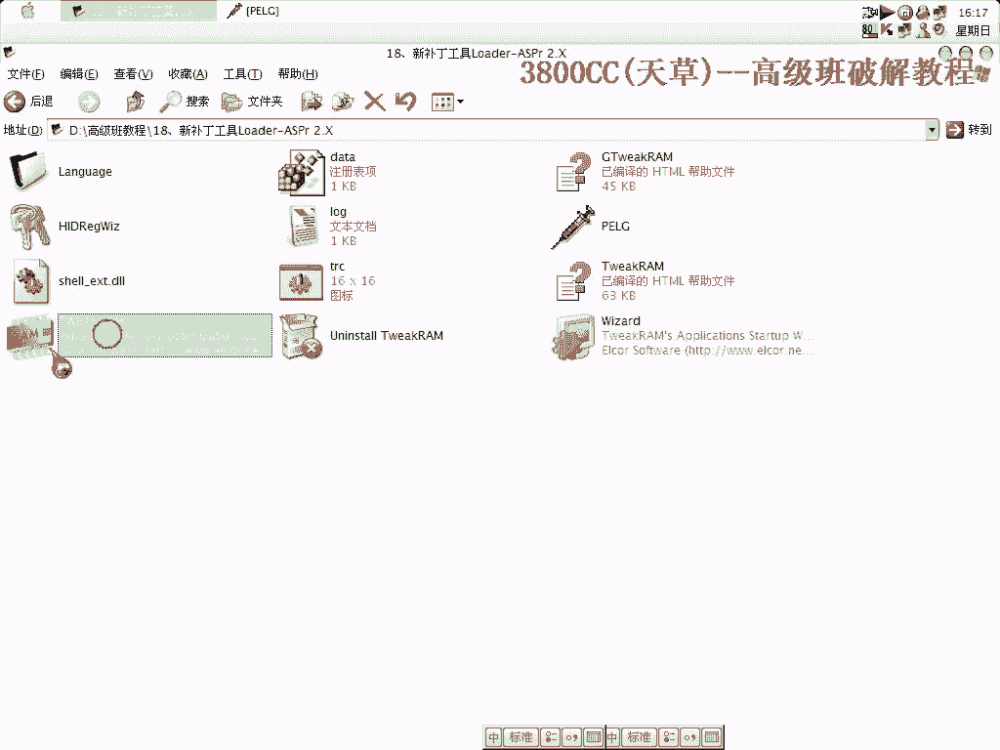
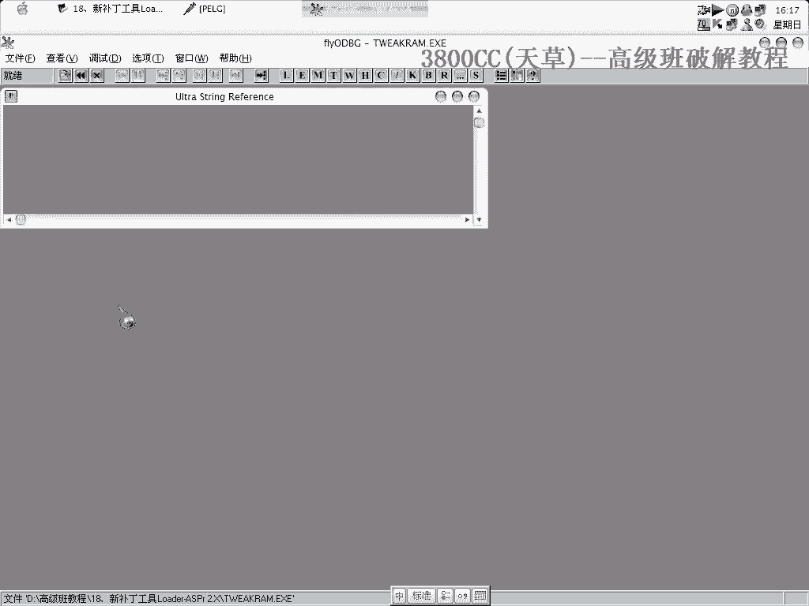
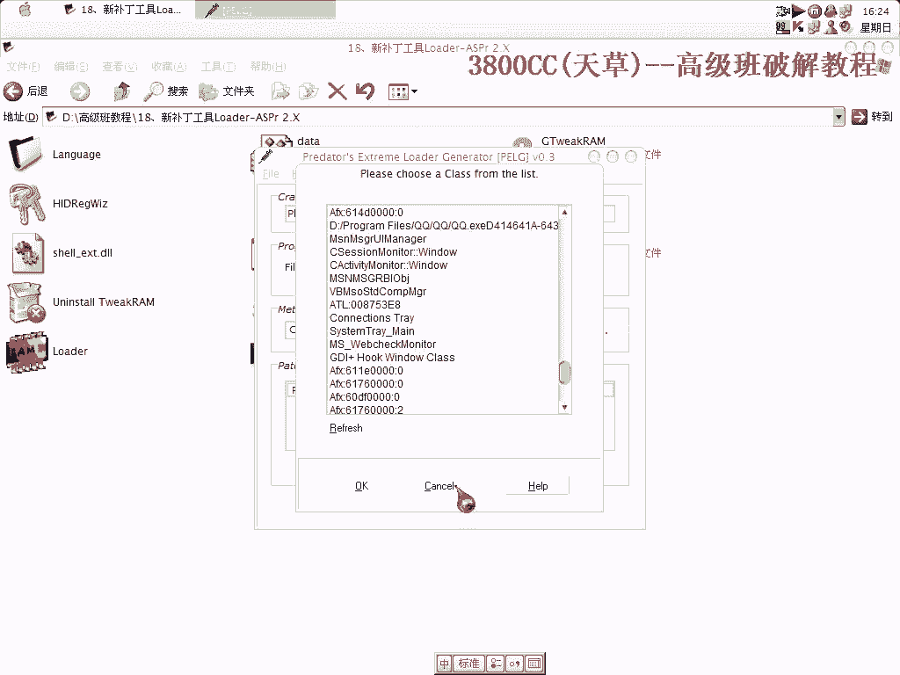

# 3800cc(天草)-天草高级班 - P18：18、新补丁工具Loader-ASPr 2.X - 白嫖无双 - BV1qx411k7kJ

大家好，這節課給大家介紹新的一種補丁工具，可以來對付Split Attack 2。0，當然也可以拿來對付其他的，就這麼一個東西，我們來看一下，例行，它會有這麼一個框框，然後是一個雷神整理的東西。

我們來載入它。

或者說一場，直接運行，然後F2暫停，這裡了，我們找到斷手，現在硬件執行斷點，這個是非常常規的一種做法，可以重新來下一下，找到斷手，剛剛還行，我把屏幕錄像專家停一下，可以啊。

屏幕錄像專家一開就好像中斷不了了，這個時候我們中斷這裡了，刪除這個硬件斷點，就是這麼一個CALL了，我們找，那就在這個地方下斷，重新來過，可以斷下了，我們來看一下這個跳，我們讓它跳一下，或者說有一場。

可以了，我們現在就是回去，回去這個地方怎麼樣改，因為這個地方我們這樣改的話，改成jump的話，會改動這裡改動四個字節，而且到時候寫字節的時候，連這兩個字節都一起寫，所以寫六個字節。

所以這個時候我們用這樣的方法，大家看到了啊，這樣子改動兩個字節，現在打開這麼一個記錄下來，直接運行，好讓它出現，現在怎麼樣呢，就這樣選擇它，然後這裡是WordTitle，就是窗口的名稱，窗口標題。

我們選擇這個標題，Name找，很多窗口標題，有一個標題，這裡有一個標題，這裡有一個OD的標題，這個標題，這裡選上它，這是一個Lag，就是說這是一個提示框，就是說Let the loader。

就是讓這個loader無敵呢，殺死它，就是關掉它的意思，OK，這裡我們要填它，地址，9019，這樣就可以了，現在關掉，其實它安裝了，開始安裝，大家看到，選上我們這個原程序，安裝成功。

然後它就生成這麼一個文件，其實這個文件就是原程序，就是原程序，然後我們雙擊它，以後每次運行它就可以了，對啊，這樣連它一起殺掉了，連它一起都殺掉了，這個不行，這個不行，我們得重新來找，重新來找了。

完成選改一下。

還是中斷不下來，是這個原因嗎，按一下，這樣才中斷下來，奇怪了，並且，我們要把這個地方也修改一下，因為剛剛看到了，它的確可以把那個窗口給關掉，但是馬上就退出了，馬上就退出來了，這個我們不行這個不行。

我們可以在這個地方下好斷電，看一下，是怎麼樣一個走向，這裡似乎不行，這樣，還是讓它出現，讓它出現吧，我們隨便指定一個地址，隨便指定一個地址，這個20F2，7517，看一下信息，還是直接退出。

把這個框框給落不掉，不對了，名字選錯了，稍等一下，我重新裝一個，點錯了，OK，現在我們來生成一個路的，可以了，隨便指定一個就可以了，把這個給落不掉，就是這個剛才那個跳的，剛才那個跳的做鬼，說說說說說說。

這工具是非常好的一個工具，大家可以看到，他這裡還有什麼，Standard，也可以標準的，就是說正常的一個大布丁，然後還有其他的幾種，class name，可以看一下，那是什麼東西呢，這些東西，組件。

它可以分析出我們現在，我現在這個電腦上運行的，所有程序的組件，所有程序的一些組件，好了這節課就到這。

