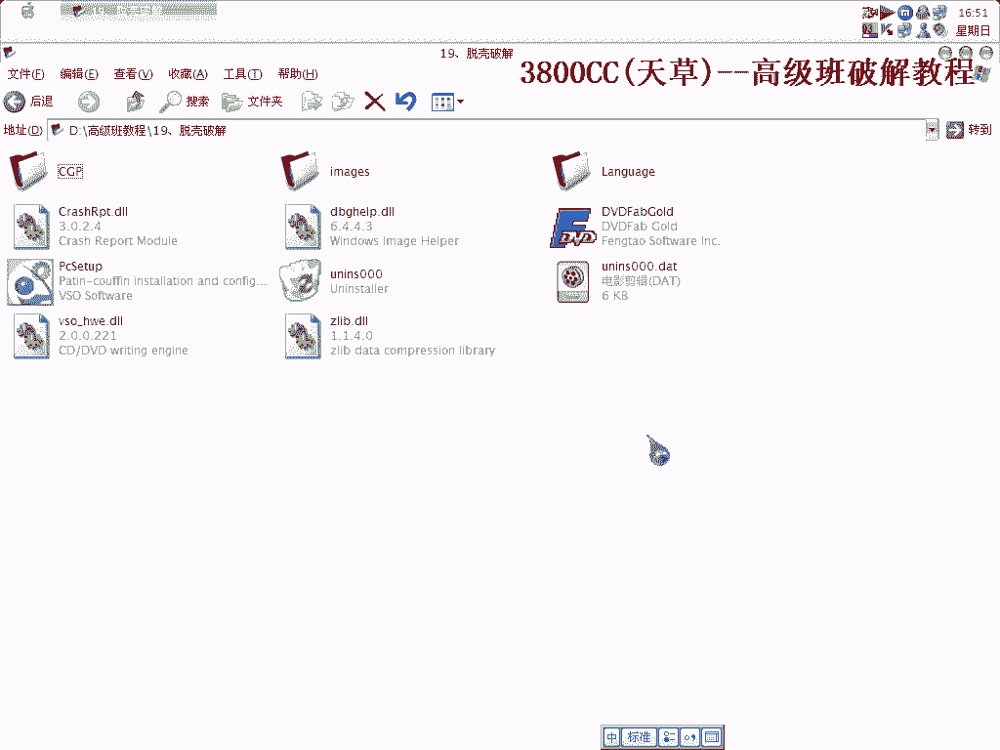
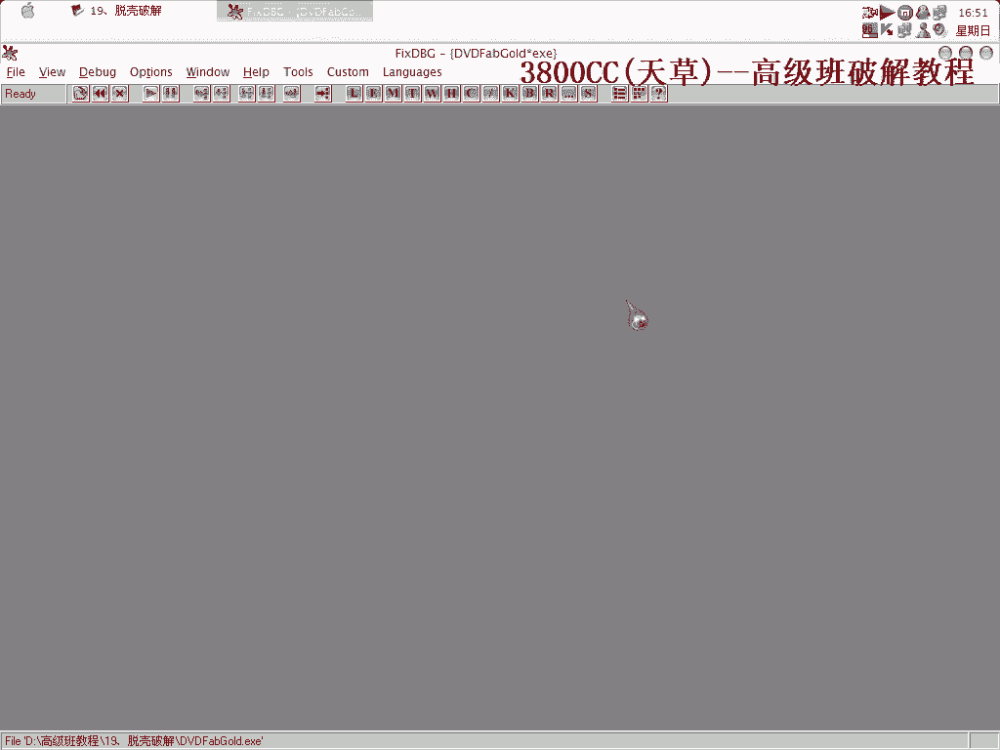
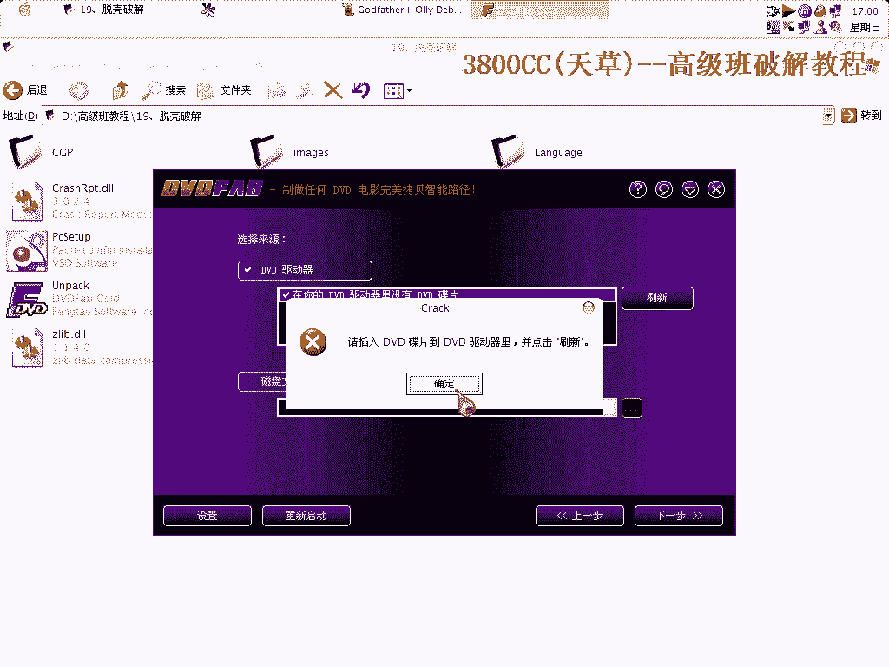

# 3800cc(天草)-天草高级班 - P19：19、脱壳破解 - 白嫖无双 - BV1qx411k7kJ

这几课我们来讲一个talk破解的，主权学院仍然是Azure Talk的课，当然我们是用脚本来做。

首先呢。

忽略intel 3的异常，可以看一下，这个程序没有intel 3的异常，那我们就只得，忽略intel 3的异常到最后一次，最后一次异常是AF-46，这个我就不用演示给大家看了，这就是OEP了。

我们要记录下来，忽略所有异常，运行脚本，这个脚本先前大家的理由的，因为这个程序没有Stone Cold，用这个脚本来处理是非常完美的，当然，当然也可以手拖啊，这些手拖非常累啊，非常累，(前方鏡頭下方：

空中玻璃玻璃鏡)，(前方鏡頭下方：空中玻璃玻璃鏡)，(前方鏡頭下方：空中玻璃玻璃鏡)，(前方鏡頭下方：空中玻璃玻璃鏡)，(前方鏡頭下方：空中玻璃玻璃鏡)，(前方鏡頭下方：空中玻璃玻璃鏡)。

(前方鏡頭下方：空中玻璃玻璃鏡)，(前方鏡頭下方：空中玻璃玻璃鏡)，(前方鏡頭下方：空中玻璃玻璃鏡)，(前方鏡頭下方：空中玻璃玻璃鏡)，(前方鏡頭下方：空中玻璃玻璃鏡)，(前方鏡頭下方：

空中玻璃玻璃鏡)，(前方鏡頭下方：空中玻璃玻璃鏡)，(前方鏡頭下方：空中玻璃玻璃鏡)，(前方鏡頭下方：空中玻璃玻璃鏡)，(前方鏡頭下方：空中玻璃玻璃鏡)，(前方鏡頭下方：空中玻璃玻璃鏡)。

(前方鏡頭下方：空中玻璃玻璃鏡)，(前方鏡頭下方：空中玻璃玻璃鏡)，(前方鏡頭下方：空中玻璃玻璃鏡)，(前方鏡頭下方：空中玻璃玻璃鏡)，(前方鏡頭下方：空中玻璃玻璃鏡)，(前方鏡頭下方：

空中玻璃玻璃鏡)，(前方鏡頭下方：空中玻璃玻璃鏡)，(前方鏡頭下方：空中玻璃玻璃鏡)，(前方鏡頭下方：空中玻璃玻璃鏡)，(前方鏡頭下方：空中玻璃玻璃鏡)，(前方鏡頭下方：空中玻璃玻璃鏡)。

(前方鏡頭下方：空中玻璃玻璃鏡)，(前方鏡頭下方：空中玻璃玻璃鏡)，(前方鏡頭下方：空中玻璃玻璃鏡)，(前方鏡頭下方：空中玻璃玻璃鏡)，(前方鏡頭下方：空中玻璃玻璃鏡)，(前方鏡頭下方：

空中玻璃玻璃鏡)，(前方鏡頭下方：空中玻璃玻璃鏡)，(前方鏡頭下方：空中玻璃玻璃鏡)，(前方鏡頭下方：空中玻璃玻璃鏡)，(前方鏡頭下方：空中玻璃玻璃鏡)，(前方鏡頭下方：空中玻璃玻璃鏡)。

(前方鏡頭下方：空中玻璃玻璃鏡)，(前方鏡頭下方：空中玻璃玻璃鏡)，(前方鏡頭下方：空中玻璃玻璃鏡)，(前方鏡頭下方：空中玻璃玻璃鏡)，(前方鏡頭下方：空中玻璃玻璃鏡)，(前方鏡頭下方：

空中玻璃玻璃鏡)，(前方鏡頭下方：空中玻璃玻璃鏡)，(前方鏡頭下方：空中玻璃玻璃鏡)，(前方鏡頭下方：空中玻璃玻璃鏡)，(前方鏡頭下方：空中玻璃玻璃鏡)，(前方鏡頭下方：空中玻璃玻璃鏡)。

(前方鏡頭下方：空中玻璃玻璃鏡)，(前方鏡頭下方：空中玻璃玻璃鏡)，(前方鏡頭下方：空中玻璃玻璃鏡)，(前方鏡頭下方：空中玻璃玻璃鏡)，(前方鏡頭下方：空中玻璃玻璃鏡)，(前方鏡頭下方：

空中玻璃玻璃鏡)，(前方鏡頭下方：空中玻璃玻璃鏡)，(前方鏡頭下方：空中玻璃玻璃鏡)，(前方鏡頭下方：空中玻璃玻璃鏡)，(前方鏡頭下方：空中玻璃玻璃鏡)，(前方鏡頭下方：空中玻璃玻璃鏡)。

(前方鏡頭下方：空中玻璃玻璃鏡)，(前方鏡頭下方：空中玻璃玻璃鏡)，(前方鏡頭下方：空中玻璃玻璃鏡)，(前方鏡頭下方：空中玻璃玻璃鏡)，(前方鏡頭下方：空中玻璃玻璃鏡)，(前方鏡頭下方：

空中玻璃玻璃鏡)，(前方鏡頭下方：空中玻璃玻璃鏡)，(前方鏡頭下方：空中玻璃玻璃鏡)，(前方鏡頭下方：空中玻璃玻璃鏡)，(前方鏡頭下方：空中玻璃玻璃鏡)，(前方鏡頭下方：空中玻璃玻璃鏡)。

(前方鏡頭下方：空中玻璃玻璃鏡)。

(前方鏡頭下方：空中玻璃玻璃鏡)，(前方鏡頭下方：空中玻璃玻璃鏡)，(前方鏡頭下方：空中玻璃玻璃鏡)，(前方鏡頭下方：空中玻璃玻璃鏡)。

(前方鏡頭下方：空中玻璃玻璃鏡)，(前方鏡頭下方：空中玻璃玻璃鏡)，(前方鏡頭下方：空中玻璃玻璃鏡)，(前方鏡頭下方：空中玻璃玻璃鏡)。

(前方鏡頭下方：空中玻璃玻璃鏡)。