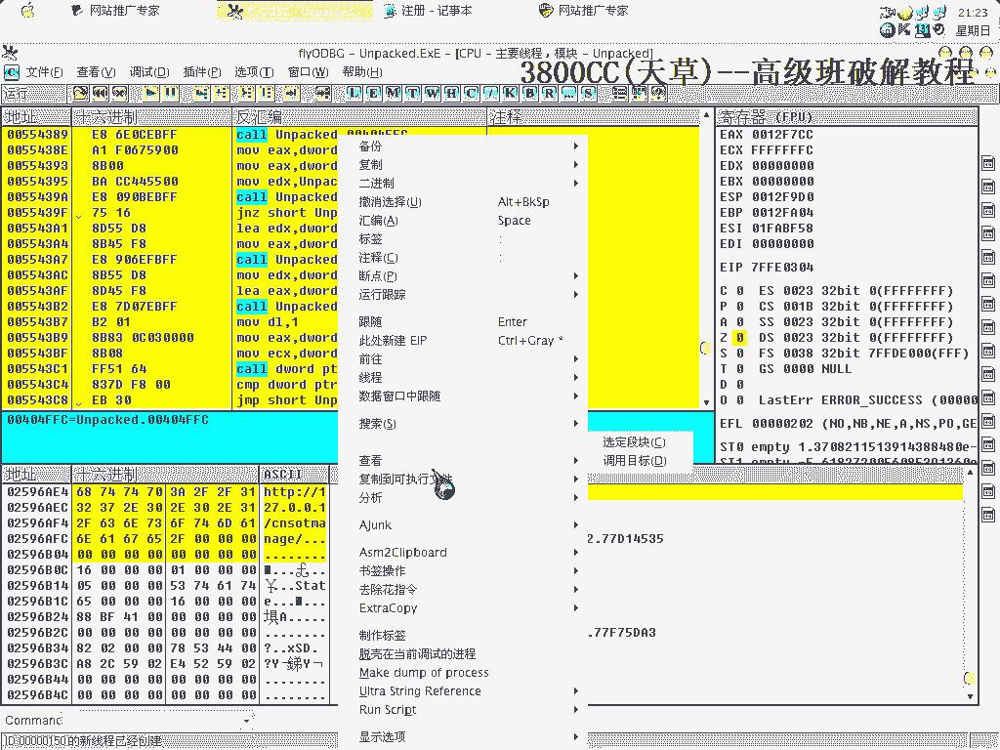
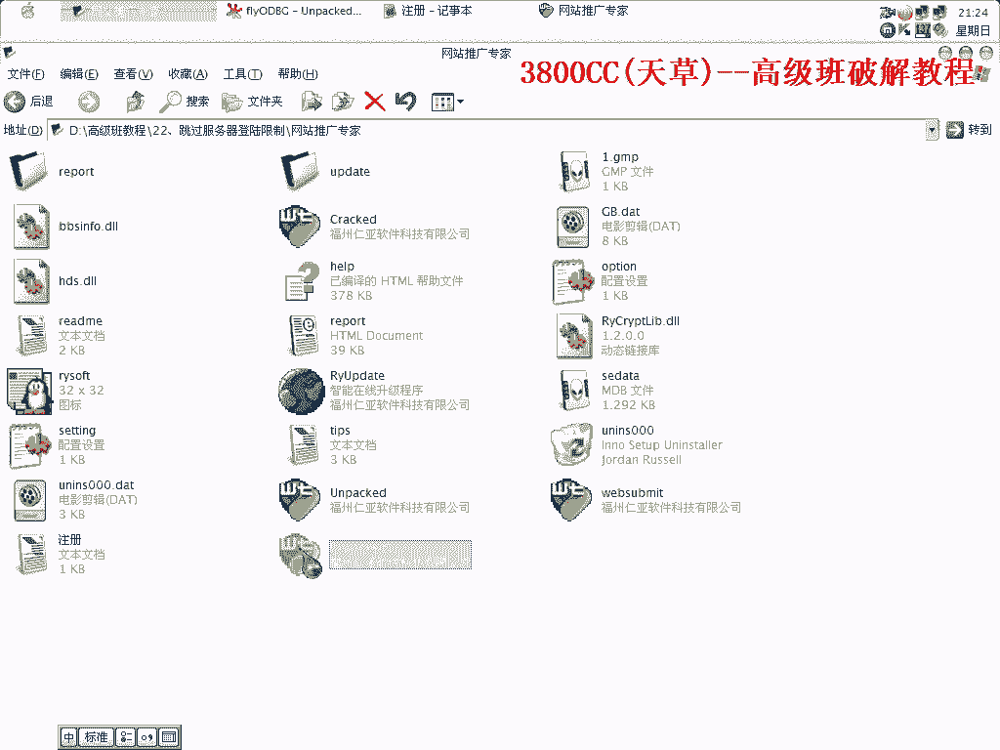
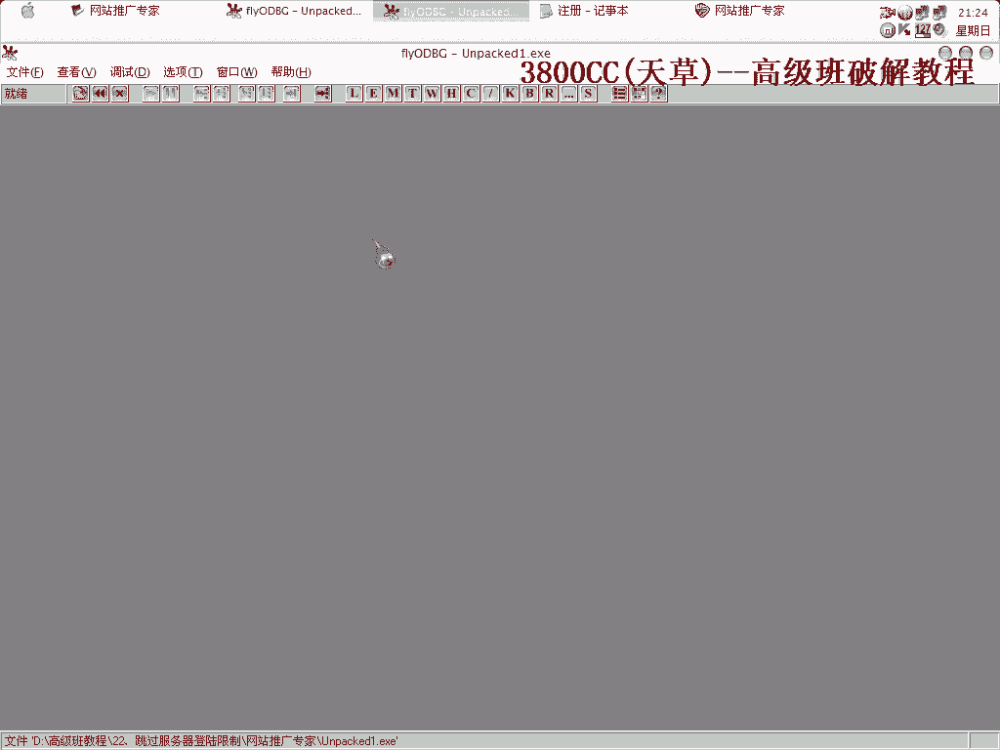
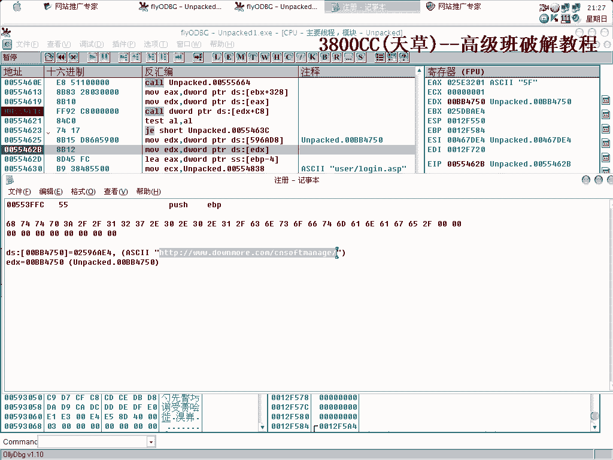
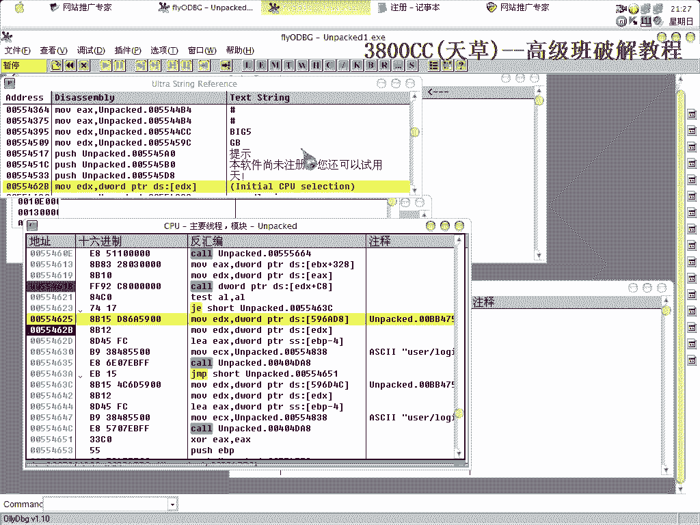
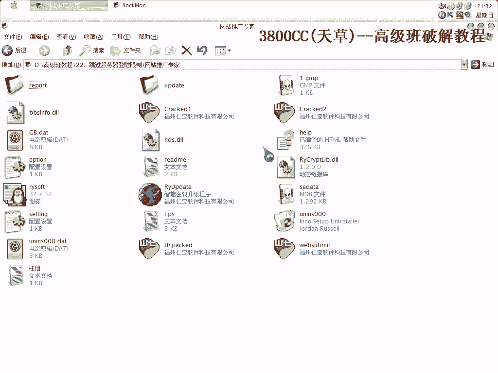

# 3800cc(天草)-天草高级班 - P22：22、跳过服务器登陆限制 - 白嫖无双 - BV1qx411k7kJ

大家好，這節課呢，我們來講一下，跳過伺服器登錄限制，這個也是一個網路驗證的，可以開黑圓程序，隨便輸入，行的不行的，那我現在這個破解了的，成功登錄進去，就是說我的關於這個例子，這個例子我只是指點一個思路。

並且把其中最重要的一個，最重要的一個思路告訴大家，首先呢我們可以通過這個樣子來做一下，這個是脫了殼的，脫了殼的，很簡單的一個殼，SPEC的一個殼，我就不重複脫了，大家可能會說，這個有一個登錄框。

那我就可以直接把登錄框去掉，可是可以這樣去去掉，但是在實際使用過程當中，實際使用過程當中會有一些問題，好，去掉斷點，返回，就這麼一個框，那我們把這個框給，漏掉看一下，不行，斷點沒了，斷點沒了。

得重新再來，(忍耐中)，(忍耐中)，好，單手，(忍耐中)，好，就是這裏啊，就是程序的入口，程序的入口，我們把它給直接錄掉看一下，(忍耐中)，好，沒有那個登錄框，沒有那個登錄框。

但是軟件在使用的過程中有些問題啊，更確切的說，這個軟件本身就不怎麼好用啊，好，現在我們要做的，找它的一個按鈕時間，按鈕時間呢，我在這裏已經找好了啊，大家就不用浪費時間了，當然你可以再自己操作一下。

(忍耐中)，這個要取消掉，好，就這裏，隨便輸入啊，隨便輸入，這樣我們單步走，這是獲取啊，獲取我們的一個名字，獲取，(忍耐中)，獲取三種名字，如果就是說，如果我們沒有填的話，沒有填的話。

雖然會提示一個錯誤的，它就跳，跳到這裏提示一個錯誤，我們可以來看一下，(忍耐中)，用後面或口令不能為空的啊，(忍耐中)，這種結構見得非常多了啊，非常多了啊，(忍耐中)，這裏啊。

這裏它就開始crash了啊，就是不動了，沒反應，這裏很明顯啊，很明顯，這裏是一個網絡驗證的口啊，(忍耐中)，這個靠死了啊，很明顯，因為這個區段啊，這個區段都快完了啊，都快完了，不是這個靠就是這個靠。

就像我們在這裏，就是OD已經陷入死循環的那種狀態的話，那這個就是一個網絡驗證靠了，好，進去，可以拉下來，首先看一下，看到了啊，這個user logger啊，這個非常清楚的了，非常清楚了，好。

我們在這裏消耗斷點，免得走起，上面一段啊，彈幕比較煩一點，彈幕走，好，再看一下這裏，這裏啊，就是這麽一個網址，然後它會跟這個相連接啊，相連接，連接在一起，我在這個地方啊，在這個地方就提示這麽一點啊。

提示這麽一點，這裏就是變啊，網絡驗證為，就是為本地驗證，好，數值，這裏呢，本地啊，127。0。0。0。12，CNSOFT，後面還是連在一起啊，這裏要引進在天窗啊，保留大小，保留大小線上，OK。

改好了就是這個樣子的了啊，看到了啊，這是我的一個機器，機器號，這一個呢，我們需要進去，把這個複製下來，保存著啊，保存著，這裏卡住了，當然啊，更不僅僅是改這麽一個地方就夠了啊。

後面還有很多地方需要我們來修改了，像一些跳轉啊，什麽之類的，這個需要大家去跟啊，大家去跟，然後就可以把，我破解的那個，拿著對照，在這裏消耗斷，自己進去啊，在這裏消耗斷，免得修完，這裏他跳了，這裏他跳了。

我們不讓他跳，獲取我們的地址，這裏他提示啊，嘗試連接服務器失敗，嘗試連接服務器失敗，那也就是說，這其中有一個call了啊，其中有一個我們必須要跳，其中我們也必須要跳了，這個跳，沒用的，這個，或者是這個。

這也是錯誤了啊，就是說在搞這種，搞這個網絡驗證破解的時候，眼睛是一定要亮的啊，一定要尖的，可以來看一下，他提示，驗證失敗了啊，重新來過，這裏了啊，這裏，看一下，看一下他這個兩個地址，兩個地址都是。

這個是跳到哪裏去啊，這個跳得遠一些啊，我們先讓這個跳一下，看一下啊，沒有任何反應，這個沒有任何反應，我們就把他取消掉，斷點還是要留著，這個地方，這裏呢，我們得跳過去，跳過去，這樣吧，仍然是有驗證失敗啊。

仍然是有驗證失敗，這說明我們剛才處理的，這個裏面算是一個關鍵的網絡驗證，好，我們彈步走，可以拉下來看一下啊，拉下來看一下，這個，我們把它跳過去，還是改這一個吧，因為剛才我們改了一個，不行啊，這個跳。

其實算了，不管他，這個沒有跳啊，沒有跳，這個跳了啊，這個跳了，還是驗證失敗，至於驗證失敗是在哪個地方啊，大家可以仔細跟一下，這個地方，這個地方，我們把它漏不掉，這個呢，漏不掉，跳，好，OK。

這就是我們修改的一個結果了，修改的一個結果。

所有改動，然後這個，我們再重新打開，打開一下看一下這個。

看一下這個修改過了沒有啊，這個，我們在前面破了一些網絡驗證裡面啊，今天這個還算是，就是說，怎麼說啊，比較麻煩的一個啊，比較麻煩的一個，看一下這個機制，而且講到的是用，你行不了。

我們看一下這個修改過了沒有啊，這個地址還沒有修改過來啊，還是沒有修改過來，那我們就找吧，我們把它複製一下。

就找他。

這裡有這一個，這一個，我們先改這一個，再把這個也改一下，複製一下，然後在下面，複製到可追星文本，我們就覆蓋我們這個Clack的E啊，覆蓋，斷點還在啊，修改過來了啊，現在修改過來了。

聽到這個聲音就知道是登陸成功啊，登陸成功，就這麼樣被破解了啊，這個是變網絡驗證為本地驗證的一個方法，在另外這個軟件啊，不能用啊，不怎麼好用的，過來看一下，這個地方呢，這裡選引擎啊，這個全部不能用啊。

這個我還沒有，這個全部選擇這裡還沒有那個，這裡還沒處理，這個處理了啊，過來看一下，處理了，選擇引擎，全部選擇了啊，然後就自動提交，發送，你們可以打開那個風暴擷取的啊，風暴擷取的，那個軟件可以打開看一下。

你會發現啊，它這些引擎啊，地址根本不存在啊，這些地址根本不存在，看一下啊，我這裡用這個，還沒註冊啊，先試一下，它這裡已經提交完了啊，還沒註冊我就用這個吧，目標程序啊。

目標程序就是我們的一個Clack的E，好，重新來，選擇引擎啊，先這，點發送，忘記點開始了啊，這個好像沒，對，可以不做這個了，這是風暴啊，這是發送的風暴，這些網路地址根本就不存在啊，這個是看不到的啊。

看不到，因為剛才那個，提交完畢，剛才這個沒註冊啊，我這個地方原先不是有一張圖片的啊，算了，就不演示了啊，主要就是教大家怎麼樣來跳過它的一個驗證啊，那今天課程就到這，再見。

