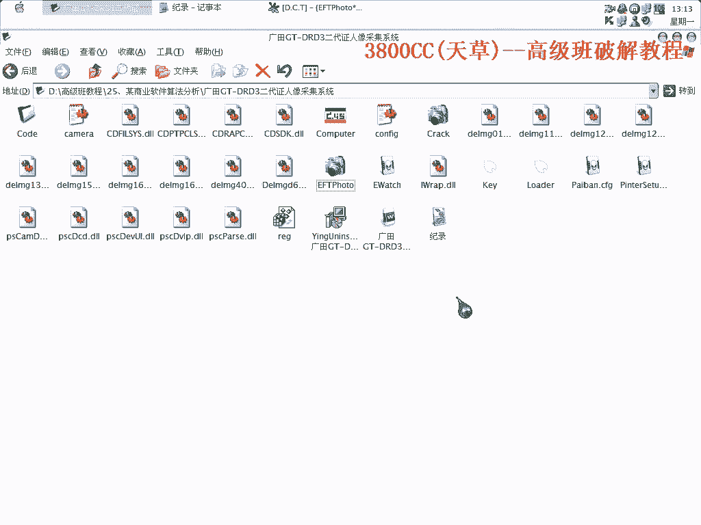
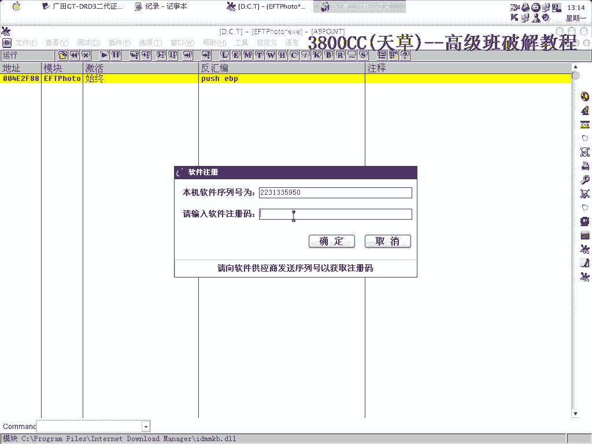
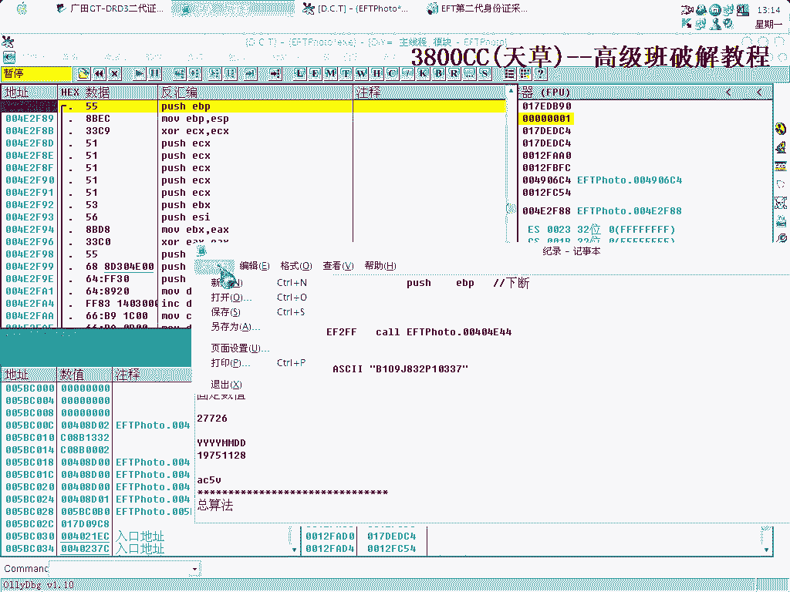
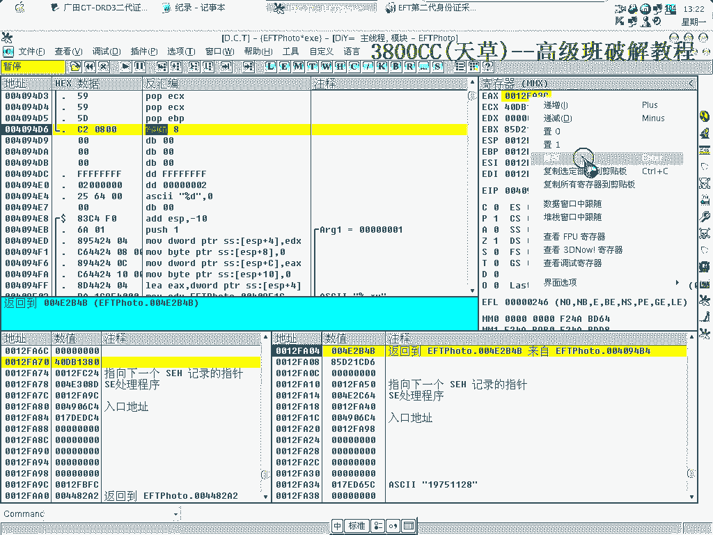
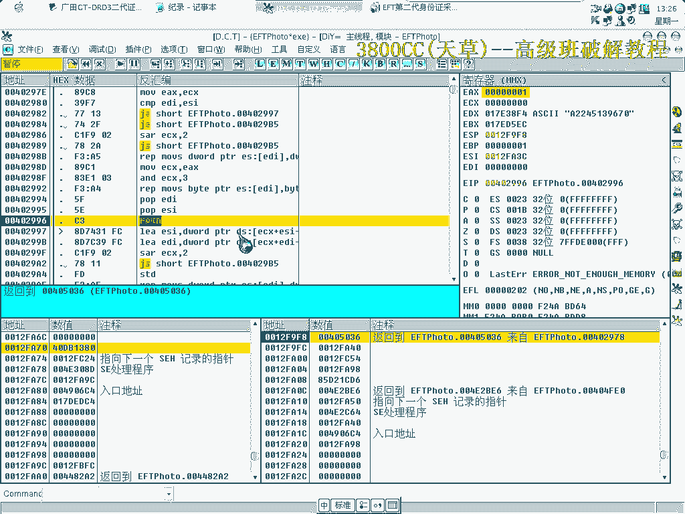
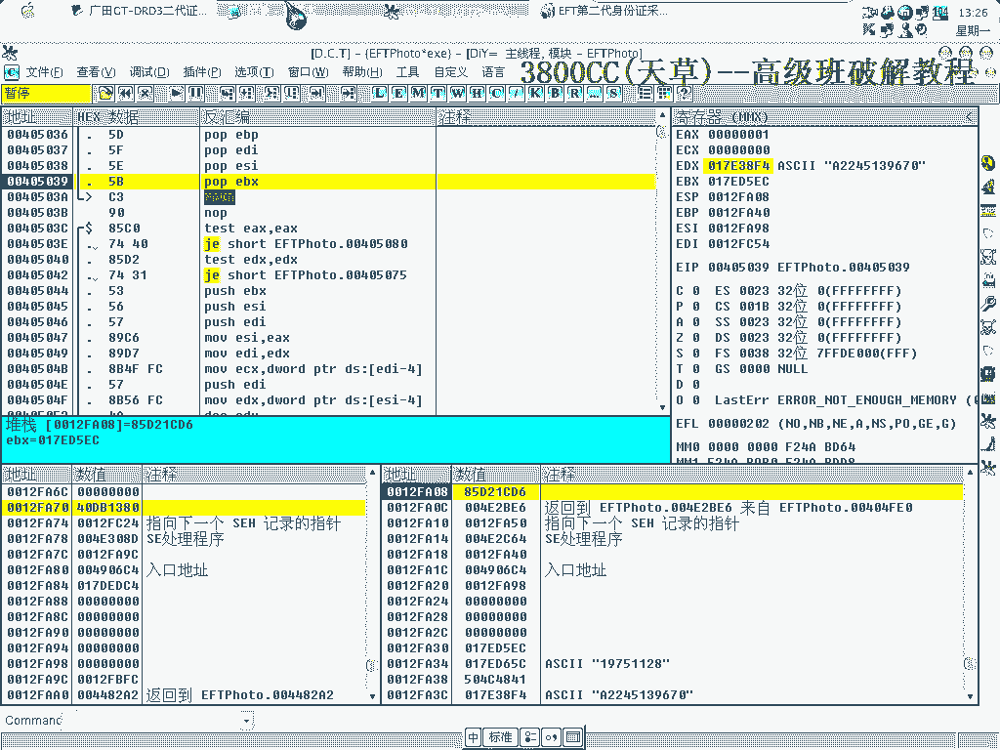
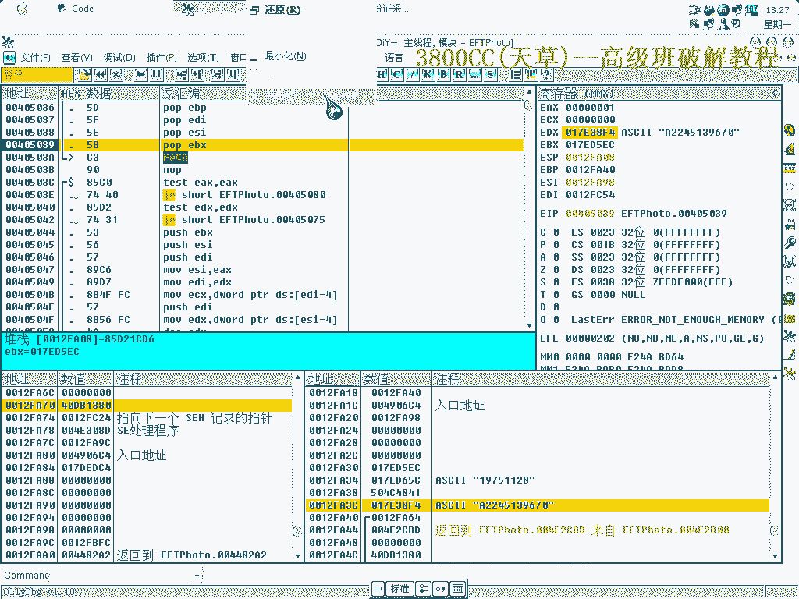
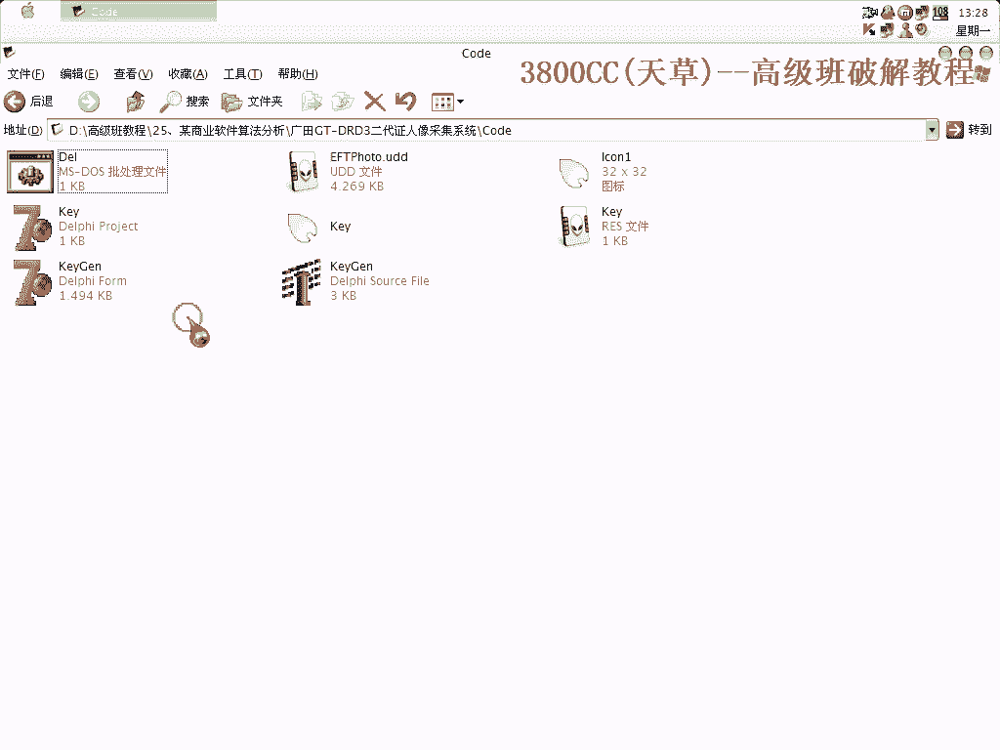
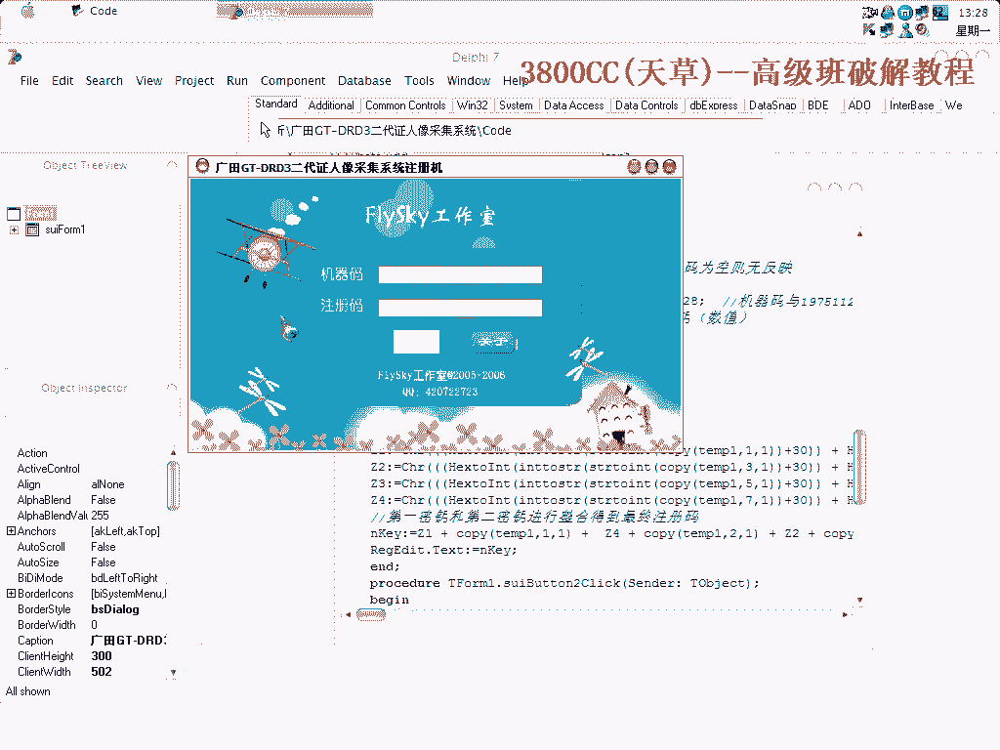
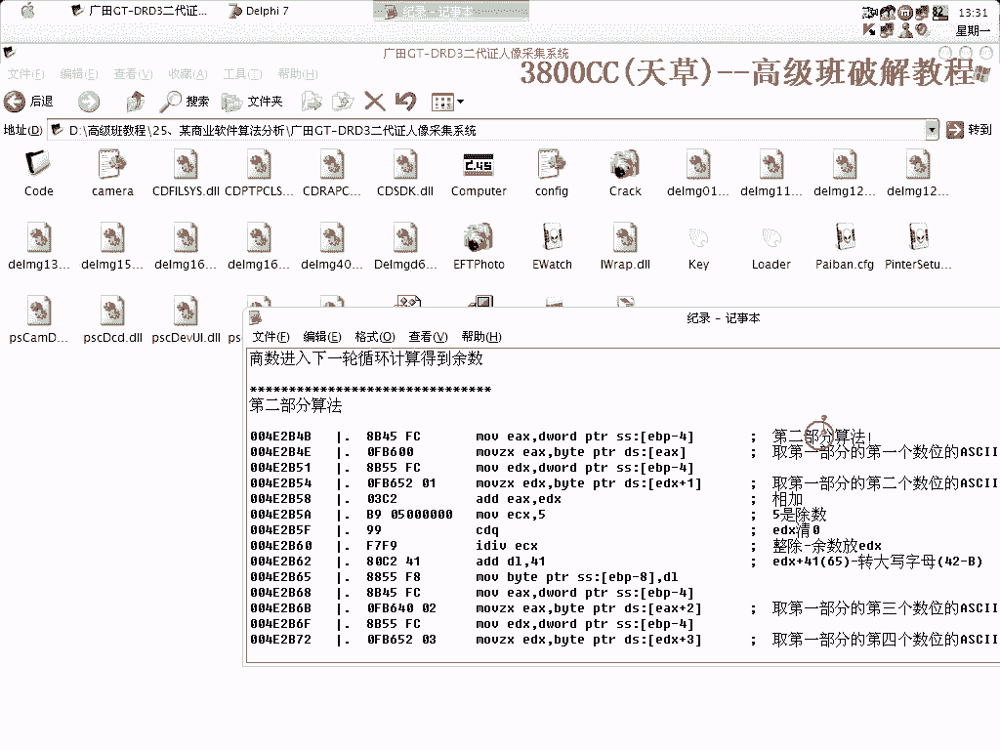

# 3800cc(天草)-天草高级班 - P25：25、某商业软件算法分析 - 白嫖无双 - BV1qx411k7kJ

大家好啊，我们这节课啊这节课是，某商业软件的一个算法分析，就这么一个软件啊，大家不要以为商业软件就很难，其实呢商业软件就是说因为是都是公司内部使用，它的一些强度并不要求强度只要求使用。

但这么一个软件强度非常弱，我们可以就是说做内存注册机但是要做算法注册机的话还是得分析一下，这个是我的一个，算法注册机然后呢这个是内存注册机，这个是完全破解了的，先用，CIT查一下壳，是W的。

至于按钮时间我就不说了按钮时间我这里已经找到了。

这个是我的一个机器码，这个是我的一个机器码。

机器码原先我原先的那个笔记本机器码是这个。

现在换过来了，当不走，为了节约时间，我就不演示为什么这个地方要进去为什么要进去，很明显啊就是说你弹幕首先第一次弹幕走过去之后，会发现哪一个科里面有些问题啊，然后第二次就知道要不要进去了。

看一下这个7比7是什么，1975啊1975，1975啊7比7，这里，这个0B呢，0B可以来算一下0B是什么是多少，0B是11R，LC28，LC28，好 我们进去了，好 这个 我们上不走，到这里来。

大家只要看到一些，因为就是说上卡分析，第一个要注意这里，第二三四其中这三个，这上面的三个部分是最重要的啊，只要看到有这软件，你们你们在搞分析的时候啊，只要看到有浮点数值出现的话，那就得小心注意了啊。

小心注意了啊，咱不走过看到啊，他把这个放到那个浮点集成器里面去了，但不走，这里是弹站把它弹出来，弹到ESP里面去，可以看ESP里面是多少，这里是123124，3756啊，3756，我们。

数据窗口中跟随看一下，他这个里面没值啊，没有值，好，咱们继续弹不走，注意演技要尖啊，是是要注意这四个窗口，这个要进去啊，我就不说为什么要进去了啊，因为第一次分析的时候发现这个地方有鬼，所以要进去。

这里啊，看一下，这个YYYYMMDD，这个是一个什么形式呢，这里代表就是，可能是时间形式或者是年月日的形式，年月日形式，Y是Year，M是Month，Day is date。

就是说看到这些奇怪的东西就就应该知道啊，有鬼进去，这里呢，也进去，因为不进去的话就看不到什么东西，19751128，19751128，就是我们刚开始他放入了三个段，三个段。

他现在这里获取了19751128了啊，获取固定数，固定数值19751128，进去，这里呢，同样进去19751128，这两个啊，他把E首先把EX和EXE获了，EXE获了之后，然后EBX和EBXE获。

看一下，E获就清零，E获就清零了，首先他就把这两个集成器给清零，就是说他清零啊，就说明后面要用到啊，B，B和ESI呢，ESI，ESI他的这个值就是19751128啊，然后他第一次获得Byte。

是把1975的1128这个Byte，那就是1了，把1给BL，那ESI就进一位啊，然后再次循环啊，这里呢，他是把这个BL和20进比较，20进比较，31嘛，明显，很明显啊，不等于不等于。

然后这里他就是获取第一位就不管了，接着进行下面的下面计算，然后同样啊，Compare BL还是31，BL还是31，和2D进行比较啊，还是不等于，和2B进行比较啊，还是不等于，和24进行比较还是不行。

和78比较和58比较30比较好，就不等于你跳到这里来了，看一下，拉下来稍微拉下来看一下就知道啊，这里就是对1975啊，1128进行算法算法分析了，BL-30啊，BL-30，那就是1了啊。

BL就是以BL进行酒和酒进行比较啊，酒进行比较，好，接着啊，他和这个CCCC这个CCCC是前面放进来的啊，前面啊，这里，这里看到啊39他这是获取获取第二位啊获取第二位，然后像然后也是爱呢。

然后在进一位啊，进一位接着循环的时候啊，循环的时候会进行取下面的7啊，去下面去，他这里啊，这里是，EX啊，EX和EX相加大家看到啊，这个，EX的只是在变的啊，在变注意看着啊，在变，循环完了。

循环完了之后。

我们就可以看一下，来看一下EX里面这是多少啊，1975，1128，CC的EX就是1975。

1128，这里就返回啊，返回破ECX，破ECX就是ECX谈战啊，谈战，这里是1975，1128出现啊，咱们走了，这里啊，F7进去，因为这个不进去的话，不进去就没什么东西可找了啊。

大家可以这样就可以非常清楚了，就是说一不算法的话，它是涉及到了好几层啊，好几层次，1000啊，这里没什么，嗯，没发现什么东西啊，EX，123124。

7378，这是开始第二步算法了，这个2245139670啊，9670我这里已经说已经写好了啊，就是说第一轮是机器码，机器码转16进制，然后和1975转16进制，两者一货啊，两者一货得到这么一个值。

得到这么一个值，然后除以A得到商数和余数和商数，得到余数和商数，然后余数呢，倒着相连啊。

1971983，210337最后就是接的是第二部分了，第二部分很简单啊，非常明了，他这里取二取第一部分的第一位数的22，这个啊，我们现在看到的这个22有两个啊。

有两个你可以就是说你为了区分到底是哪一个啊，到底是哪一个，你可以再仔细看一下，接着往下面分析可以分得出来的，好这里也是取啊，那说明第一个肯定是去第一位，第二个去第二位，两者相加啊，两者相加，加的64啊。

64目符ECS就是855放到ECS里面去，然后CDQ呢，CDQ就是说EDX70啊，EDX70这个是常用指令，在上粉分析的时候要经常遇到，然后IDIV大家看到除以ECS，就是说把ECS做商数做除。

做那个除数了，就是把EX然后除以ECS啊，然后得到了余数啊，余数放入E，整数啊，整数是放到EX里面，然后再相加再加，转大写字幕，转大写字幕，接着是取第三第四，这个是加48加48，这是取第五第六位。

加41，这取第七第八位加四加加，这是取第九位七八九啊，这三最后一位是七八九一起的，加上44F加4F，这里我们得进去，因为我们看到了他算法已经差不多完了，差不多完了，那就说明他后面还会有做手脚的。

Compare，比较比较，这里我们进去看一下，进去看一下，这个CALL里面没什么东西啊，兴趣，他这里就开始开始去了啊，取三位三位三位一三位的，这里，转换开始转换了。

第三部分算法就是这一个位置进去的。

然后19832015101033，他就是说我们的第一位啊，互相插插进去，这这是得到第一次得到的一个数字吗，然后BJ呀，BJP0就是我们刚才上面算出来的第一个，第二个，然后第三个第四个字母。

这四个字母怎么样查，怎么样查进去，就是DX第一位啊，BX第一位，当然这个是根据最后面的一个就是得出来这么一个字啊，都是这么一个字来算出来的算出来的BX第一位啊，然后J呢，J插9后面，J插9后面，10啊。

哦，这个哦插到是第二插到第二，那个第一位数字0中间去了啊，0中间去了，就是这样插着啊，交叉着插着，算法就是这个样子。

算法就这样，我这里呢。

这里这里有一个这个UDD备份，大家到时候分析的时候啊，分析的时候可以把这个UDD给拷到你的那个OD。

那个UDD目录里面去，然后这个里面就有一些注释了，注释了。

这样子你就方便看了，好我们来看一下注册集，注册集。

点确定进去看算法，首先呢，首先是，定义定义这四个变量整数变量，整数变量，然后再定义这六个字符串变量，字符串变量，最后呢，如果这个Tex就是说机器码为空的话，这没有反应，以这个的就是没反应的意思。

然后Tempo1呢，Tempo1因为后面要用到Tempo1，Tempo1字符串处死化，处死化给他一个空字符串的，然后第二个就是我们的一个这里就是把那个机器码。

机器码我们这里输入这个框，这个框就是机器码，就也就是这个框，EDIT框和19751128，这是固定的数字，一或，一或得复制给MKY，MKY是一个整数，整数，然后循环，然后if i=0，i=0到9。

i=0到9，因为他这样一或出来的是九位数，九位数，然后，除以十，除以十A吧，A的一个整数，整数A是16进制的，十，那就他就是，整数就是十了，十进制就是十了，除以十得到MKY1。

然后再是more的就是取余，取余，最后把这个MKY复制给MKY，就是把他的一个整数，取得的一个整数给MKY，最后相加，最后相加，这是得到第一个循环，得到第一miss，miss数字，第二个。

就是通过第一个算的算的。

这个非常简单的，非常简单，这就是相加了，其中用到的就是这一个是chain的copy，copy就是，一个算法，就是一个一个字符串截取的一个功能，tmp1这么一个字符串，1是代表从第一个开始取。

后面这个1呢，后面这个数字代表长度长度，也就是说tmp1，取tmp1从第一个开始取，就取一个，然后相加，相加，这里是chain to int，就是说字符串转整数，字符串转整数，然后加上30之后。

然后再右转，然后这个号是to int，就16进制转，转十进制的，转十进制，后面这也是一样的，这是取第二位，第二位一个一个嘛，取第二位一个，然后相加，这个就是这里的一个算法了，第一位第二位。

第一个就是第一位第二位，然后呢，第三位第四位，第三位第四位，第五位第六位，第七位第八，第九位，最后是九位，最后就是。

像你像年轻。