# 3800cc(天草)-天草高级班 - P27：27、高级班总结 - 白嫖无双 - BV1qx411k7kJ

好大家好啊，这节课啊就是做最后一节课了最后一节课关于最后一节课我算是就是重新总结了，一下重新总结一下，首先就说托克啊，在高级版里面啊高级版里面也讲到啊，SVKP啊，还有，AC Protector。

AS Protector，还有穿山甲的。

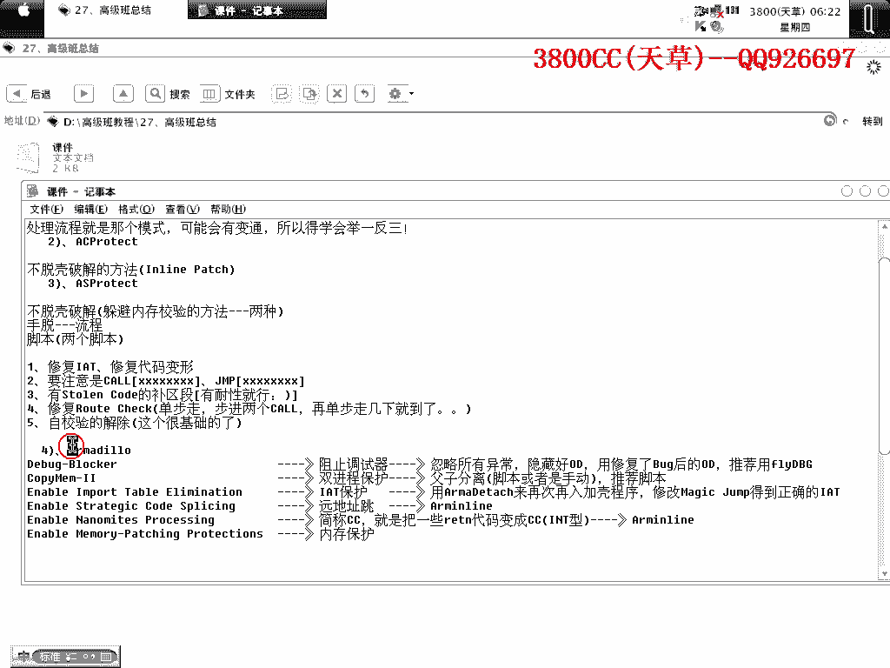

当然还有一个什么，其他的一个什么，这个课啊，还有这个课。

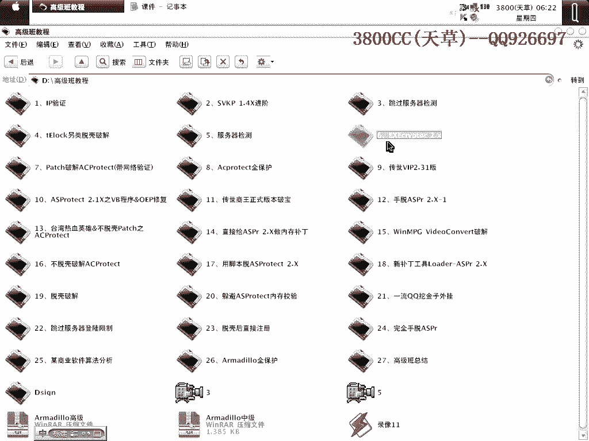

我就是说重点总结一下这几个吧，一个SVKP呢处理流程啊就是那个模式，可能会有变通啊就像我在这节课里面啊在高级版里面讲的这个SVKP呢跟我们前面是不一样的，所以还是需要，举一反三啊学会举一反三。

这个我一再强调过了，一再强调过大家可以再去找一下，SVKP加课的一些程序，这个我也不多说，然后第二个AS Protector，不脱口破解的一个方法，这个大家一定要掌握啊。

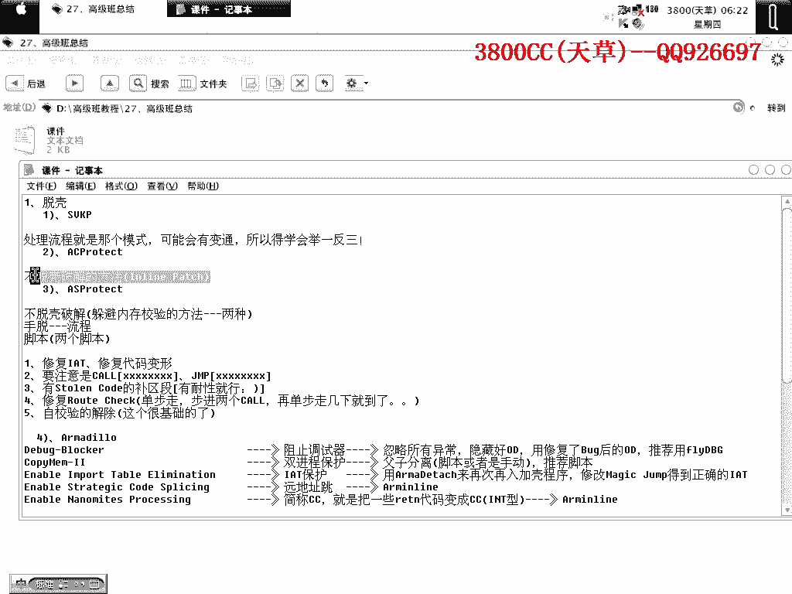

AS Protector，等于啊，看一下啊，他这个啊，跟这个名字是一样的啊，作者是一样的老名字和新名字的问题啊，这个作者一样的，然后还有一个什么，等于，这个看一下，这个，Anti-Corrupt。

Anti-Corrupt，这三个是一样的啊三个是一样的啊，这个大家就是说不要见到他见到这一个啊就以为，是另外一个课，是一样的啊，关于他这个不脱口破解的方法在国内还没见过啊没见过。

所以说大家学到一些技术啊，国人的思想还是，就按大家都是中国人啊还是按大家中国人的一些思想不要外露啊，自己用就可以了不要告诉别人，这就是AS Protector，关于这个啊在高级版里面，介绍比较多。

最近就是说网上啊，搞这个AS Protector搞得比较凶啊比较凶教程比较多但是大多都不是那么清楚啊，大致流程都有，不脱口破解啊我们在这里面讲了不脱口破解，尤其要注意的是躲避内存交易的，两种方法。

拿两种自己去回味一下，然后就是手托流程，首先是处理IIT，找两个85，然后再就是处理代码变形，代码变形，这个是一定要的，然后呢，另外就是一个脚本两个脚本，当然用那个。

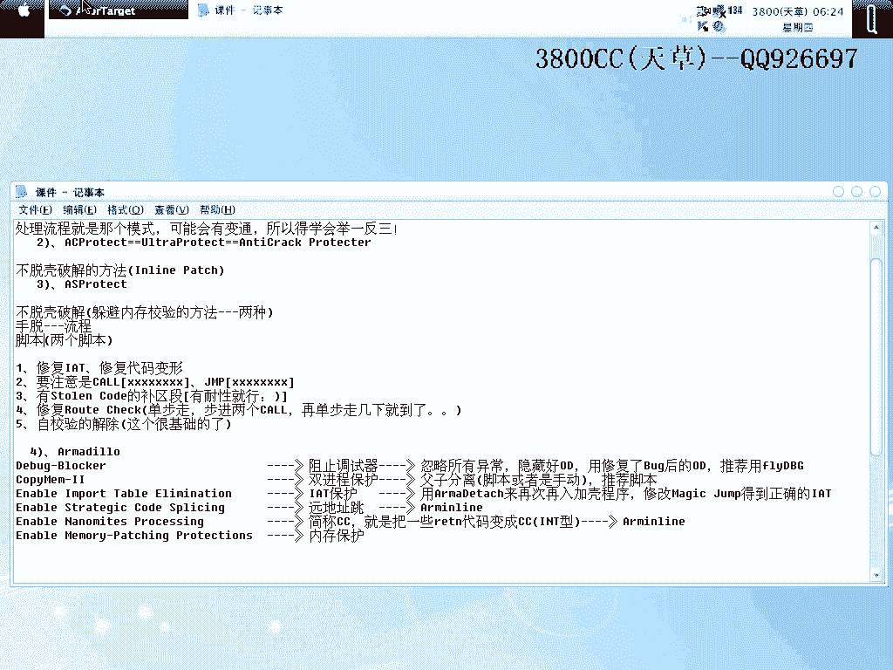

用那个脚本啊用这个脚本是最好的了，现在，脚本，那个脚本我放在。

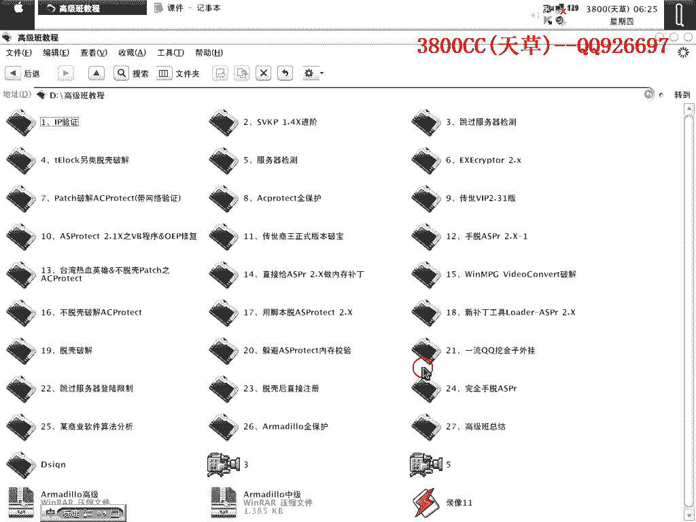

放在哪一个啊有些课里面我现在记不太清楚了，用那个脚本是最好的当然大家可以把手托和这个，脚本脱接合起来用脚本来处理前面的，两项，就是说修复IT和修复代码变形，在这里需要注意的啊。

就是说是call类型的还是jump类型的，call类型还是jump类型的，就是说他一些IT是call什么什么，然后后面那个注释会出现什么，这个我看一下。

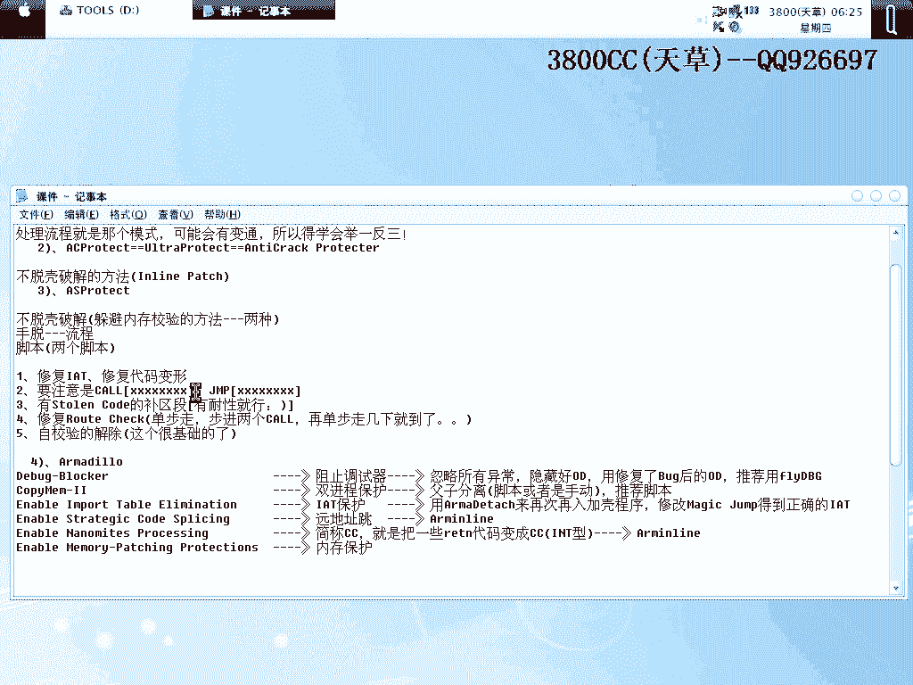

能不能找一个例子，这个我找过call类型的比较少啊，比较少看一下这个是不是，看一下啊。

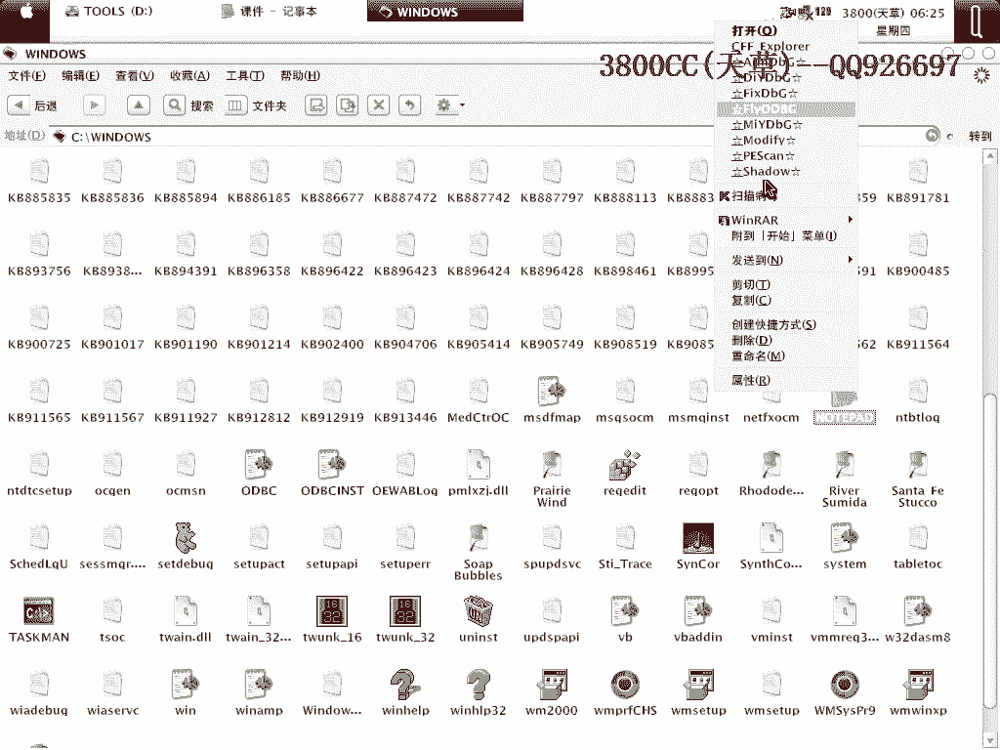

找ff25，就知道啊这个，明显啊，这个很明显是，jump类型的，不多啊不多没几个。

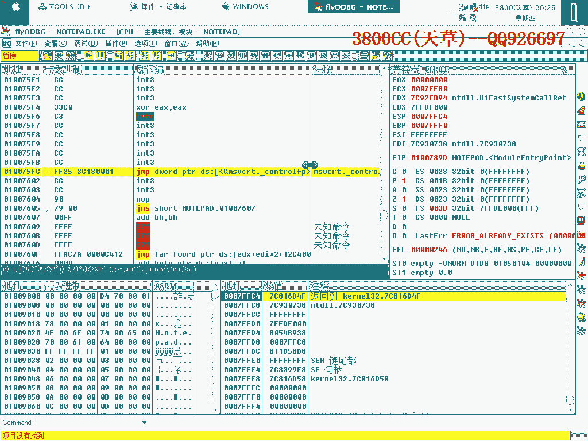

没几个我们再找一下ff15看一下，这里有这一种看一下，很明显啊，这个是ff15类型的啊，IT全是这些啊，咱们跟随看一下就知道了啊，这是call类型的，IT地址，这就是ff15类型的啊。

jump类型的就是另外那种啊，一样的，为什么是ff15啊，刚才大家看到call的前面四个字就是ff15，jump是ff25啊，然后这就是有standard的需要补的区段，这个要有这个有类型就行了。

有类型就行了，就是关于需要补哪些区段，这个我这在课程里面又给大家提供，提供一种，算是经验吧，最后啊最后，就是一个修复，load check，这个啊弹幕走，弹幕走不计两个call然后再弹幕走几下就到了。

替换的代码呢这个在课程里面也讲过替换代码是一样的啊，就是有时候是在有时候如果是修复load count是怎么为什么啊就是说怎么判断是，load check，就是说。

你等你把所有区段补完了啊就是你觉得应该补上的区段你都补了，然后再运行，出现出现什么错误啊出现就是说，出现这么一个啊protect，protect，error，或者是或者是。

提示了一个错误地址提示了错误地址是你已经补上了区段，那么我们就可以确定啊是load check是我们补区段的问题啊，这就是资料页啊这个有基础就行，其中最麻烦的啊最麻烦的当然就是这一个，第三步。

第四个穿甲的，穿甲全保护的啊现在就是说全保护的还是蛮多的，这里介绍分别介绍一下，第八个block的就是阻止调试器了，这里处理方法就是忽略所有的异常然后隐藏好OD，用修复了。

修复了bug的就是说修改版并不是原版OD，这个我已经给大家了推荐用这个，因为我使用过使用了很多的OD啊就是发现，Dbg呢，还是在，调试这个穿甲全保护的，这么一个壳的时候啊，还是比较好用的啊没什么问题。

这个我等一下打包给，打包给大家打包给大家，然后再就是，comii，comii，就是双进程的啊两个刚刚就是双进程，双进保护就是说直进程和负进程，负进程检验直进程啊检验直进程所以我们需要对它进行负值分离了。

脚本或者手动当然推荐脚本因为前面的有时候操作出现问题啊因为它要检测调试器，调试器我们手动的时候，因为有一个时差问题它会检测到，所以推荐用脚本，当然手动手动是必须要会的必须要会的这个呢我会。

一起打包吧一起打包，给大家留一个一篇文章怎么样去手动操作前面的，这就是，Import，Enable就是有效的意思启用的意思，Import就是IT了，输入表的意思，IT保护，这个用。

这么一个工具来再次载入家可程序然后修改MultiJump得到正确的这个，这个流程是我们在拖，标准版或者是那个需要走的一个过程所以说，前面在初级版里面教的那些，脱穿甲的一些方法。

为这些全保护脱这种全保护作为，基础的，然后这就是Crossplane就是原地跳原地跳，当然用这个工具就OK了用这个工具就OK了，记得啊在修复的时候啊用0。95的话用这个0。95的话。

它就会自动识别Crossplane不需要自己来识别了，当然但是呢，它一般有的程序会识别出是它的一个大小大小是1万，我们需要把它改成2万，因为这样保险一些这个需要手动改一下这个在。

26课的时候有给大家提过，演示过这个大家要，看清楚记在心里面，然后，这个就是CC，就是把代码CC为什么把它简称为CC，就是说把一些RAND代码啦或者一些其他的代码。

它会就像Azure ProTek一样代码变形它就是也是相当于代码变形了，把它变成CC，Int型的，用这个工具用这个工具就OK了，就是说你如果脱课之后就像我们脱最后一课了，出现点那么一个按钮，它就。

就退出这个就是因为这个造成的，所以用这个工具怎么使用在课程里面也提过，那这个就是内存保护了，内存保护，它就是防止内存补丁内存派系或者是其他的一些东西，着重着重就是这后面的，这是后面的三种课，这个的。

脱课破解的一个方法，当然像Azure ProTek的钻甲这些都有，直接派系的方法但是，要自己写代码非常非常麻烦以大家现在的这个能力呢，我也，现在还不太想讲因为要写的代码的确太多，我在另外。

Azure ProTek的有一个内存补丁，忘记了，自己编内存补丁这也是锻炼大家锻炼大家自己写代码的一个能力自己写代码，而且它使用的一些写代码的比如说像还原原先我们修改的代码，这个还原的方法，在。

直接派系Azure ProTek的派系钻甲这里面都会用到，后面就是说高级版结束之后，我会就是说，还是会啊就是终身会员嘛，我还是会做一些教程给大家当然不是这么密集了不是这么密集，就看大家需要吧看大家需要。

就觉得我会不定期吧不定期就看一下大家的一些进展，基础或者怎么样，然后再，考虑啊做一些教程，当然不完全是高级也可以是初级的啊，也可以说就相当于不初级不中级不高级这个样子啊，这个大家不用担心。

但是有一点必须要提醒大家的啊。

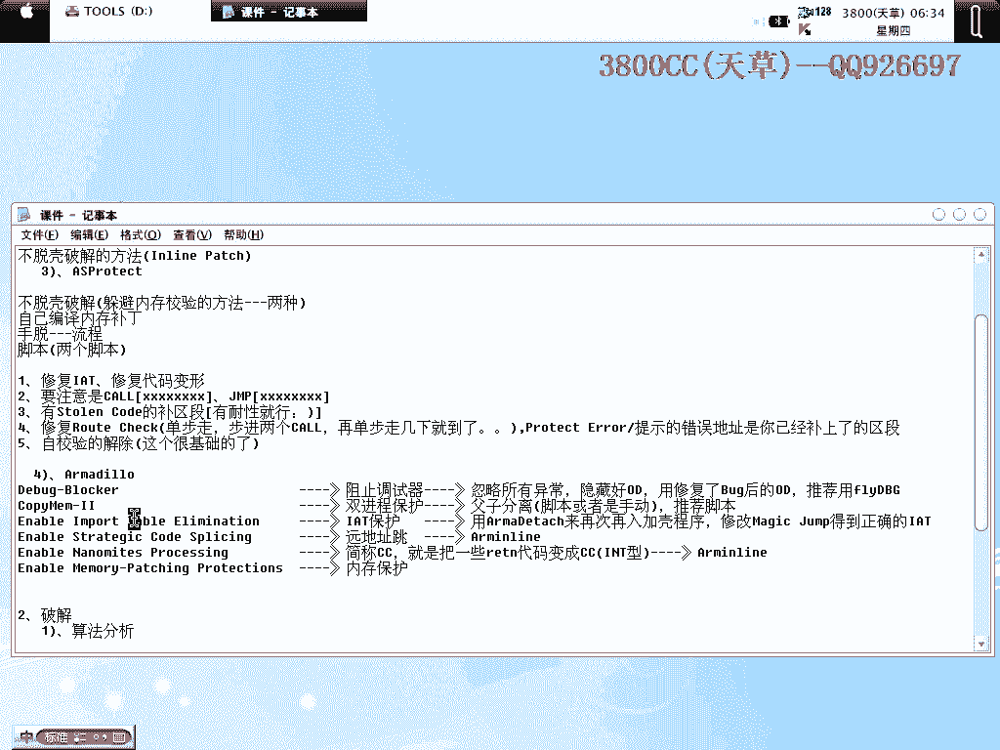

你们现在学啊。

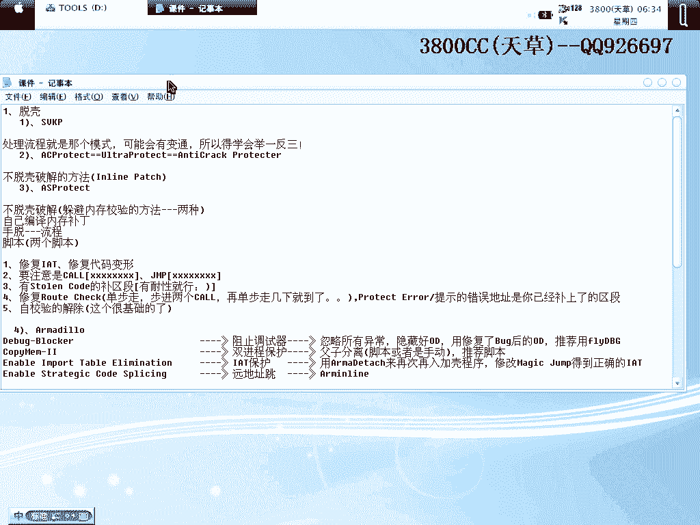

最好是跟着教程走跟着教程走，因为其他的东西现在搞不下来了就先放一会儿先放一会儿把教程里面东西完全，吸收了之后啊吸收了之后，再说，不要太浮躁了，一口吃不了一个胖子，这是一个劝告然后这是破解，破解算法分析。

算法分析大家可以。

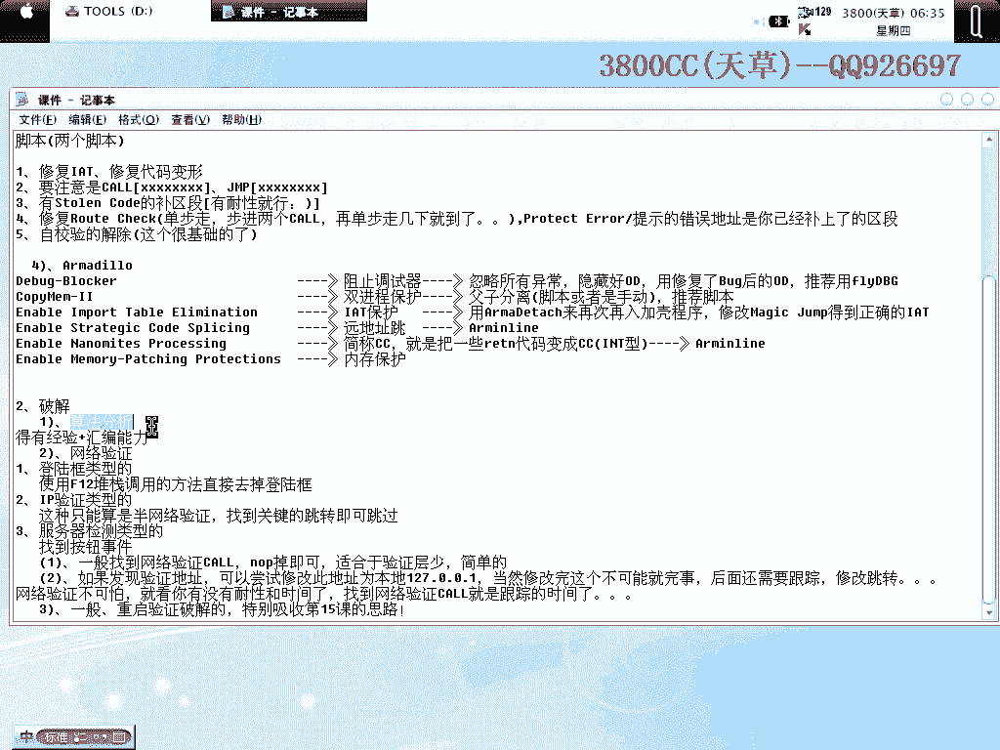

看得到啊可以看得到，我在，高级版初级版中级版里面，都没有讲过算法分析，只有这么一个商业软件的算法分析。

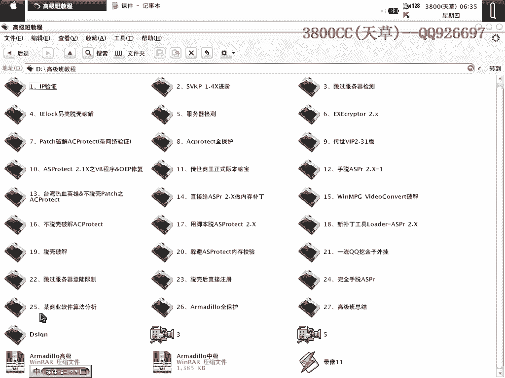

也是给大家提一下而已，这个呢我出于一个考虑就是说，对于经验啊经验然后就是会编的能力大家现在以大家现在一个会编，能力的话我听有些朋友就是说，看代码比较吃力啊就是会编能力不行，当然这个锻炼。

锻炼啊就是你要多看多练多看多练，你会编能力才会上来啊，还要多思考当然，所以说以现在大家一个能力啊我不打算讲算法分析啊，更何况算法分析的确用语音动物啊，也都不好讲，有都不好讲，所以说啊后面。

三个班都结束了，后面看大家的能力是否有所提升，我会，在算法分析这个方面，加强一点加强一点，这里就过啊，然后第二个网络验证网络验证大家最感兴趣的啊，也并不是大家想象那么，想象中那么难。

也是需要跟踪也是需要跟踪，当然有，以下几点啊有以下几点，第一，登陆框类型的，F12对战调用的方法直接去掉登陆框当然，我也试过有的用F12对战调用的方法不行。

当然有90%的啊90%的程序我试过都可以都可以，这个话也不能说满了，然后这就是IP验证的，验证类型的，这种的只能算是半网络验证。

他就是说网络验证的一个强度不是很高就像这一个程序一样。

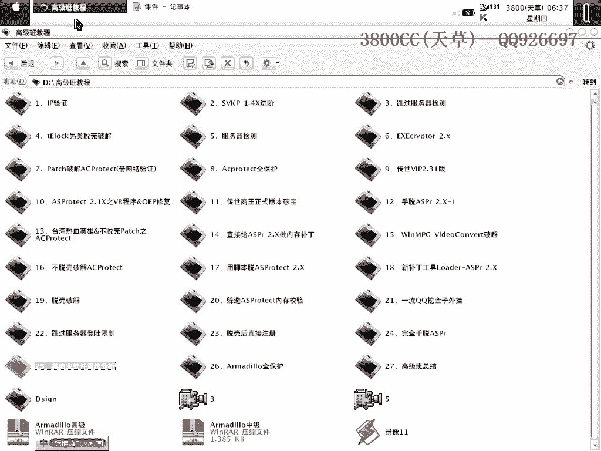

我们只需要跳转啊找到相应的跳转，就是说跳过他对IP进行验证的部分，所以说只能算是半网络验证，像网络验证的话就是说需要本机向服务器发送数据然后，服务器返回数据，然后，软件呢要在本地处理这些数据。

判断你是否注册是否让你通过这样才是完完全全的网络验证，所以说IP验证只能算半网络验证，给大家练手啊，对网络验证一种熟悉吧，然后这就是服务器检测。

服务器检测呢其实说网络验证啊我在这个地方把网络验证分的比较细一点，比较细一点当然大家这要融会贯通比如说有一个东西他有几种类型的有几种类型的，像我们在高级版里面讲的那个什么。

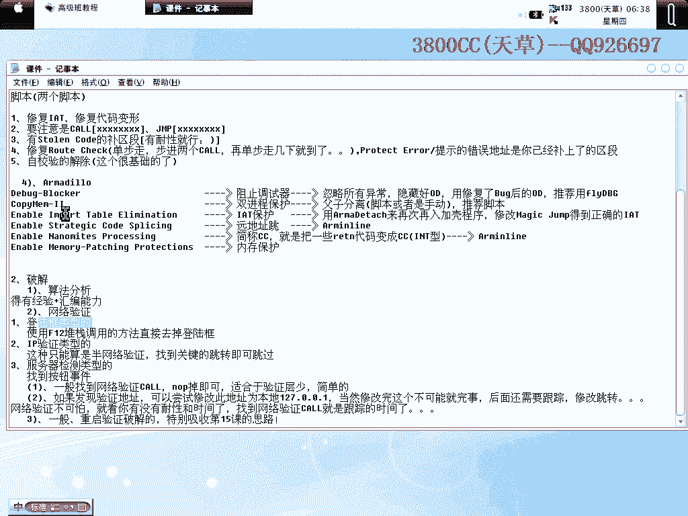

网站推广专家他也登录框。

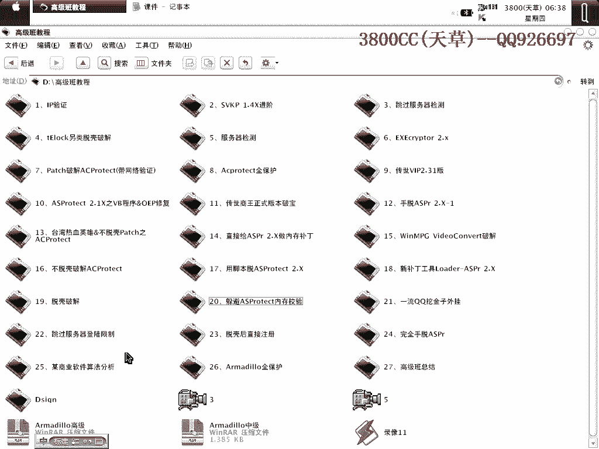

他也是网络验证，同时他又是服务器检测类型的，所以说，我们的处理方法就是不一样了，在那个地方在那个课程里面我有融合几种思路，这里就是说第一个找到按钮事件，找到按钮事件，第一个就是说如果是，Derpy。

BC++的程序，或者是VB的程序，VB的程序用哪一个软件找按钮事件大家知道，Derpy呢BC++这个大家也知道，如果是C++的，C++的一些程序的话找按钮事件我们一般只有通过，通过。

F12短暂调用的这个方法，慢慢缩短缩紧，就是说缩小范围啊缩小范围，一般是找到网络验证的调用口号，调用网络验证的那么一个口号，落步调教就可以了，是和验证，层次比较少一点，简单一点。

当然就是说我在课程里面前面课程，里面也给大家提过，现在越来越多的程序在使用网络验证就是说一般的程序他也，排除外挂吧，排除外挂因为外挂，都是在，使用网络验证，一般的一些程序，使用网络验证的。

越来越多大家就说程序员可能就觉得网络验证难，可以难倒一些，就像黑银在加密课程的时候黑鲁在加密课程就说，难倒菜鸟就行，高手，不舍网，可能就是说有些程序员就是这么一种思路，加上网络验证可以难倒一大批菜鸟。

所以这样导致在，网络验证质量上面数量是越来越多质量上面是，有所降低，网络验证也并不是大家想象的那种案子，像这么一种类型的，找到网络验证客，弄不掉，不让他验证，就OK，然后再就是第二种，如果发现验证地址。

这个非常巧妙的也可以试用很多很多的程序，可以尝试修改，此地址为本地的127。00，本地地址大家都学陆青的这个就知道这是本地地址本地的地址，当然修改完了之后，并不是完事了，并不完事。

后面还需要跟踪有一大堆跳转需要大家修改，这个在，推广专家类节课里面有给大家提过啊，非常麻烦的也需要大家非常非常多的细心，同时，跟踪网络验证必须做记录这个大家一定，一定要，切记，在前面我也给大家提过。

不管你是TALK还是，还是破解，必须做记录，可能有的朋友就说，听进去了，有的朋友没有但是在破网络验证的时候，特别是像这种的，因为，要跟踪的代码太长了，太长了必须做记录不然的话，你前面跟踪的后面又忘记了。

代码太多那就是前功尽弃了后来就越跟越烦越跟越累，网络验证不可怕，就看你有没有耐心和时间了，找到网络验证口了就是跟踪的时间了找到网络验证口，那一个部分的话，然后呢，就算是完成了一半了，后面就是跟踪的时间。

然后最后就是一般重启，验证类型的一个破解，特别是要吸收第15课思路，大家可能在我讲课的时候第15课里面大家看到我做的，做的一个记录是非常非常多的因为我那里是三种思路，我是每一个思路每一个思路都去，尝试。

然后每一种思路跟踪出来的一些疑点都做了好的记录所以说。

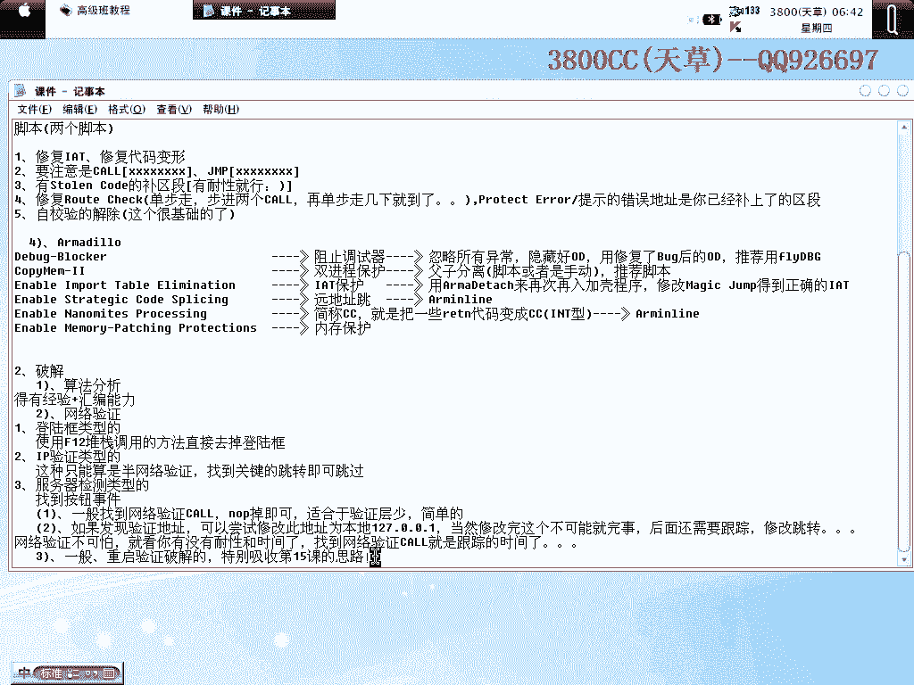

做记录是，蛮大的一个优点。

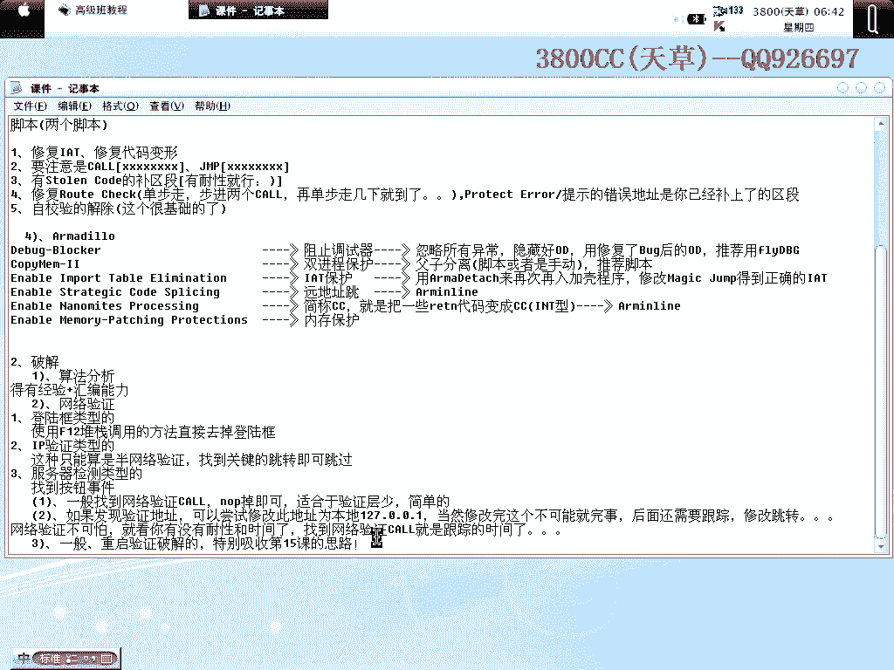

在另外在课程里面好像也，提到没有啊忘记了用这么一个插件。

这么一个插件做记录的，这么一个插件。

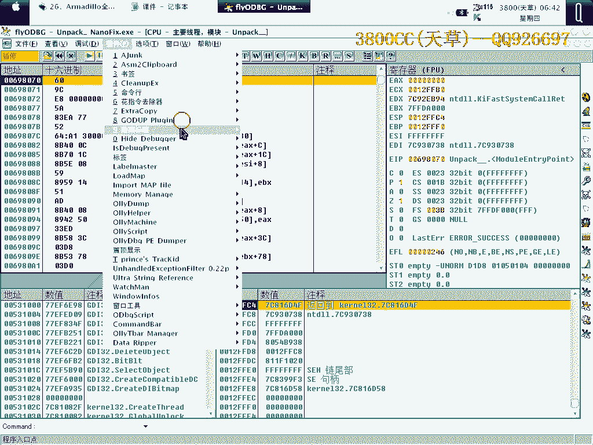

打开它，做记录然后呢它会默认在这里面保存你写一下写了一些之后，然后保存只要你OD不关或者重新重载都可以，重新加载，它这个不会关，但是你如果，OD关掉了它这个会关掉所以说你，在做好记录之后然后记得。

写上记录之后然后记得save一下然后save一下这样就不会导致。

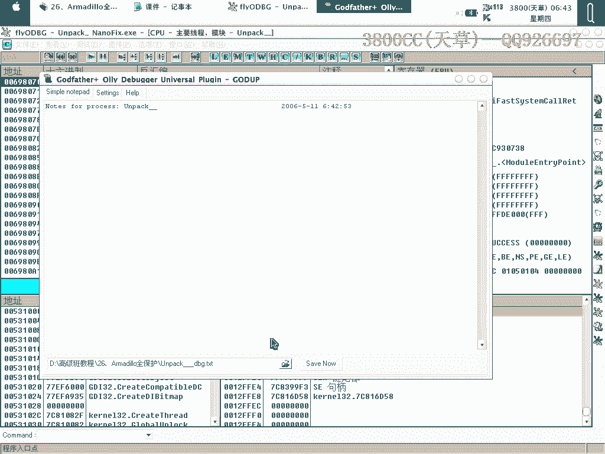

就是说。

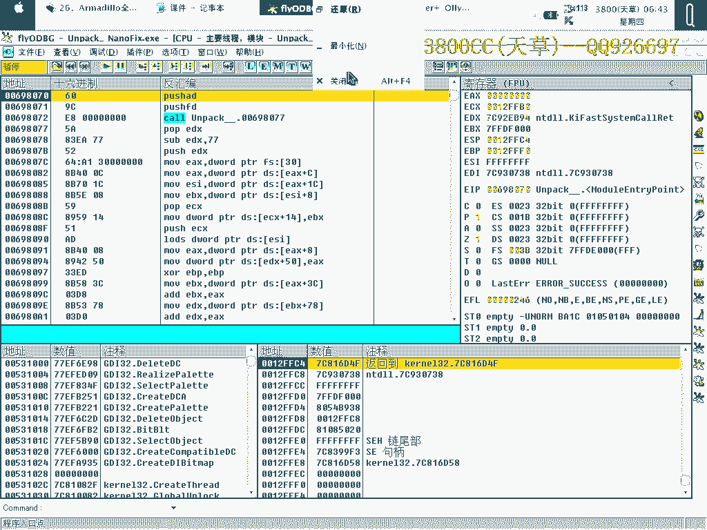

记录遗失吧记录遗失，第15课第15课。

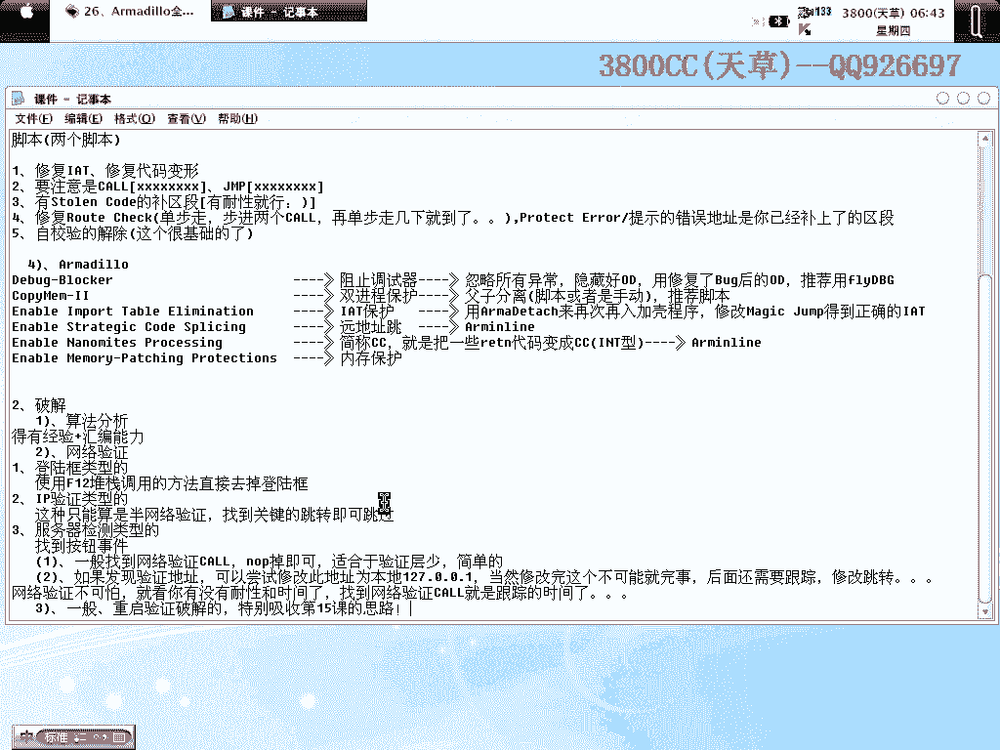

它这个。

在讲这一课大家看到了讲了50多分钟，是非常长的一节课也是我，迄今为止，讲这么多课讲的最长的一节课，大家应该从中应该可以看得出啊就是说，我是把心思花在这个上面的把心思花在这个上面，希望大家能够好好吸收。

破解最重要最重要是一种思路啊，是一种思路，你拿到一个破解不要急拿到一个软件不要急着去破解它，你先玩一下它玩一下它然后再，发现一下，看下有没有，疑点漏洞然后把它记录下来，在自己，整理成文整理成文。

整理把思路整理出来然后一个一个思路去尝试当然简单的，你就可以就是说通过我们现有的方法一下子就可以完成破解，当然就是说，一下子没有头绪的，比较难一些的话，你当然就需要按这种方法去做了。

当然时间是需要的比较多一点，破解是非常辛苦的，破解是非常辛苦的，好了这期课就这么多就这么多，高级班呢也就做完了，后面还是会给大家做一些教程，有什么问题，也希望大家能够提出来提出来我这个啊。

有时候脾气不是很好脾气不是很好，如果问一些我在课程里面，也在强调过的一些问题的话，我可能就是有点不耐烦，但是我还是会给你讲，还是会给你再讲一遍，所以在这里大家算是先提个醒啊要是我有点烦脾气不太好的话。

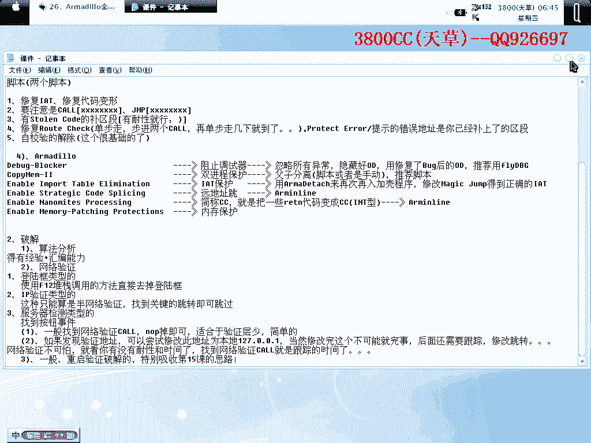

大家就先谅一下原谅一下啊，好那这期课就这么多就这么多好再见啊。