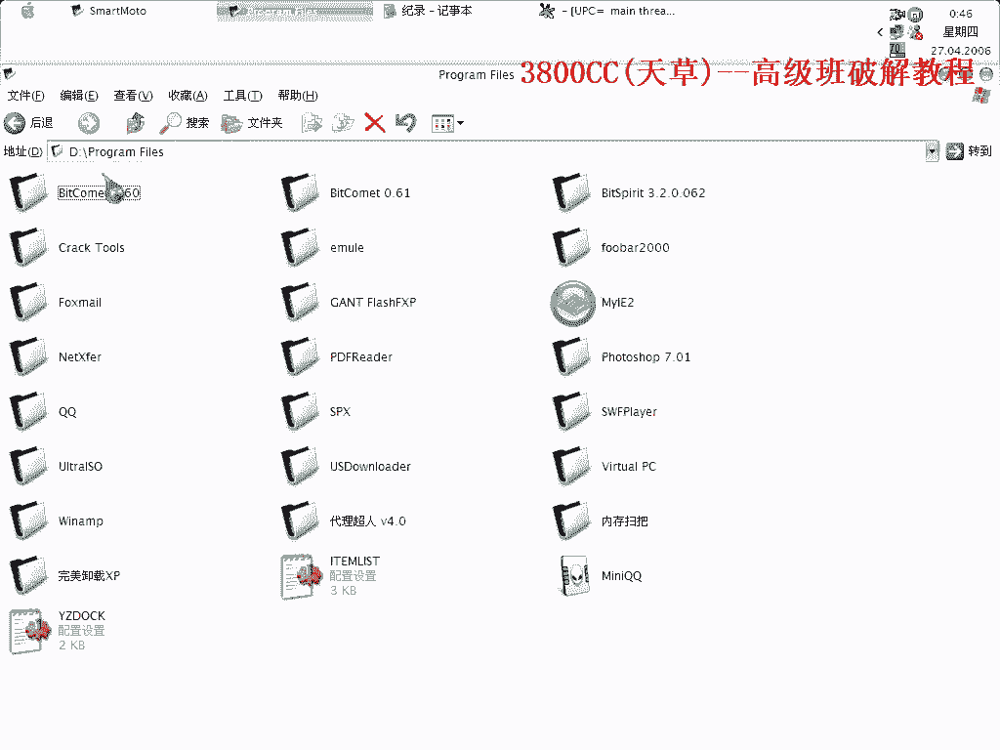
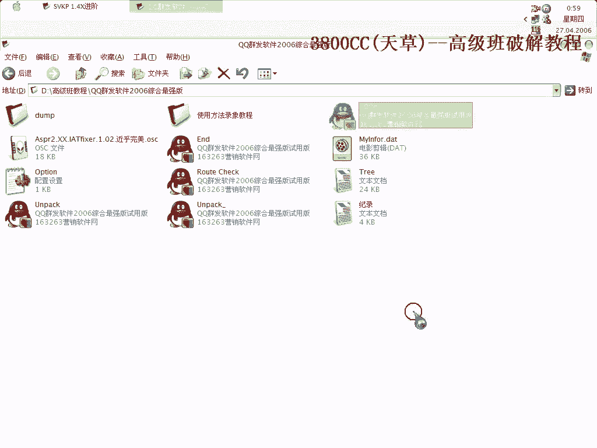

# 3800cc(天草)-天草高级班 - P2：2、SVKP 1.4X进阶 - 白嫖无双 - BV1qx411k7kJ

好，这集可以来看一下这个，这个呢是我在国外的云台上看到一个家伙的球体上面，然后看了一下，还蛮有意思的，有一些不同，我就做了一个教程给他，这个教程是英文的，我当然也发到了，看写上面去了。

这个英文教程写得非常非常清楚，你呢在下面，首先不要看录像，看这个教程，或者是什么都不要看，自己试一下，好，就这么一个东西，用这个PID查的是1。3X的，但是它是一个，先这样的一个文本记录吧，首先呢。

我们第一步，探测一下OEP，探测一下OEP，为了快捷一点，就用它来探测，这是我们的第一步，激活一下。

重新来过吧，激活啊，这里是我们的OEP。

这是我们的OEP，同时呢，可以来看一下，这里被抽取了7个字节，关于Stormcloud的一个字节，7个，一般就是这个，扫一个程序，给它comment。

你可以对照一下。

对照一下，其他的是一样的，那么OEP被抽取的是这7个字节，这个节是Push 60，是肯定的，然后这个Push的，可以单步来走一下这个，Push完之后，这个Push值被压到这里面来，我们来看一下这里。

这里有一个值，也就是说刚才那个Push的值，就是这么一个值了，这么一个值，这个我们已经确定了，Stormcloud的也确定了，这个啊，在前面也说过啊，在拖那个，嗯，就是，啊，前面讲拖这个壳的时候。

开这个屏幕路线转家会，断掉，会断掉，断不下来，好，现在中断下来之后啊，看一下，返回了，返回了，返回了，这个样子，对了，好，重新换一个ODP，换中文的啊，好，返回，返回了之后。

第一步首先是查找这么一个特征，好，查找到这里来了啊，这个跟前面的不一样啊，前面不一样。

可以看一下这里有个GN1，然后接着这里，然后这里有个GNZ，这里，我们在前面说过啊，这三个啊，这三个，是反注册函数啊，反注册函数，那么我们前面处理的方法是把这个挑到这里来，挑到这里来，然后呢，这里就。

就挑到这里来，就不要管了，然后再进行第二个特征，这里不同了，因为我们要这里啊，我那个教程说的很清楚了，这里是KUR啊，这么一个模块的一个家，啊，下面，然后呢，这里呢是反注册函数，反注册函数呢。

自然就是这里啊。

这个函数，这个DLL的一个加密，然后下面经过，这，这一个啊，经过修改啊，没有修改的话，会出现是user32的加密啊，那就说明它是user32的加密，这里我们把它改一下，(咳)，三个都改成这样吧。

改成这样破之后啊，这里，挑到这个来，然后接着这样破，全部都挑过来了，接着就这样破了，好，擦走第二个，这里我们把它颠倒一下，好，这里呢，下断点，啊，这前面这里，我这里，开着屏幕，现在在加了哈，啊，就下。

断不下来，我把它暂停一下，好，可以了啊，这个时候取下断点，接着啊，lns它，取下断点，把它加F9，同样啊，下硬件断点，之后这一步就是一样的，好，中断三次啊，OK，删除硬件断点，这里啊，我也不多说了。

这个12FSC是开始的OEP的解释啊，好，到这里来之后，我们就弹幕走，可以看到这里了啊，49F390就是我们刚才被淘到了一个字节了，好，放到这里了，这里，我们把它补上，放置新建一下EIP啊，这个时候。

这个时候我们在托克，去掉充电，输入表，OEP 436 CC，所有都有效，所有都有效，嗯，还是起死，还是起死错误，我们这个时候来载入看一下，OK，这里呢我们设置一下，因为一般程序，有一场的话。

它会是内存访问一场，在机器上面，它要读取内存，所以忽略内存访问一场，这样它就会断下来，同样啊，所有都取消掉，看一下，这样就断下来了，它这里是显示D47D0D02，这么一个区段，这么一个区段。

那我们就用来补区段的方法，可以这个样子来试一下，用这个，用这个来试一下，D47，D47，D7啊，D7，我们就这个，嗯，因为我现在懒得开这个，找那个目录，找目录开PID了，看一下，错误了，错误了，新的啊。

刚才是把那个选上了吗，D74啊，看一下，00，00，这一个啊，这一个错了，D7DT啊，错了，刚才弹幕错了啊，D74啊，这个错了啊，还是不行，还是不行，这个时候我们就来，打开load PE吧。

之所以这个插件用的比较少啊，用的比较少，就是因为它不好用，经常会出问题，杀了这么一个精神区域托克，D74啊，看一下啊，D7，怎么有这么一个区段啊，00，选错了，选错了，应该选这一个，D7，D4，卧槽。

应该是D4啊，这一个，D4，这一个，先打开我们错误后修复的一个文件，这个时候呢，我把这个关掉啊，不然它无法写入，它这个内存值会变啊，我在做那个教程的时候，不是这么一个地址啊，然后这一个大小，算一下。

1234，要点保存啊，记得要点保存，确定，然后这里选项就只是设置一个认真IP啊，先重建，可以运行的啊，完全没有问题了，而且好像没有跨平台运行，没有跨平台问题，没有跨平台问题，这个就这么简单，就这么简单。

这个处理手段上面，技巧呢，就是首先的，我们就插到这一个的时候，跟以前的不太一样，以前不太一样，然后第二个，第二个技巧，第二个技巧就是在最后的一个补区段上面啊，这个在拖那个ASProtect的这个2。

X的时候啊，要经常，要经常碰到的，这个非常非常烦的，昨天拖了一个，拖了一个，昨天，可以看一下，高级版里面会有这个的，这个呢，这个是拖了的，然后拖了之后运行不了，然后这个不行，又不行，最后修复。

最后修复才行的，没关系啊，也是，最后显示为Nothing Founder，因为它是童口的啊，但是最后，可以看一下，我补了31，32个区段，从00，从00开始的，补了32个，补得累死了啊，这个每。

因为每个便宜地址都要计算的啊，非常非常麻烦，这个在高级版里面会讲的啊，会讲的啊，好，那今天这个课程呢就到这啊，再见。

字幕：J Chong，字幕：J Chong，字幕：J Chong，字幕：J Chong，字幕：J Chong，字幕：J Chong，字幕：J Chong，字幕：J Chong，(字幕製作/時間軸：

秋月AutumnMoon)，影片就到這，記得幫我訂閱、按讚及分享唷。