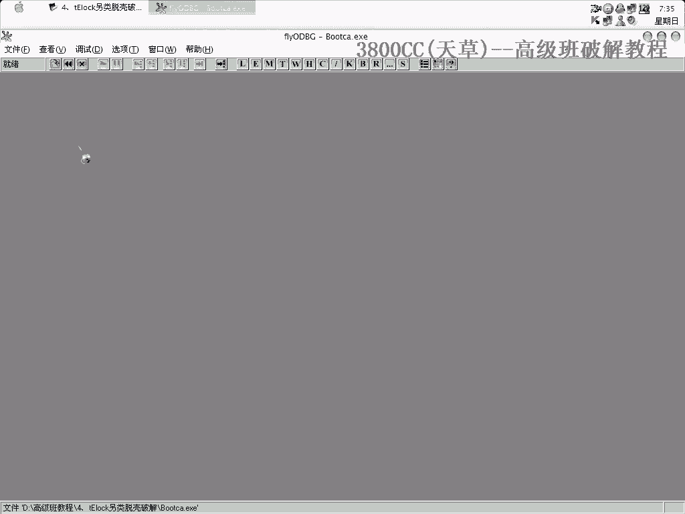
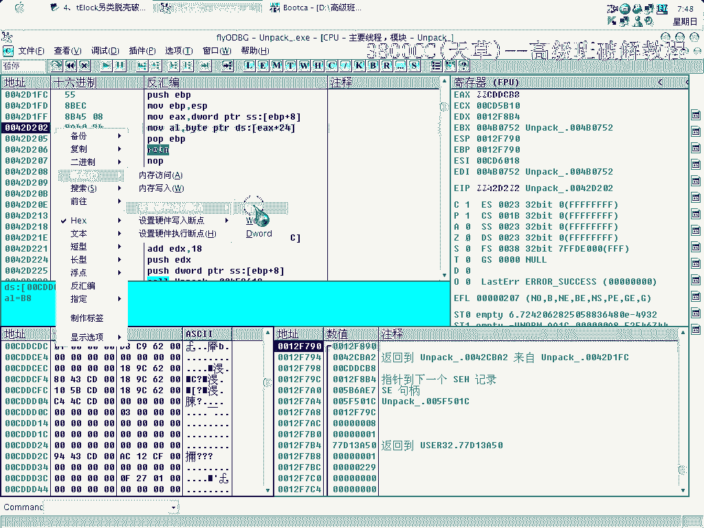
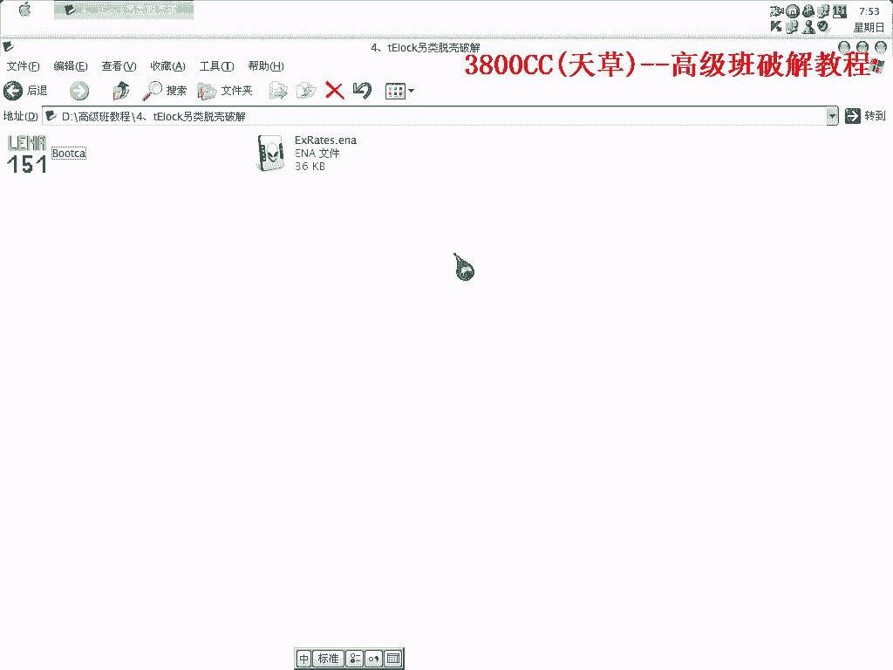

# 3800cc(天草)-天草高级班 - P4：4、tElock另类脱壳破解 - 白嫖无双 - BV1qx411k7kJ

大家好，这节课呢，来做一下这个TNLock的一个另类破解，关于TNLock，看写上面有一些文章，有些文章就是说，它是一个加密型的课，拖它之前呢，首先得找麻吉跳啊，但那样操作就是说是一种正规的操作。

但是今天我给大家讲一种，另外的一种方法，就这么一个东西啊，用PID来查课，0。98的。

这里呢，我们忽略所有的异常，然后找到这个，然后Shift+F9啊。

用F9的时候会有提示，错误点有什么东西，老不过去啊，一个提示，好，到OEP了啊，一看这个路口啊，就知道是BC++的啊，BC++大家想得到啊，要用到就是那个手动查找IAT啊，我们可以先试着来查找一下。

就这么一些啊，大家看到了啊，有非常非常多的误销啊，非常非常多的误销，好，这个时候呢，我们来用Import IEC来看一下，好，很多误销啊，我们等级1呢，一个都没有修复好啊，然后呢。

用等级3的也可以试一下，也修复不好啊，在我这时间啊，然后用插件呢，也修复不好，看到了啊，全部都是Fail的啊，是吧，(这边我还在试着找误销的误销，看能不能找到)，很多啊，700多个啊，700多个。

一个都没有修复好，(这边我还在试着找误销的误销，看能不能找到)，一个都没有啊，重新来过，重新来过，现在就是我们的一个正题了啊，好，我们右键看一下啊，这些都是一些空数据啊，这都是空数据，没用，看不到什么。

我们把它剪掉，或者delta掉啊，看看这个，这个也是一样的啊，delta掉啊，看一下这个，这里面有啊，看一下它这个汇编代码啊，move，这里有一句move，这个37啊，这么一个地址啊。

它放到EAX里面去啊，放到EAX里面去，我们可以到这里去看一下啊，看会有什么改变，看到了啊，从这里77啊，非常清楚了啊，77，77开头的都是一些IAT啊，都是一些IAT，77，你们可以看一下这里面。

77，76是属于这个几个地址的啊，然后这个地址属于77开头的啊，这几个，从这几个开始都是77啊，这个是78，当然在每台机器上都不一样啊，每台机器上都不一样，这个时候啊，我们这前面这个就不能要了啊。

就不能要了，因为它不属于IAT了啊，所以在F0，加上1，加上1就代表这里16进制的4个字节啊，我们把这个复制下来，同时复制的时候啊，复制的时候要注意，从IAT的一个起始位置复制，到最后呢。

咱们要复制4个字节的空数据啊，零数据，看好，要这样复制啊，要这样复制，好，我们现在把它连贴到哪里去呢，连贴到这里啊，这里啊，看到了啊，这个是跟这个对应的啊，这里是268284，268284，它这个是。

我们这里要加上imgbx的啊，imgbx就是004001啊，在这个地方，咱们就是把它复制到0066啊，8284，从这里开始啊，多选一点无所谓的啊，反正它那些数据只有那么多啊，不会重复覆盖的啊，看到了啊。

刚才连贴了之后这里马上就认出来了啊，马上就认出来了啊，看到了啊，这些都认出来了啊，再回去看一下啊，看这一个，这里啊，是B3，这里我们要加6啊，加一个，前面加上0啊，因为刚才加5的话，这前面是0啊。

前面是0我们不要，同样这里复制，后面也要复制四个字节的，你空数据，这个时候呢，我们再把这里来看一下，从这里开始吧，是从这里开始，没错，668564，668564，连贴了之后马上就在上面了啊。

连贴了之后马上就在上面了啊，马上就出现了啊，这里有一个，这里呢是29，29，00，这里他只有一个IT，刚好对应了我们这个地方的一个，记得要复制一个空数据啊，把它复制到这个地方，66，668688。

咱们就复制连接，这个的IT是这么一个东西，最后一部分了，CD啊，记得啊，记得啊，记得啊，看一下啊，是从这里开始，没错，跟这个地址是对应的，668950，我们看得非常清楚了啊，他这个地方呢就是说。

地址全部都被偏移了啊，这个有点像那个穿山甲的CC啊，穿山甲的CC，Cosplay，重新来过，剪掉无效的就可以了，我们来，连接啊，可以运行啊，这里就是一个就是说Turk的一个技巧了。

大家就是说要充分的充分的去会使用这么一个东西啊，这么一个东西，我们来看一下这个地方现在需要破解啊，需要破解，怎么样呢，就这样，这么一个东西，选上一格，选上一格，然后按空格，点一下其他的。

我们再按这个保存，不能保存，看他啊，他这里就是说演示版，就是保存操作是无效的，我们有一个演示，这里是DOM版，现在越来越多的软件啊，都使用演示版，他怎么样意思呢，就是说他只是把部分功能，摆出来。

然后让大家让用户免费下载，免费下载就是说如果你适用，适用觉得挺好的话，觉得好的话，然后他再给你发正式版，所以说演示版在里面是功能不全的，功能是非常非常不全的，他甚至我碰到一些很多一些软件。

就是说他甚至里面，比如说这是一个按钮啊，这是一个按钮，点一下，但这个按钮里面完全没有代码，完全没有代码，这个就是，为了保护程序吧，因为现在不管是什么样的程序都有人，能够破解啊，都有人能够破解。

但是演示版的话，就没办法了啊，所以说有时候你碰到一个软件啊，破解，不了他的话，然后你就学会一种技能，就是说来辨认，他是否是演示版，最重要的一个，标志就是说你看他相对应的功能的代码，如果。

他的那些代码齐全的话，就说明他不是演示版，如果不齐全的话，那一定是演示版，破了也没用啊，根本是破不了的，好，我们F9运行，打开这个东西，当然啊，我们同样是要，用到啊，用到就是，L12对战调用啊。

这里有很多啊，我们一一进去看一下啊，这里呢，这个调，没有调可以调过去啊，这个可以调过去，但是他这是调用系统的API啊，这个肯定不是的，这个，没有调可以过去啊，就是这个要靠嘛，这个不是，这个，这里呢。

有啊，可以调过去，这里呢，可以，可以，可以，可以，但是这种调是非常多的啊，我们不妨不用去，先不用看他，往下面看，往下面看，看一下啊，这个调也是没有调过去的啊，也是没有调过去的，看一下这个，同样。

连一个调都没有，这个也是一个调都没有啊，这个呢，看一下啊，看一下，有调可以调过去，同时呢，这里有一个重要的标志，Text AL，Text AL，这个就要求我们对一些东西非常敏感，经验吧，Text AL。

很明显啊，这个Tel，这个CALL呢就是关键CALL，好，我们重新来过啊，重新来过，再重新改一个，中断下来啊，中断下来，没有调啊，没有调啊，保存成功了，那我们可以再来看一下，我们进去看一下，进去。

因为是AL啊，控制的刚才那个-1，然后现在可以看到啊，是EX+24，控制这个AL，那么这个EX+24，这里面的1的这个字是哪里来的啊，在前面哪里来的，我们通过另外一种方法来查找。

这是在前面没有介绍过的方法啊，在数据窗口中跟随，然后它这是01嘛，我们就在01下，硬件断点Byte，要记清楚是Byte。

现在我们把这个都弄掉啊。

来查看一下，硬件断点还在，打开之后它就中断了啊。

中断下来了，这里面有什么东西，继续运行，看到了啊，看到了啊，这里，就程序在一启动的时候，因为是断板吧，它程序里面就本身就一开始就开始设置了这么一个东西，演示吧，它一开始就设置了这么一个东西。

就是说程序还没完全启动，导致我们后面不能用，EX+24很明显，它这里放一个1，我们放一个0，继续运行，可以看到，可以看到，好，先确定，这里，啊，这里，move，就是我们刚才进的那个Core啊，嗯？

还是跳了，还是没有跳，重新来过看一下，重新来过看一下，好，这里，好，这里，好，这里，好，这里，好，这里，好，这里，好，这里，好，这里，它在动态调试，它在动态调试，可以，可以，因为刚才是动态调试。

它首先运行到这里之后，它首先就把那个值给放进去了，我们改掉它之前，先一步就放进去了，可以再来看一下，可以看一下刚才为什么会这样，看到了啊，它这里我们改掉这里之后，就是说在改这个之前。

它程序已经运行过刚才那一句了，已经运行过刚才那一句，所以就没办法，所以就会出现刚才那种情况，我们可以这样来试一下，在这个地方下好硬件执行到底，在这里，在这里，再来一下，好，0了啊，跳了啊。

这个就是要注意刚才那一点，好了，这一节课程就这么多，大家回去好好吸收一下，因为今天介绍的这，像刚才修复啊，修复的方法是以前没介绍过的，然后呢，这还有就是后面破解，虽然用的也是F12对战雕用。

但是如何去找那个放入值。

也是前面没有介绍过的，嗯。