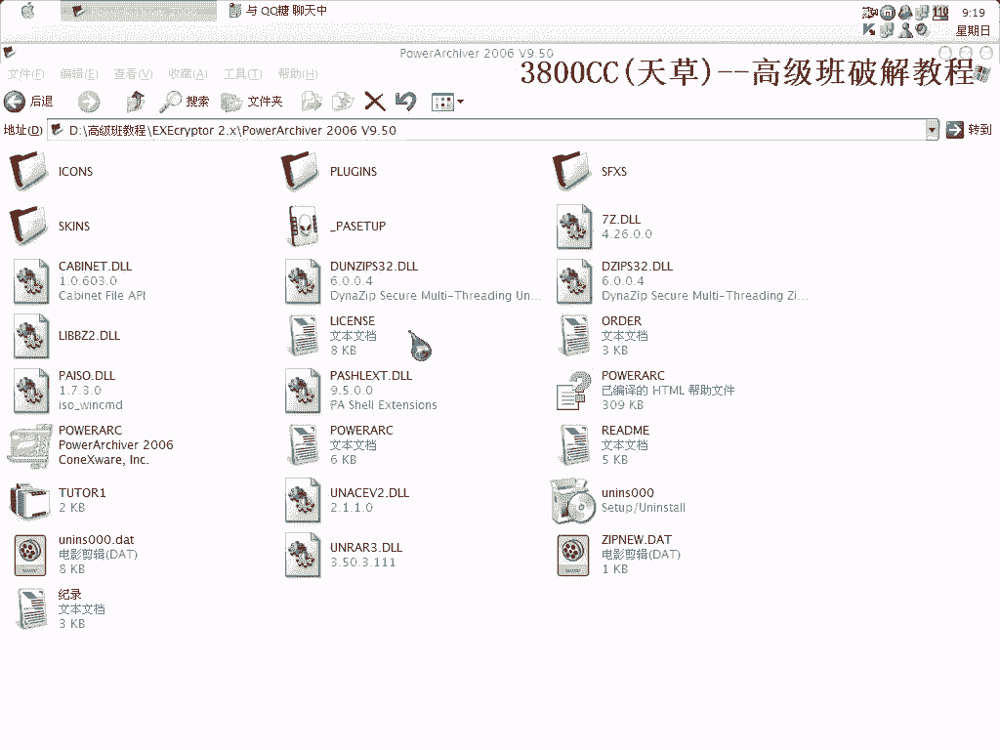
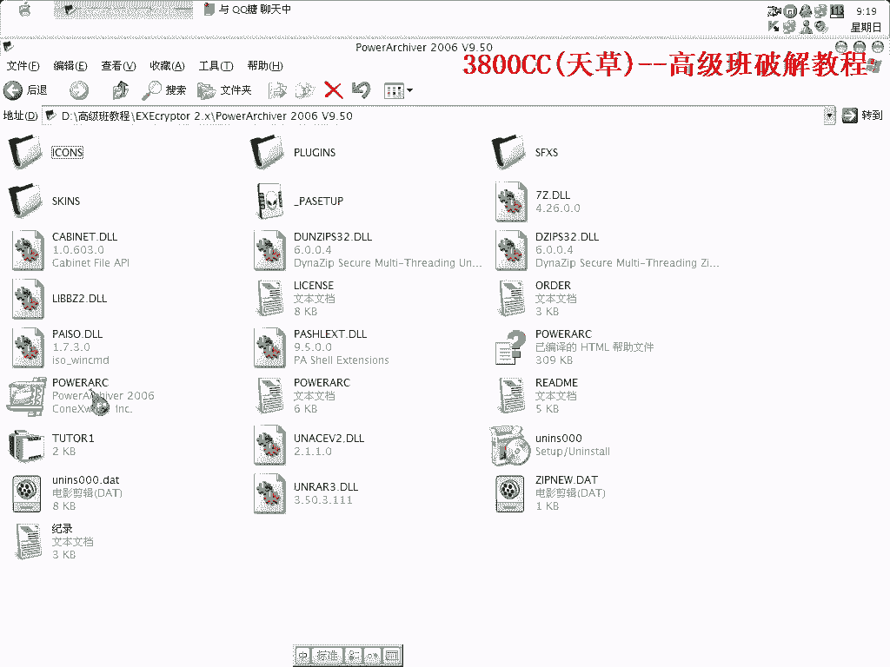
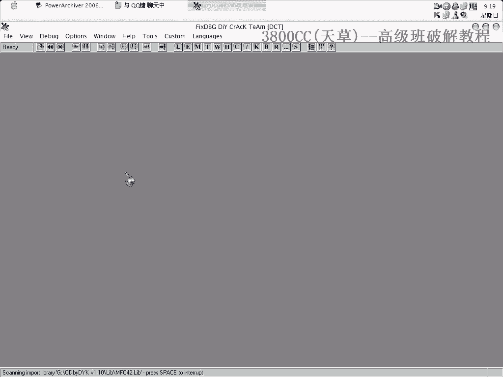
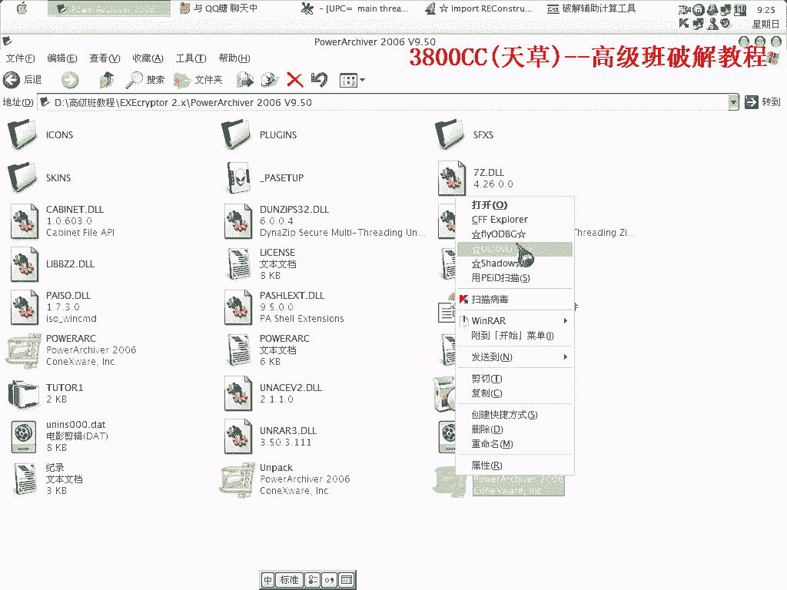
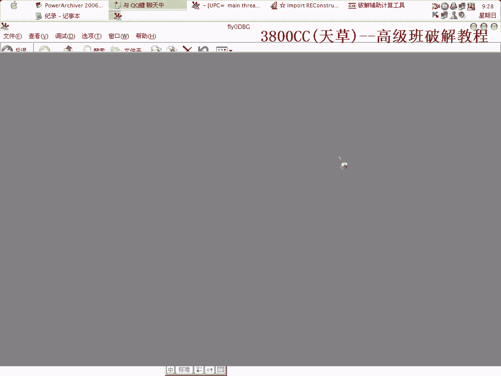
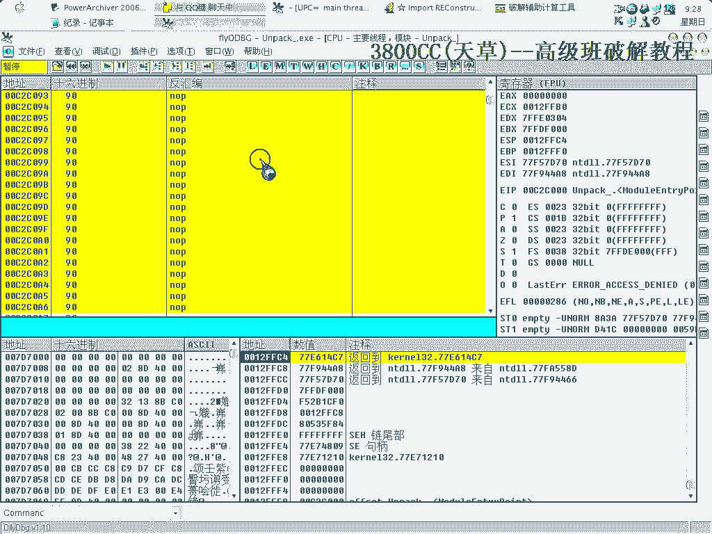
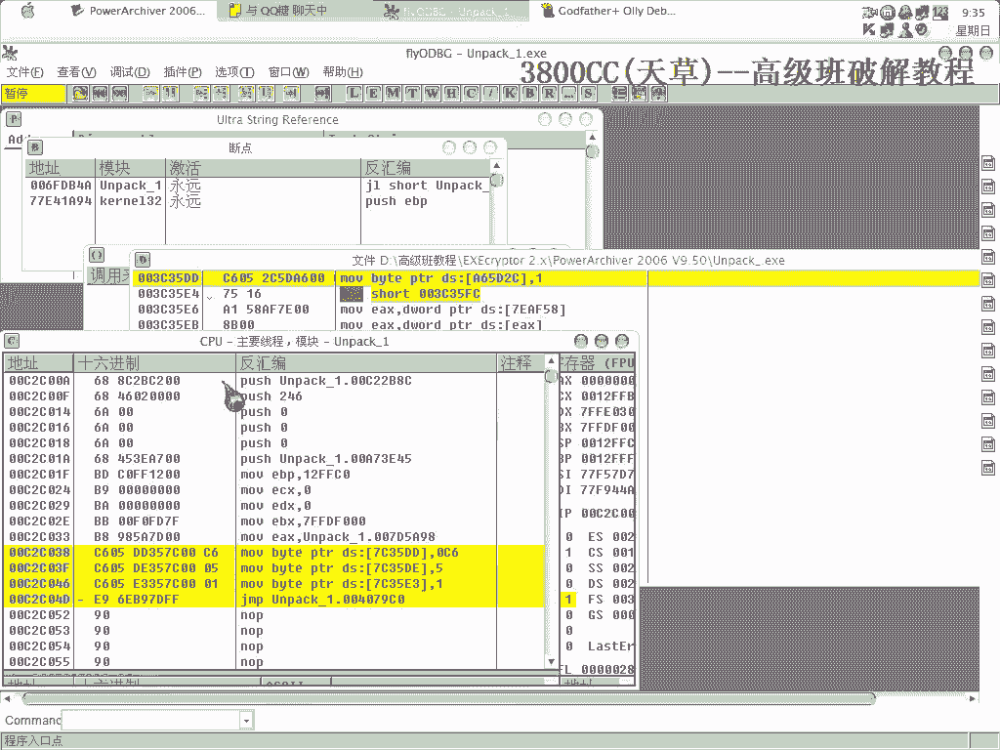

# 3800cc(天草)-天草高级班 - P6：6、EXEcryptor 2.x - 白嫖无双 - BV1qx411k7kJ

大家好，这节课咱们来讲一个托克，加上破解，就这么一个软件，也是一个压缩软件，算是比较新的吧，除了1R1和1J1之外，还有一个7J1，我们来看一下，用PID查课是UPS课，这是看区段，乱七八糟的一些区段。

大家这个要清楚，只要看到这些乱七八糟的区段，那肯定就是这么一个课，我们可以用FN来试一下，这个也查不出来。

这个要记清楚，这个是2。X的，但不是最新的，最新的处理方式有一些不同，而且要难一些，这个也够难的，够烦的了。

好，我们来OD载入，这个课它有一个保护的一个措施。

它有一个保护措施，是我们保护措施，等一下大家可以看得到，这里首先这样，按原先的设置，好 咱們用PID來看一下，打開加可程序，寫目錄，這個，它是通過來檢測這個，Callback Tempo，通過多次檢測。

來完成加密工作，非常煩的，也就是說，它也是這樣對OD進行檢測了，OD進行檢測，所以呢，我們剛才看到了，剛才看到這麼一個東西，看一下，而且它每次，程序，這個先不看這個，我們來看一下這裡。

Callback這個是006F010，這麼一個地址，好 把這個地址記著，要用到，再來打開內存進行看一下，剛才那個地址是屬於這麼一個段的，屬於這麼一個段的，好，現在來開始我們的工作，首先設置為它這樣，好。

看到了，大家看到了，像設置為系統端點，在系統端點總段的話，它每回都也等於一個One Shot，這個我們必須得刪掉，打開它，我們在這一行，這裡為什麼，剛才我們看到的那個值，好 中段下來了，中段下來之後。

再到Call的段，像這麼一個段點，F9，看一下，5BB，我們來看一下在哪一個區段，這個不太方便看，直接看這個吧，看它的內存，5BB，5BB，它這個是，005BB，在這麼一個區段裡面，在這麼一個區段裡面。

繼續F9運行，但是它跳到的是00CC，是跳到這一個段，CC，在這個段，不對，C1，在這個段，但是它是跳到這個段，這並不是我們想要的，繼續F9，這個是返回到哪裡，返回到A7，A7也不是我們想要的。

A7看一下，在這個段，也不是我們想要的，繼續F9運行，這個才是就是我們的一個OEP了，這個才是就是我們的一個OEP了，在這個地方，我們完整脫殼，大家不要看得很簡單，後面還有更多的，完整脫殼之後。

我們開始修復，先來看一下，這個IAT，起始位置，拉上去，從這個，68258開始，68258開始，OEP是7940，254開始，這個可以，大小，我們來算一下，就這一個，要來算一下，A6 8。0，B9C。

B9C，B9C，它這個是BA0，可以用，沒有無效的，如果在你們那有無效的話，就剪掉，直接剪掉，這就是因為程序加了殼，被加了殼，這個殼之後，它會把這個機子金像給改掉，這裡的，代碼起始位置。

我們把它改回1000，保存一下，好，我們現在來看一下。

直接復旧運行，退出，直接就退出，為什麼會這樣，我們來對照一下，看一下，在程序到達OEP之後，原程序加殼程序到達OEP之後，EX，ECX這些詞，看一下，但是對照一下脫殼後的，完全都變了，再看一下。

對戰這一段的，對戰這一段的，可以對照一下，都變了，都變了的，都變了，現在怎麼辦，現在怎麼辦，因為程序運行，必須基於這些詞，必須基於這些詞，那好，我這裡做好記錄了，看一下，就是說，寄存器的值。

原程序的寄存器的值，是這麼一個字，這麼一些字，然後對戰的，對戰的，可以來對照一下，可以來對照一下，寄存器，對戰的這些字，對照一下，那我們就可以通過來寫代碼，通過來寫這些代碼，寫這些代碼，把這些字。

就反著來，反著來，這樣，PUSH，12FFA，FF0，FF0，然後呢，再PUSH，然後再PUSH，PUSH完了之後，把對戰的字PUSH完了之後，然後寄存器的值，MOV，MOV，12FC04。

12FC04，EBX，EBP的，EBP的，就是按這個順序來，分別都給他，最後來挑箱的這個OEP，最後挑箱的OEP，值就是這樣一些值，那怎麼辦。

怎麼辦，現在怎麼辦呢，好，我們這樣，就用到這個工具，這個工具，打開我們修復後的程序，創建一個新的區段，然後這裡的字節大小，可以1024，備份文件，還是備份一下，免得到時候要重新來託客，選上重定位，自行。

好，現在來打開它。

就這麼一些東西，我們現在呢，就是要，就是使程序，首先從這裡開始運行，從這裡開始運行，把那些值給堆進去之後，把那些值給堆進去之後。

就這樣，把那些值堆進去之後，再返回到我們真正的OEP，我們來打開它，來看一下，我們來彈幕走一下吧，彈幕走一下，看到了，他開始壓入這些東西，開始壓，開始給，到這裡來，我們現在對照一下，是完全一樣的了。

完全一樣的，非常OK了，非常好，可以運行的，可以運行，但是要我們註冊，現在就是我們破解它的功夫了，破解它的功夫，這裡它會提示重啟重新啟動，但是我們還會發現，就是無意中無意中發現了一個問題，就是註冊碼。

註冊碼裡面填字母，填字母，看一下，它是有這麼一堆東西的，這麼一堆東西的，我們現在來查找了，像剛才它在重啟驗證的話，我們通過重啟驗證，我試了一下，通過重啟驗證的方法，行不通，搜索這個，搜索這個。

它提示的一個錯誤，就是這裡了，這裡了，我們在這個地方下好斷點，這個沒有跳，沒有跳，我們讓它跳，讓它跳，到這裡來，到這裡來，大家看一下，71AC70的這裡面那個字是00A6，00A6 5D2C。

然後把它進行比較，進行比較，就是讓它跟它進行比較，這裡我們這個樣子，可以這個樣子來修改一下，基本上它的意思就是這樣的，00A6 5D2C，就這一個字，我們現在在前面有一節課裡面就說了。

既然這個只是怎麼來的，是怎麼來的，我們通過，肯定是在前面放過來的，我們通過來查找，查找一下命令序列，查找它，這裡有混淆了，代碼我被混淆了，分析一下，還是混淆，那也就是說，這個地方，我們剛才看到了。

它這裡剛才那個A6 5D2C，這個裡面是0，這個地方要對它進行關鍵比較，關鍵比較，我們在這個地方通過修改了，這樣吧，把它複製一下，記錄，我們在這個地方這樣修改，錯了，就說我們在這個地方把它修改成這樣的。

直接首先給它，給它這麼多東西，給了這麼多東西，我們再來運行看一下，這裡呢，直接保存一下吧，可以的，RAM 累計是3800CC，但是我們這裡還有一個技巧，大家要記得，因為我們這裡也是本身就寫入代碼了的。

寫入代碼了，我們就在這個地方對它進行寫入代碼，首先給它連C6，然後呢，接著要給這下一位，這個是DD，這個是C6是DD，然後05就是第一了，最後要給它01，可以對照一下這中間的是一樣的，然後DE。

這是DF，10，11，12，13，你要最後調到OEG，這也是我們派對的一個練習了，這前面也講過了的。

這就是我們派去技術了，派去的技術OK了，這幾個文件我就留給大家，今天這個課程就這麼多，內容還算是比較多的，像剛才的那個工具，它是會被卡巴殺的，但不是病毒。

好了今天這期課到這再見。