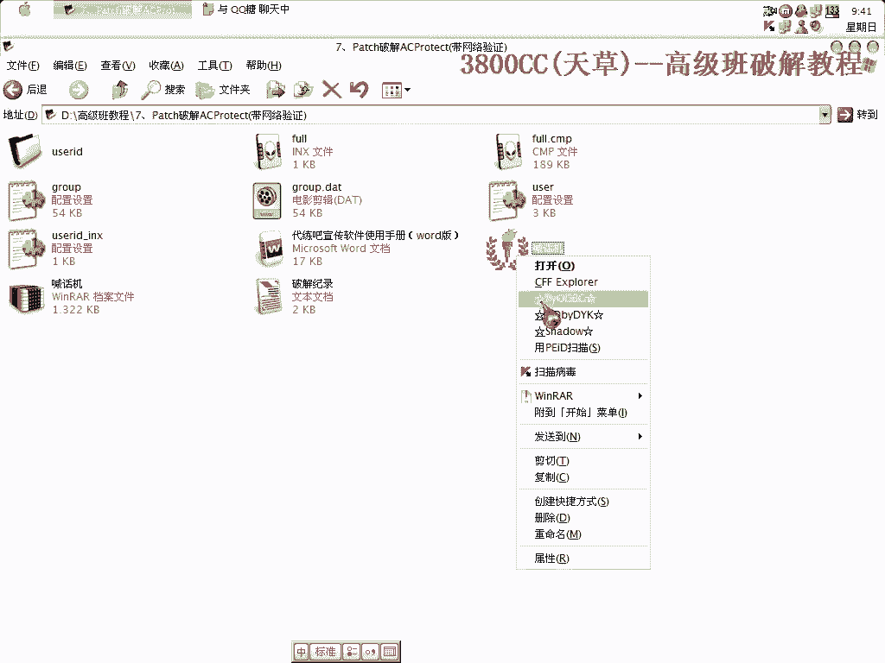
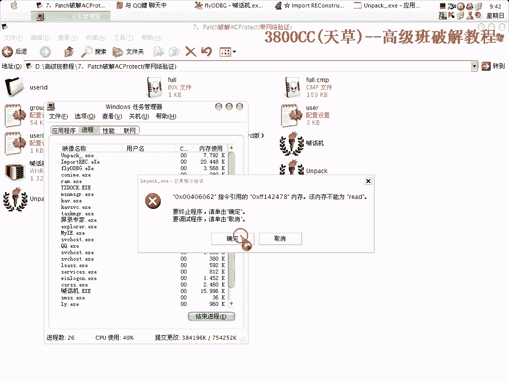
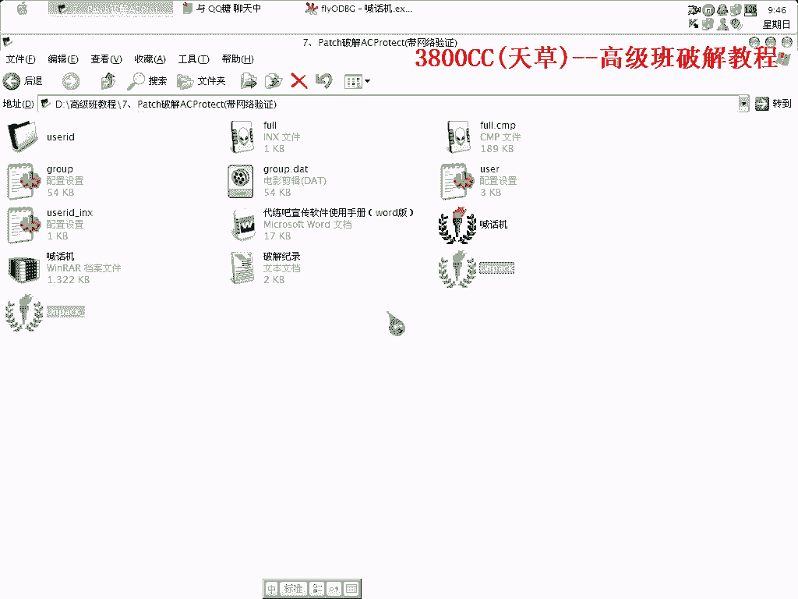
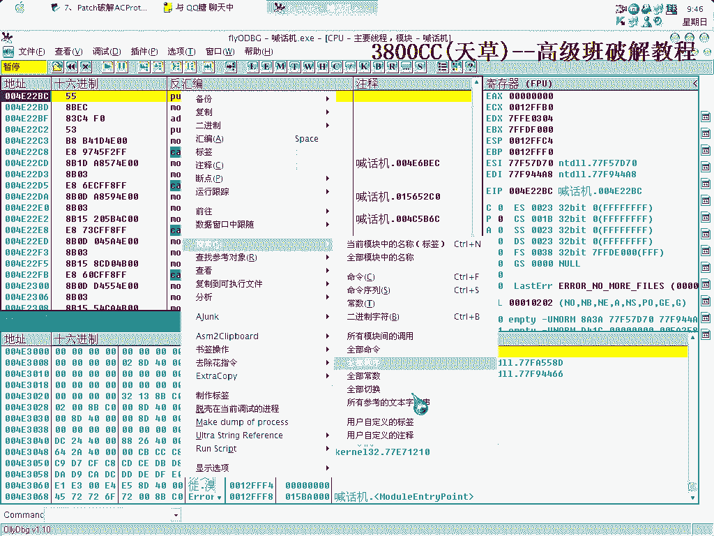
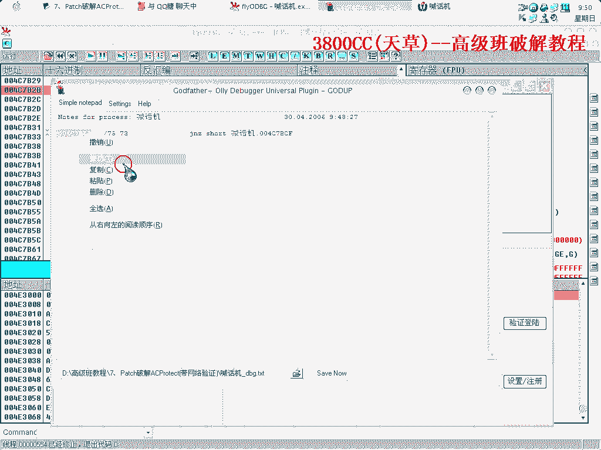
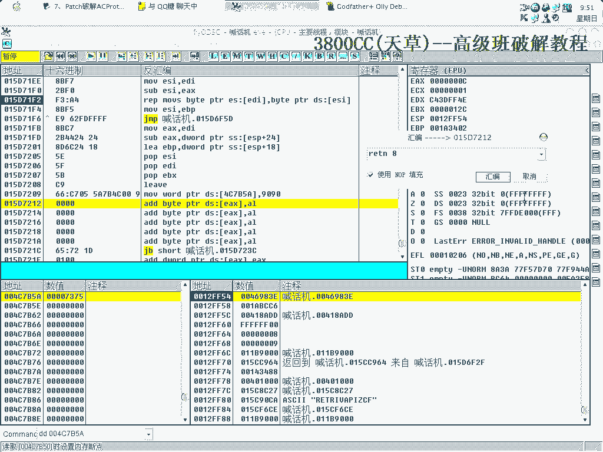
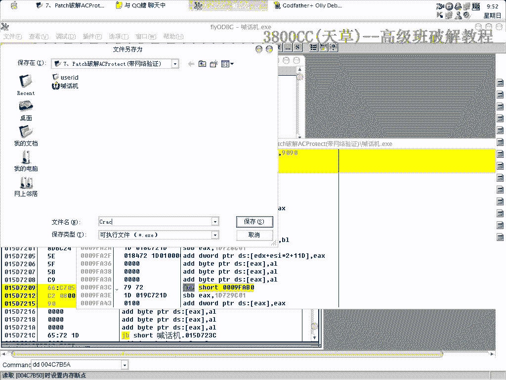
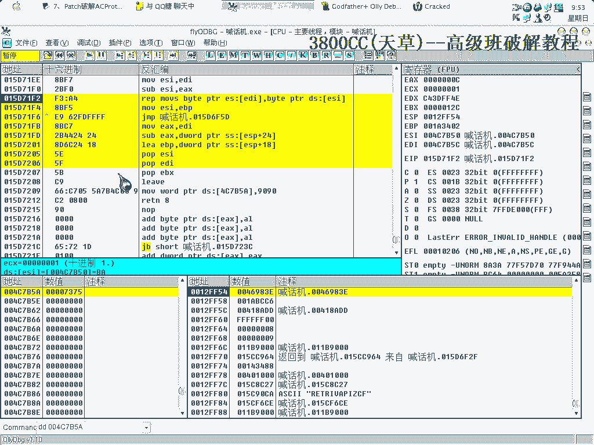
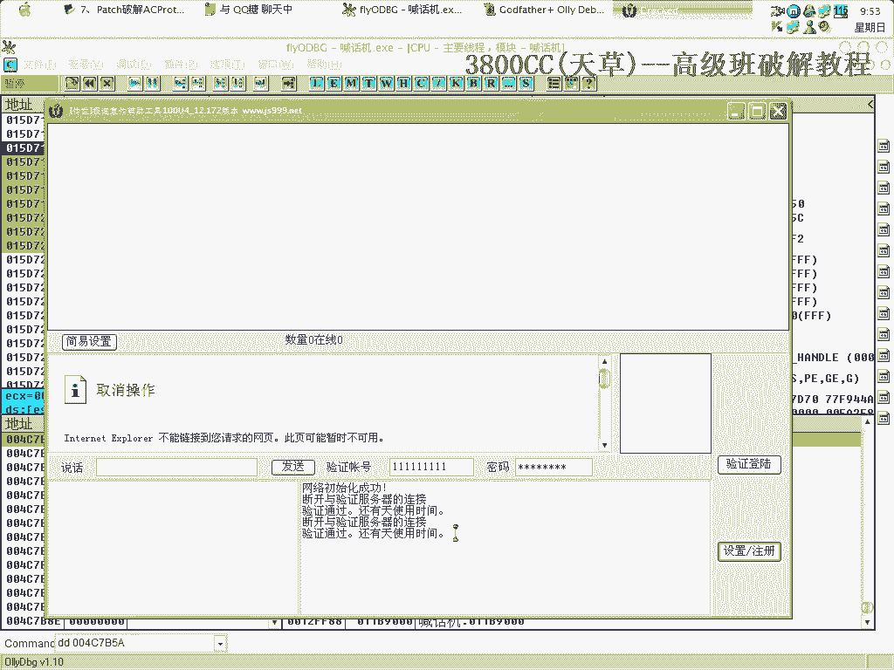
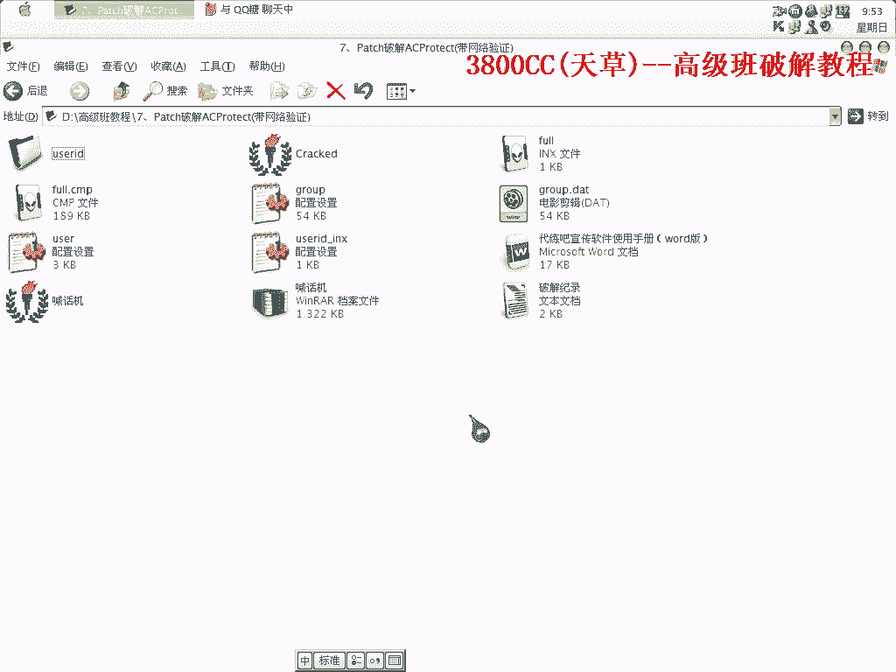

# 3800cc(天草)-天草高级班 - P7：7、Patch破解ACProtect(带网络验证) - 白嫖无双 - BV1qx411k7kJ

好大家好，这节课呢给大家介绍一种新的技术啊，就这么一个壳啊这么一个壳可以完全完成啊，我们可以来完成不拖它不拖它直接来破解的，他这个是一个带网络验证的啊，带网络验证的一个游戏外挂的一个喊话机啊。

可以来试一下，可以来试一下，这个导入有点慢啊，操这个怎么这么慢，重新来吧，难道这个外挂失效了吗，我把这个屏幕弄一下，我把这个屏幕弄一下，我把这个屏幕弄一下，可以了啊他这里断开了啊，已经断开了。

这里有一个设置什么注册啊，不用管他我们记着这个就行了，我们可以先来试着拖一下壳。

我们可以先来试着拖一下壳，我们来看一下会是什么样一种情况啊，我来打他。

这样就到了oep了很快了，这样就到了oep了很快了，这里呢我想就是说算是请求大家吧，就是给大家教给大家的这一些方法的话，不要外传，自己留着用就可以了啊。

有很多我需要剪掉，运行可以，运行啊不能运行，这个，刚才我们修复的时候有问题。

我们来用这个吧，我们来用这个吧，发现了重新来过第一个被我们弄坏了，我 为了不死啊为了不卡掉我就一段一段来修复，啊，有一个无效，我们把它改一下，改成MacOS Pulse。现在来抓取一下，嗯，嗯，嗯，嗯。

嗯，嗯，嗯，嗯，嗯，嗯，嗯，嗯，嗯，嗯，还有无效的吗？哦，这个是MacOS，sorry，刚才那个MacOS不是啊，两个都修回成MacOS吧。

有点问题啊，刚才那个不能修回成MacOS，上面一个，User，这个不能修回成MacOS，我把它剪掉看一下，有问题，大家也看到啊，像要拖这个还是有那么一些难度的，不要以为非常简单，我们可以重新来修复一下。

前几天看到群里面有一个谁啊，说这个很简单啊，其实你要想完美的去非常完美的处理它的话，不简单啊，有很多学问可做的，因为你觉得简单是因为你没有碰到难的啊，这个看一下，这个我们就没办法了啊，没办法了。

下面一个是，下面一个是MacBox嘛，这个，跟这个在一起，那我就不拖了，本来今天课程也不是拖的，好，到OEP之后，咱们搜索啊。

这个不行啊，大家注意这两种搜索方式，6%搜索大部分都是英文字符串啊，这里有中文的，刚才我们看到的是连接服务器失败，还是怎么样。

我们重新来开启一下，忘记了，随便搜了啊，随便搜了啊，稍微等一下。

验证失败吧，这里是验证失败吧。

肯定上面有一个跳转啊，这个跳转，这里是验证失败吗，上面肯定有一个跳转，跳到这里来了啊，我们把它给录不掉，记录下来啊，新记录下来吧，像它这个程序啊，只有一层网络验证啊，这个非常容易跳过去啊。

非常容易就跳过去了，这个就关掉，这个，因为现在很多软件啊，连一些就是说基本日常使用的啊，使用的一些软件的话，他也就是说，经常的话经常经常的在，使用到一些网络验证。

但是大家可能使用这么多人去使用网络验证的一个目的啊，就觉得网络验证很难破解，所以就用它，但是大家说因此这个啊，因此这个就掉以轻心，那就觉得非常非常的，只要用上它就可以万能的，是的啊，其实这个不是的啊。

不是的，所以在有些东西的话，他就是使用，只是使用一层验证啊，我碰到一个外挂，他使用了四层啊，四层，脑验证脑验证烦死了啊，像这个你看一下啊，一通过验证还安天使用啊，还什么什么都天使用，这个断开。

与验证服务器的连接啊，已经断开了，你断开了，但是验证通过，这个估计是失效了啊，因为原先破解的这个时候没有这么一句话啊，估计失效了，12。172的吧，这就是我们的一个破解的一个东西，地方好。

现在我们来直接拍起来吧，所以说啊。

大家以后，但是想保护自己的程序啊，自己写成写的程序，自己要保护的话，还是最好还是，用网络验证啊，这方面多加几层验证，好这样，可以再重新来过，刚刚说话系统可能大家不是说话，就没忘忘记看啊。

西斐加F9西斐加F9西斐加F9到了这里啊，这里是循环解码啊，是S-Protect的一个循环解码的一个地方，大家看到跳回去又开始解码，又跳回去又开始解码，这里解码完了就到这里来了啊。

到这里来就开始到OEP去了，所以说呢，这个地方就是我们的一个漏洞啊，这个地方记着，现在怎么样了，Move，Word，PTR，PTR，DS，9090，就是把这个地址给填进去啊，刚才有一个R1 TM8啊。

这个要加上去，好。

这就复制，当然大家可以去破他的下一个新的版本啊。

新的版本，这个可以去破，赚点钱啊，这个也是我的一个破解业务啊，因为高级班要讲，要讲的是，网络验证方面的，所以，去找网络验证方面的东西需要一些时间，所以就只有拿原先那些破解过的一些网络验证的东西。

演示给大家看，可以吧，随便什么名字都可以吧，这个大家也看清楚了。

就这么一写，非常简单，你有多少个就这样写多少个，后面加R1 TM8，而且你这样下内存访问单点啊，Shift几次之后，到达这个地方的一个模样都是这样的。

关于这个在后面还会讲到，可以吧。

这期课内容就这么多，这个方法非常奇妙的一个方法，至少在国内我没见过有人把这个，把这个方法给弄出来的，给把我放出来的，那今天课程到这儿，再见。

出品人：宋佩岩。