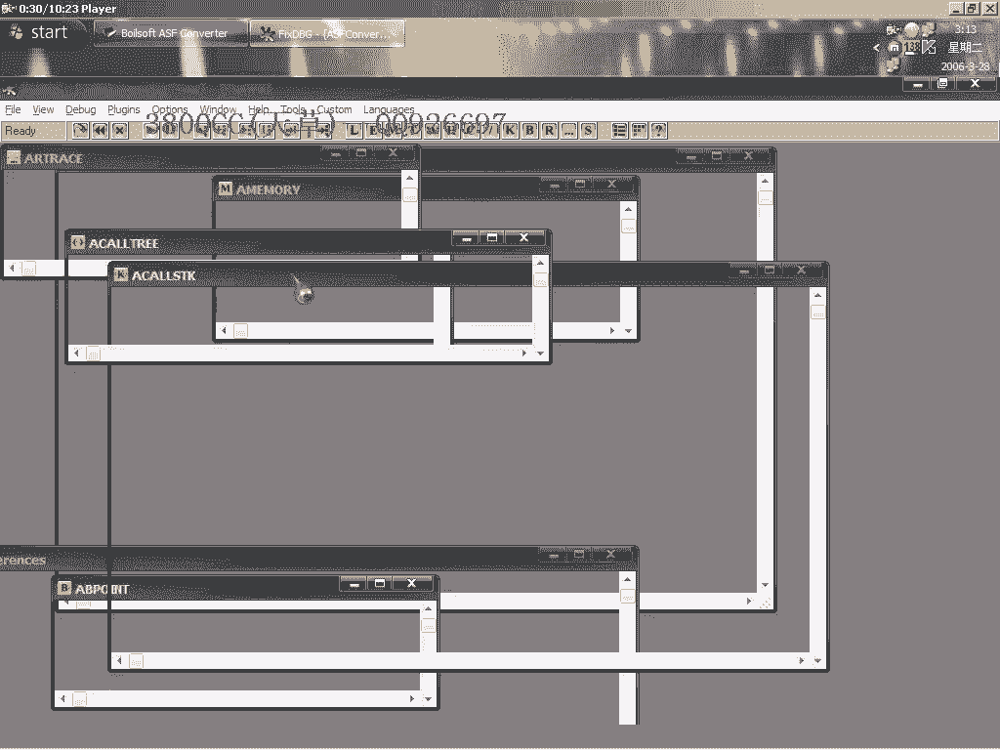
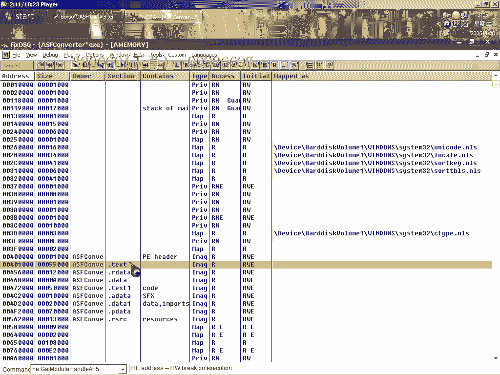

# 天草中级班 - P1：第01课 - 白嫖无双 🛡️

在本节课中，我们将学习如何对一个使用“穿山甲”3.x版本加壳的程序进行手动脱壳。课程将涵盖标准保护判断、绕过反调试检测、定位原始入口点以及最终修复与优化脱壳后文件的全过程。

---

## 判断保护模式

首先，我们需要判断目标程序使用的是标准保护模式还是最小保护模式。

以下是判断方法：

*   使用辅助工具进行检查。将工具指向目标程序。
*   观察工具提示。若显示为“标准保护”或“最小保护”，则说明是标准模式。
*   也可通过查看加壳软件本身的选项来确认其提供的几种保护类型。

确认程序为标准保护模式后，我们开始进行动态分析。

---

## 载入程序与初步分析

上一节我们确认了保护模式，本节中我们来看看如何在调试器中载入程序。

使用OD载入目标程序。载入后，观察进程列表。

*   如果OD中只显示一个主进程，说明这是一个单进程程序。
*   我们直接在程序入口点附近下断点，然后运行程序。

程序中断后，观察堆栈。堆栈中出现的特定返回地址通常是即将发生关键跳转的标志。找到第二或第三个这样的返回地址，就可能接近核心代码。

---

## 处理反调试与定位OEP

上一节我们尝试了直接下断点，但遇到了反调试。本节我们来看看如何绕过它。

直接下断点可能导致调试异常，例如提示“debug program was unable to process exception”，这表明程序检测到了OD。

以下是尝试的几种方法：

1.  **第一种方法**：在疑似关键跳转处下断点。尝试后，同样触发反调试，方法无效。
2.  **第二种方法**：采用国外高手常用的“二次断点法”。在程序处理导入地址表（IAT）的代码段附近下断点。具体位置是一个处理IAT的CALL之后。
3.  **执行流程**：
    *   先删除之前下的所有硬件断点。
    *   让程序运行，直到它处理完IAT。在这个时机下断点。
    *   中断后，需要将之前为了跳过反调试而修改的代码恢复原状，否则程序会检测到代码被修改并触发保护。
    *   恢复代码后，再次下断点，即可成功中断在理想位置。

成功绕过反调试后，继续单步跟踪。注意观察CALL指令。

*   计算器类的CALL通常与寄存器`ECX`和`EDX`有关。
*   如果看到`CALL ECX`或`CALL EDX`，可以尝试跟进。
*   通过单步执行，判断哪个CALL会跳转到程序的原始入口点。进入那个CALL后，即可到达清晰的OEP。

---

## 转储与修复程序

上一节我们成功定位了OEP，本节我们来完成脱壳和修复。

找到OEP后，第一件事是转储程序。无论脱UPX壳还是其他简单壳，这都是必须的步骤。

使用OD的脱壳插件进行转储。我们的OEP地址是 **`312A7`**。

转储后，使用修复工具进行修复。

以下是修复步骤：

1.  打开修复工具，加载刚转储出来的文件。
2.  在OEP处填入我们找到的地址：**`312A7`**。
3.  点击“自动查找IAT”，工具可能会提示发现一些“无效函数”。
4.  点击“获取输入表”，查看无效函数。
5.  点击“修复转储文件”，在弹出的保存对话框中，**注意不要勾选任何附加选项**。
6.  保存后，之前的无效函数数量可能会变化，直接点击“修复”即可。

修复完成后，关闭工具。运行修复后的程序，确认可以正常启动。

---

## 查壳与体积优化

程序虽然能运行，但我们还需要确认脱壳是否彻底，并优化文件体积。

首先使用查壳工具检查。

*   用PEiD查壳，可能会显示为“ASPack 1.x - 2.x”。这是因为穿山甲壳将入口点伪装成了ASPack的样式，这是PEiD的误报。
*   用更准确的工具FI查壳，会显示为“Microsoft Visual C++”，这表明已成功脱壳。

接下来优化文件体积。脱壳后的文件往往包含无用数据，体积较大。

以下是优化步骤：

*   使用区段编辑工具（如`SexyHUD`）。
*   需要对PE文件区段有一定了解。
*   在工具中，选择删除冗余的头部（HUD）和数据（Data）区段。
*   此方法在黑鹰破解课程中有详细讲解。
*   处理前文件大小为1.11MB，处理后约为540KB，体积减少一半以上，且程序运行正常。

---

## 关于破解的说明

本课主要聚焦于脱壳技术。对于程序本身的破解，只做简要提示。

该程序注册失败时会提示：“The code you have entered is inferior to the code”。

破解思路如下：

*   在OD中，通过字符串参考或错误提示框断点来定位关键判断代码。
*   由于在初级班课程中已经详细讲解过多种破解思路和方法，此处不再赘述。
*   鼓励大家运用已学知识，自行完成破解分析，以此作为练习。

---

本节课中我们一起学习了针对“穿山甲”3.x壳的手动脱壳流程。主要内容包括：判断保护模式、使用OD载入并分析、绕过反调试检测、精准定位程序原始入口点、使用工具转储并修复文件，最后还对脱壳文件进行了查壳验证和体积优化。希望你能掌握这个系统的脱壳方法。