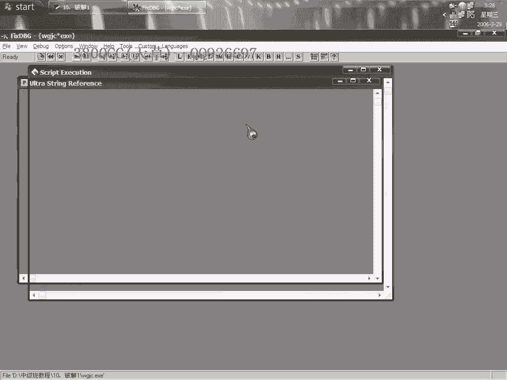
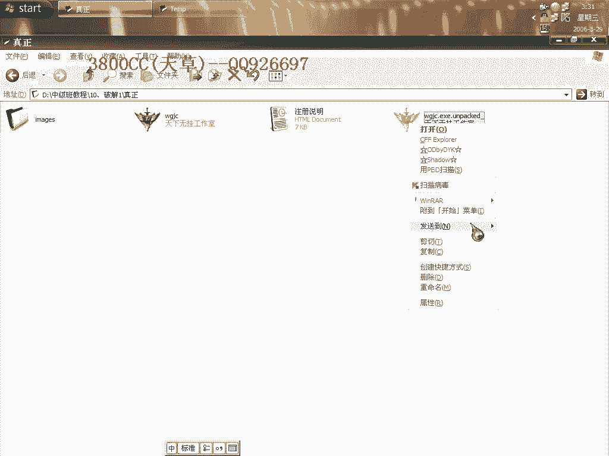
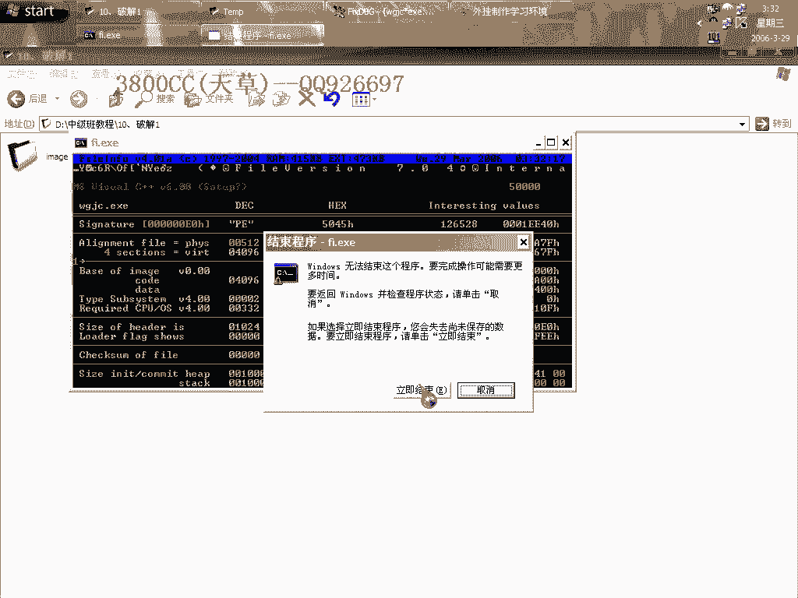
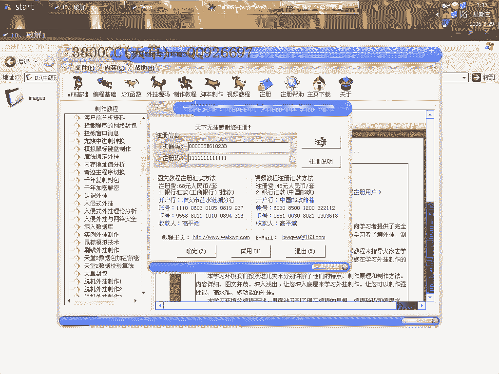
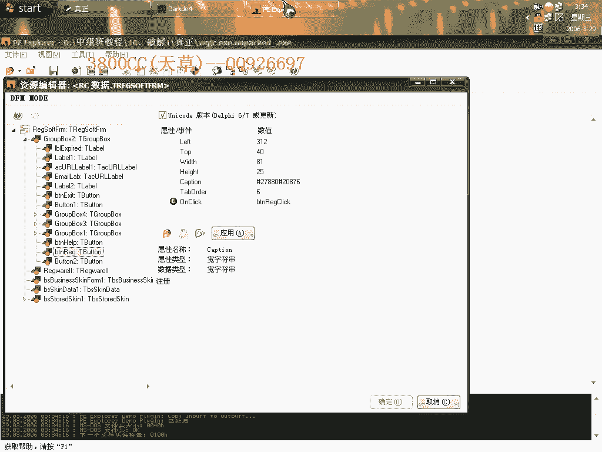
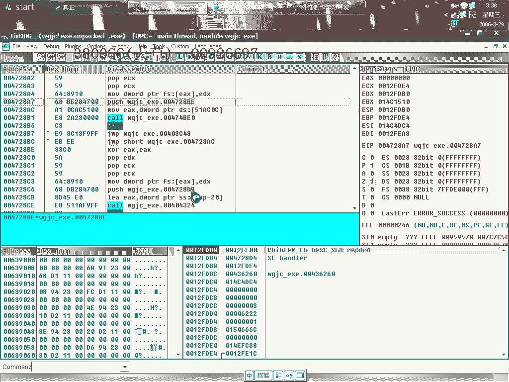
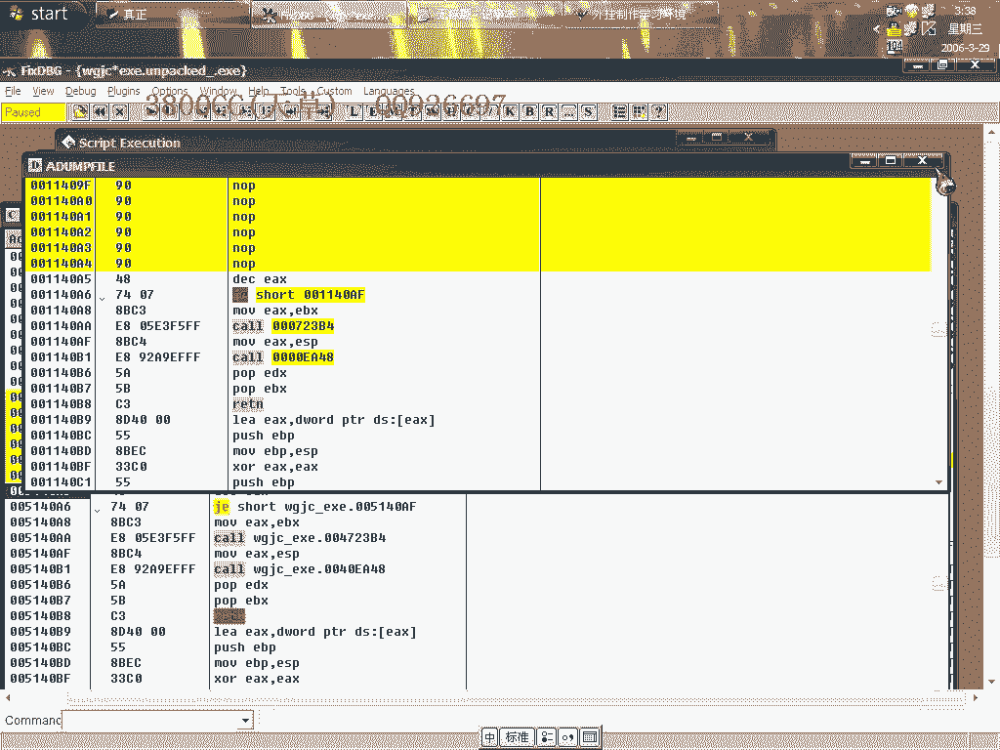

# 天草中级班 - P10：第10课 - 白嫖无双 - BV1qx411k7kd 🔍

在本节课中，我们将学习如何分析一个具有欺骗性质的软件，并揭示其“外挂”的虚假注册机制。我们将通过逆向工程实践，识别软件的真实结构，并学习处理此类“安装包”式程序的方法。

---

## 课程概述

本节课将分析一个伪装成外挂的软件。该软件表面显示注册成功，但实际上并未真正验证注册码，属于欺骗行为。我们将通过逆向工具，揭示其真实程序隐藏在临时目录中，并演示如何定位和修改其关键验证逻辑。

---

## 初步分析与误导

上一节我们介绍了课程目标，本节中我们来看看具体的分析对象。该软件启动后，表面显示已成功注册，注册码为 `我的注册码`。

使用查壳工具检查主程序，结果显示为“没有壳”。这通常是一个令人高兴的发现，但在此案例中，这恰恰是误导的开始。

---

## 发现真实程序

使用OD载入程序进行分析，发现无法找到关键字符串。这是因为主程序实际上是一个“安装包”或“打包器”。

真正的可执行文件被释放到了系统的临时目录中。以下是定位步骤：

1.  在软件运行时，进入系统临时目录（如 `%TEMP%`）。
2.  查找在软件启动时间点新创建的、可疑的可执行文件。
3.  将其复制出来进行分析。

退出软件后，该临时文件理应自删，但在此例中并未删除，这为我们提供了机会。

对复制出的真实程序进行查壳，发现其为 **UPX** 壳。我们可以使用OD的插件进行脱壳。

---

## 识别程序类型

为什么说原程序是一个“包”？有两个线索：

1.  **启动行为**：程序启动时，有明显的解压或释放过程。
2.  **文件信息**：使用查壳工具（如 `FI`）检查原程序，会显示类似 `Setup` 或安装程序的标识。

这是一种提示，说明它是一个安装包，会将真实程序释放到临时目录运行。

---

## 逆向关键验证逻辑

现在，我们对脱壳后的真实程序进行分析，目标是找到注册验证代码。

首先，我们尝试定位注册按钮的事件处理函数。使用辅助工具（如 `SPY++` 或 `Winspector`）查找包含“注册”文字的窗口。

找到注册按钮后，在OD中对相关API（如 `GetWindowTextA`）或按钮事件消息（如 `WM_COMMAND`）下断点。

程序中断后，单步跟踪，会来到验证逻辑处。这里会出现“注册码不正确”的提示，其附近通常有一个关键的条件跳转指令（如 `je` 或 `jne`）。

这个跳转决定了注册是否成功。我们分析堆栈和寄存器，可以找到程序用于比较的“真实验证码”。在本例中，发现它只是一个简单的固定值或机器名，并非基于用户输入的复杂计算，这证实了其欺骗性。

---

## 修改程序行为

既然验证是虚假的，我们可以通过修改关键跳转来绕过它。

1.  在OD中找到导致“注册失败”或“直接退出”的关键跳转指令。
2.  修改该指令（例如，将 `je` 改为 `jmp`），使其无论验证结果如何都跳转到成功流程。

修改后运行程序，虽然可能仍会显示“注册给：xxx”（如机器名），但软件的“试用”限制或弹窗已被去除。

然而，即使用户输入了从这个逆向过程中找到的“真实验证码”，软件本身的功能也并未真正解锁，这进一步证明该软件只是一个骗局。

---

## 核心技巧与总结

本节课中我们一起学习了如何分析和处理此类“打包”的欺骗性软件。以下是两个核心要点：

1.  **识别安装包**：对于启动异常或查壳信息显示为安装程序的软件，应检查系统临时目录（`%TEMP%`），寻找其释放出的真实可执行文件进行逆向分析。
2.  **处理启动弹窗**：对于程序启动时的骚扰弹窗，可以通过逆向找到其调用代码（通常是一个 `MessageBox` 或 `CreateWindow` 调用），并通过修改或NOP掉相关调用指令来去除它。

**总结**：本节课通过一个实例，演示了从识别欺骗性软件包、定位真实程序、逆向虚假注册验证到修改程序行为的完整流程。关键在于保持警惕，不轻信表面现象，并通过技术手段深入分析程序的真实行为。