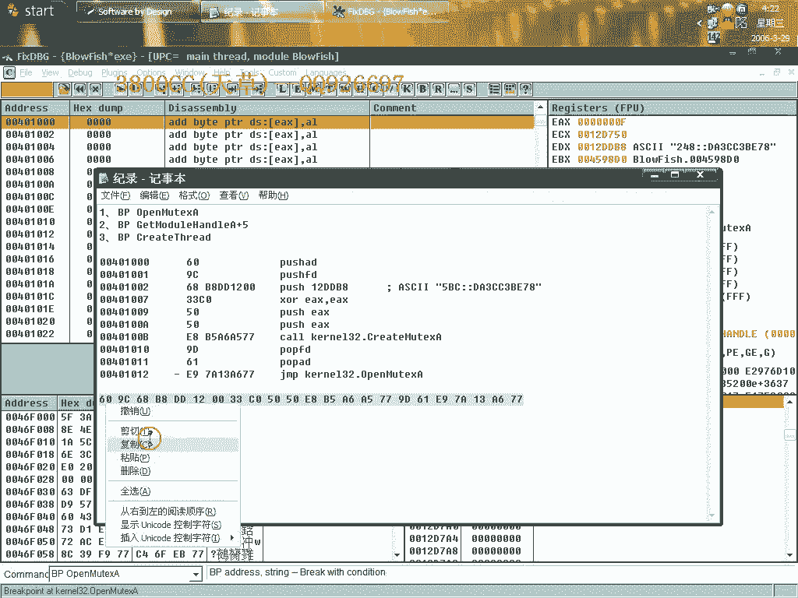
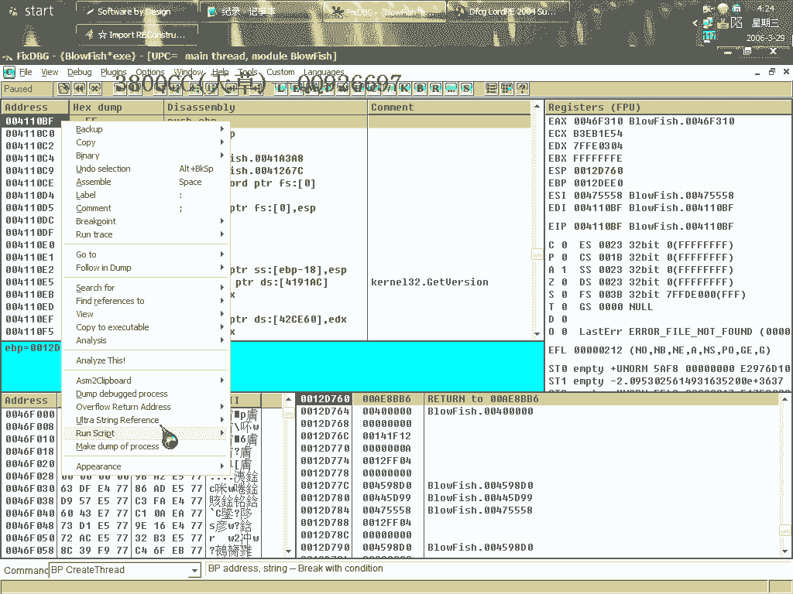
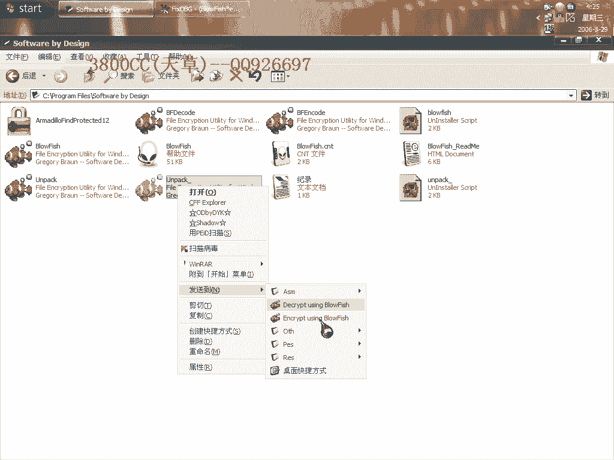
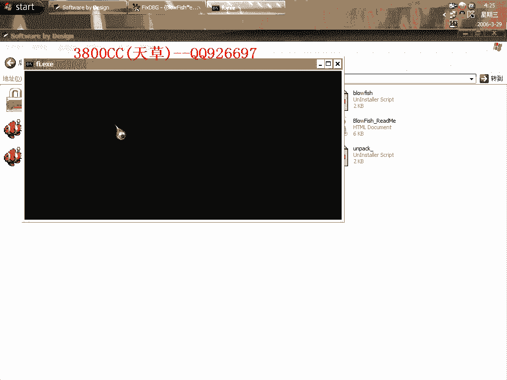
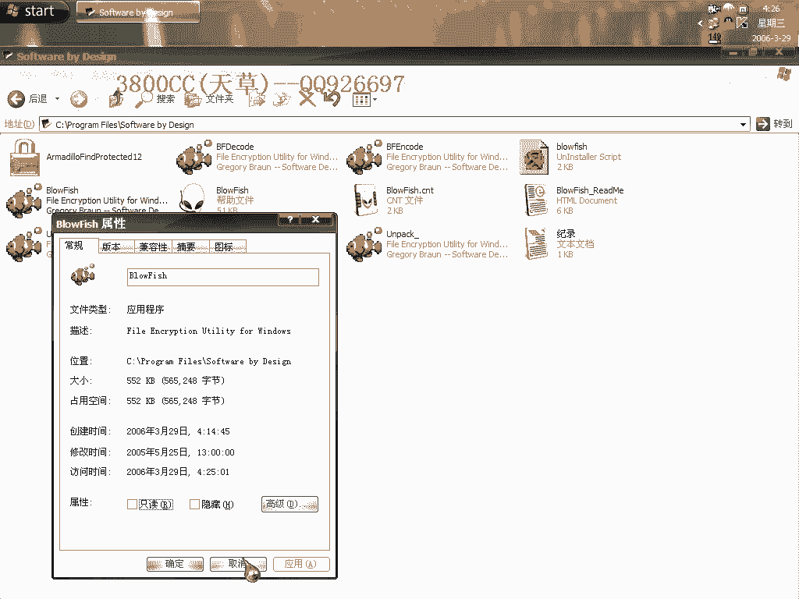
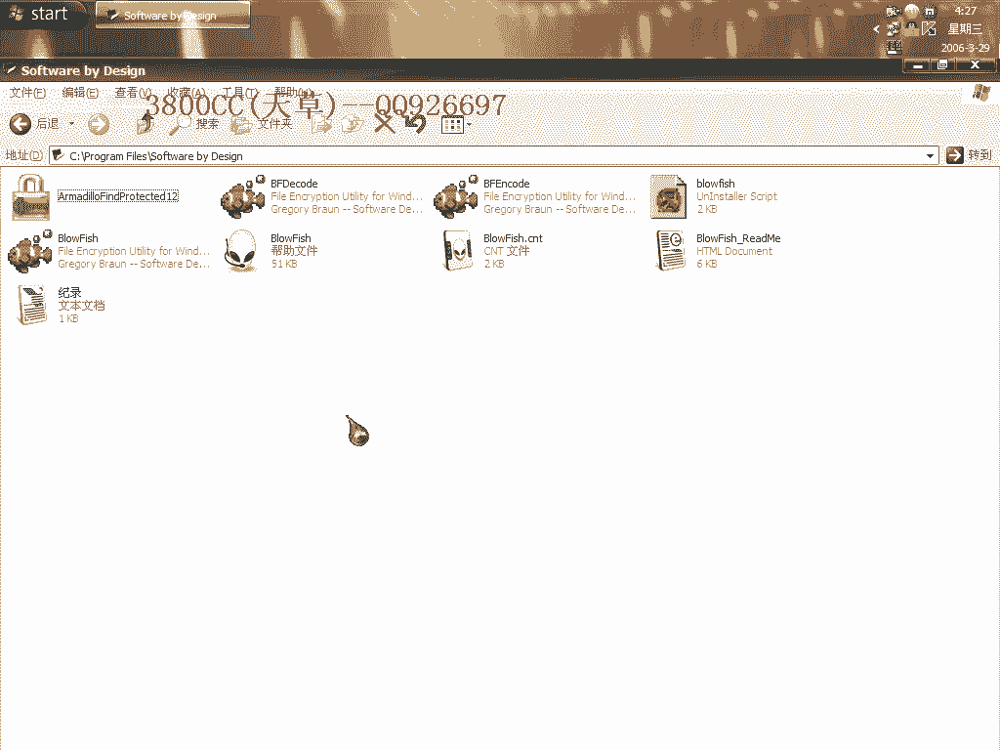

# 天草中级班 - P11：第11课 - 白嫖无双 - BV1qx411k7kd

这期课也是做一个穿山甲的课，这个是双进程标准版的，我们现在启动看一下，大家看有两个一样的进程，我们来用这个工具来查一下，它这三个文件，一个是解码，一个是编码的工具，都是这个课，我只拿这个做一个演示。

其他大家都自己试一下，可以载入这两个，另外两个看一下，都一样的，它们是同类型的课，我们废话不多说，我们要用到这三个段点，大家应该知道它有两个进程。

一个是负进程，一个是子进程，那就是说我们即使处理好了IoT，到了最后要修复的时候，选择哪一个呢，那我们这第一步用的这一个段点，就是把双进程转换为单进程，这个时候下好段点之后，然后shift+F9。

中断下来，中间要是碰到异常的话，大家自行在这个里面，添加最近的异常，把它添加进去就可以了，这个时候中断下来不要取消段点了，我们004010000到这里来，然后写上这一行代码，注意啊，这些代码。

这几行代码是除了一处。

是不一样的之外，其他都一样，就是这个位置的12DDB8，就是这里的12DDB8，每一台机上都不一样，这个要注意，你那里是什么就换成什么，其他都不要变，就换这一个，好，不多说了，就这里要注意。

然后右键再次新建EIP，然后F9，再次中断下来，这个时候取消段点，然后在Country家居来到这里，好，然后撤销，选择，这个时候下这个段点，下这个段点，好，那Shift+F9，再来看对战，看对战，好。

好，这里，发现这个了之后啊，就是说明很快到那个返回时机了，再过一会儿，再一下，这里就是返回时机了，就是过了刚才那两个标志之后，就是返回时机，好，取消段点，Alt+F9，改成这样，好，下这个段点。

下这个段点，中断下来之后取消段点，然后Alt+F9，打不走啊，这里有一个Core UDI，我们右键F7进去，大家看到这变红色，为什么是红色，这就是那个，创生甲解码，创生甲解码之后的。

大家看到只有一个进程了，右键，修复了啊。

有八个无效全部减掉，我不是给改动了吗，大家来看一下，可以运行，然后用PID来查呢，最远是还是一点叉叉，二点叉叉的，我们用F5来查。

他居然跑到右键来了，真够烦的。

那咱们来载入一下，这个夹克的，这个脱壳后的，大家看这个特征，看这个路口特征，VC++的一个特征，是VC++5。0的特征，至于破解的话，破解大家自己去破，自己去破，这个有一个简单的破解方法，大家自己破。

我再给大家讲吧，再来看一下吧，还是看一下这个体积的问题，他这里呢，有888K，原程序呢，是552K，那我们用这个来减肥。

减这个啊删掉，删掉，OK保存。

保存啊，再来看一下，还是可以运行，再来看一下原程，248K，减了三分之二多了，这个就是说，擦身夹克有这么几个版本，还是说一下，一个是标准版，他这是非标准版，然后再就是，非标准版都是双线程的。

然后标准版里面有单线程和双线程，我这个今天讲这个是标准的，非标准的双线程，后面会给大家讲到，非标准的双线程的脱发，这个脱发比较麻烦一点，至此呢，穿甲的三种类型，三大类型，已经讲了两大类型了。

大家自己下去，把这三个都脱一下，这三个都脱一下。

破解也要自己弄一下，再见。