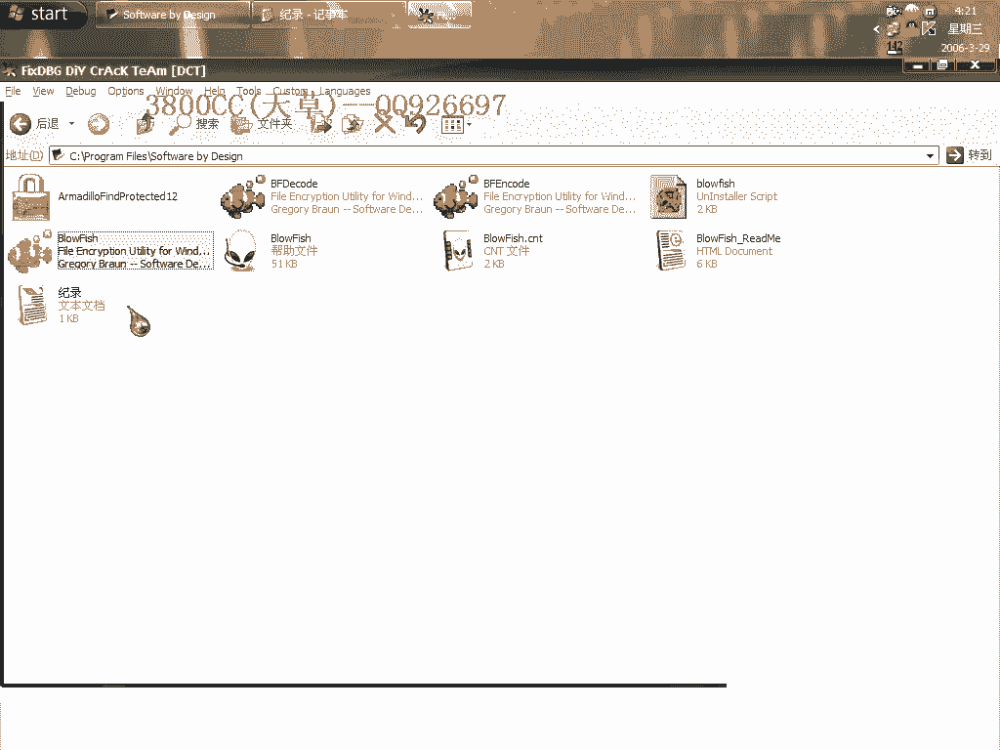
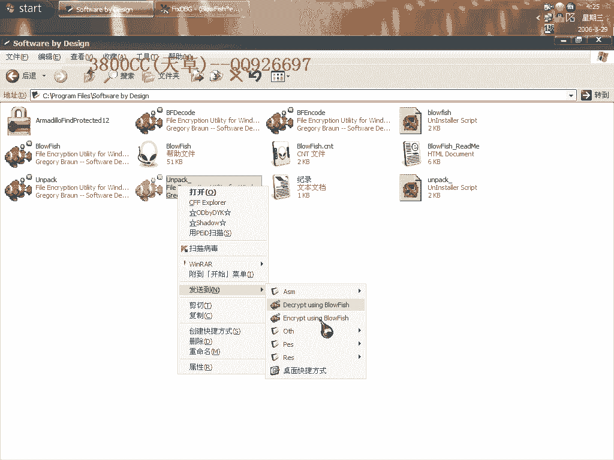
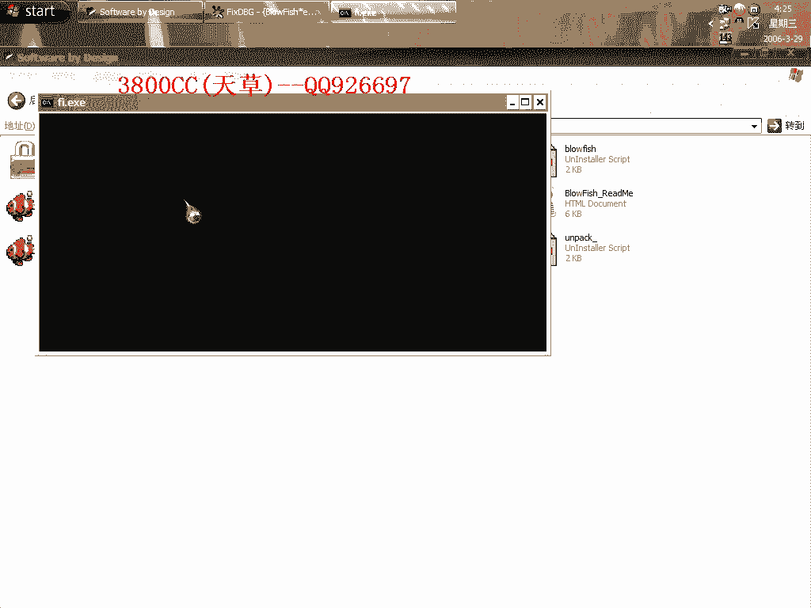
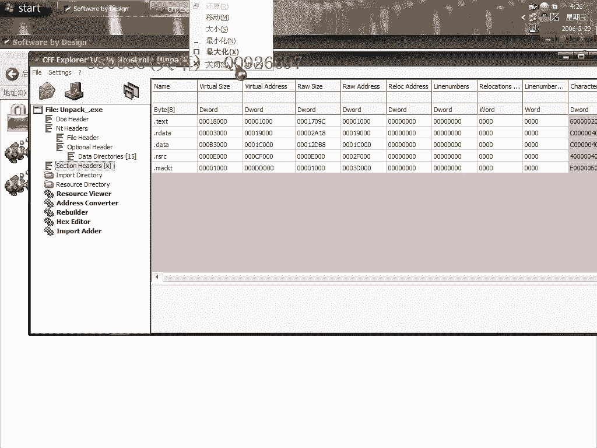

# 天草中级班 - P11：第11课 - 白嫖无双 🛡️➡️📦

在本节课中，我们将学习如何对一款名为“穿山甲”的双进程标准版加壳程序进行脱壳处理。我们将从识别双进程开始，逐步将其转换为单进程，最终完成脱壳并修复程序，最后还会涉及程序“减肥”的优化操作。

---

## 课程概述

本节课演示针对“穿山甲”双进程标准版加壳程序的脱壳流程。我们将使用特定断点将双进程合并为单进程，找到解码后的原始入口点（OEP），并进行修复与优化。



---

## 第一步：识别双进程并设置断点

启动目标程序后，可以观察到存在两个相同的进程。这是双进程加壳的典型特征。

以下是操作步骤：

1.  使用工具检查程序文件。本课涉及三个文件：一个解码工具、一个编码工具以及演示程序。它们属于同类型加壳程序。
2.  我们需要使用三个关键断点。首先设置第一个断点，其作用是将双进程转换为单进程。
3.  设置好断点后，按下 `Shift + F9` 运行程序直至中断。如果中途遇到异常，请在调试器中添加该异常并忽略。


---


## 第二步：写入转换代码

中断后，不要取消断点。跳转到地址 `00401000`，并写入一行特定代码。

**请注意**：以下代码中，仅有一处地址 `12DDB8` 需要根据你本机的实际情况进行修改，其他部分保持不变。

```assembly
// 此处代码示例，关键地址需替换
mov eax, [12DDB8] // 将 12DDB8 替换为你本机调试时看到的实际地址
```


写入代码后，右键选择“新建 EIP”以设置新的执行点，然后按 `F9` 继续运行，程序将再次中断。

---

## 第三步：定位返回时机并设置新断点

现在可以取消第一个断点。使用 `Ctrl + G` 跳转到指定地址，并撤销之前的代码选择。

以下是后续操作：

1.  设置第二个关键断点。
2.  按下 `Shift + F9` 运行并中断，此时观察堆栈。
3.  在堆栈中发现特定数据时，意味着即将到达返回时机。继续执行一次，当经过两个特定标志后，便是正确的返回时机。
4.  取消第二个断点，按 `Alt + F9` 执行到返回。

---


## 第四步：进入解码区域并修复程序

到达返回时机后，设置第三个断点。中断后取消该断点，再次按 `Alt + F9` 执行。

此时会遇到一个 `CALL` 指令，右键选择“步入”（`F7`）进入。你会发现代码区域变为红色，这标志着“穿山甲”壳的解码已完成，我们已进入原始程序代码区，并且进程已合并为单个。

现在可以对程序进行修复：



1.  右键选择“使用 OllyDump 脱壳调试进程”。
2.  在脱壳窗口中，点击“获取 EIP”作为 OEP，然后点击“脱壳”。
3.  保存脱壳后的文件。




---

## 第五步：验证与优化

运行脱壳后的程序，确认功能正常。可以使用进程查看工具检查，确认已变为单进程。

载入脱壳后的文件，观察其入口特征，例如显示为 `VC++ 5.0` 编译的程序特征。关于破解方法，本课暂不深入，学员可自行研究。

接下来进行程序“减肥”以优化体积：


1.  观察脱壳后程序体积（例如 888KB）与原程序体积（例如 552KB）的差异。
2.  使用编辑工具删除文件末尾的冗余数据（通常是壳的残留数据）。
3.  保存修改后的文件。




再次检查，程序应仍可正常运行，且体积显著减小（例如从 888KB 减至 248KB）。


---

## 课程总结

本节课中，我们一起学习了“穿山甲”双进程标准版加壳程序的完整脱壳流程。

我们首先识别了双进程，通过设置断点将其转换为单进程，然后定位到解码后的原始入口点并完成程序修复与转储，最后还对程序进行了体积优化。

“穿山甲”壳主要有几种变体：标准版（含单/双线程）和非标准版（多为双线程）。本节课演示的是标准双线程版的脱壳。非标准版的脱壳方法更为复杂，将在后续课程中讲解。


至此，“穿山甲”壳的三大主要类型已讲解两种。请学员课后自行练习本课涉及的三个文件，并尝试完成破解步骤。

