# 天草中级班 - P12：第12课 - 白嫖无双 - BV1qx411k7kd

现在来拖一下这个壳。

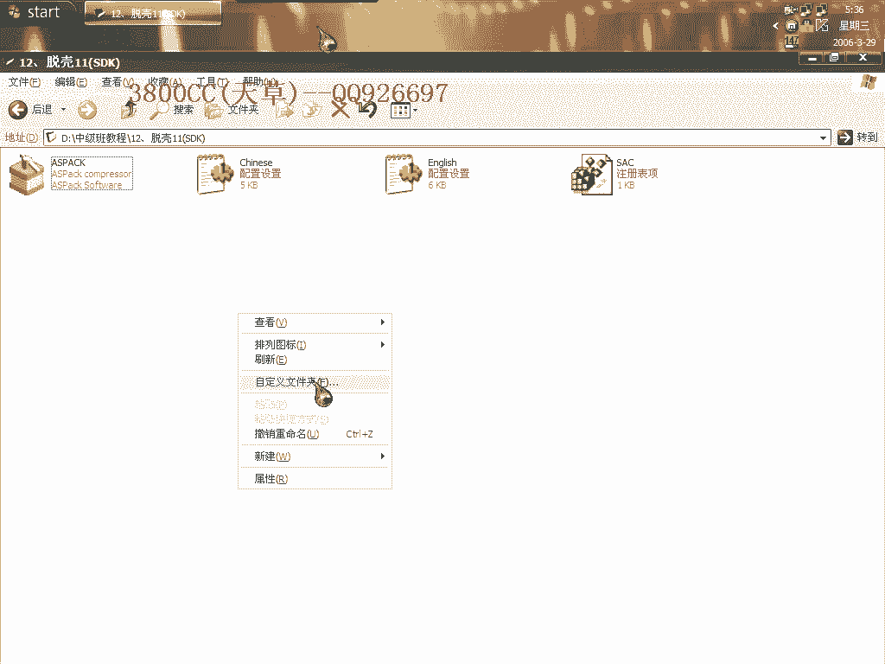

这个aspire2。12的一个壳。

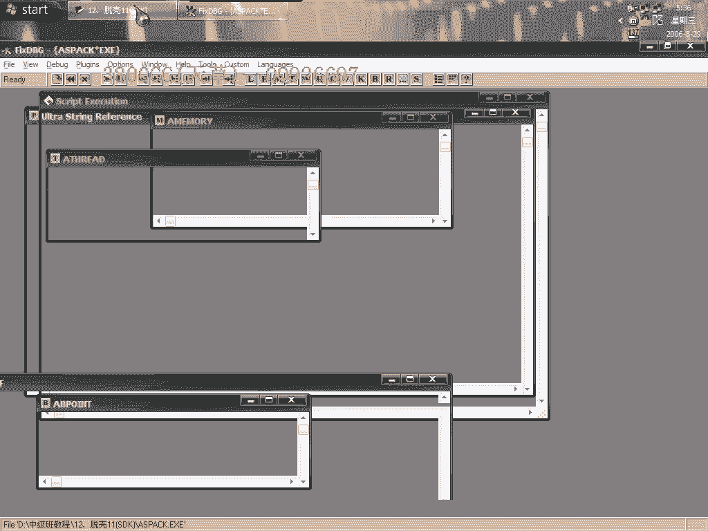

它加的一个是aspire1。22这个，因为像asprotect这个壳的话，即使我们能够成功的拖掉它的话，但是人员还是有一些问题的，关于一些交易啊什么之类的，那我们今天就来看一下。

首先忽略内存访问异常和异常，我们来看一下，直接来到最后一次异常，这里啊不是，这里也不是啊，这里这个和1。23RC是有点相似，它这个呢是一个XOR然后两个接1，再加上了一个jump。

我们呢就直接到了最后一次异常之后，直接在这个0040100这个区段，一下f2断点，稀有的叫f9运行，分析一下，大家看这个非常非常奇怪啊，等一下看一下是什么语言写的，这个知道了，现在来修复了。

我用这个来试一下。

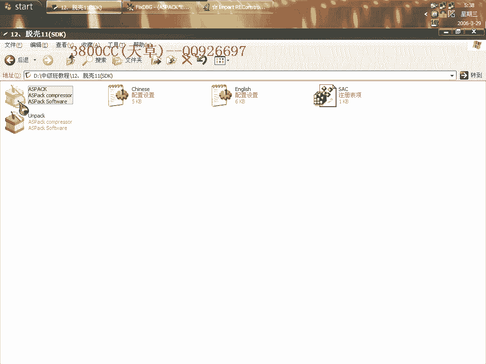

试一下发现不行，因为它这个家可有点特别。

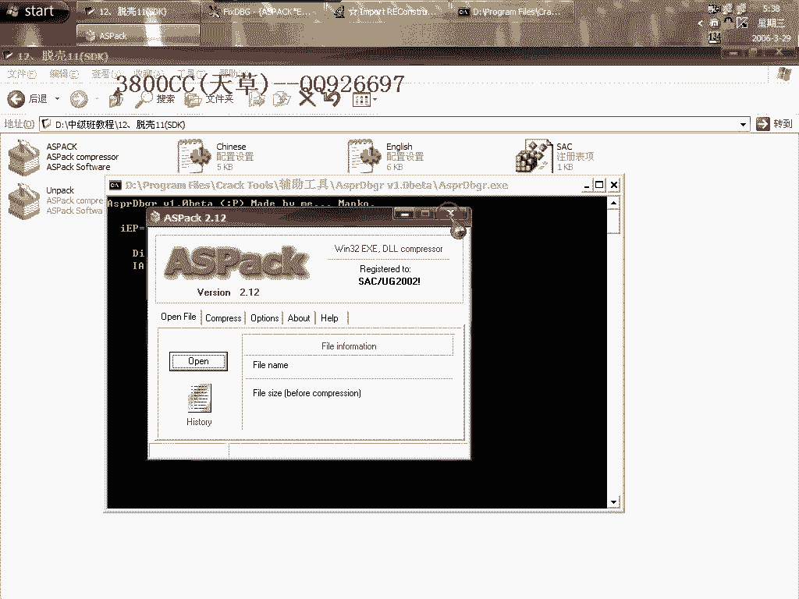

用了SDK的一点功能，就是用了ASP的第一版本的，第一版本的SDK，跟这个现在跟现在那个SDK是不一样的，现在的SDK是指，就像你们那个教程加密的那种，需要就是绑定硬件的那种，那种现在叫做SDK。

它这个就是说SDK只是说最基础的，最基本的一种SDK，因为可的发展，首先是一些比较简单的一些可，到现在就慢慢就是说开始对，ITR API进行处理，最基础的对API处理的技术叫做SDK，这个要区别开。

我们用等级，还有八个，还有八个我们用插件，用先用这个1。2X这个试一下，不行啊，然后再用1。22的，用1。22的可以，现在来抓取，大家看到啊，有错误，有错误，这个我们用这个，已经修复完全了，修复完全了。

但是还是有错误，那就是说它有交厌了，这个不叫自交厌，这个叫可的交厌，我们来找可的交厌，一个基本的方法是，首先设异常，异常要设置好，异常啊，这两个也是忽略这两个，一般是忽略这两个，直接运行，这个样子啊。

没有任何错误提示，但是程序运行不起来，好我们这个样子在这里，返回到，选这个返回到，是程序的返回到啊，大家看到这个地址是程序，这是系统的灵控啊，我们右键返回边缘跟随，我们找到上一个口啊，就是这里出错。

就上这个口出错了，这个口出错，好大家，我们现在对照一下原程序，控制家居啊，来到这里看一下，我们按它，大家看到看到，他这里给了就是这个13435A8和灵机性比较，然后呢，这个按道理说是没有跳的。

没有跳按道理没有跳，没有跳的话，他给这个1343，我们可以这个样子的看，不用不用这样来分析了啊，看着家居啊，大家看到这么一个地址啊，这么一个地址，也就是说他返回返回的通过返回就是返回到这个地址。

那我们来看一下现在脱壳后的程序，没有按的按键板上的按的也跟随不进去，那就说明这个地址有问题了，那我们在地底看一下这个地址，这个是指向壳啊，指向壳，但是壳我们已经脱了。

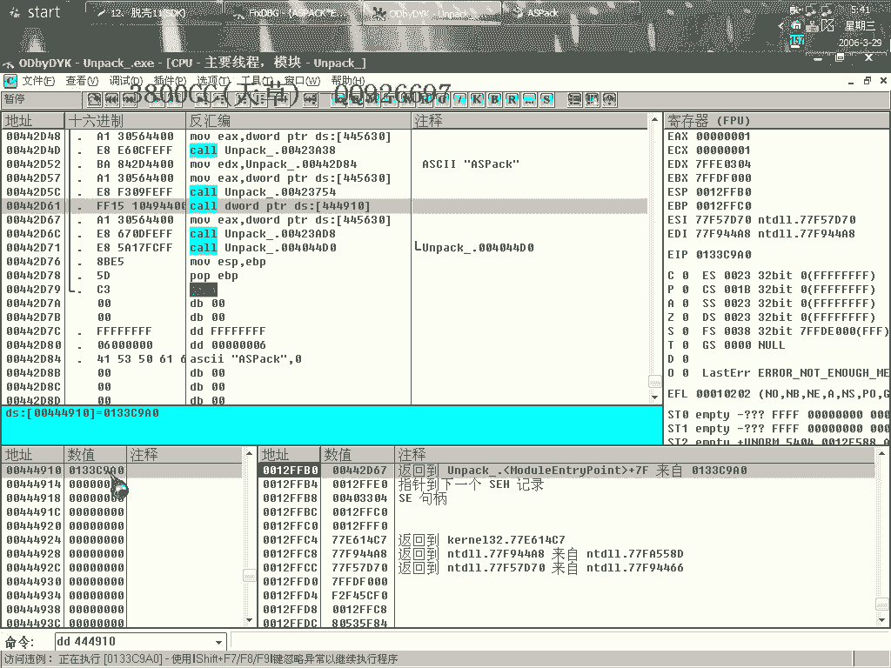

所以我们需要把它改成程序的，好这个时候呢，复制，好现在打开。

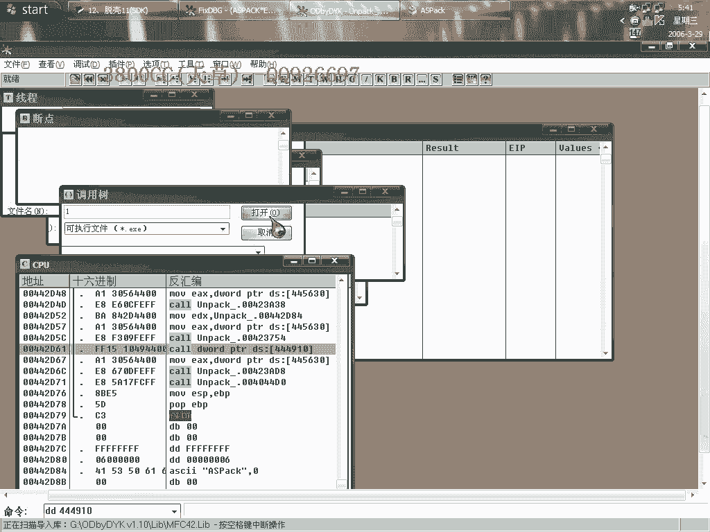

这个异常人员是这样的保持不变，再一次，这会是这么一个地址啊，也是指向了壳啊，也是也是指向了壳，所以我们就改成133这么一个地址啊，返回边走边随，好在这里，我们来看一下，地地啊，这里有地底。

到这里看一下吧，我们在对比原程序，对比原程序，我们人员也是进去看一下啊，好我们来看一下跟随进去，这里是rent啊，rent，那我们就在这个程序里面啊，找一个rent吧，找一个rent。

这里是一个rent啊，好那我们就把这个地址改成rent了，00401234。

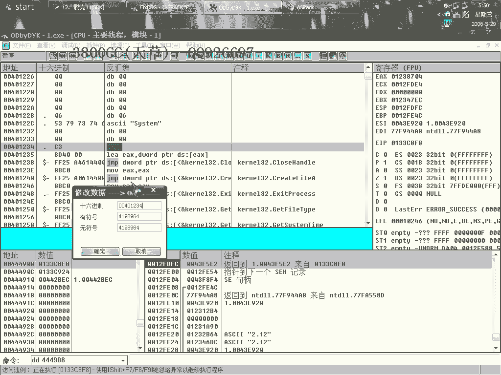

保存。

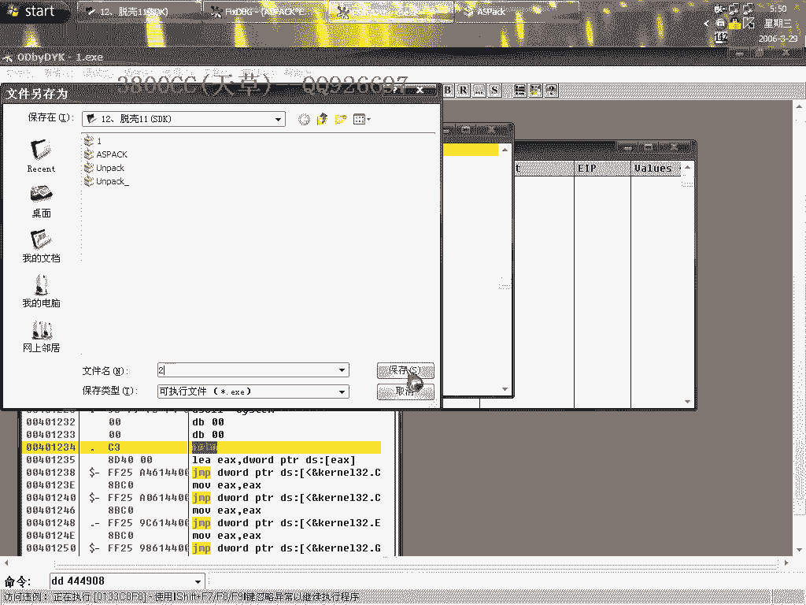

现在来转入啊，同样啊。

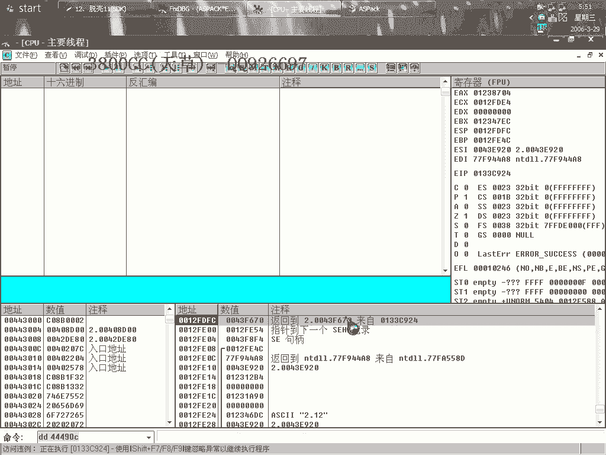

这次来到这里啊，我们看一下这个地址，看一下原程序的，也是按键盘按进去，这个同样也是按的啊，同样也是按的，我们同样，把这个地址也改成rent，同样改成上面的一样啊，00401234。

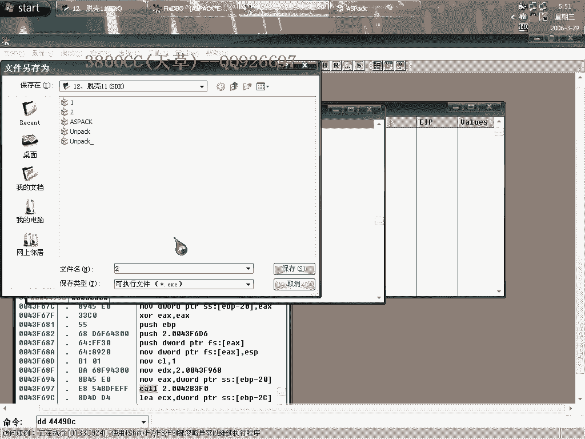

大家再来看一下啊，可以运行了啊，大家可以这个关于这个破解啊，关于这个破解，这个大家自己下去，下去再试一下下去再试一下。

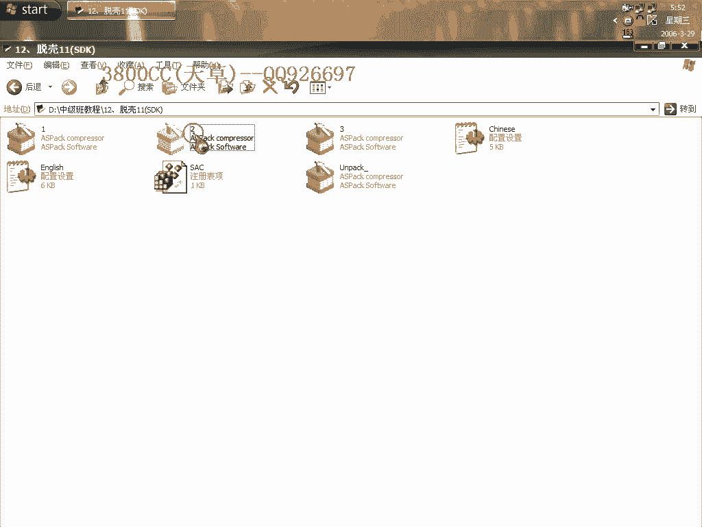

哎删错了。

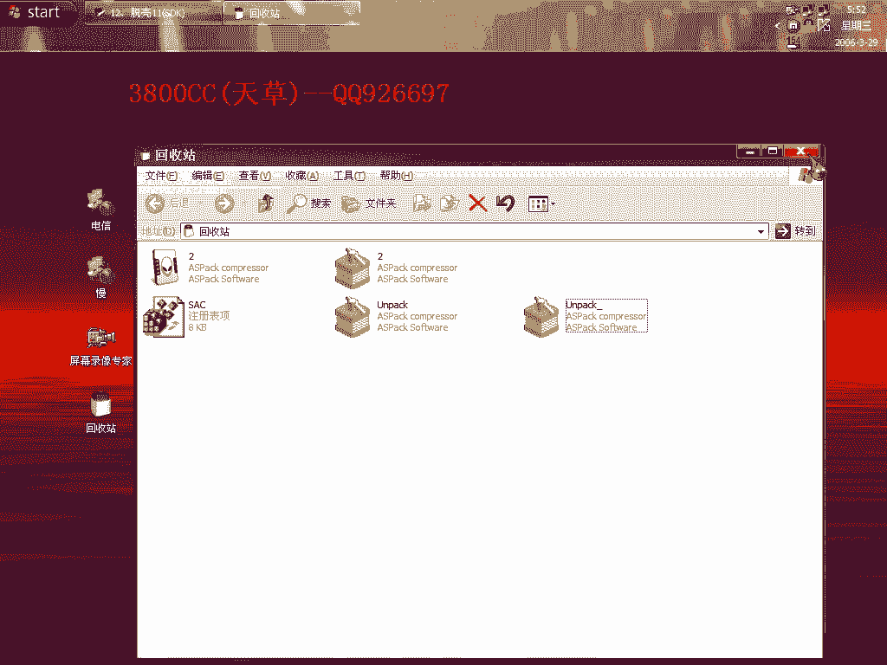

这一课的主要目的啊，就是说锻炼大家，怎么去修复壳的焦炼啊，修复壳的焦炼。

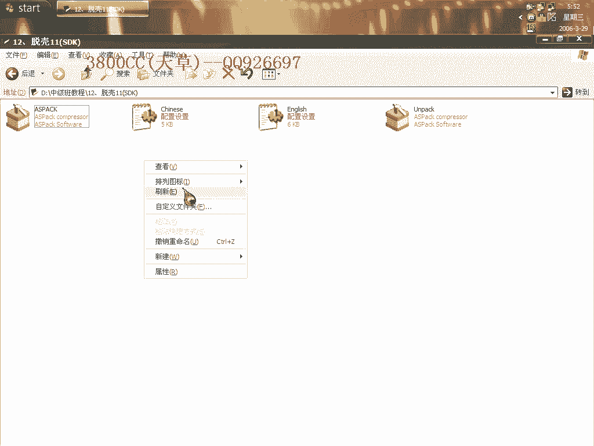

当然我们这里提供的只是一种思路而已，提供的只是一种思路，这个要大家自己去，研究吧研究，后面当然也会也会给大家讲到啊，好再见。

