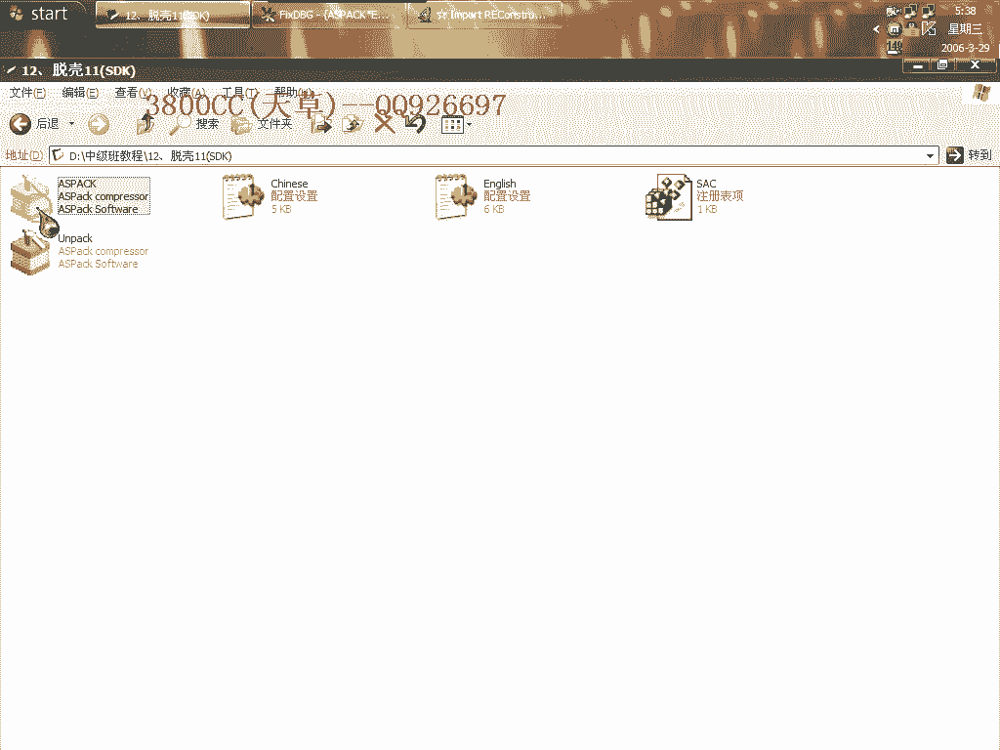
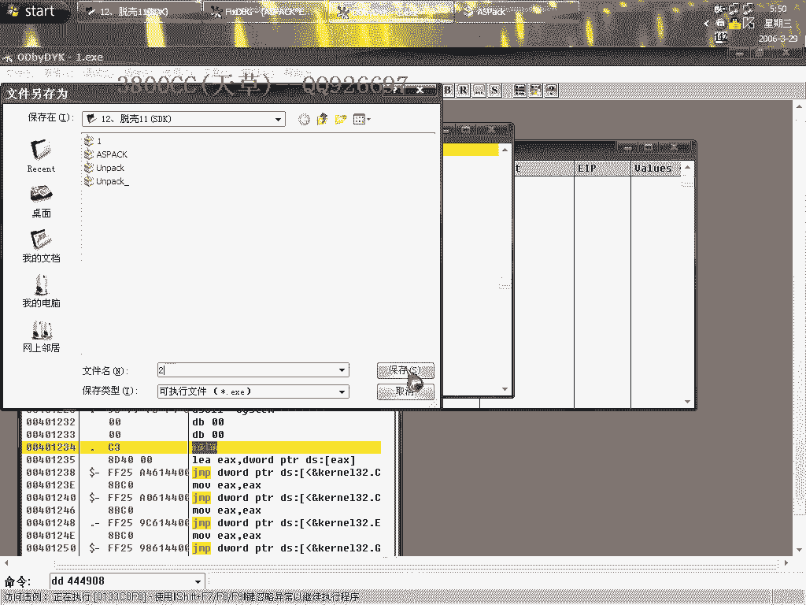
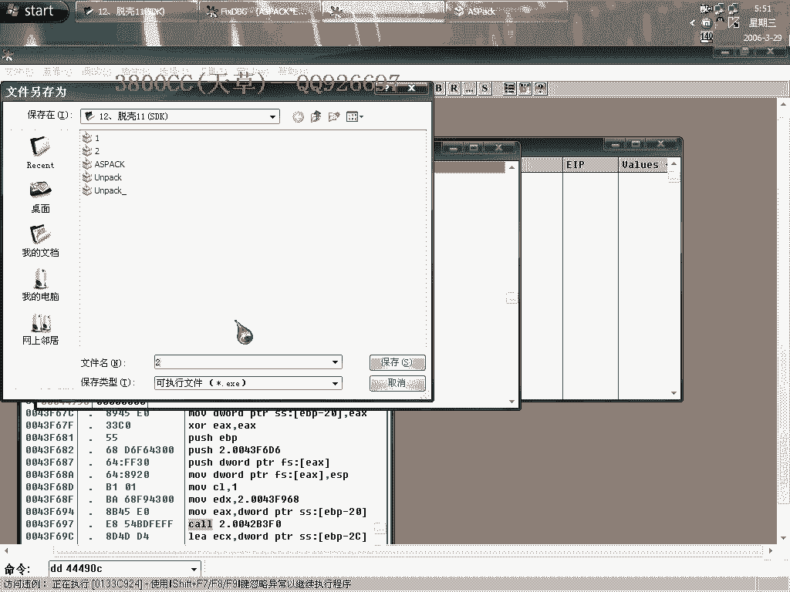
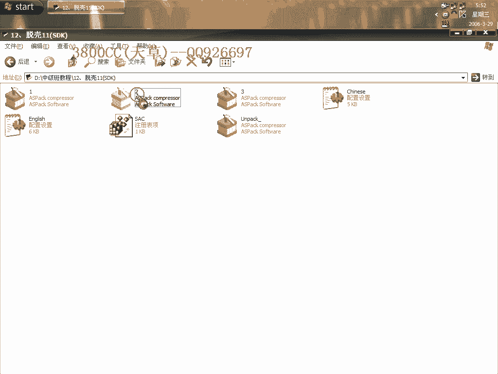
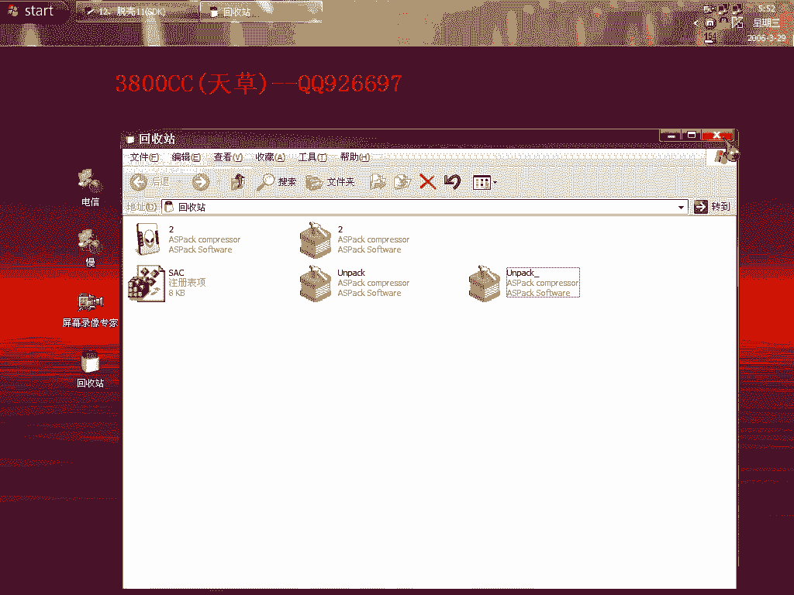
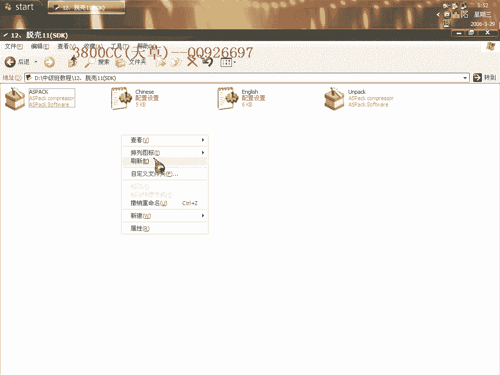

# 天草中级班 - P12：第12课 - 白嫖无双 - BV1qx411k7kd 🔓

在本节课中，我们将要学习如何对一个使用Asprotect 1.22版本加壳的程序进行脱壳，并重点解决脱壳后程序因“壳的校验”而无法正常运行的问题。我们将通过实践操作，掌握定位和修复壳校验的基本思路与方法。

---

## 开始脱壳操作

现在来拖拽这个壳。这是一个名为“aspire2.12”的程序。

它实际上加的是Asprotect 1.22这个版本的壳。对于Asprotect这类壳，即使成功脱壳，程序仍可能存在一些问题，特别是关于一些校验。本节课我们就来具体处理这些问题。

首先，在调试器中设置忽略所有内存访问异常和其他异常。然后，我们直接运行程序，让其触发异常并来到“最后一次异常”处。这里的代码结构与1.23RC版本有些相似，其特点是包含一个`XOR`操作，后接两个`JE`指令，再加上一个`JMP`指令。

我们直接来到最后一次异常之后，在程序的原始入口点`00401000`处下一个断点（按`F2`），然后按`F9`运行到该断点。分析代码时发现情况有些奇怪。我们先查看程序是用什么语言编写的，确认后开始进行修复。

---

## 尝试使用插件修复

我尝试使用一个修复插件。

但发现不行，因为这个壳有些特别。

它使用了早期版本的SDK功能。这里需要区分一下：Asprotect早期最基础的API保护技术被称为SDK，这与现代需要绑定硬件的“SDK”概念不同。壳的发展是从简单保护，逐步演进到对API进行处理，最基础的技术就是这种SDK。

我们使用插件，先用针对1.2X版本的插件尝试，不行。然后再用1.22版本的插件尝试，这次可以了。现在开始抓取进程并转储（Dump）程序。

---

## 处理脱壳后的错误

转储完成后，程序运行有错误。这个错误并非程序自身的校验，而是“壳的校验”。我们需要找到并修复它。

一个基本的方法是：首先设置调试异常选项，通常忽略内存访问异常和其他异常，然后直接运行程序。此时程序没有任何错误提示，但也无法正常启动。

我们在代码中找到一个出错的调用（CALL），右键选择“返回到调用者”。可以看到返回地址指向了系统领空。我们继续向上查找，找到上一个调用（CALL），就是这里出错了。

---

## 对比分析并修复

现在，我们对照原程序（加壳状态）进行分析。在原程序中，跟随这个出错的调用地址，可以看到代码逻辑。例如，有一条指令是将`13435A8`与零比较，正常情况下不应该跳转。

在脱壳后的程序中，这个调用地址无法正确跟随，说明地址有问题。在数据窗口中查看这个地址，发现它指向了已被脱掉的壳代码区域。

因此，我们需要将这个地址修改为指向脱壳后程序自身的正确地址。复制正确的地址。

打开脱壳后的程序文件进行修改。保持异常设置不变，再次运行。程序会来到另一个类似的问题地址，同样指向壳区域。

我们将其修改为程序内的一个有效地址，例如`133xxxx`。然后返回边缘跟随，来到修改后的地址处。为了找到合适的替换地址，我们在程序代码段中搜索一个常见的指令，比如`RETN`。假设我们在`00401234`找到了一个`RETN`指令。

于是，我们将之前出错的调用地址都修改为`00401234`，然后保存文件。

---

## 验证修复结果

现在再次载入修复后的程序。

程序运行到之前出错的位置。我们对比原程序，发现原程序此处也是一个调用（CALL）。我们同样将脱壳程序中的这个地址修改为之前找到的`RETN`地址`00401234`。

修改完成后，大家可以看到，程序现在可以正常运行了。

关于程序本身的破解部分，需要大家课后自行尝试和研究。

（操作失误，删错了某些内容）

---

## 课程总结 🎯

本节课的主要目的，是锻炼大家如何修复脱壳后遇到的“壳的校验”问题。我们提供了一种通过对比分析、定位错误调用并将其重定向到程序内部有效地址的修复思路。

当然，这里提供的只是一种思路。这需要大家自己去深入研究和实践，后续课程中也会继续讲解相关内容。

本节课中，我们一起学习了针对Asprotect 1.22壳的脱壳后校验修复流程，掌握了基本的故障定位与地址修复方法。