# 天草中级班 - P13：第13课 - 白嫖无双 - BV1qx411k7kd

聲音調一下，這個我們來進行第十三課，第十三課也是托克，這是一個什麼外掛啊，他有什麼啊，有些目錄才可以用，所以這個我就不破解了，不破解了，只托克，然後這裏呢，是Ace ProTech的。

我們來確定一下到底是。

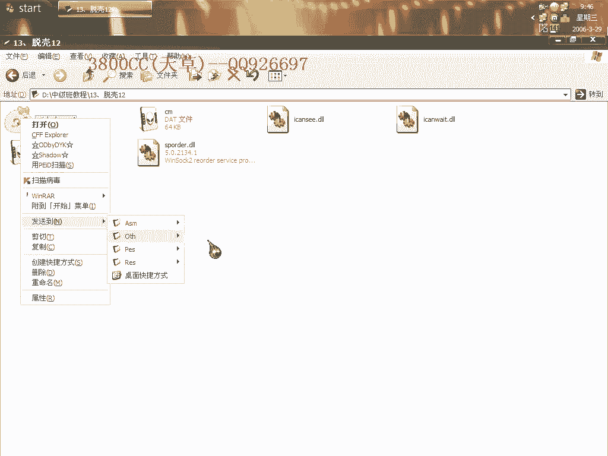

具體是哪一個版本的，好1。35的。

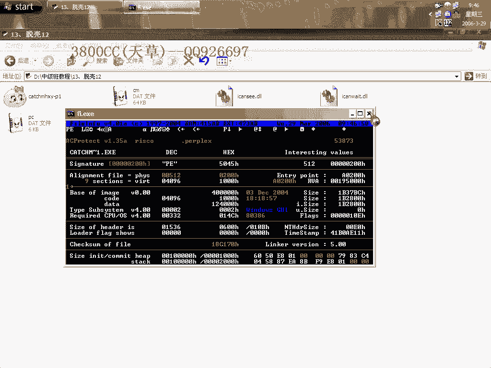

我這裏在講他的目的就是說，給大家介紹幾種方法，幾種方法，可以到達OVP的。

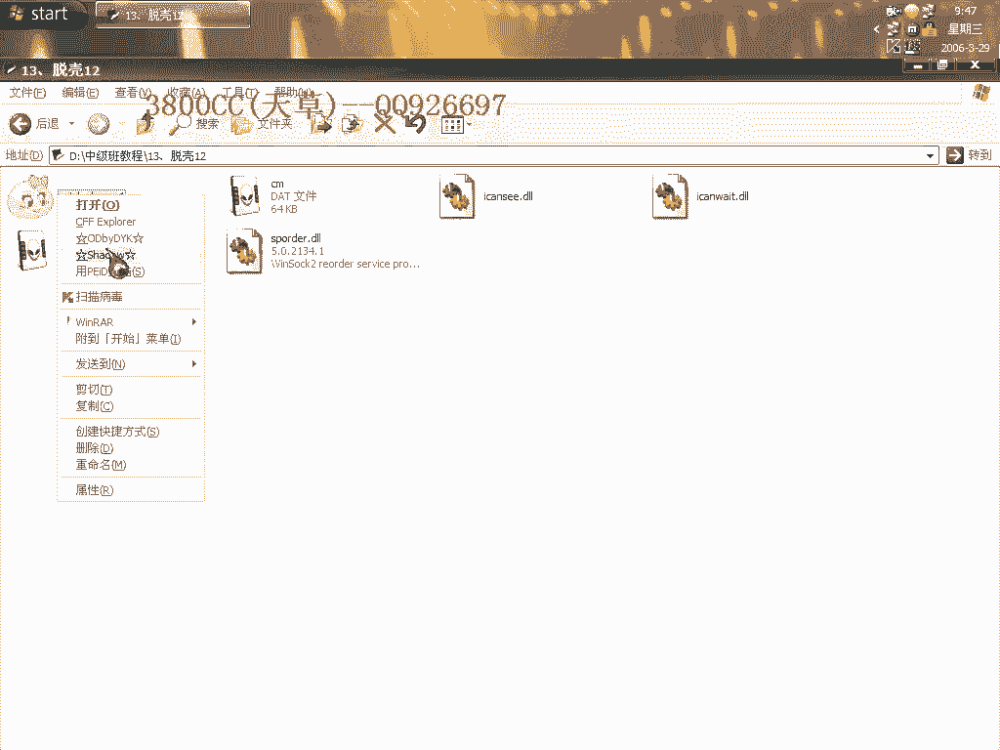

好，首先第一種，我們在前面說的。

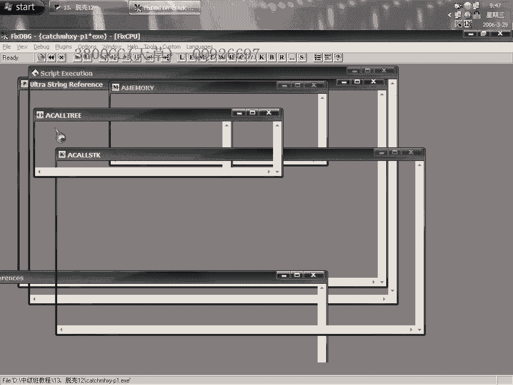

是設置，忽略內存訪問異常和指定異常之後，然後再隱藏一下OD的，我們來看一下這個行不行，不行的，這個不行，不行的話，我們就用，Intel三星的，Intel三星的端點，好像是，是我這個插件。

插件這裏設置有問題，這裏，我們還是來看一下，看一下這個，忽略內存訪問異常的，好，這樣可以，可以就是說到達最後一次，內存訪問異常，我們就轉成，好這樣。

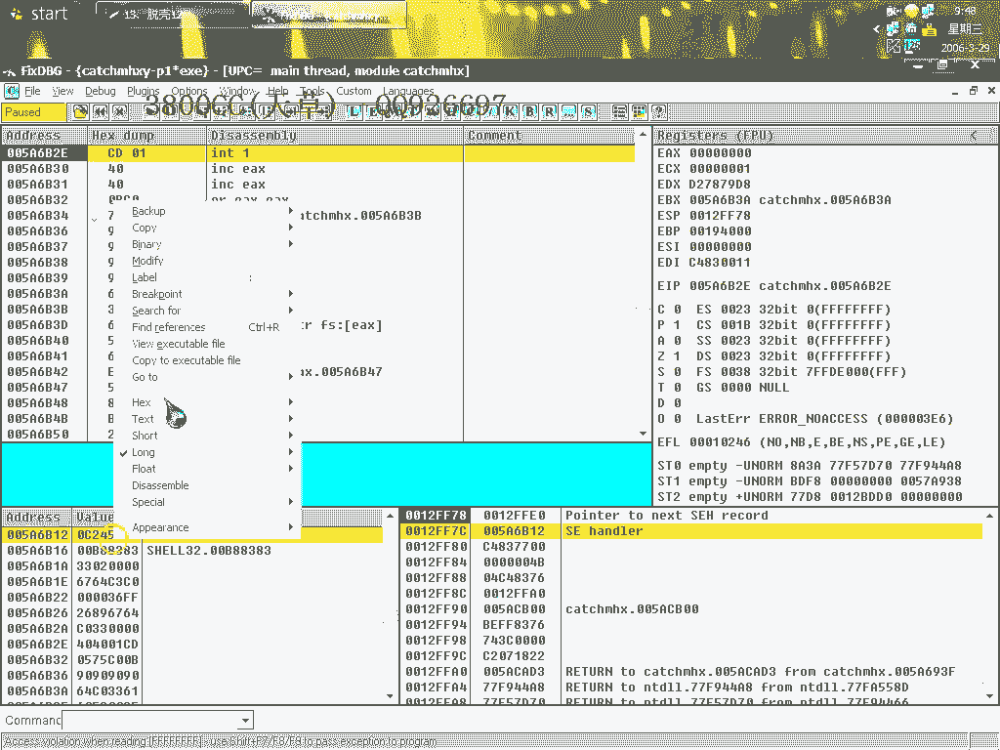

下，內存訪問端點，這裏呢，下端點，當然這個走這個步驟的目的，走這個步驟的目的，是為了處理Stormcall，為了找Stormcall。

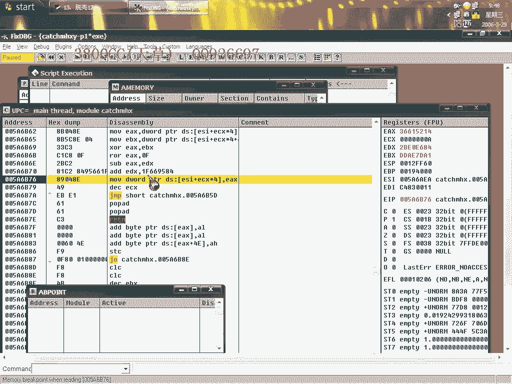

但是有的程序沒有Stormcall的話，我們就用後面的方法，在這裏，如果有Stormcall的話，我們在這裏用跟蹤的方法，這個沒有，這樣就直接到達OEP了，咱們來脫殼吧，一看路口特徵。

路口特徵就是BC++的，(看路口特徵)，OEP是1590，然後呢，我們這裏需要，手動查找IAT，我這裏呢，去啊，看一下，是這個，F0，161F0，161F0，大小，我們還是來找一下大小，這一個，80。

80，這裏呢，是120，我們這裏呢，用180，放縮四個字節，80，大小是D90，大家看到啊，有非常非常多無效的，我們用這個插件的，這裏開始停止了，我們就等一下，等一下，關於這個殼啊。

大家可能會說這個殼很好脫，其實呢，這個殼你要把它完完全全的處理完美的話，就是說，跨平臺啊什麼之類的，都要處理非常非常完美的話，還是蠻難的，還是蠻難的，這個殼啊，也算是四大金剛之一了。

當然現在也出了一些新殼，出了一些新殼，我們來看一下，這前面跟大家說過，這個就是Maxbox A了，跟大家說過了，看一下，我們來運行一下，可以運行的，可以運行的，好，這個脫殼修復呢，就也是這麼多。

後面就是演示方法了，好，我們還是設置這個，然後修的JF9，這樣啊就到達了4，到達了4，最後一次內存訪問一場了，Int1嘛，Int1型的，好。

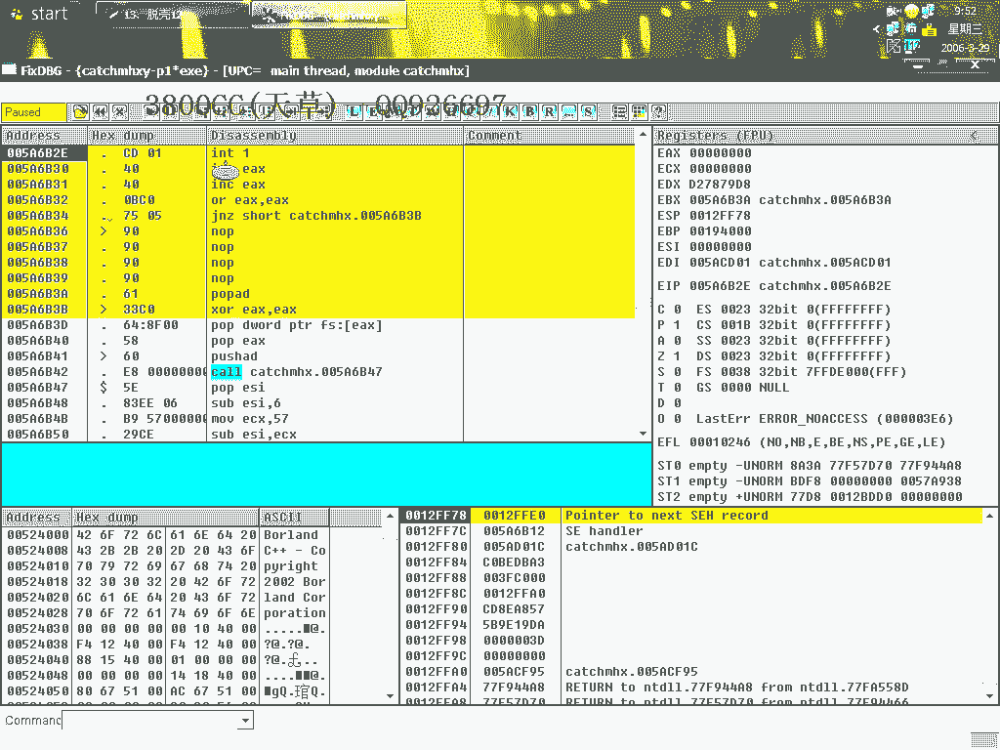

這個時候我們直接在，0040100這個，下F2端點，修的JF9就可以到達了，這是第二種方法，好接著看第三種，我們來設這個，設為Int3型的，Int3，Int3型的，隱藏一下，這裡不用看了，就是最後一次。

Int3型一場，我們在這裡呢，同樣也是像，第一種一樣，在這裡下F2端點，然後繼續，這裡下F2端點，好，這裡是R+B，就是端點了，這裡呢，也是，在這個地方可以找一下，StormCount，當然像1。

35的StormCount，應該是用這種方法找不到的，只能用我們前面介紹的那種，下，就用ESP定律，前面用ESP定律才可以找得到，這是第三種方法，到達，好繼續，能源是設那個，Int3型的，OK。

能源和第二種相類似，這樣，也是直接到達OEP，這是第四種好第五種，第五種更快捷，如果發現，你發現有這個，IDELT這個區段的話，設內存寫入端點，內存寫入端點。

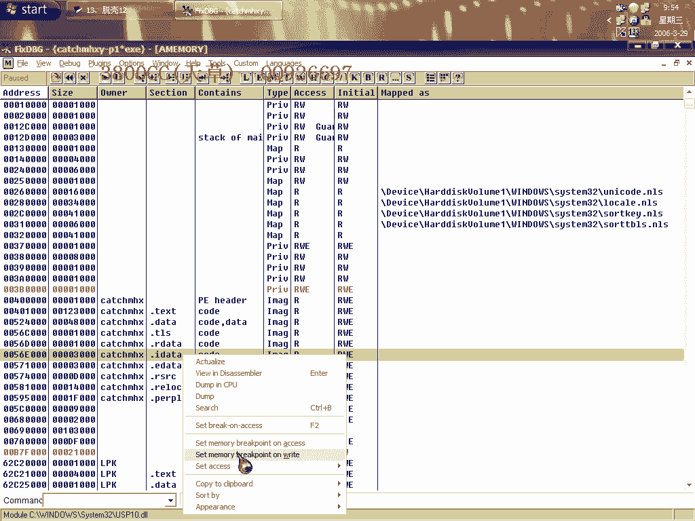

這個時候。

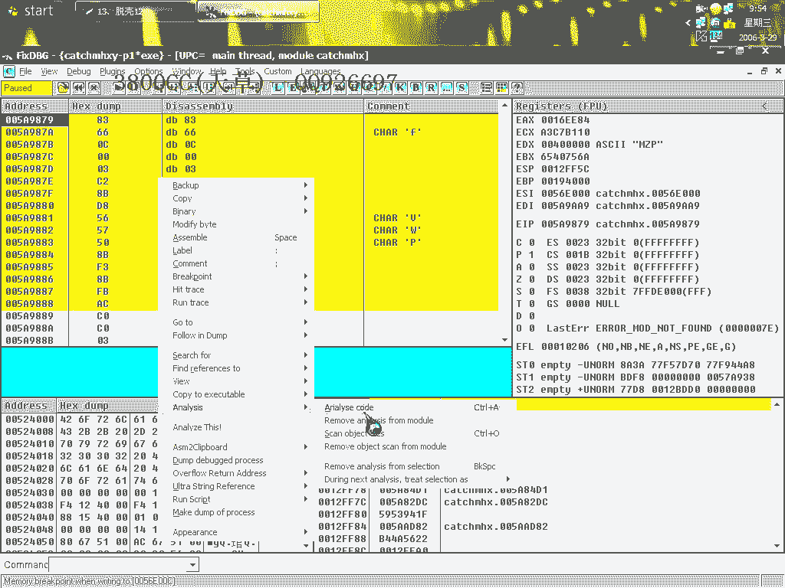

刪除內存寫入端點，然後呢，在0。4。0，100這個區段下，訪問端點，Shift+F9，這裡剛才忽略，沒有，繼續，剛才沒有忽略異常，我們重新來吧，忽略所有異常，就是說第五種方法，要忽略所有異常。

忽略所有異常，然後呢，再點IDELT端，內存寫入，然後呢，刪除掉然後再下內存訪問，(嘶)。

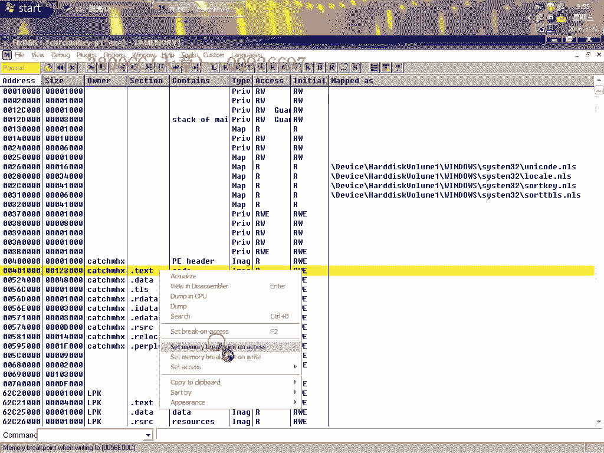

好，分析一下，好，這樣就到達了，到達了OEP了，在這裡，說這幾種方法的目的。

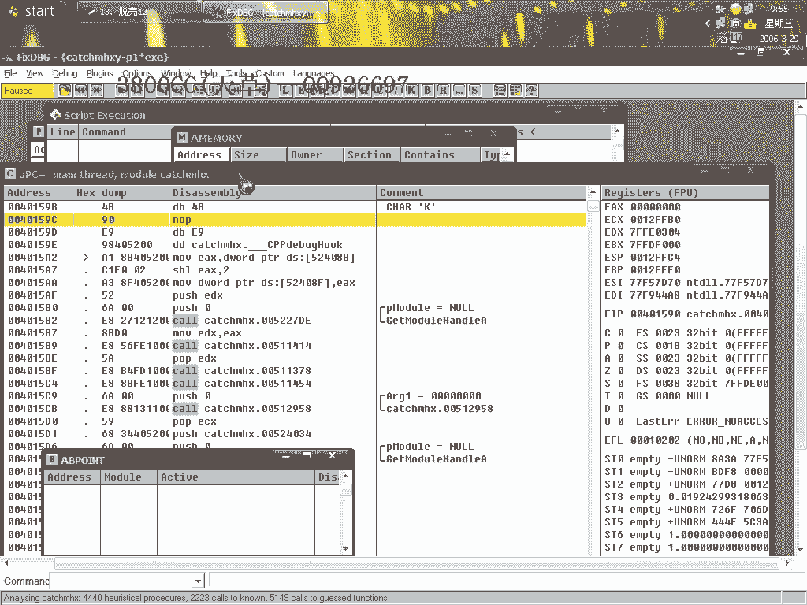

就是說，靈活運用，另外就是說，另外需要注意的，我再強調一遍，就是在修復的時候，1590，這裡是，多少，這裡只是給大家看一下，給大家看一下，這裡呢，1990，就是在，User這個裡面。

在Message BP，下面的一個，就是Message Box，這個大家要記清楚，這個大家要記清楚，這個大家要記清楚，那今天課程就這麼多，就這麼多，關於這個，看一下能不能把這個，這個對話給去掉，很煩的。

它好像還有，反調式功能，(嘶)，好，然後叫運行，然後12暫停，小誇，(嘶)，(嘶)，這裡啊，點一下，這樣返回的，返回，就是這個調轉，這個調轉，我們把這個給漏掉看一下，這樣吧，做個記號，(嘶)。

這個地方也可以調過去，這個地方也可以調過去，我們就在這個地方下斷點，下硬件洩漏，免得到時候給弄掉了，我們還是，把這個給漏掉試一下，(嘶)，按錯了，直接漏掉就可以了，大家看到了，就不用再試了。

這個大家可以自己試一下，直接漏掉就可以了，好了，今天課程內容就這麼多，再見。

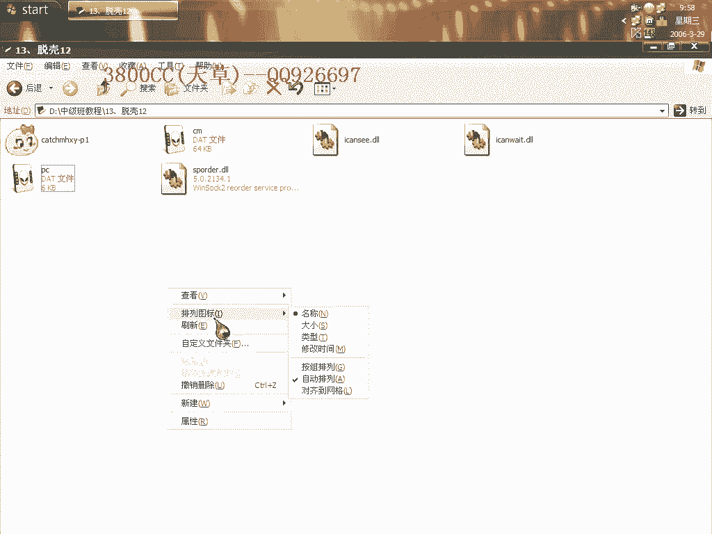