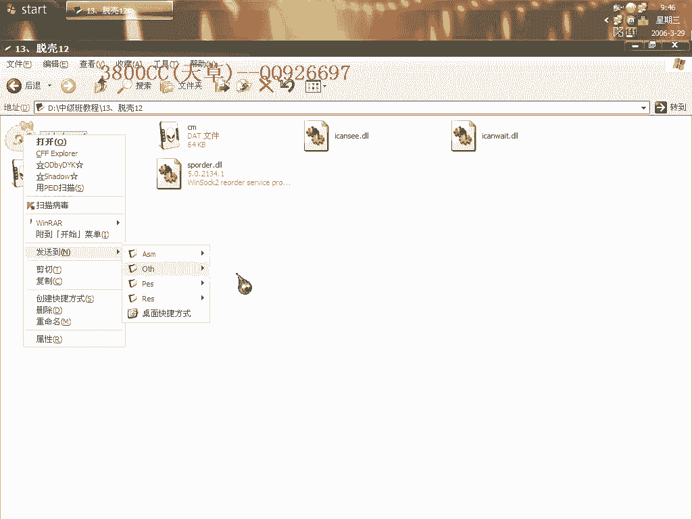
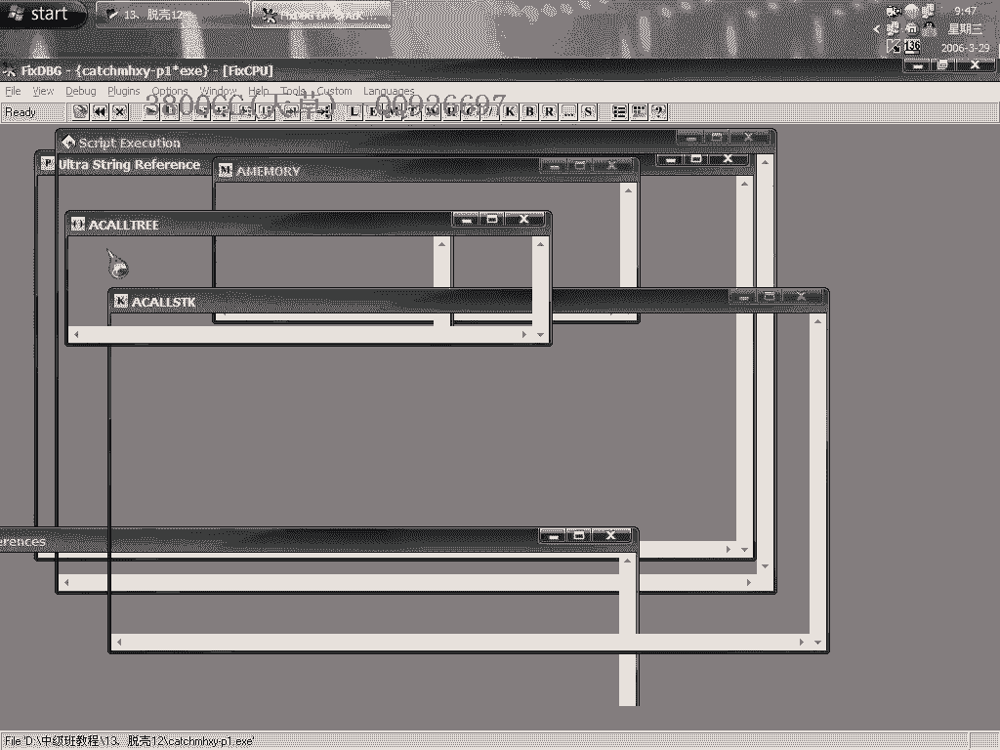
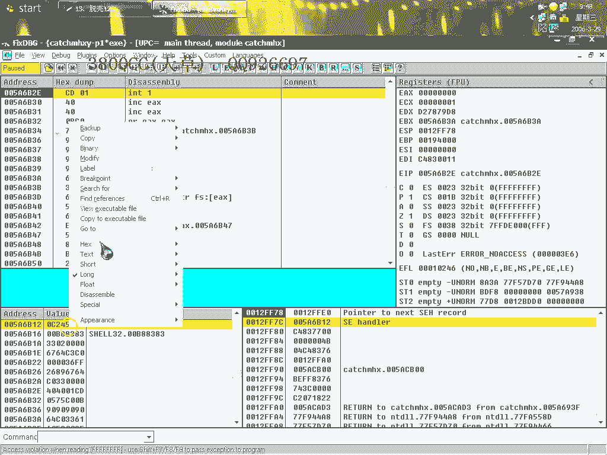
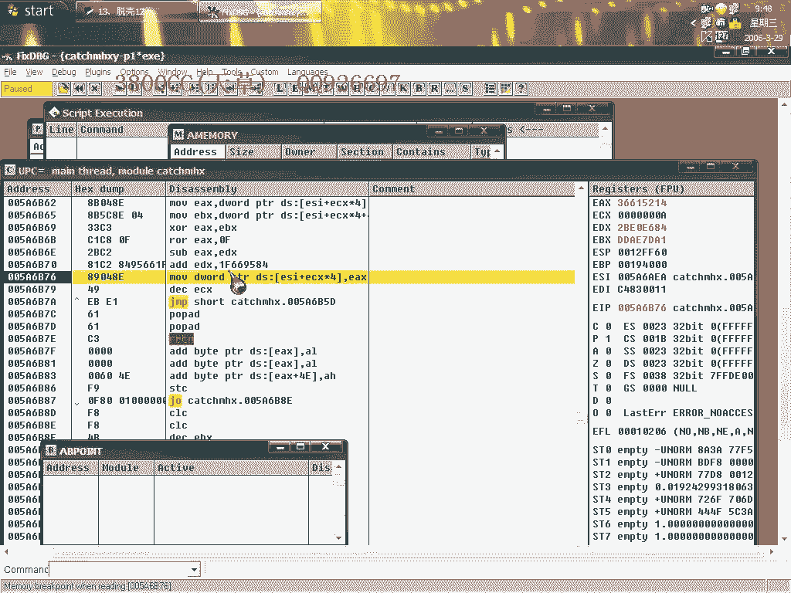
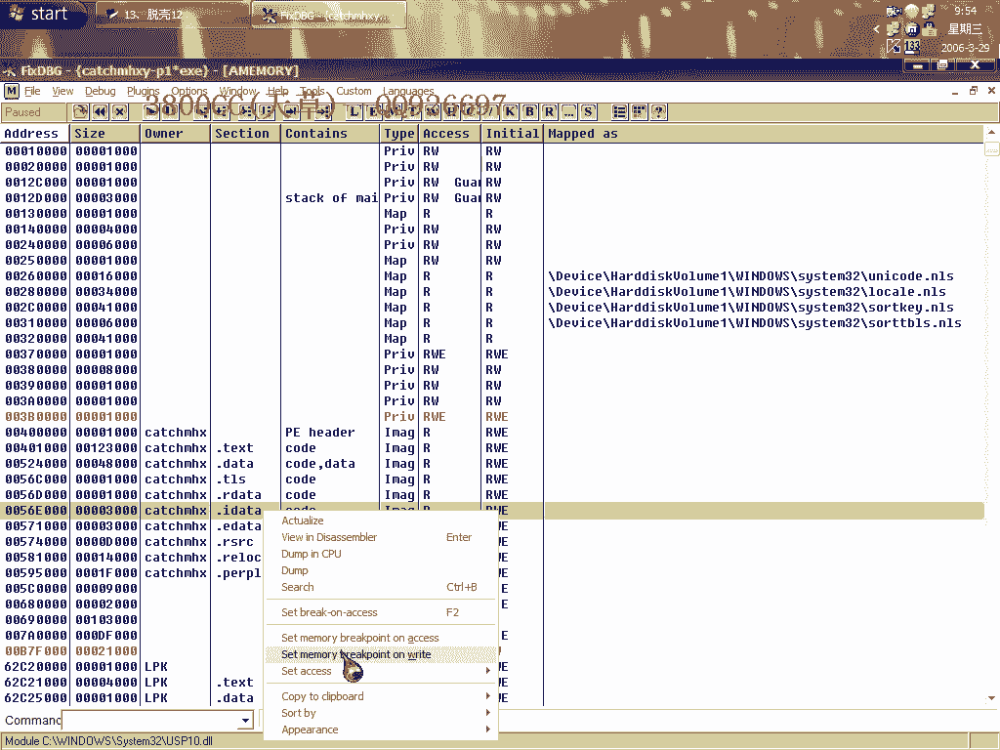
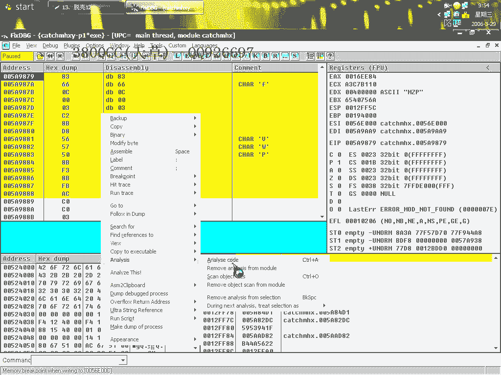
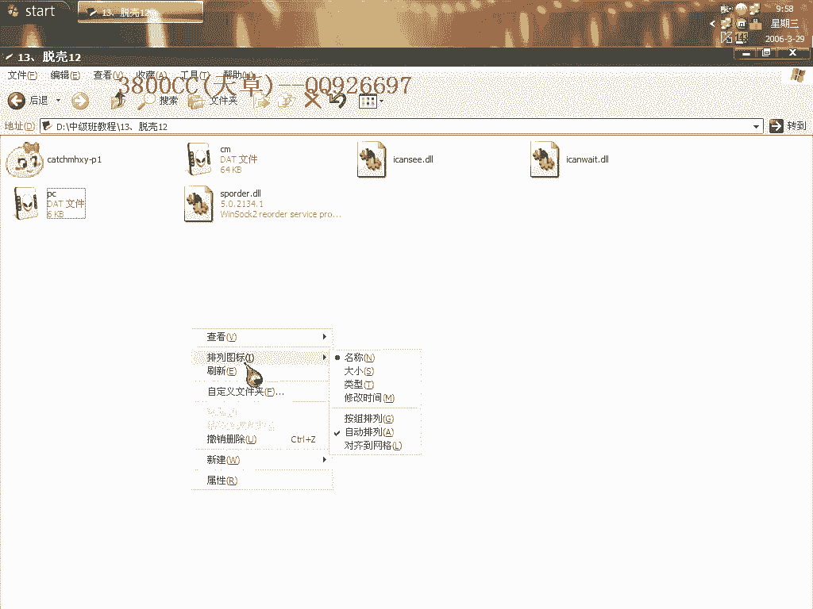

# 天草中级班 - P13：第13课 - 白嫖无双 🛡️

在本节课中，我们将学习针对特定加壳程序（Ace ProTech 1.35）的多种脱壳方法。课程将详细介绍如何利用不同的异常设置和断点技巧，定位并到达原始程序入口点（OEP），并完成导入地址表（IAT）的修复。

---

## 课程概述与目标确认

我们首先需要确认目标程序的版本。通过分析，确认目标程序使用的是 **Ace ProTech 1.35** 版本的壳。

本课程的主要目的是向大家介绍几种能够有效到达程序 OEP 的通用方法。

---

## 方法一：忽略异常与隐藏调试器

上一节我们确认了目标，本节中我们来看看第一种方法。这种方法基于我们之前课程中提到的设置：忽略内存访问异常并指定异常处理，同时隐藏OD调试器。

以下是具体操作步骤：
1.  在OD中设置，忽略所有内存访问异常。
2.  启用插件隐藏OD。
3.  运行程序，观察是否能直接到达OEP。

经过测试，这种方法对于当前目标**不可行**。因此，我们需要尝试其他方法。

---

## 方法二：利用最后一次内存访问异常

由于第一种方法失败，我们转而使用基于异常断点的方法。首先，确保插件设置正确，并启用“忽略内存访问异常”选项。

运行程序，让其触发并停留在**最后一次内存访问异常**处。

然后，在代码段（例如 `00401000`）的起始地址设置一个**内存访问断点**（F2）。

执行这个步骤的主要目的是为了寻找和处理可能存在的 **Stolen Code**。如果程序没有 Stolen Code，我们就可以直接到达 OEP。

对于本例，程序没有 Stolen Code，因此设置断点后运行，可以直接到达 OEP。OEP 的特征是典型的 BC++ 程序入口，地址为 `0x00401590`。

到达 OEP 后，接下来需要进行脱壳和修复。我们需要手动查找 IAT。IAT 的起始地址大约是 `0x004161F0`，大小需要通过计算确定，本例中约为 `0xD90`。

使用插件修复 IAT 时，会发现有很多无效指针，需要耐心等待插件处理完成。

这个壳虽然看似简单，但要完美处理其跨平台等特性，实际上颇具难度，它曾是知名的“四大金刚”壳之一。

修复完成后，可以运行脱壳后的程序进行验证。

---

## 方法三：利用 `INT1` 单步异常

除了内存访问异常，我们还可以利用其他类型的异常。现在，我们来看第三种方法。

将异常类型设置为 **`INT1` 单步异常**，并隐藏OD调试器。

运行程序，让其停留在最后一次 `INT1` 异常处。

与方法二类似，此时在 `00401000` 地址设置 **F2 断点**，然后运行（Shift+F9），即可到达 OEP。

---

## 方法四：利用 `INT3` 断点异常

接下来是第四种方法，它与第二种方法原理相似，但使用的异常类型不同。

将异常类型设置为 **`INT3` 断点异常**。

程序运行后，会停留在最后一次 `INT3` 异常处。同样地，在 `00401000` 设置 **F2 断点** 后运行，即可到达 OEP。

对于 Ace ProTech 1.35 这个版本，其 Stolen Code 通常无法用 `INT3` 异常法找到，需要使用前面提到的 **ESP 定律** 来定位。

---

## 方法五：利用 `.idata` 区段断点（最快捷）

最后介绍一种更快捷的第五种方法。如果目标程序存在明显的 **`.idata`** 区段（即导入表区段），可以采用此方法。

首先，必须**忽略所有异常**。

然后，在 `.idata` 区段上设置一个**内存写入断点**。

运行程序，当断点触发后，**删除**这个内存写入断点。

紧接着，在代码段 `00401000` 上设置一个**内存访问断点**。

再次运行程序（Shift+F9），即可直接到达 OEP。

介绍这几种方法的目的，是希望大家能够灵活运用不同的调试技巧来应对不同的加壳情况。

---

## 修复要点与反调试处理

在修复 IAT 时，有一个关键点需要特别注意。以本程序 OEP `0x00401590` 为例，在修复对话框中，对于 `USER32.MessageBoxA` 这类 API，其显示位置可能在 `Message` 类别下，务必准确识别和修复。

此外，该壳具备反调试功能。在脱壳后的程序中，可能会遇到烦人的调试提示框。

可以通过在程序启动代码附近（例如调用 `MessageBox` 显示提示框之前）设置**硬件断点**，并跳过相关调用，来去除这个提示。具体操作是找到提示框调用指令（通常是 `CALL`），将其**NOP 掉**或修改流程直接跳过。

---

## 课程总结

本节课中，我们一起学习了针对 Ace ProTech 1.35 壳的五种脱壳方法：
1.  **忽略异常法**（本例中无效）。
2.  **最后一次内存访问异常断点法**。
3.  **`INT1` 单步异常断点法**。
4.  **`INT3` 断点异常断点法**。
5.  **`.idata` 区段写入转访问断点法**（最快捷）。

核心在于灵活运用不同的异常设置和断点技术来定位 OEP，并掌握手动查找与修复 IAT 的技能。同时，需要注意处理壳可能带来的反调试机制。