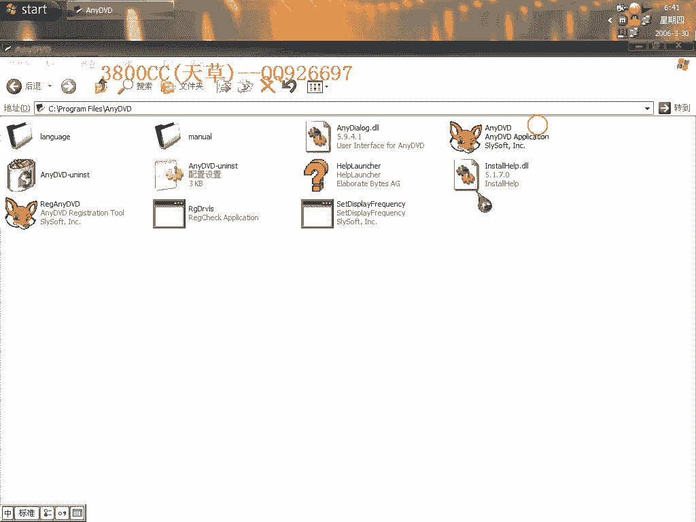
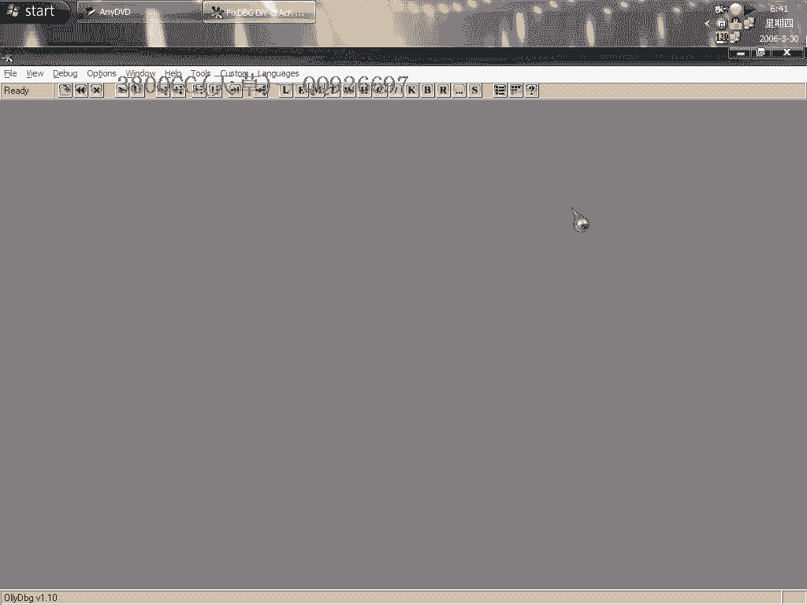
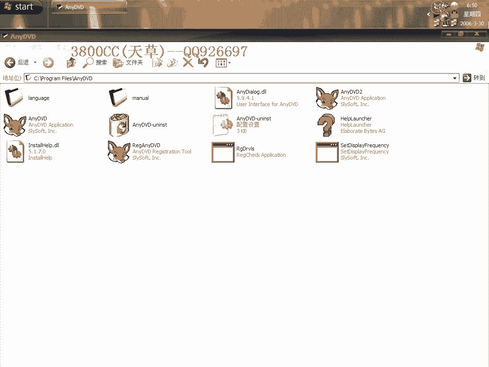
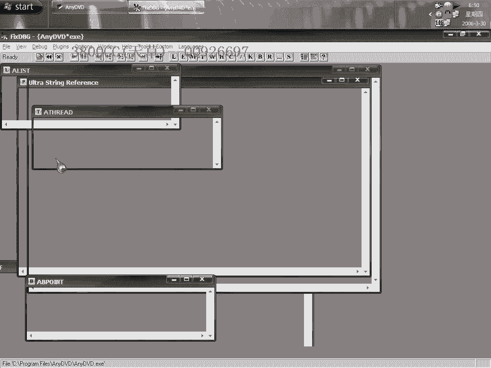
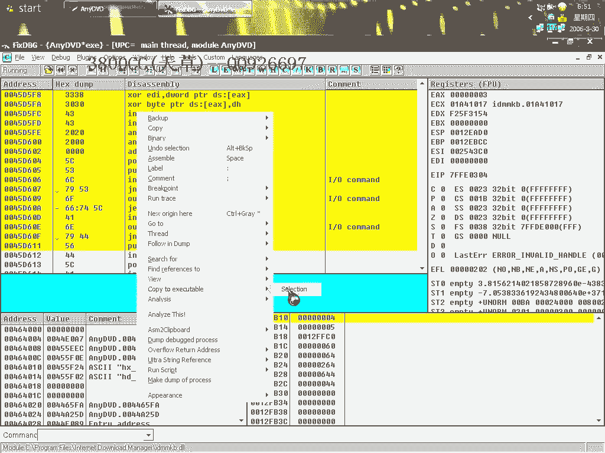
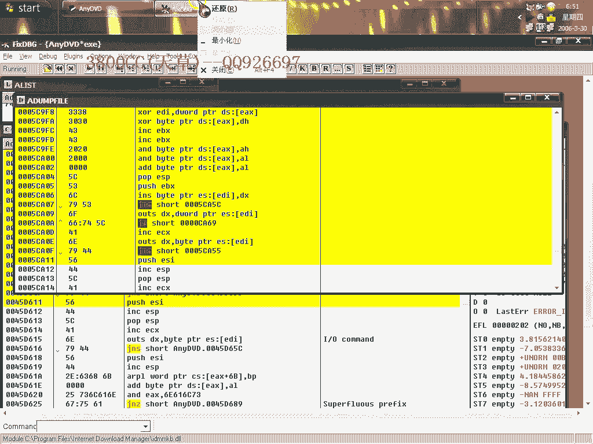
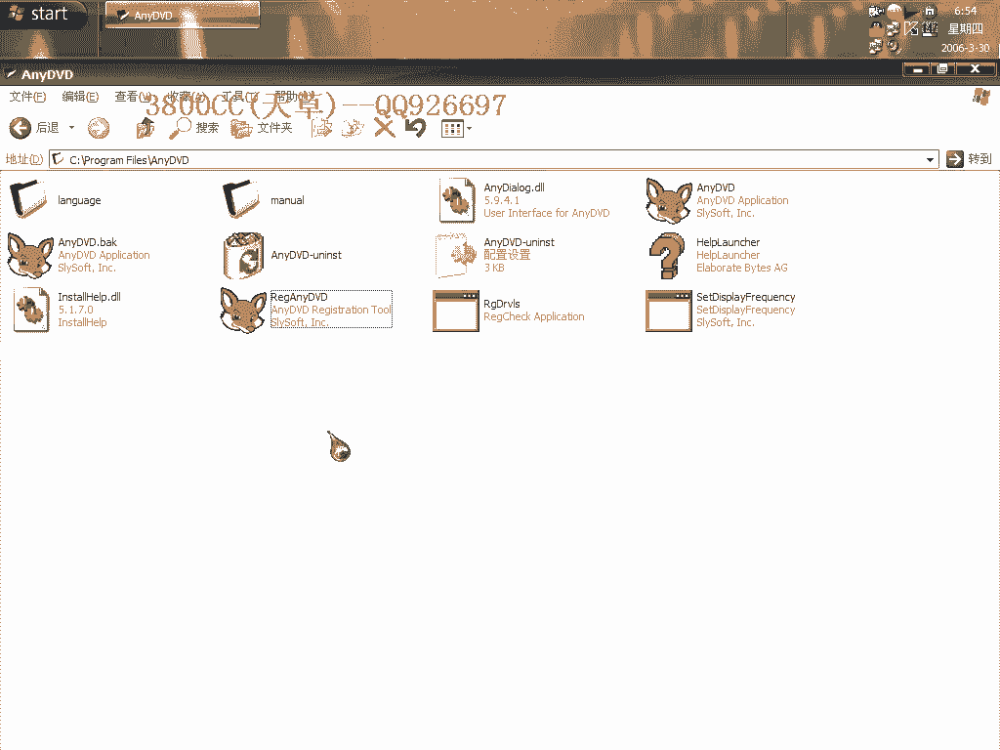

# 天草中级班 - P15：第15课 - 白嫖无双 - BV1qx411k7kd

大家好啊，这节课我们来做一个破解，把声音调一下，就这么一个破解，这个大家可以看一下，它里面有这么一个程序，明显它这是一个Keyfile类型的一个，就是破解的一个东西，但是我们用LinkedIn的方法。

我们先来看一下原程序，可以试用21天，然后这个继续这里呢，可以啊，我们来看一下，注册给没人啊，试用期，我们现在左手来破一下，左手来破一下。

这里大家看到这里面有个language。

我们现在这个软件使用的是中文的，我们来把它变成英文，看一下有没有什么可以，可用的信息啊，可用的信息，因为就是说我们要用到查找，查找一个字符串的话，就用到英文的，等一下大家就会明白了，就这样，大家看一下。

Tired， low body， tired， tired，因为大家等一下看看一下这里啊，我们现在查到这个字符参考呢，是英文的，查找的是英文的，所以我们要把软件变成英文的，这个样子方便一些，我们这里呢。

查找Tired，大家看到啊，有这么一堆东西，然后他这还有什么，Red Chalk，在哪个地方啊，这个地方没有，大家看到这里，Continue，就是我们刚才程序运行的时候，有一个继续啊，我们到这里来。

我们在这个地方，这个断首啊，断首看一下，他从这里跳过来的，我们回去右键，Go to啊，这里，然后看一下这一段是哪里来的啊，是这两个地方来的，这两个地方啊，好，在这个地方下F2断点，重新来过啊，这里可以。

这里就停下来了，停下来了，我们看一下，看一下这个地方呢，单步走下，可以单步走下，这里啊，他这里，这个跳是跳到啊，跳到就是说适用，跳到适用的地方去，这个地方呢，如果这个跳了的话，自然就是跳到那个过期了。

跳到过期，我们可以来看一下，重新来，试一下看这两个跳，到底是起什么作用的，好，这个改成跳，然后直接运行程序，已经过期了啊，已经过期了，You have 21条，21条，已经适用了21条。

已经适用了21条，已经适用21条，就是说这里就是跳向过期了，这里呢，就是跳向，刚才改动了之后啊，程序就变了啊，程序就变了，他那个期限就变了啊，都变了，就是说，刚开始的时候，本来就是1，改动了之后。

他就有了个交验，时间交验了，好，我们这里就说，我们这里就说，跳向过期，我们接下来看一下，看一下到这里来看一下，Continue啊，这里是把这个位置，这个位置，就是Continue了啊，我们来看一下。

这个相当于抗锈加剧了啊，抗锈加剧，这样我们什么都看不到，我们这样看一下，大家看到了，有Continue啊，那我们把这里改一下，3800cc，现在回去，这里是回到上一层，回到我们上一步，大家看到啊。

这里就变成3800cc，那我们来分析一下，分析一下，就是说，如果这个值啊，这里的这个值，在弹幕走吧，走到这里来看一下吧，这里，0和1，就是说，如果是，这里把0，放到EX里面去，然后，如果EX。

EX不等于，不等于0的话，不等于0的话，他就跳了，他就跳，直接跳过去了，我们来看一下，我们来看一下，这个没有跳，这里呢，是把这个值啊，这个值给了EX，EX不等于0的话，是等于0的话，就跳了。

我们来看一下，Continue，这里是Continue，EX，我们来看一下，到这个值，这里也是EX，也是Continue，我们到这里去看一下，我们把它也改一下，回去，这里，就变成3800cc了。

3800cc，那我们这个样子，就是说，我们把这个值，把我们的，注册名的这个值啊，给EX，这里应该是，半角，错了错了错了，把这个，取消，这个复制过去，我们现在回到这里，这里，这个样子的话。

我们这个样子来试一下吧，还是重新，还是来试一下，还是按我们这个思路来试一下，我们单步走啊，这里变成Continue了啊，把这个，改成我们的3800cc，好，不管怎么样单步走啊，这里呢，是调向，我们这个。

调向我们实用，直接就是，改成jump，无论如何都是调向实用，好，右键，这里，大家看到了啊，这里的值，是，是，45，D，5FB，就是这里的3800cc，就是说注册名的啊，相当于我们的注册名呢。

然后进行比较啊，进行比较，3800cc，直接就跳走了，直接就跳走了，这里的一个值呢，看一下啊，我们不让他跳走，因为这里的有一个，Continue好像没改过来啊，这里，这个值好像一直都是在变动的啊。

一直都是在变动的，一直都是变动的，我们看一下，我这个也改成这样，不管了，现在直接复制所有的，我们先来运行啊，直接运行，看一下效果，哎，这个效果不行，我们来看一下啊，看一下，这里是注册给3800cc了啊。

刚才我们那个跳转跳了啊，我们刚才把那个跳转，稍微跳了，所以一定要按那个，按那个Continue啊，好，现在我们把它关掉，来看一下，不能运行的啊，不能运行的，为什么啊，因为这个名字啊。

我们把这个原程序的改一下，看一下就知道了，原程序名字一改，就不能运行，好，我们把我们那个，修改了之后的一个文件改一下，可以了，他这里注册给Continue啊，注册给Continue，那我们再来看一下。

到底是，这个Continue是在哪里出现的，我们改过了一个。

但是还是，注册给Continue啊，好。

搜索支付侧，我们搜索Target，这里就知道了，就是这里的值啊，这里的值，这个值好像就是说，是一个动态变化的，动态变化的，所以我们再怎么着，再怎么改，它都会变的，都会变的，3800cc。

直接运行看一下就知道了，只有那次改的时候啊，只有那次改了之后的才，才可以我们再来看一下，这里，我们来看一下我们改的成果。

现在就变成3800cc了啊，刚才那个，看一下，再来看一下，注册给3800cc，这个呢，就是Bug，就是我们的原程序了，把它变成中文的，Simple就这个，因为这个我安装之后，它非要启动。

非要重新启动才可以，现在破解了就这样了，它应该是有一个CRC，就是说有一个验证，非得用这个名字，另外再看一下这个，这个可以就不用了，可以不用了，我们还是来打开，因为我们刚才看到了有一个。

在那个里面看到有一个CRC，有一个Registrar，我能看一下那个程序在哪个地方，那么一个程序可能会给我们带来一个隐患，我们来搜索一下，看一下这个程序在哪，没有没有，这里有一个这个，有一个这个。

但是没有这个，有点奇怪，不管了，已经破解成功了，这个也算是我们的一个另类破解了，用另外一种方法来破解的，跳过了它的这个，有的朋友可能会说，要直接用这个文件，用这个文件破解，通过这个来破解。

但这个样子的话非常非常难，好大家再自己看一下，再见，好 再见。

