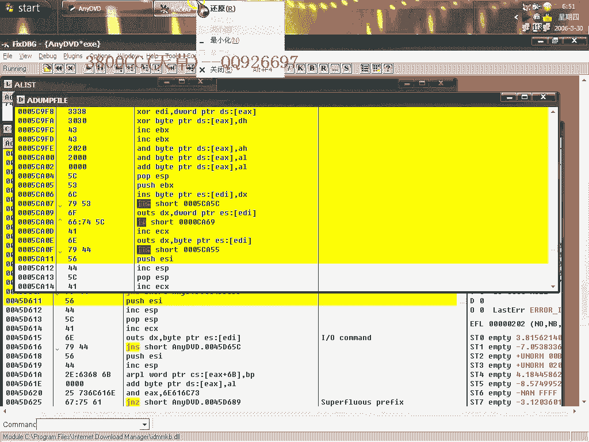
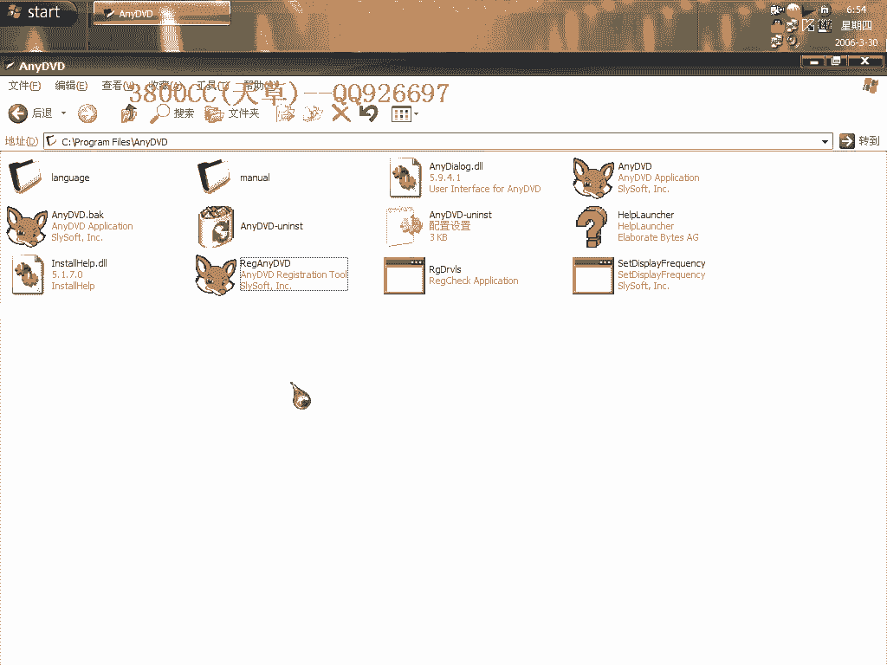

# 天草中级班 - P15：第15课 - 白嫖无双 🛡️

在本节课中，我们将学习一种针对特定软件（Keyfile类型）的破解方法。我们将通过分析程序流程、修改关键跳转和内存数据，绕过其试用期限制，最终实现软件的“破解”。

---


## 概述


本节课的目标是破解一个具有21天试用期的软件。我们将使用动态调试的方法，定位并修改程序中的关键验证逻辑，从而跳过试用期检查，使软件进入“已注册”状态。

---

## 第一步：准备与观察

首先，我们运行原程序。程序界面显示为中文，并提示有21天试用期。点击“继续”按钮可以进入试用。

为了便于后续的字符串搜索和分析，我们需要将软件界面语言切换为英文。因为许多调试工具在搜索字符串时对英文的支持更好。


在设置中找到语言选项，将其更改为英文。


---

## 第二步：定位关键字符串

软件切换为英文后，我们使用调试器（如OllyDbg）附加到进程。接下来，我们需要在内存中搜索与注册验证相关的字符串。

我们在字符串参考中搜索“Trial”，发现了多个相关结果。同时，我们也看到了“Continue”这个字符串，它对应程序运行时的“继续”按钮。

我们重点关注“Continue”字符串，并查看哪些代码引用了它。

---

## 第三步：分析验证逻辑

在引用“Continue”的代码处设置断点，然后重新运行程序。程序会在断点处暂停。

我们开始单步执行（F7/F8），观察程序的执行流程。很快，我们发现了一个关键的条件跳转指令（如`JNZ`或`JE`）。

```assembly
CMP EAX, 0
JNZ SHORT 跳转地址
```

这段代码的含义是：比较`EAX`寄存器的值是否为0。如果不为0（`JNZ`），则跳转到某个地址；如果为0，则顺序执行。

通过反复测试和修改这个跳转指令（例如，将`JNZ`改为`JMP`强制跳转，或改为`NOP`填充使其不跳转），我们观察程序行为的变化。

我们发现，当这个跳转生效时，程序会显示“已过期”；当跳转被绕过时，程序则显示“继续试用”。这证实此处是试用期验证的关键点之一。

---

## 第四步：追踪数据来源

仅仅修改跳转可能不够，因为程序可能在其他地方还有校验。我们需要知道`EAX`寄存器中的值（即判断依据）是从哪里来的。

我们向上回溯代码，发现`EAX`的值来源于一个内存地址。我们查看该内存地址，发现其中存储着一个字符串，例如“3800cc”。

```assembly
MOV EAX, DWORD PTR [内存地址]
```

这个字符串看起来像是注册名或密钥。程序会将我们输入的注册信息与这个值进行比较。

---

## 第五步：修改与测试

我们尝试将内存中这个关键的字符串修改为我们想要的注册名，例如“3800cc”。

1.  在调试器中找到存储该字符串的内存地址。
2.  右键选择“修改数据”，将其内容改为“3800cc”。
3.  同时，确保之前找到的关键跳转指令被修改为绕过验证（例如改为`JMP`）。


完成修改后，让程序继续运行。此时，软件界面显示注册给“3800cc”，并且试用期限制似乎已经消失。




---

## 第六步：处理文件校验（CRC）

然而，我们发现直接修改内存后，一旦关闭程序再重新启动，修改就会失效。或者，如果修改了程序文件本身，程序甚至无法启动。


这提示程序可能存在**文件完整性校验（CRC校验）**。程序会检查自身文件是否被篡改，如果发现被修改，就会拒绝运行或重置状态。

以下是应对思路：

1.  **定位校验代码**：在程序中搜索“CRC”、“Checksum”、“Registrar”等字符串，或分析程序启动初期的函数调用，找到进行校验的代码段。
2.  **绕过校验**：找到校验函数后，可以尝试修改其返回值（例如，强制让它返回“校验通过”），或者直接`NOP`掉整个校验调用。

在本例中，我们通过搜索发现了一些相关字符串，但由于时间关系，没有深入追踪完整的校验流程。我们采用的**内存补丁**方法（运行时修改）绕过了静态文件校验，是一种有效的“另类”破解方式。

---

## 总结

本节课我们一起学习了一个软件破解的实战流程：

1.  **环境准备**：将软件切换为英文以便分析。
2.  **定位关键点**：通过搜索字符串和动态调试，找到与试用期验证相关的代码和跳转。
3.  **逻辑分析**：理解条件跳转的判断逻辑（`CMP` + `JCC`）。
4.  **数据追踪**：找到判断依据（如注册名）在内存中的来源。
5.  **实施修改**：修改内存数据和关键跳转，实现破解。
6.  **应对保护**：意识到并简单探索了CRC文件校验这种反破解机制。



这种方法的核心在于**动态调试**和**逻辑分析**，通过修改程序运行时的状态来达到破解目的。对于初学者，掌握查找关键跳转和修改内存数据是至关重要的第一步。