# 天草中级班 - P17：第17课 - 白嫖无双 - BV1qx411k7kd 🔓


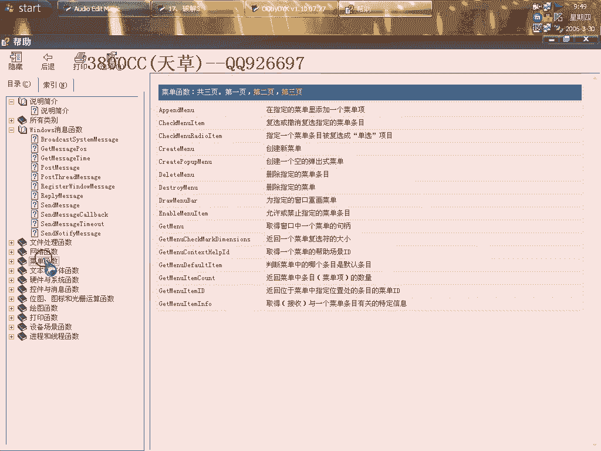

在本节课中，我们将要学习如何利用一个API速查表辅助逆向分析，并通过一个简单的实例演示破解过程。课程的核心是掌握工具的使用和关键跳转的分析方法。

## 概述 📋

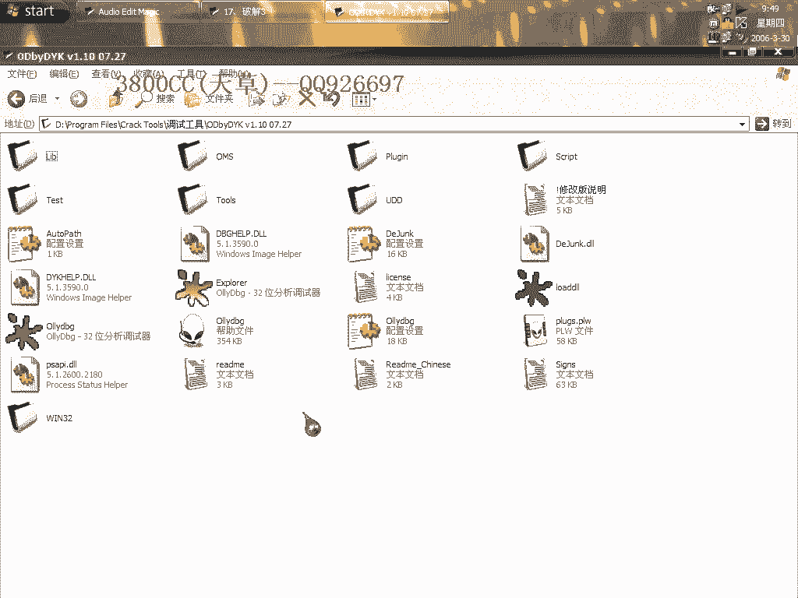

本节课的主要内容分为两部分：首先介绍一个实用的API速查表工具及其安装使用方法；其次，通过一个具体的软件实例，演示如何定位并修改关键跳转以实现破解。

## API速查表工具安装与使用 🛠️

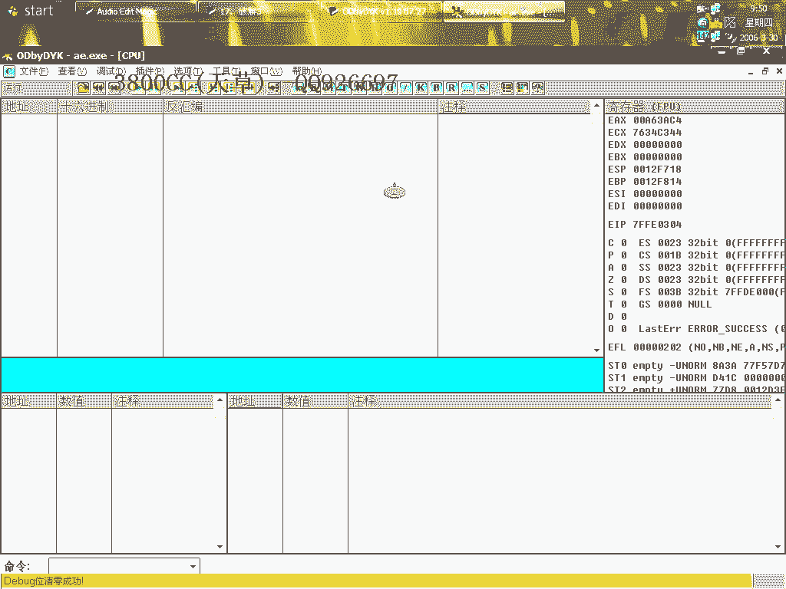

上一节我们概述了课程目标，本节中我们来看看如何配置和使用API速查表工具。

这是一个非常有用的API速查表。


以下是具体的安装和使用步骤：


1.  将提供的文件复制到OllyDbg（OD）的安装目录下。
2.  在OD目录内新建一个文件夹（名称可自定），并将文件放入其中。
3.  启动OllyDbg。
4.  在OD菜单中选择“API帮助文件”，然后选择刚才放入的文档文件。


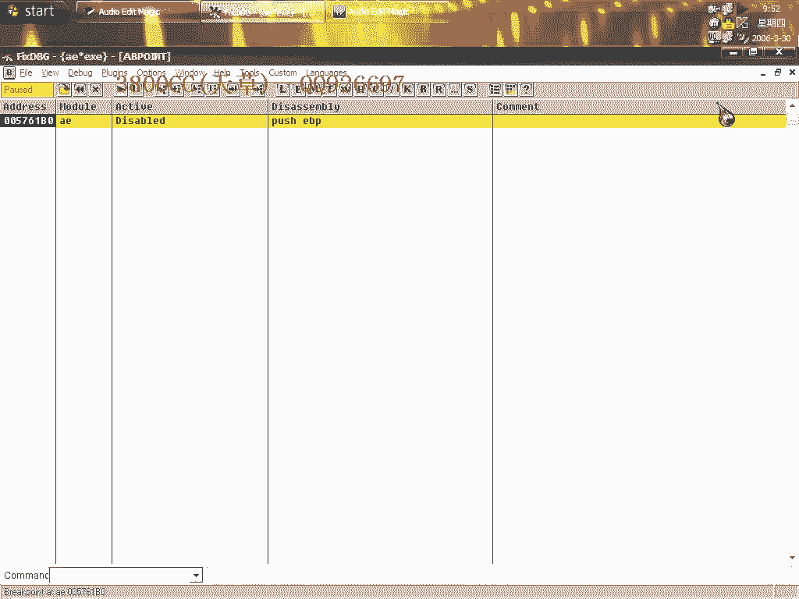

配置完成后，即可在分析程序时使用。以下是使用方法：

1.  在OD中打开一个可执行文件进行分析。
2.  在代码区看到某个API函数调用时，右键点击该函数。
3.  在弹出的菜单中选择“符号名称帮助”。


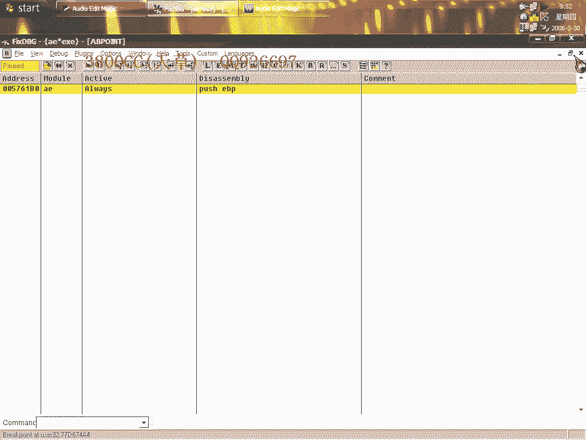

此时会显示该API的英文帮助信息，内容来源于MSDN，非常方便。

## 实例破解分析 🧩

掌握了工具的基本用法后，我们进入实战环节，对一个目标程序进行破解分析。

本次的目标程序有一个验证机制。我们随意输入信息后，程序提示失败。


首先，使用OD载入程序。


### 定位关键代码

尝试使用暂停法（例如在按钮事件处下断点）来定位关键代码。我们发现直接定位按钮事件的方法在此例中不奏效，这与我们之前遇到过的一种情况类似。

因此，我们换用其他方法。以下是寻找关键判断逻辑的步骤：

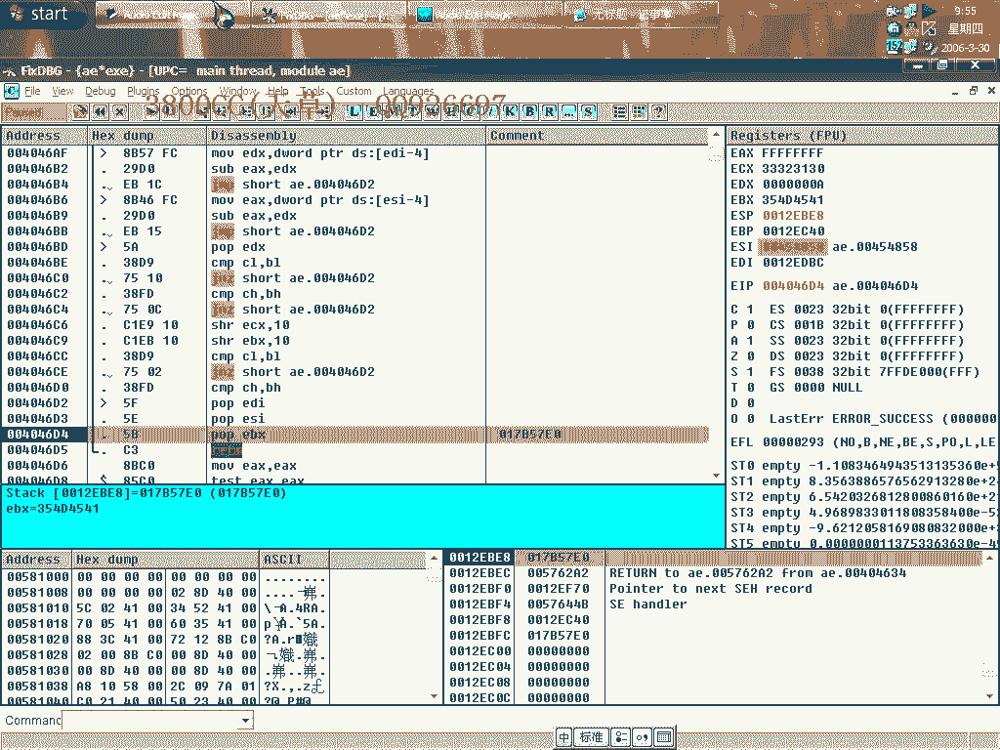

1.  使用辅助工具配合查找按钮事件的处理函数。
2.  在函数内部，可以找到获取用户名和注册码的代码。
3.  关键位置通常存在决定程序流程的条件跳转指令。

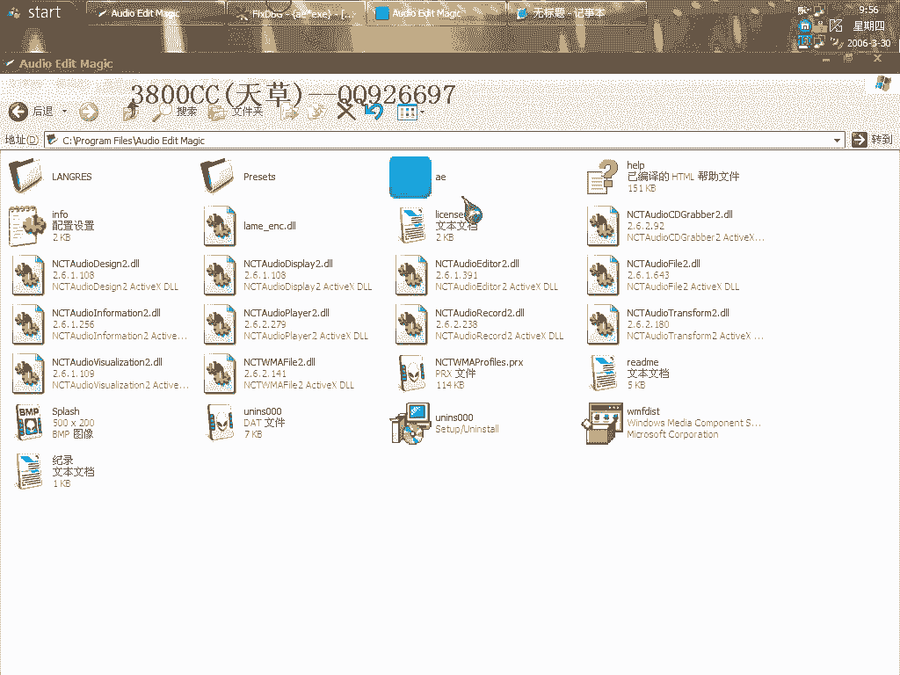


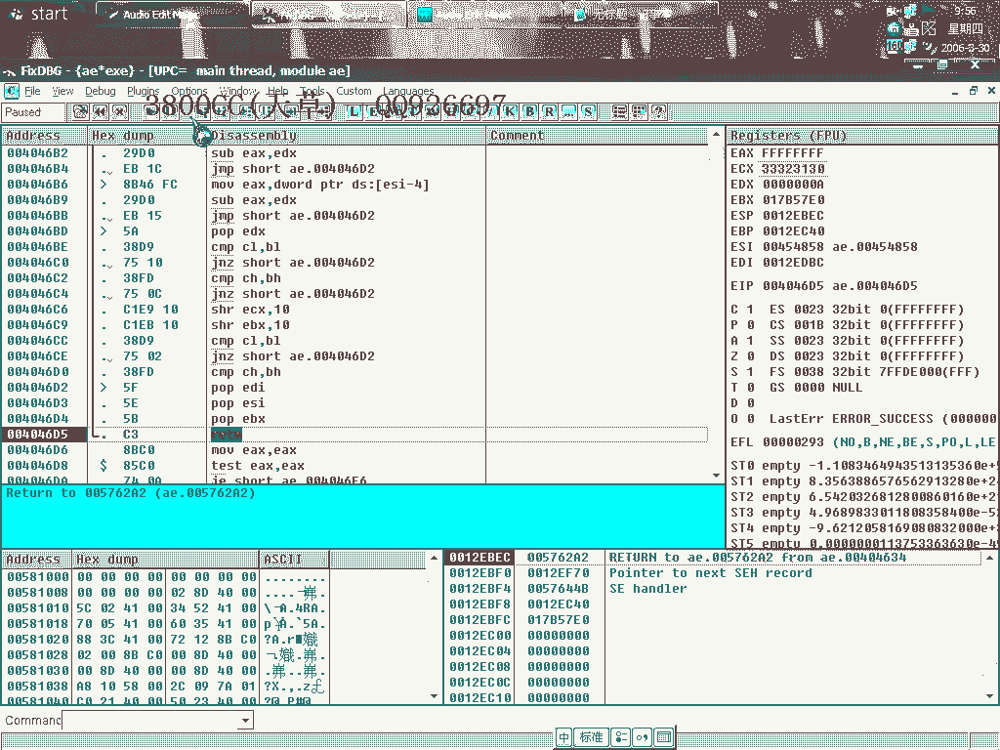

在分析过程中，我们找到了一个关键比较和跳转。该处代码将两个值（例如用户输入与计算出的值）进行比较。

```assembly
CMP EAX, EDX    ; 比较两个值
JNZ SHORT xxxxxx ; 如果不相等则跳转（通常是跳向失败流程）
```


### 分析并修改验证逻辑

我们观察到，如果跳转发生，程序会走向注册失败的流程。我们的目标是阻止这个跳转。

在本次实例中，这个跳转本身是发生的。我们通过修改此处的跳转指令，将其改为无条件跳转（`JMP`）或直接NOP掉（填充为`90 90`），从而绕过验证。


```assembly
; 修改前
JNZ SHORT 失败地址

; 修改后（方法一：强制跳转）
JMP SHORT 成功地址


; 修改后（方法二：直接无效化）
NOP
NOP
```

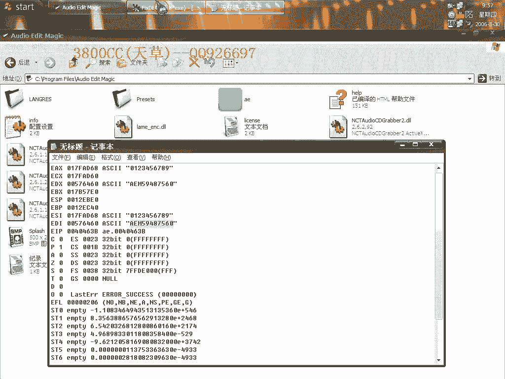

修改后运行程序，发现程序在目录下生成了一个标志性的DLL文件（例如`SATDLL`），并且界面显示注册成功。


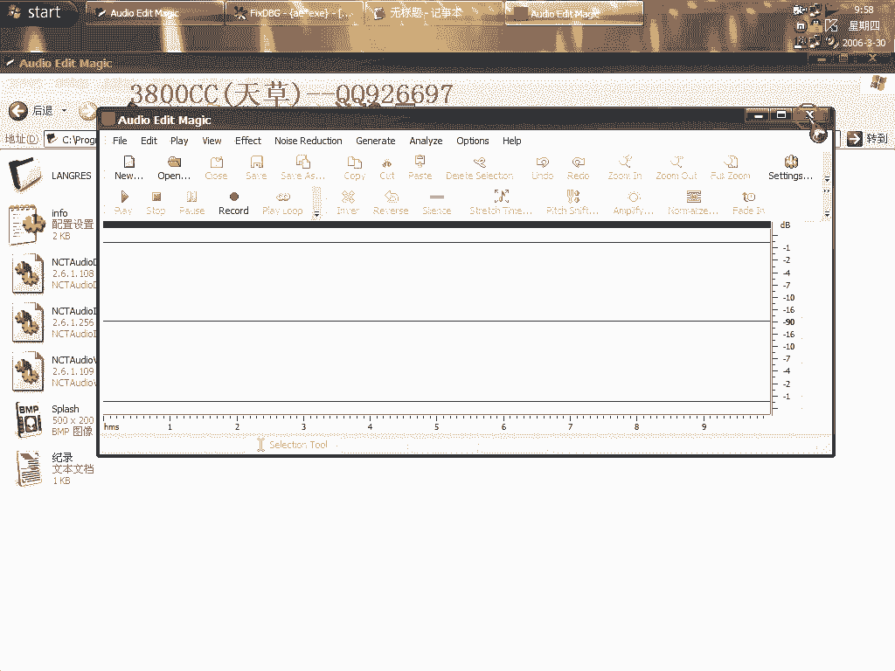

为了验证，我们删除生成的DLL文件，程序状态恢复为“未注册”。重新运行修改后的程序，DLL文件再次生成，注册状态恢复为“已注册”。这证实了我们的修改是有效的。

## 总结 ✨

本节课中我们一起学习了两个核心内容。

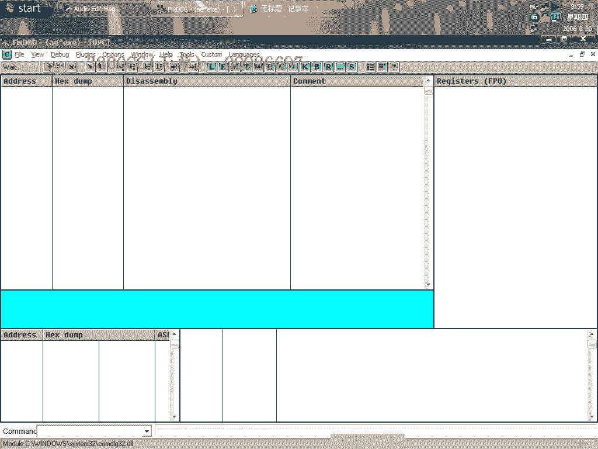

首先，我们介绍并实践了如何安装和使用一个外置的API速查表工具，这能极大方便我们在逆向工程中查询Windows API函数的功能。

其次，我们通过一个简单的破解实例，完整演练了从载入程序、定位关键验证代码到分析并修改关键跳转指令的整个过程。本次破解的关键在于找到决定注册成功与否的**条件跳转**，并通过修改其逻辑来绕过验证。

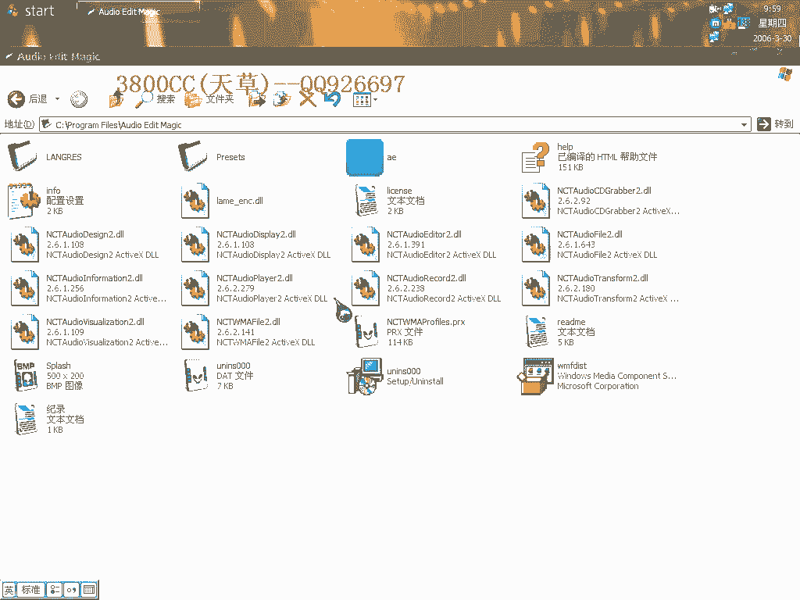

希望本教程能帮助你理解基础破解思路和工具的使用方法。