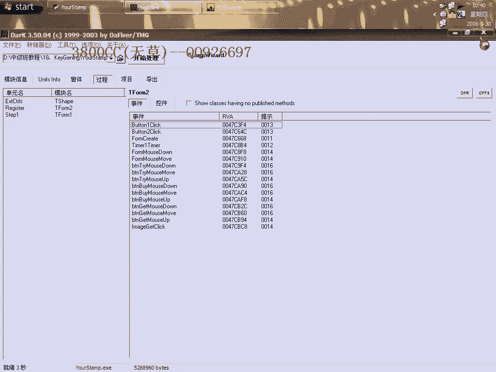
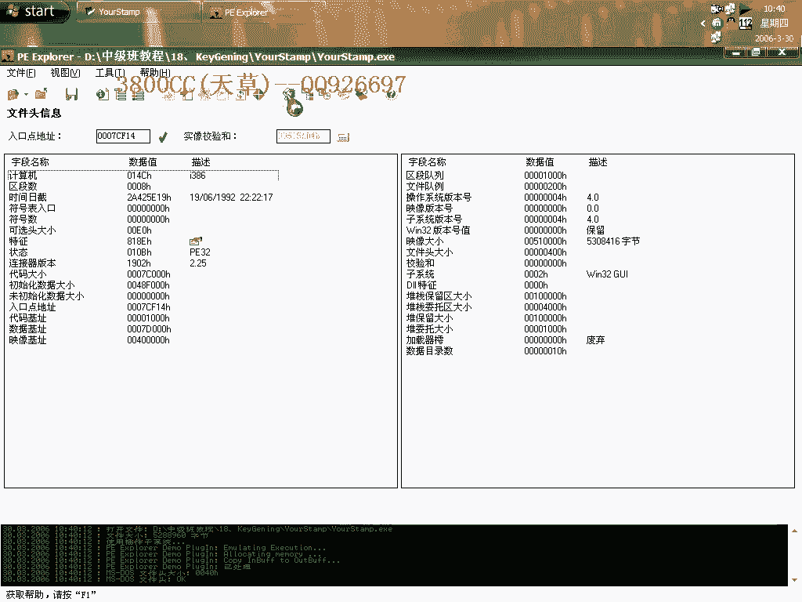
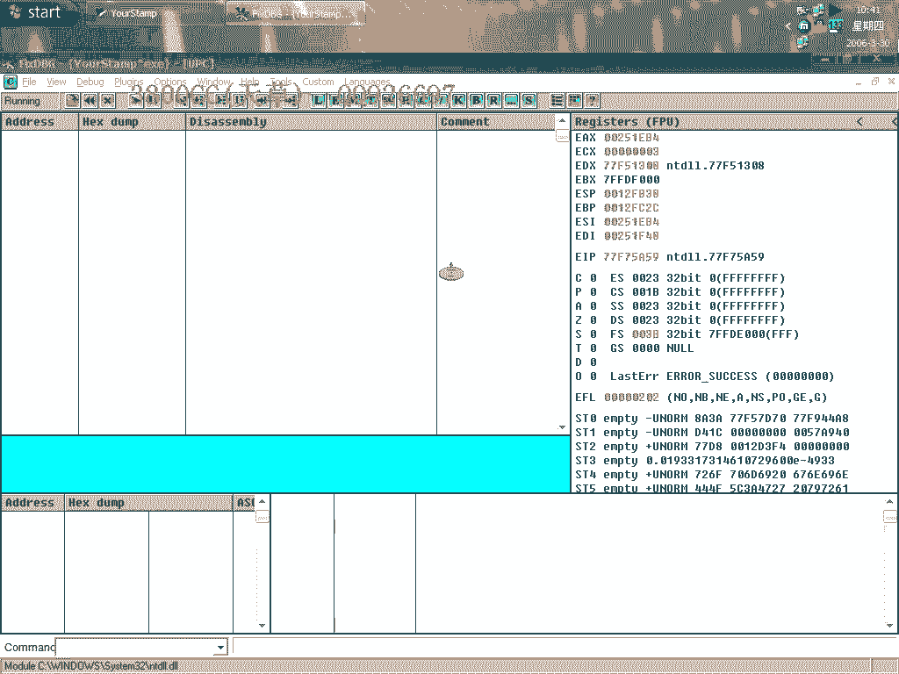
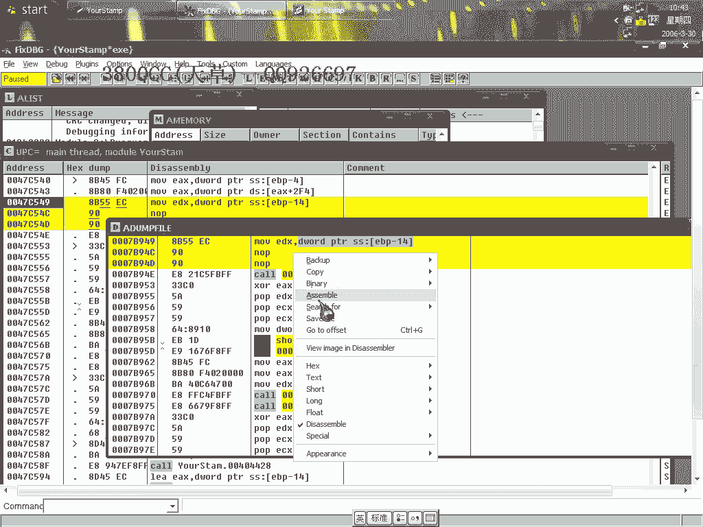
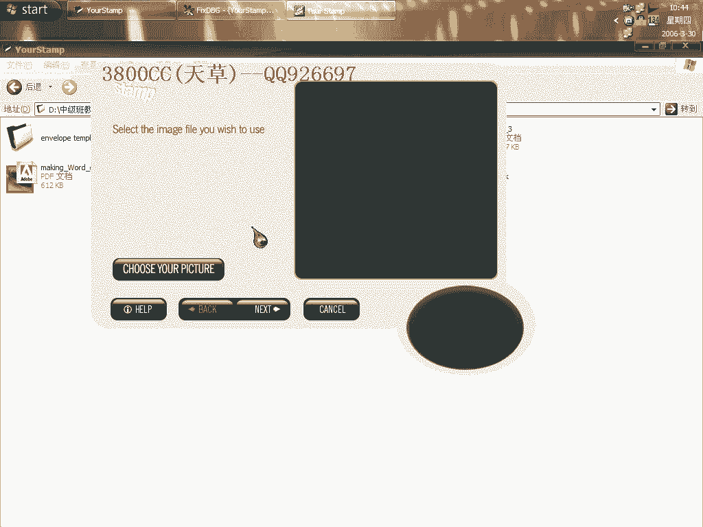
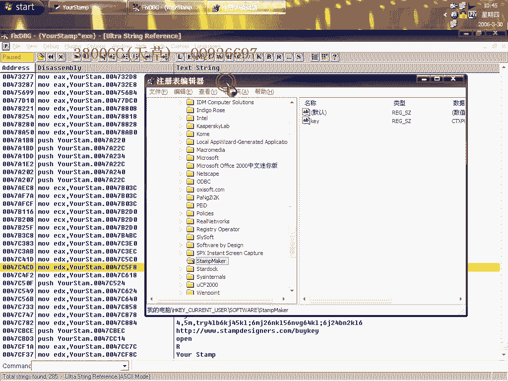

# 天草中级班 - P18：第18课 - 白嫖无双 🎮

在本节课中，我们将学习一种有趣的逆向工程思路。我们将分析一个名为“KeyGame”的软件，其特点是无需编写补丁或注册机，而是通过调试让程序自己显示出正确的注册码。整个过程将涉及基础的动态调试与关键跳转修改。

---

## 软件初始状态与目标 🎯


首先运行目标程序。在初始界面随意输入信息并点击“Unlock”按钮。


点击后，界面提示变为“Enter Key”，要求输入一个完整的Key文件。


我们的目标是绕过这个验证，让程序直接显示有效的注册码。

---

## 程序分析与断点定位 🔍


使用查壳工具检查，确认程序无壳，由Delphi语言编写。虽然程序界面显示了五种算法，看起来复杂，但通过耐心分析可以找到突破口。

我们使用DED（Delphi反编译工具）进行辅助分析。加载程序后，分析过程可能较慢（程序约5.04M）。


在DED中定位到`Form2`，并进一步查看其上的控件事件。


经过查找，确认关键按钮（“Unlock”）的点击事件处理函数为`Button1Click`。




将此地址记录下来，以便在调试器中下断点。




---

## 动态调试与注册码生成 💡

上一节我们定位了关键函数，本节中我们通过动态调试来观察注册码的生成过程。


在调试器中于`Button1Click`函数入口处下断点，然后运行程序。在程序界面输入任意假注册码并点击“Unlock”，程序会在断点处中断。

单步跟踪程序执行，可以看到程序会读取我们输入的假注册码和本机的机器码。继续跟踪，在一个计算过程后，真正的注册码会出现在某个寄存器或栈地址中。



在本例中，真正的注册码出现在`EBP-14`这个栈地址中。

```
真正的注册码 = [EBP-14]
```

我们可以在内存窗口中查看这个地址的值，例如显示为`17C64`。这就是程序为我们生成的正确注册码。

---

## 修改程序流程显示注册码 ⚙️

为了让程序直接显示这个注册码，我们需要修改一处关键判断。

在代码中，找到将注册码提示信息放入`EDX`寄存器的指令。通常，其后会有一个条件跳转来决定是显示错误信息还是显示正确注册码。

我们的修改思路是：**强制让程序执行显示正确注册码的流程**。这可以通过修改条件跳转（例如`JNZ`改为`JZ`），或直接`NOP`掉跳转指令来实现。

修改后保存程序。再次运行，点击“Unlock”按钮。




此时，程序界面会直接显示出正确的注册码`17C64`，而不会再要求输入Key文件。


点击两次后，软件即显示注册成功，界面非常美观。



---


## 注册信息存储位置 📁

为了更彻底地理解，我们可以探究注册成功后的信息保存在何处。


如果继续跟踪未修改的程序流程（即让验证成功通过），会发现程序将注册信息写入某个特定地址或文件。通过搜索字符串或访问注册表，可以定位到存储位置。

例如，在内存中搜索成功提示字符串，可以找到对应的存储关键数据地址。



删除该地址的数据，软件状态会恢复为未注册。这验证了`17C64`就是我们获取到的真正有效注册码。


---


## 核心思路总结 📝

本节课中我们一起学习并实践了一种巧妙的逆向分析方法。整个过程可以总结为以下几步：


1.  **定位关键函数**：使用静态分析工具（如DED）找到核心按钮的事件处理函数。
2.  **动态调试分析**：在调试器中运行，输入假数据，跟踪程序如何生成真注册码。
3.  **获取关键数据**：在内存或寄存器中找到计算出的真注册码。
4.  **修改程序逻辑**：通过改变一个关键跳转，迫使程序走向显示真注册码的流程。
5.  **验证与拓展**：检查注册信息的存储方式，加深对程序机制的理解。

这种方法的核心在于 **“借力打力”**——不直接暴力破解算法，而是利用程序自身的计算能力为我们生成合法密钥，并通过极小的修改来改变其输出行为。

这种思路在破解练习或软件分析中非常实用，关键在于培养耐心跟踪和敏锐观察程序数据流的能力。


希望你能掌握这种思路，并应用到未来的学习中。再见。