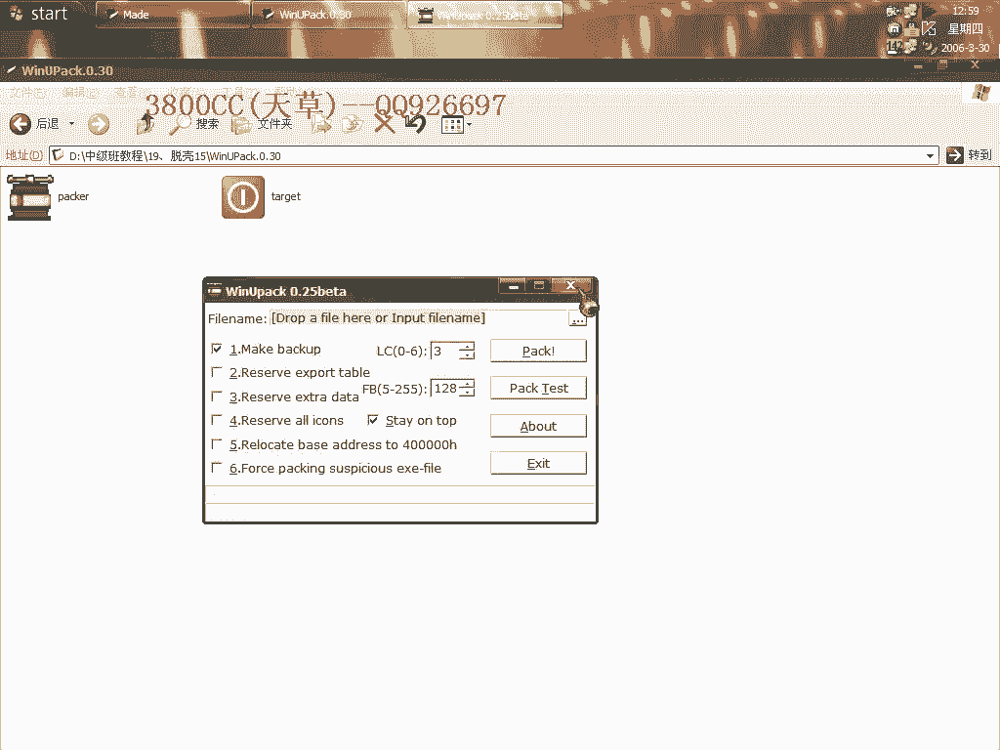
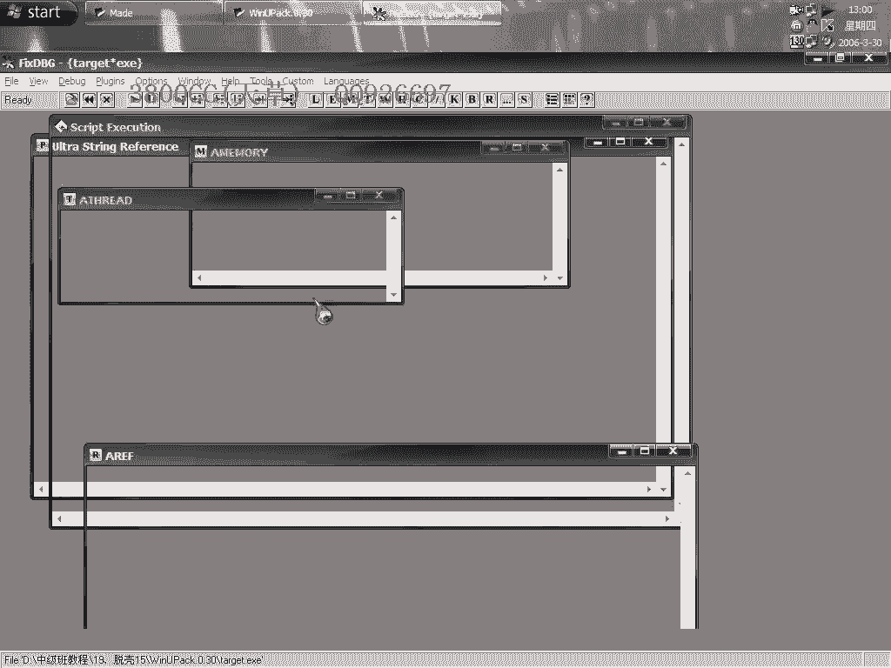
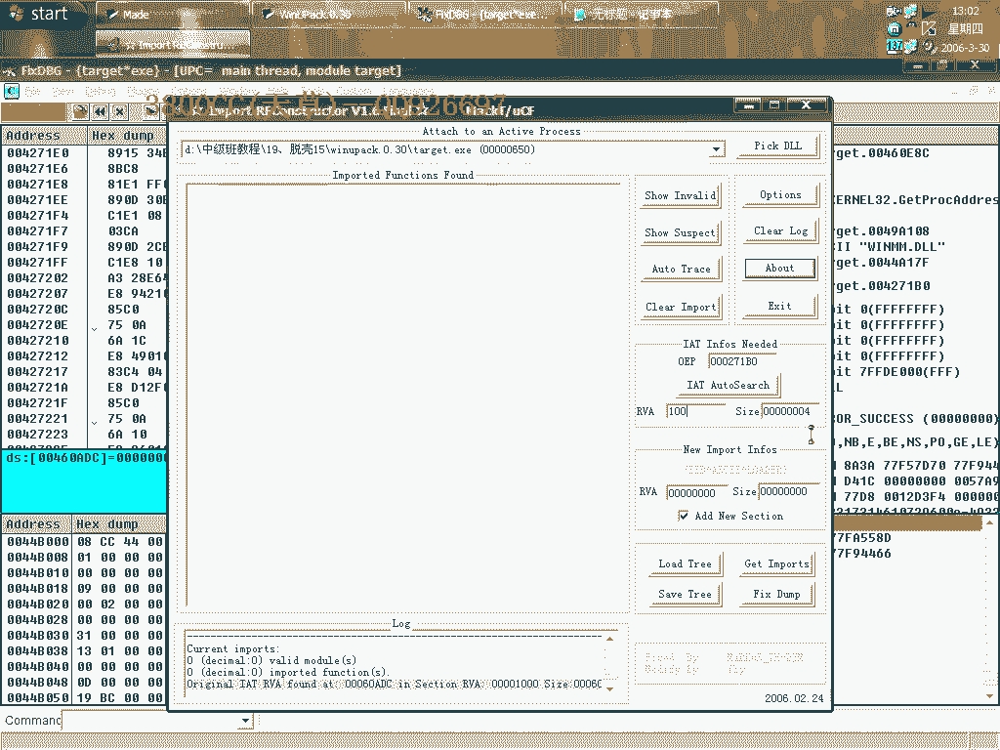
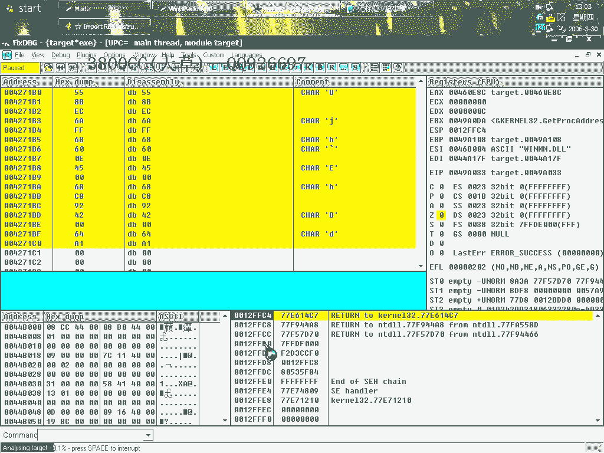
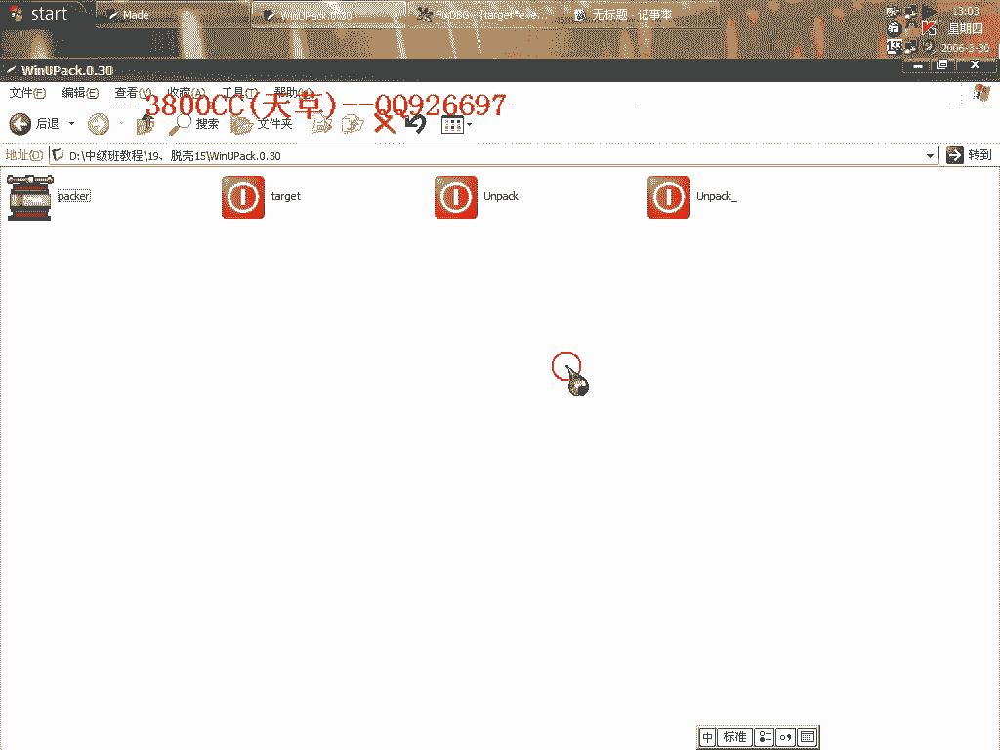
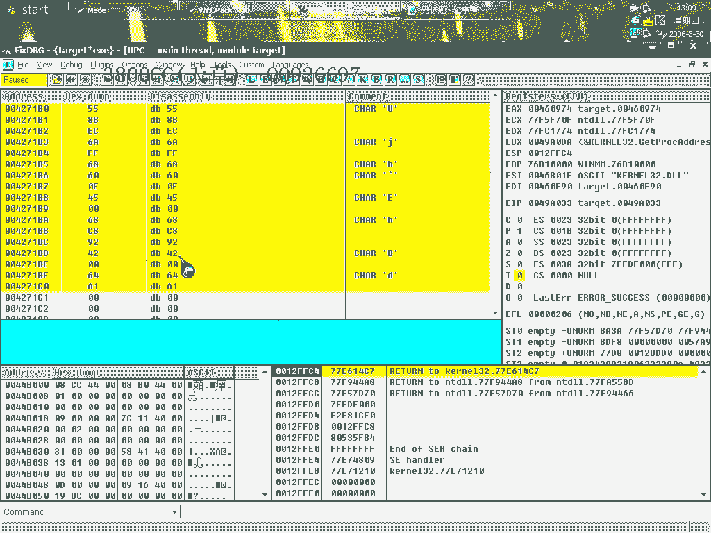
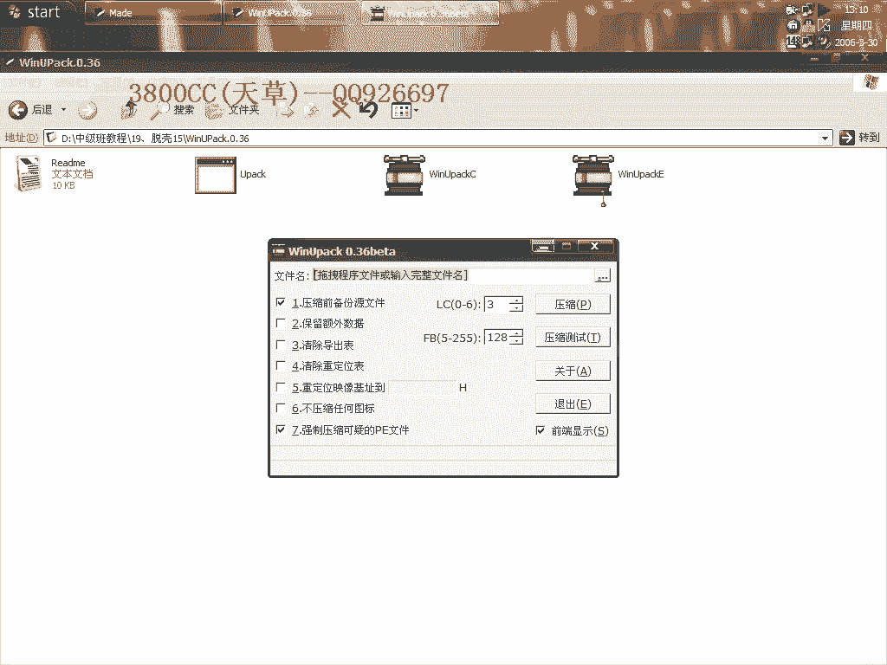
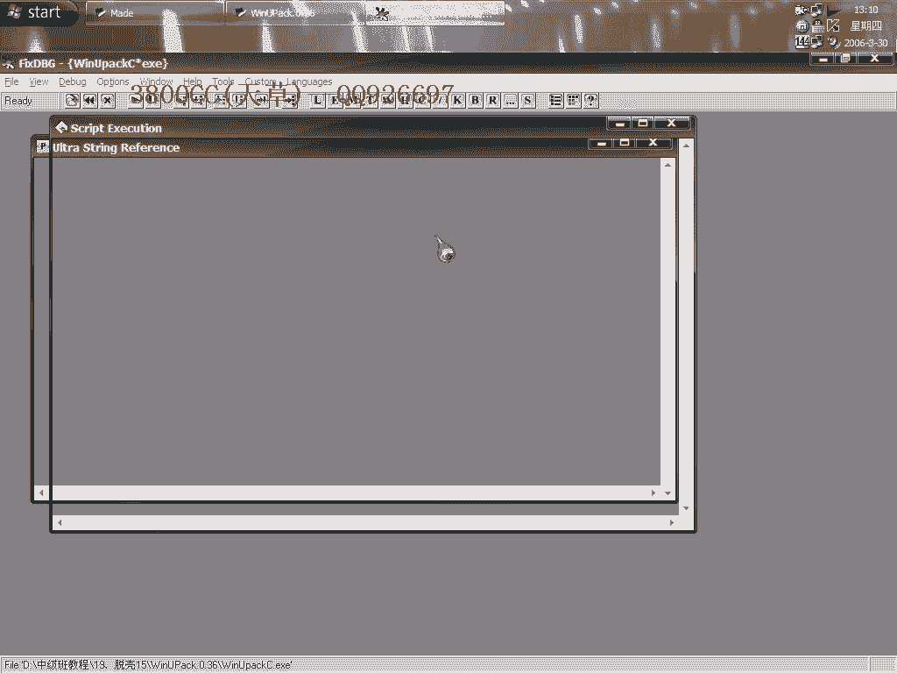
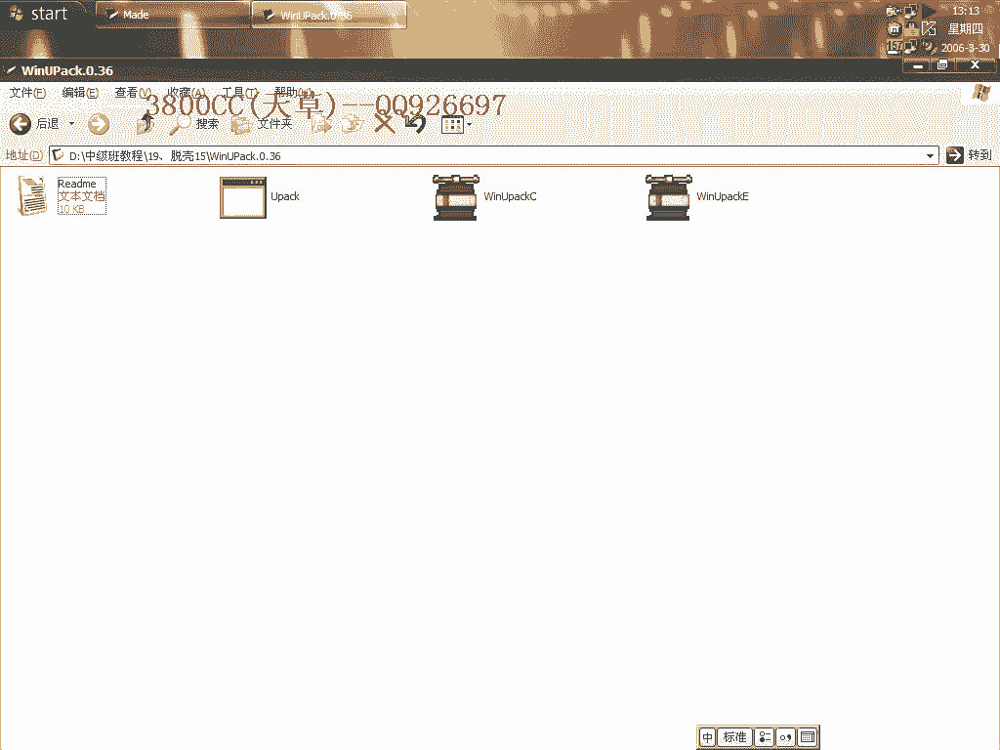

# 天草中级班 - P19：第19课 - 白嫖无双 🛡️

在本节课中，我们将要学习软件脱壳的思路与方法，特别是如何通过手动调试来发现关键特征并设置断点。我们将以两个具体版本的加壳软件为例，演示从载入程序到找到原始入口点的完整过程。

## 课程概述 📖

本节课的核心是讲解脱壳过程中手动调试的思路。许多脱壳教程会直接给出断点位置，但本节课将解释这些断点是如何被发现的。我们将通过实际操作，展示如何观察程序行为、识别特征代码，并最终定位到原始入口点。

## 手动调试与特征识别 🔍

上一节我们介绍了课程目标，本节中我们来看看如何进行手动调试。手动调试是发现脱壳关键断点的基础，需要观察程序运行时的指令流，寻找具有规律性或标志性的代码片段。

以下是手动调试的核心步骤：

1.  载入目标程序。
2.  单步执行或跟踪程序代码。
3.  观察寄存器、堆栈和代码段的变化。
4.  记录反复出现或具有特定意义的指令序列。

## 实战演示：定位OEP 🎯

现在，我们进入实战环节。我们将载入一个加壳软件，并通过手动调试寻找其原始入口点。

首先，我们载入目标程序。程序运行后，会连续弹出多个窗口。

在单步跟踪过程中，需要留意代码的特征。例如，在某个时刻，我们可能会发现一段特殊的指令序列，它标志着壳代码即将执行完毕。

当我们看到类似“江湖遗珠楼”这类未实现的调用或特定跳转时，意味着程序逻辑即将发生关键转变。继续跟踪，在弹窗循环结束后，程序会跳转到一个新的地址。

这个新地址就是我们要找的原始入口点。此时，程序的加壳部分已经完成了解密和加载工作，将控制权交还给了原始代码。

找到OEP后，就可以使用脱壳工具进行内存转储，从而得到脱壳后的可执行文件。

## 思路总结 💡

本节课中我们一起学习了手动调试定位OEP的思路与方法。关键在于耐心观察和记录程序运行时的特征，例如特定的API调用序列、循环结构或跳转模式。通过分析这些特征，我们可以推断出壳代码的执行逻辑，并最终找到原始程序的起点。

掌握这种手动分析的能力，有助于理解不同保护壳的工作原理，即使在缺乏现成脚本或工具的情况下，也能独立完成脱壳任务。