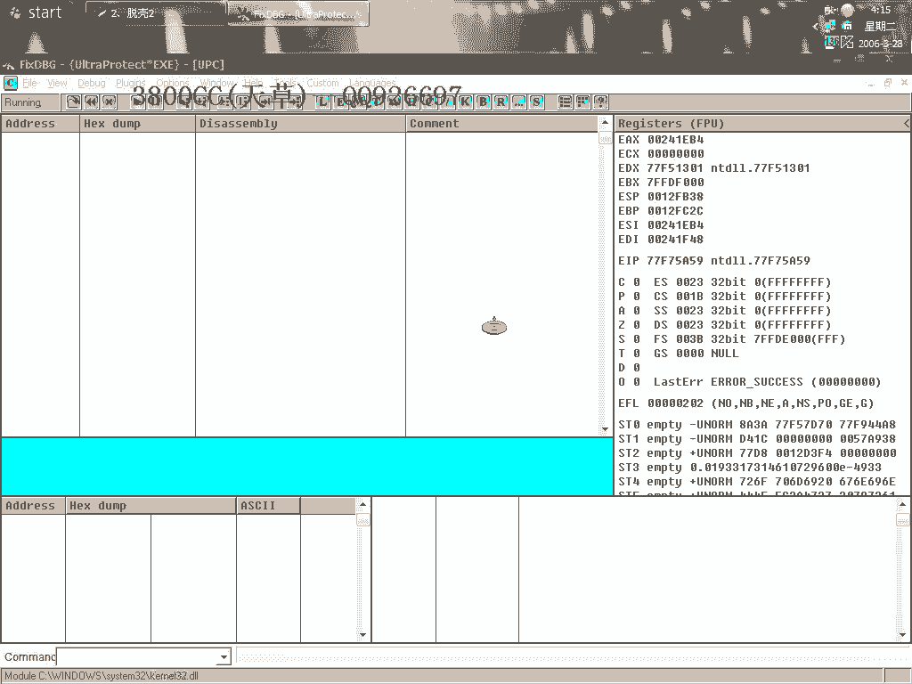
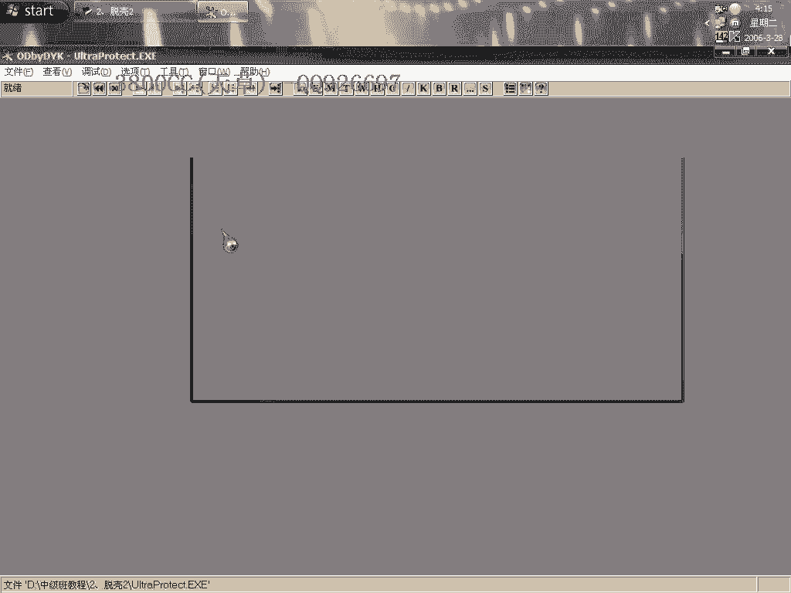
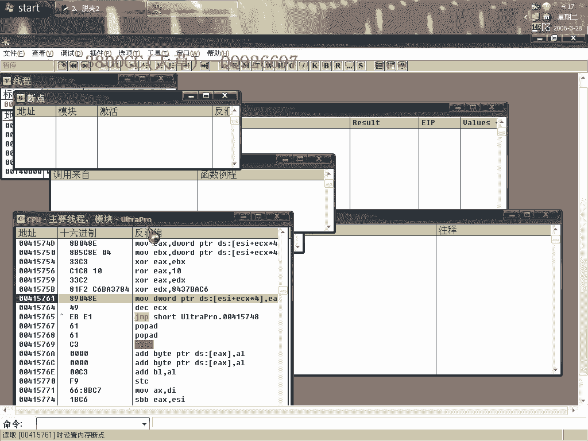
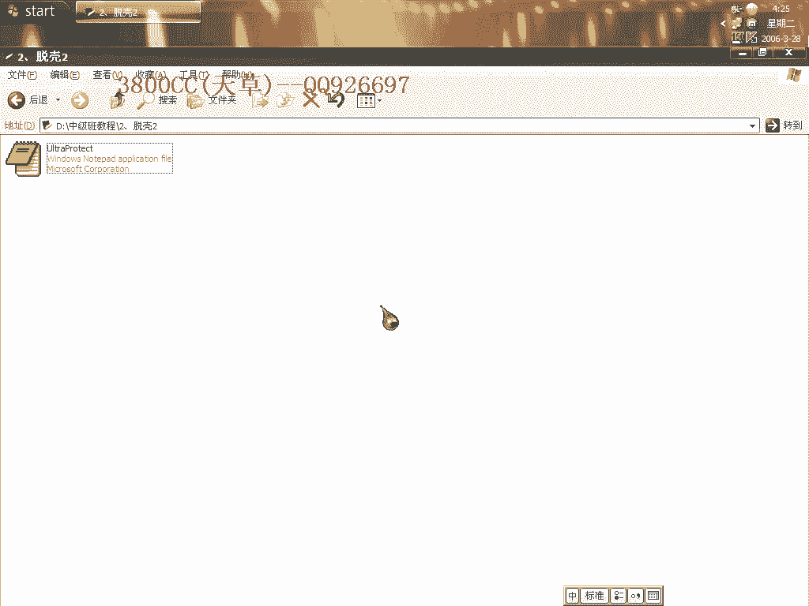

# 天草中级班 - P2：第02课 - 白嫖无双 - BV1qx411k7kd

大家好，現在來講我們第二課的托課，中級班的，這個目標程序是一個即時本加科的，用PID查的是這麼一個課，其實這個課，大家看到主要是這個區段的，區段跟，就是ASProtect，ACProtect。

這是一個一個的，因為原先的ACProtect的名字就是叫這個名字了，最後改了，但是PID就是說在一些標誌數據裡面沒有改過來，這個是沒什麼關係的，那好，我們先來，就是方法，托課的一個方法。

就是常規方法，首先，忽略，除了內存訪問之外的所有異常，這個勾也不要打上，這個我現在用中文的來做吧，大家看到了，這個沒有解碼。

就是只有這個勾，還有這個勾都去掉，然後隱藏一下OD，直接運行，這樣它就運行起來了，我們來分析一下，啊，不代碼分析一下，不代碼分析一下，忽略，它這樣就直接中斷在最後一次內存異常了，我們在這裡呢。

大家看到對戰有一個巨兵，數據窗口跟隨，然後選上這四個，直接內存訪問，再按Shift，鍵盤上的Shift+F9，等一下啊，我們把這個分析從模塊中刪掉，再來下斷點，再Shift+F9。

同樣在這個地方下好斷點，再一次Shift+F9，我們現在刪除所有的斷點。

在這個地方F4，因為像這個殼的話，它會把程序的入口給弄掉，我們可以這個樣子來看一下，先去看一下吧，在這裡下斷點，大家看到了，它就是把這個入口給弄掉了，在Torque裡面把它叫做VM。

這個也叫做Stolen Code，就是偷取的字節，偷取的數據，那我們現在要找到這些數據，手段是那麼幾個手段，但是我跟大家已經說過很多次了，要對程序的語言熟悉。

關於這個殼的查找Stolen Code的方法，大家看好，到這裡來了之後，數據窗口跟隨，同樣內存訪問一場，下好斷點，再下好斷點，同時刪掉兩個F4斷點，加上一個內存訪問斷點，這個時候在這個REND段位。

F4，這個時候就是我們來查找Stolen Code的一個最佳時機，大家再清楚一點，就是除了BC++，還有匯編的，這兩種語言，其他的語言入口是Push，都是以Push，EBP來說的，那我們就先來看這樣。

用設置條件，這裡MINI是一個Push，EBP，然後調試，跟蹤進入，大家看到OD在提示跟蹤，就是說這種殼的，現在1。41版本的，版本高了一點的時候，就查找這個Stolen Code的方法不一樣。

後面也會給大家講到，關於1。41怎麼去查找這個Stolen Code，當然這個要求大家對語言特徵，各種語言特徵的入口要非常非常熟悉，停在這裡了，很明顯了，這三個，就是Stolen Code。

進去複製一下，好，這個時候我們來到這裡面，大家看到了，有幾個字節，被偷取了六個，那我們往上面數，數六個，1，2，3，這裡有五個，這裡我們把它給LOOP掉，從這裡有六個字節，然後右鍵，這樣就可以了。

然後在右鍵，此處新建EIP，我們來用OD的拖把插件來拖，注意這裡，方式，這個重建輸入表，不要選了，現在來修復，OEPC10CC，有98個無效，這裡我們有，這個插件可以來修復，因為用等級1修復不了。

我們等一下用等級3來修復一下，這裡有問題，這裡顯示無效，這個大家應該非常清楚了，雙擊進去，這裡是MASKBP，下面接著的應該是，Boxer，看到了吧，因為這個是一個慣例，因為像這個殼，就是這個殼對這個。

MASKBOX A，這個，它處理比較麻煩，它會對它進行處理，所以一般剩下的指針就是它了，我們來修復一下，看一下有沒有什麼，可以運行的，另外我們來用等級3來修復一下，等級3，大概這個樣子吧，很明顯。

我們載入，先把這個關掉，我們來載入這個進程，重新載入這個進程看一下，10CC，我們選一個用等級3的就知道，很卡，沒響應了，所以我們打開這個加卡程序，選擇這個加卡程序的這個進程，有兩個。

上面一個就是我們剛才打開的加卡程序的進程，現在我們用等級3，可以修復，大家看到了，我這一段一段的修復，就是怕我這裡又卡死了，一段一段的修，當然我們也可以，這個樣子打開加卡程序之後呢，用那個。

用這個插件也可以試一下，看一下插件行不行，也可以啊，大家看到了，我們來看一下，我們剛才說的那個是，Meshbox A，用等級3修復的也是這個，這個是這個殼的一個處理的一個慣例，他都會去處理這個殼。

這個指針的，這個後面也會給大家著重，多次講到，因為我打算，關於這個殼的一些討客，我打算多講幾個，因為現在的一些，就是潮流而言的話，這款還是用的比較多的，用的比較多的，好了今天這個課程就到這，再見。

