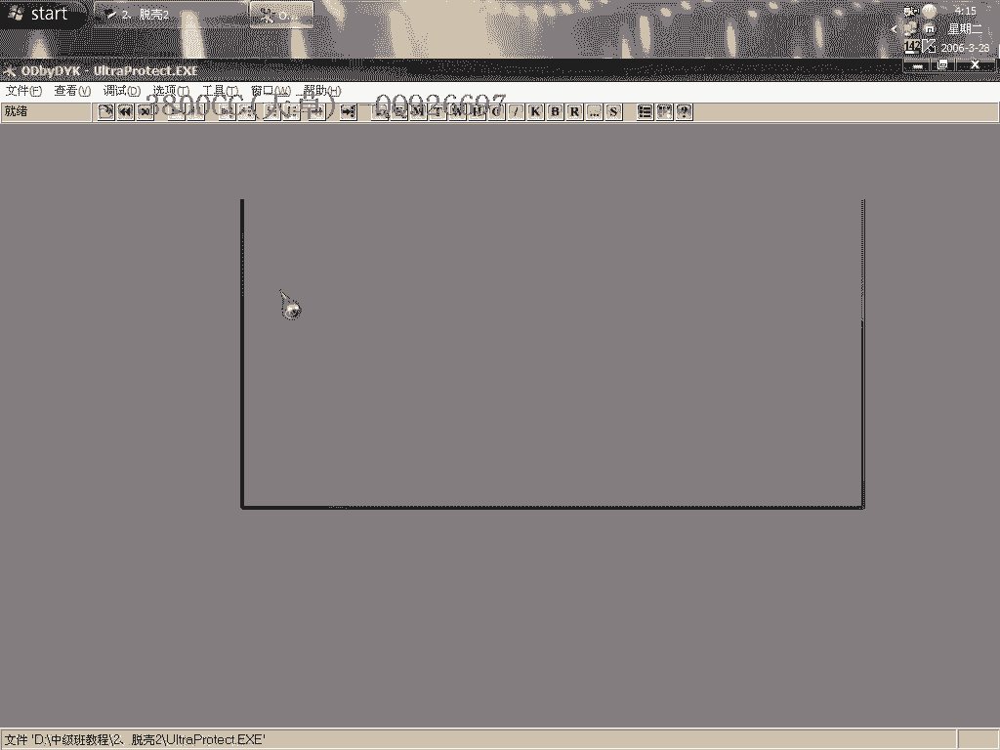
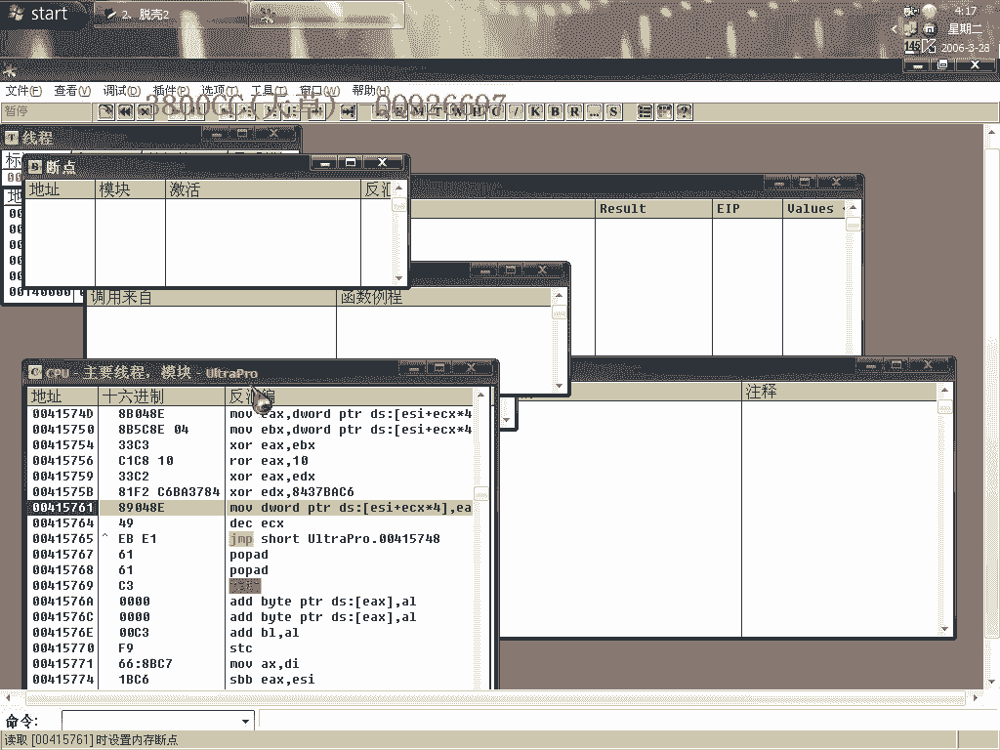
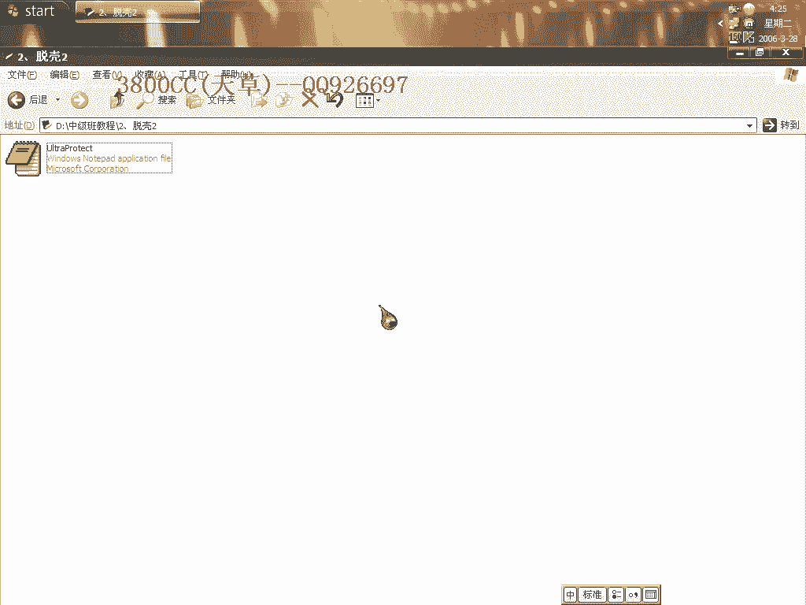

# 天草中级班 - P2：第02课 - 白嫖无双 - BV1qx411k7kd 🛡️

在本节课中，我们将学习如何对一个使用ASProtect（ACProtect）加壳的程序进行脱壳。我们将从设置调试器异常选项开始，逐步定位并修复被壳偷取的原始程序入口代码（Stolen Code），最终完成输入表的修复，使程序能够正常运行。

---

## 调试器设置与运行

上一节我们介绍了课程目标，本节中我们来看看如何配置调试环境以启动加壳程序。

首先，需要设置OllyDbg（OD）的异常选项。以下是具体步骤：

1.  在OD中，打开“选项”菜单下的“调试设置”。
2.  在“异常”选项卡中，勾选“忽略在以下范围之外的异常”。
3.  确保只勾选“内存访问异常”这一项，其他所有异常选项（如“内存写入异常”）均应取消勾选。
4.  设置完成后，隐藏OD，然后直接运行程序。

这样操作后，程序将运行起来，并会在遇到内存访问异常时中断。

---

## 定位最后一次异常

程序运行后，我们需找到其最后一次内存异常发生的位置，这是接近原始代码的关键一步。

1.  程序中断后，观察堆栈窗口。
2.  在堆栈中找到一个较大的返回地址（巨兵），在数据窗口中跟随此地址。
3.  选中跟随地址处的四个字节，右键设置“内存访问”断点。
4.  按 `Shift + F9` 键，让程序继续运行并忽略异常，直到触发刚设置的内存访问断点。
5.  到达断点后，删除所有现有断点。

---

## 查找被偷取的代码（Stolen Code）

找到关键断点后，我们开始寻找被壳隐藏或修改的原始程序入口代码。

1.  在当前位置按 `F4` 键运行到所选位置。这是因为此类壳会破坏程序的原始入口点（OEP），这个行为在脱壳领域常被称为“虚拟机”（VM）或“偷取代码”（Stolen Code）。
2.  要找回这些被偷的代码，需要对不同编程语言的程序入口特征有基本了解。除了BC++和纯汇编程序，大多数高级语言编译的程序入口通常是 `Push EBP`。
3.  在OD中打开“运行跟踪”功能，设置条件为指令等于 `Push EBP`，然后进行跟踪。
4.  OD会逐步跟踪并停在符合条件的指令处。对于当前这个壳的版本，停在 `Push EBP` 附近的几条指令，很可能就是被偷取的原始入口代码。
5.  记录下这几条指令的字节。返回之前的内存断点处，向上回溯数出相同数量的字节，将这部分字节用NOP指令（`0x90`）填充。
6.  在填充结束后的地址处，右键选择“此处新建EIP”，将程序执行流设置到此。

---

## 修复输入表与程序转储

成功定位并修复OEP后，最后一步是修复程序的输入表，并最终导出可执行文件。

以下是使用OD的脱壳插件进行修复的步骤：

1.  使用插件的“转储”功能。注意，在选项中**不要勾选“重建输入表”**。
2.  点击“修复转储文件”，选择刚才转储的程序。插件可能会报告大量无效的输入表函数指针。
3.  尝试用“等级1”进行修复，若无法成功，则改用“等级3”修复。
4.  在修复过程中，可能会遇到指向 `GetModuleHandleA` 或 `GetProcAddress` 的无效指针。这是此类壳的常见处理方式，它会对这些关键API进行特殊处理，导致修复工具无法自动识别。
5.  手动双击无效指针，根据经验，其后的有效指针通常是 `LoadLibraryA`。将此无效指针修正为 `LoadLibraryA` 的地址。
6.  分段进行修复，避免因一次性操作过多导致程序卡死。修复完成后，保存文件。

---

## 课程总结

本节课中，我们一起学习了针对ASProtect/ACProtect壳的完整脱壳流程。

我们首先通过配置OD的异常选项来启动加壳程序，然后利用内存断点技巧定位到壳的解码核心区域。接着，我们依据程序入口的通用特征（`Push EBP`）找回了被壳偷取的原始代码，并修复了执行入口。最后，我们使用脱壳插件转储程序，并通过手动修正关键API指针的方式完成了输入表的修复，最终得到了可以正常运行的程序。

掌握这一流程是理解此类保护机制和进行软件分析的重要基础。