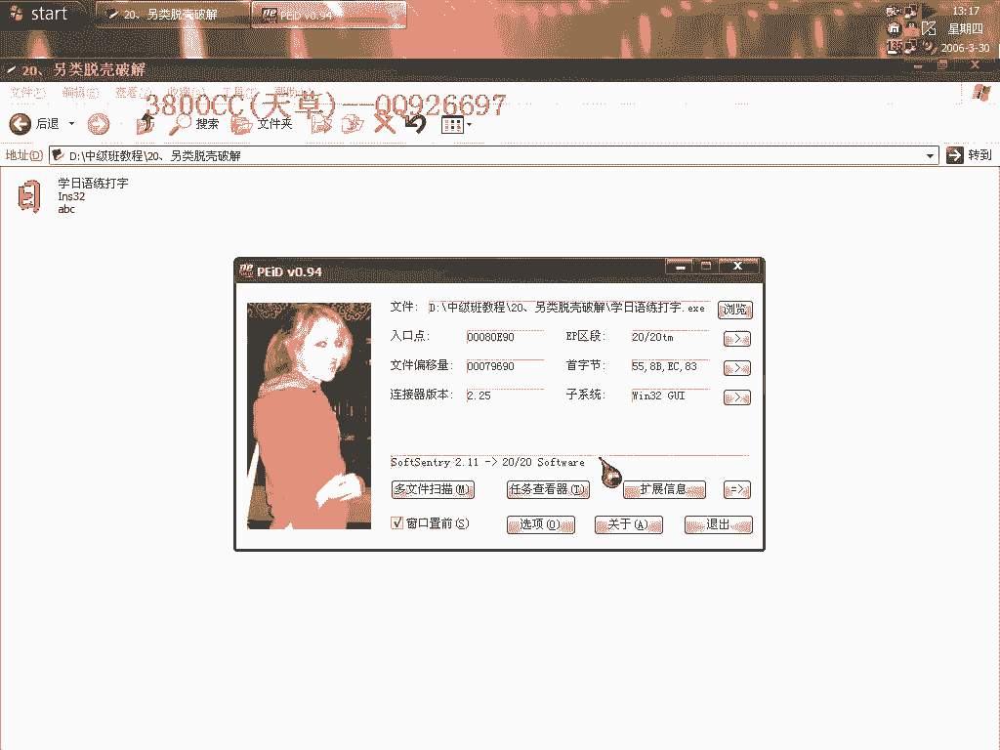
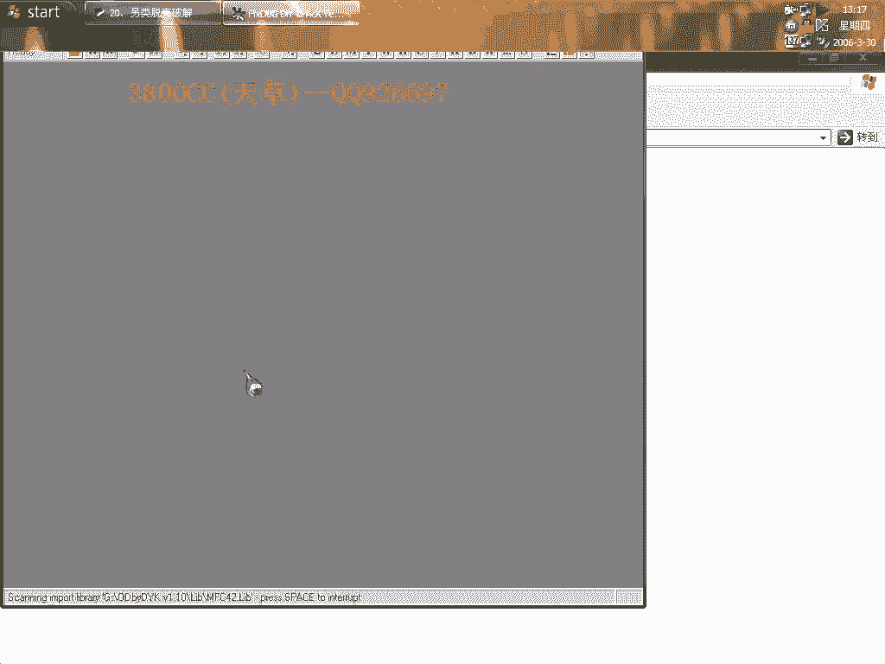
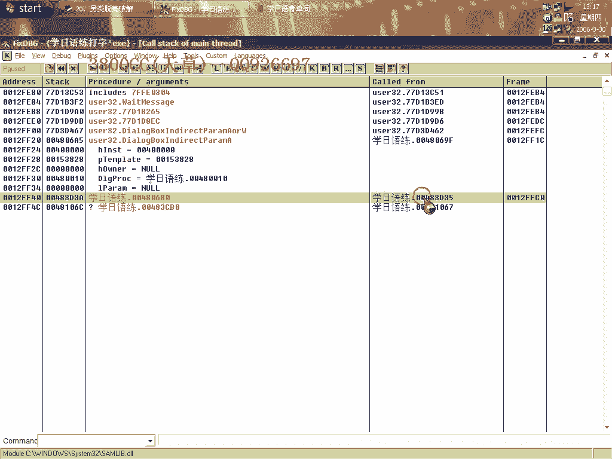
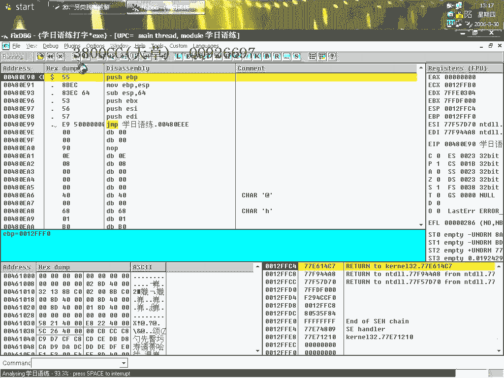
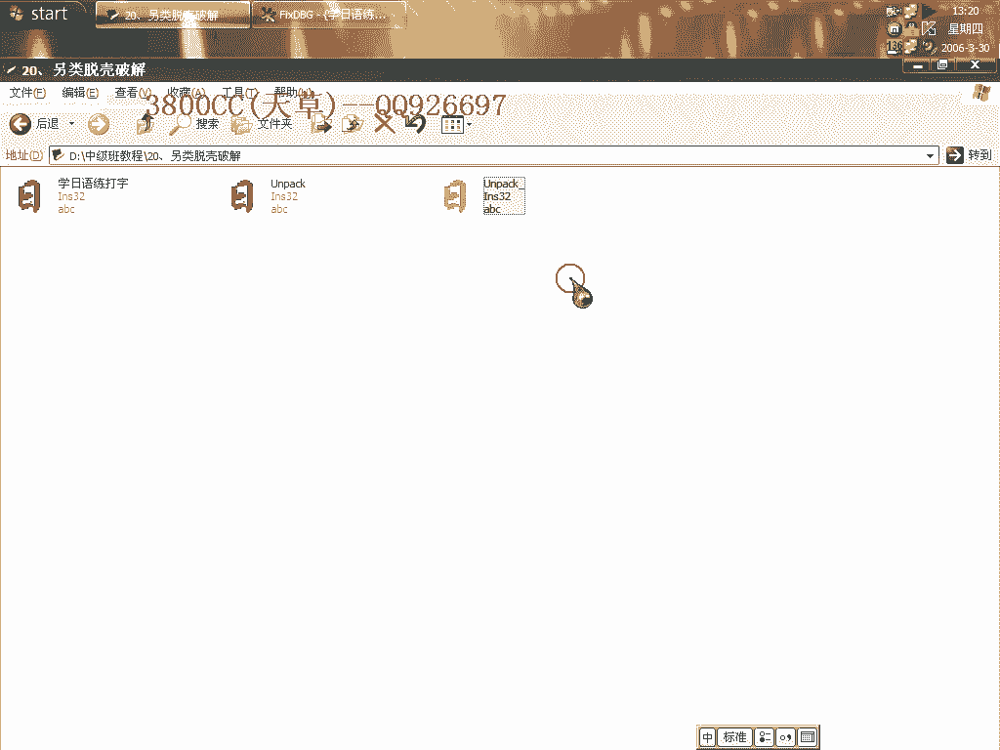
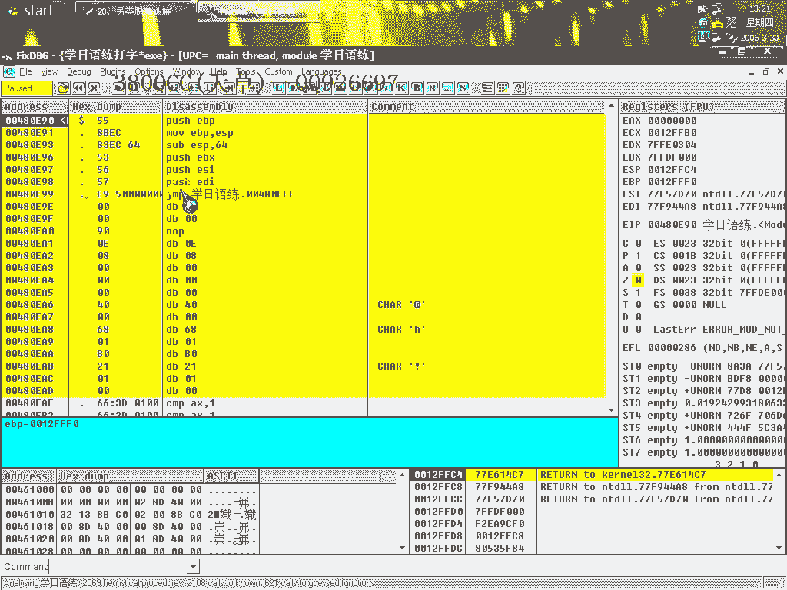
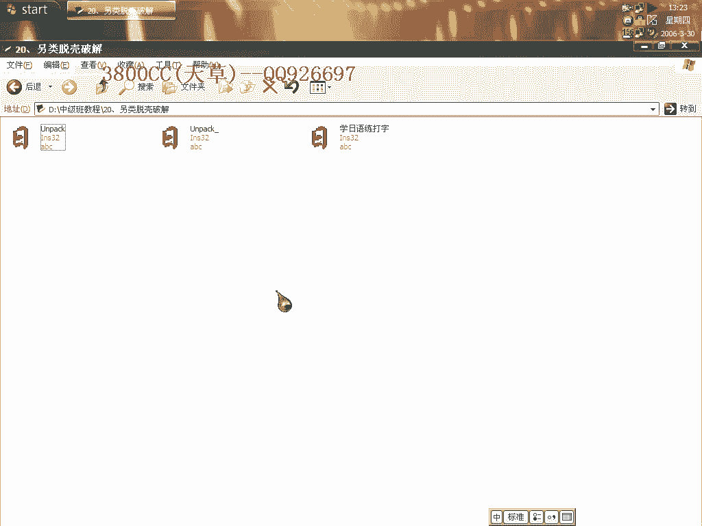

# 天草中级班 - P20：第20课 - 另类脱壳与绕过试用期 🛡️➡️🔓

在本节课中，我们将学习一种另类的软件脱壳与破解思路，核心目标是绕过程序的试用期限制。我们将通过分析程序调用、修改关键跳转来实现目标，而无需直接破解注册机制。

---

## 课程概述 📋



本节课演示如何通过动态调试，定位并修改程序中的关键判断逻辑，从而跳过试用期已到的提示框，使程序能够继续运行。这是一种思路上的启发，旨在拓宽解决此类问题的视野。

---



## 第一步：运行程序并定位调用

首先运行目标程序。程序会弹出一个提示试用期已到的对话框。




我们的目标是消除这个提示。为了高效定位产生此对话框的代码，我们使用调试器的“调用栈”功能（文中提及的F12对战调用方法）来快速定位到相关函数，这可以节省大量搜索时间。




---

## 第二步：下断点并跟踪程序流

在调用对话框的函数处下好断点，然后开始单步执行程序。


当程序执行到弹出对话框的代码时，我们按`F7`键步入该函数内部进行详细跟踪。跟踪过程中需要仔细观察代码的逻辑流向。


---

## 第三步：分析并修改关键跳转

在跟踪过程中，我们会遇到一系列条件跳转指令。这些跳转决定了程序是继续运行还是退出。

以下是关键发现：
*   如果程序执行了某个特定的跳转指令，就会直接退出。
*   因此，我们的目标就是阻止程序执行这个关键的跳转。

第一次尝试时，我们可能任由程序执行，会发现它最终会提示“Fail to run”并退出。这说明我们不允许它完成那个跳转。

解决方案是修改该跳转指令。例如，将条件跳转`JE`（相等则跳转）修改为`NOP`（空操作）或无条件跳转`JMP`，从而改变程序的执行路径。



```assembly
; 修改前，可能跳向退出流程
JE 0x00401000

; 修改后，使其不跳转或跳向继续运行的流程
NOP
NOP
; 或
JMP 0x00401050
```

通过这样的修改，程序跳过了退出逻辑，我们发现了程序的原始入口点（OEP）。这意味着我们不仅绕过了试用提示，也完成了脱壳。




---

## 第四步：使用单步法验证思路

上一节我们通过修改关键跳转绕过了保护。本节我们用最基础的“单步法”来重新验证这个过程。

单步法的目的是仔细跟踪每一条指令，观察程序状态变化。第一次调试时，我们可能允许程序正常运行并记录下关键点（如弹出对话框的位置）。第二次调试时，就可以有针对性地在关键点进行干预。


同样，在遇到那个会导致退出的关键跳转时，我们运用刚才的思路进行修改。如果不修改，程序就会退出。修改后，程序得以继续执行。

这个方法的核心在于识别出程序流程中的“决策点”，并通过修改CPU指令来影响决策结果。

---

## 总结与思路拓展 💡

本节课我们一起学习了一种绕过软件试用期限制的另类方法。我们通过动态调试定位到程序的核心判断逻辑，并通过修改一个关键的条件跳转指令，成功地让程序跳过了试用期检查。

关键公式可以概括为：
**`拦截关键跳转 -> 修改指令 -> 改变执行路径 -> 达成目标`**



这种方法的应用范围取决于具体软件的保护方式。本课程的主要目的是提供一种解题思路：在面对软件保护时，除了直接破解算法，还可以从程序流程控制的角度入手。许多解决方案依赖于灵活的思考和细致的观察。

