# 天草中级班 - P21：第21课 - 白嫖无双 - BV1qx411k7kd 🔓

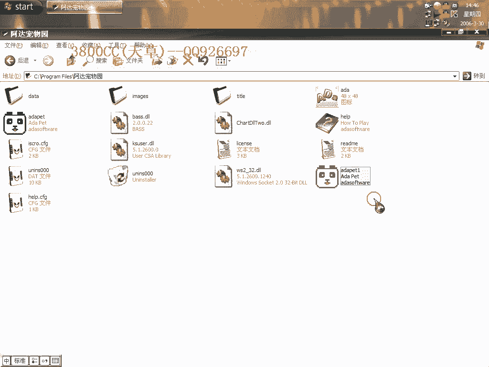

在本节课中，我们将学习如何破解一款名为“阿达宠物园”的VB程序。我们将从分析程序结构开始，逐步定位其注册验证机制，并最终找到破解的关键点。整个过程将涉及静态分析、动态调试以及关键跳转的修改。

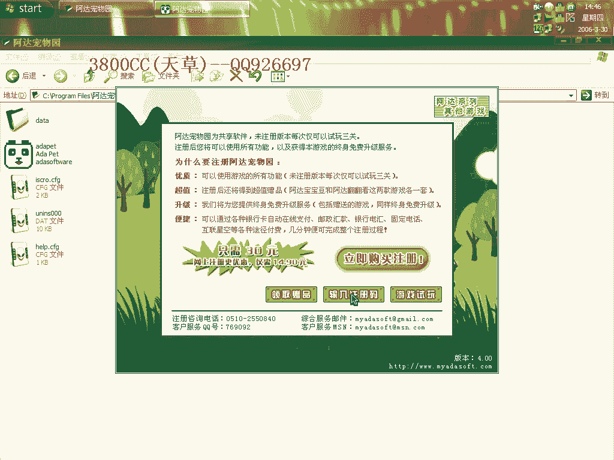

---

## 程序初步分析 🧐

首先，我们载入“阿达宠物园”的原程序。该程序没有加壳，但阿达系列的游戏通常会加ASI ProType的壳，这个程序是个例外。


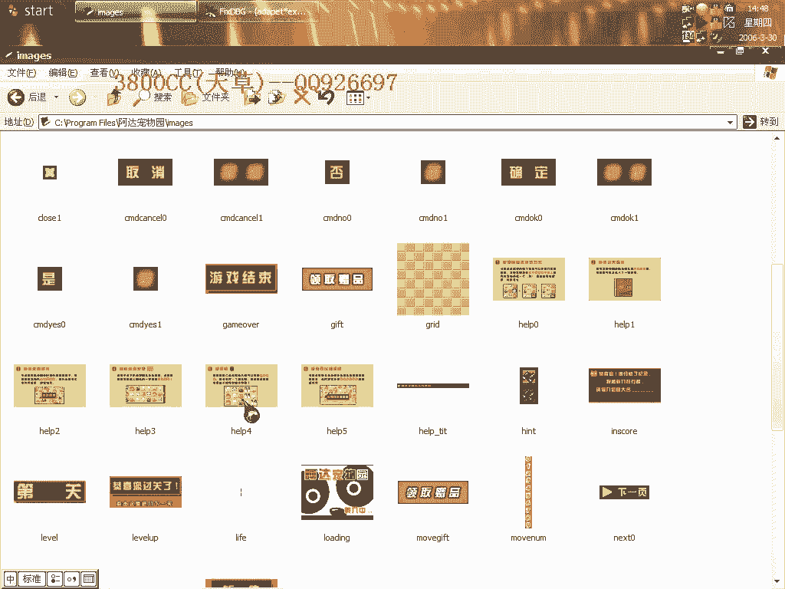

上图是未破解的程序界面。我们的目标是使其无需注册即可直接运行，如下图所示。


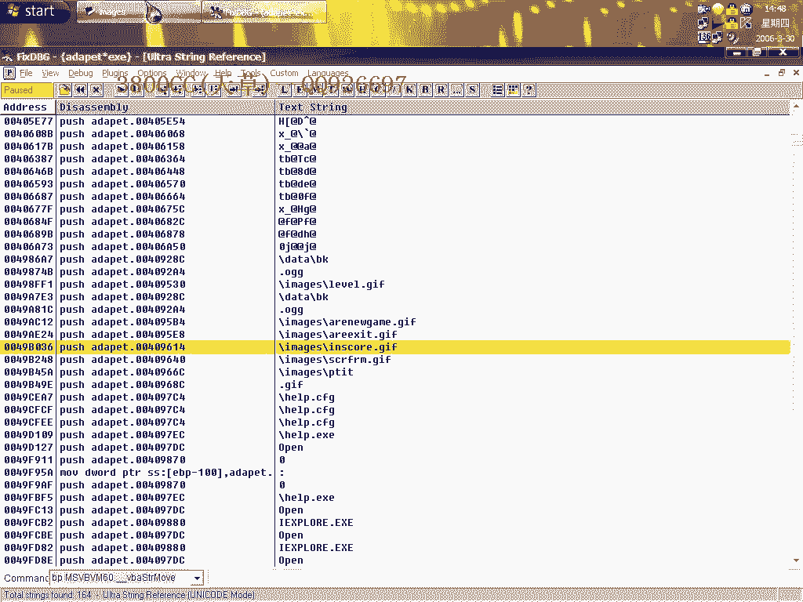


上一节我们介绍了目标程序，本节中我们来看看如何开始分析。首先尝试常规的字符串搜索方法，但程序没有明显的错误提示信息。

## 定位关键字符串 🔍


由于是VB程序，字符串通常以Unicode（宽字符）形式存储。因此，我们需要在调试器中搜索Unicode字符串。


以下是搜索到的可用信息，其中包含程序启动时加载的一些资源名称。


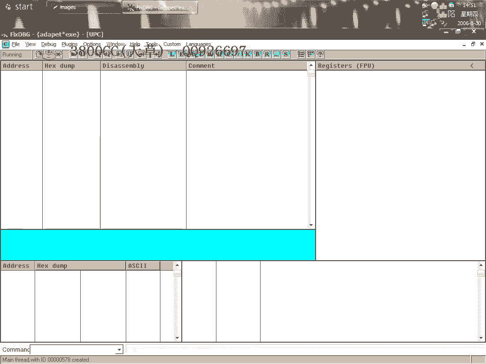

在这些字符串中，我们发现了“Rage”等字样，这可能是注册验证相关的关键模块。


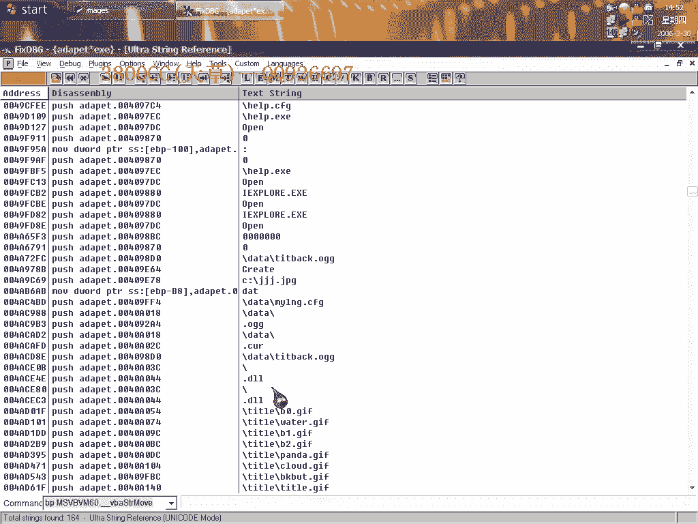

我们尝试查找调用或加载这些字符串的代码位置。

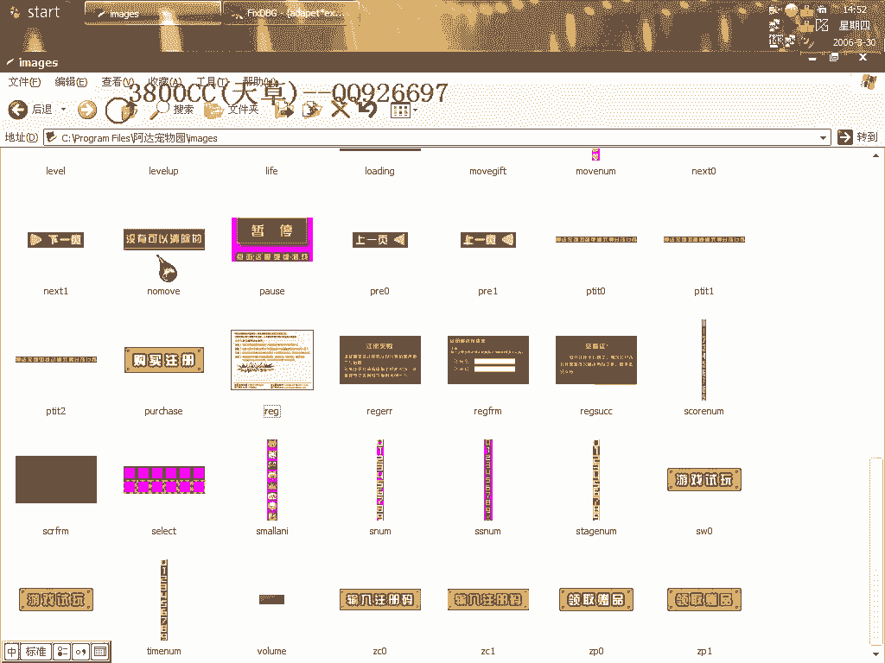


通过搜索引用，我们定位到加载相关图片和资源的代码段附近，地址在 `B5A88` 左右。


## 分析程序启动流程 🔄

程序启动时，会先加载主界面资源。如果检测到未注册，则会加载注册提示框。我们的思路是找到加载注册框之前的判断逻辑。

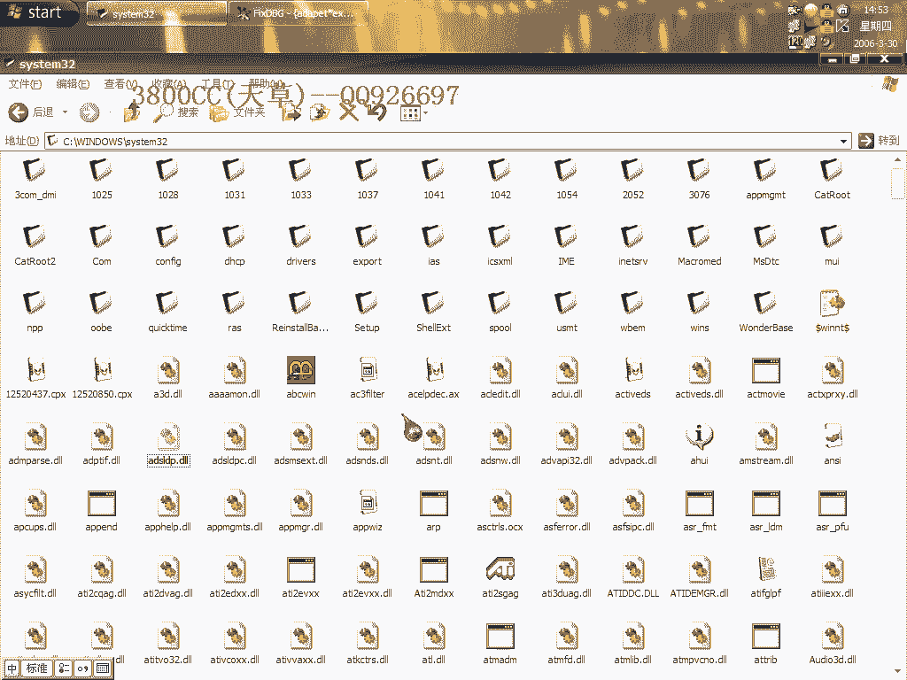

以下是程序启动时加载资源的部分代码顺序。


程序首先加载主界面元素（如 `B0 Title`），然后根据注册状态决定是否加载注册框。


我们在加载注册框之前的代码区域下断点，以分析验证逻辑。

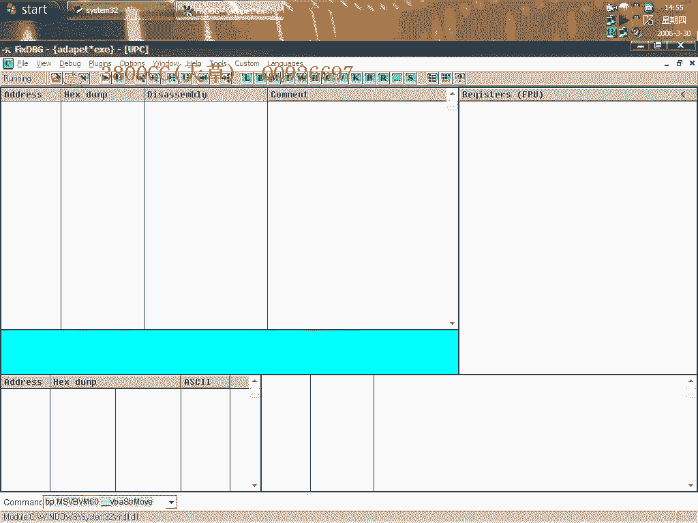


## 深入动态调试 🐛

程序断下后，观察寄存器状态。发现程序反复操作一个名为 `SCAT` 的DLL模块。


这个DLL的行为非常可疑。程序持续围绕它进行操作，包括多次清零寄存器（如 `ECX`、`EDX`）和进行比较。

以下是关键的分析步骤：

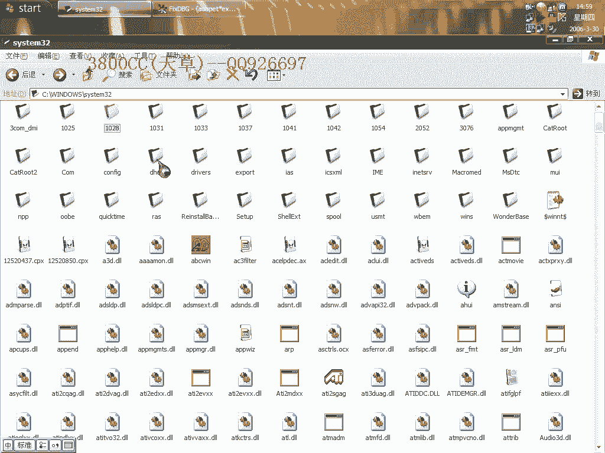

1.  **清零操作**：一个 `call` 指令的目的被证实是将 `ECX` 和 `EDX` 等寄存器清零。
    ```assembly
    ; 示例：清零操作
    XOR ECX, ECX    ; ECX = 0
    XOR EDX, EDX    ; EDX = 0
    ```
2.  **虚假操作**：后续有许多指令是无效操作，例如将0移入本身已经是0的寄存器。
    ```assembly
    MOV EAX, 0      ; 无意义的操作，EAX可能本就是0
    ```
3.  **核心循环**：程序陷入一个循环，不断比较和操作与 `SCAT.DLL` 相关的数据。

如果一个程序持续、高强度地操作某个特定DLL，那么这个DLL很可能就是负责注册验证的核心模块。

## 定位并修改验证点 ⚙️

通过逐步缩小范围，我们最终将目标锁定在一段比较和跳转代码上。这段代码决定了程序是否弹出注册框。

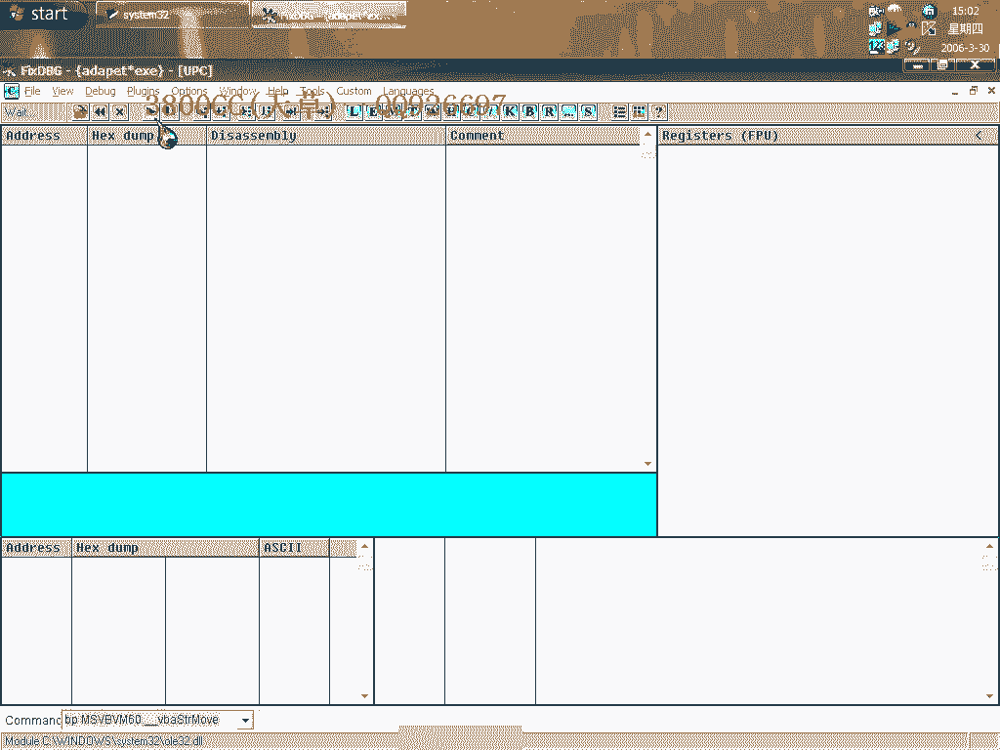

我们尝试修改相关寄存器的值来影响跳转结果。例如，将决定跳转条件的 `ECX` 值从0改为1。

```assembly
; 原始可能代码
CMP ECX, 0
JE SHOW_REGISTER_BOX ; 如果ECX==0，则跳转到显示注册框


; 修改思路：让ECX不为0，从而使跳转不成立
MOV ECX, 1
```

我们在关键地址设置硬件断点，以防止断点被清除，然后进行多次尝试。


经过多次单步跟踪和值修改测试，我们发现将某个关键比较的结果从“相等”改为“不相等”，可以绕过注册检查。


在修改成功后，程序不再加载注册框，而是直接进入了游戏主界面。

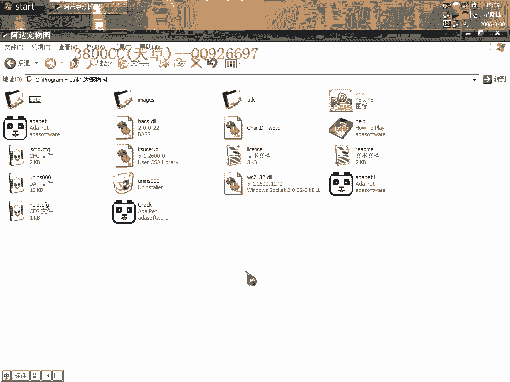

## 总结 📝

本节课中我们一起学习了如何破解一个VB编写的“阿达宠物园”游戏。整个过程可以总结为以下几步：


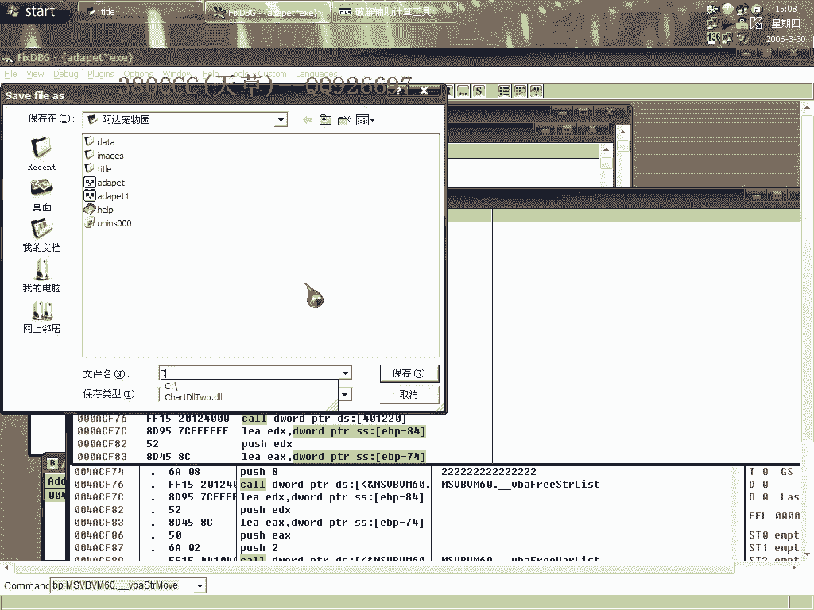

1.  **静态分析**：确认程序无壳，并搜索Unicode字符串寻找线索。
2.  **动态调试**：通过下断点分析程序启动流程，定位注册验证触发点。
3.  **聚焦核心**：发现程序反复操作一个特定DLL（`SCAT.DLL`），判断其为验证核心。
4.  **逆向修改**：通过动态跟踪，找到关键的条件判断指令，并修改寄存器值或跳转逻辑，从而绕过注册验证。


破解过程需要耐心和多次尝试，特别是对于这种验证逻辑较为隐蔽的程序。关键思路在于**观察程序的异常行为（如反复操作某模块）**，并**逐步缩小关键代码的范围**，最终实现对验证机制的绕过。