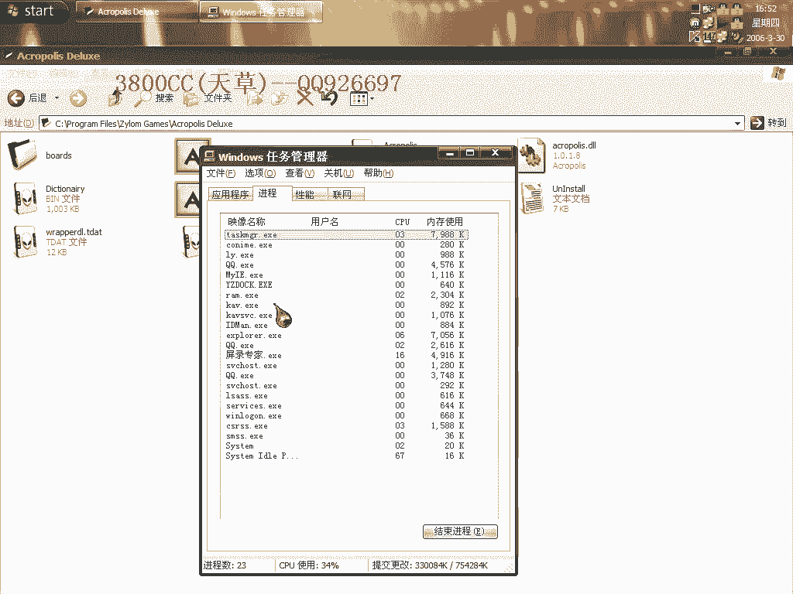
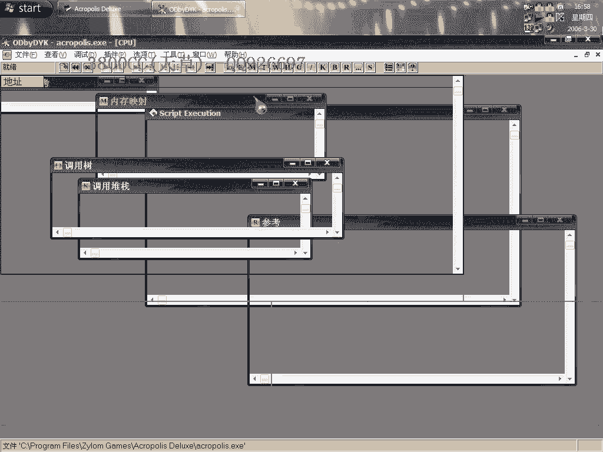
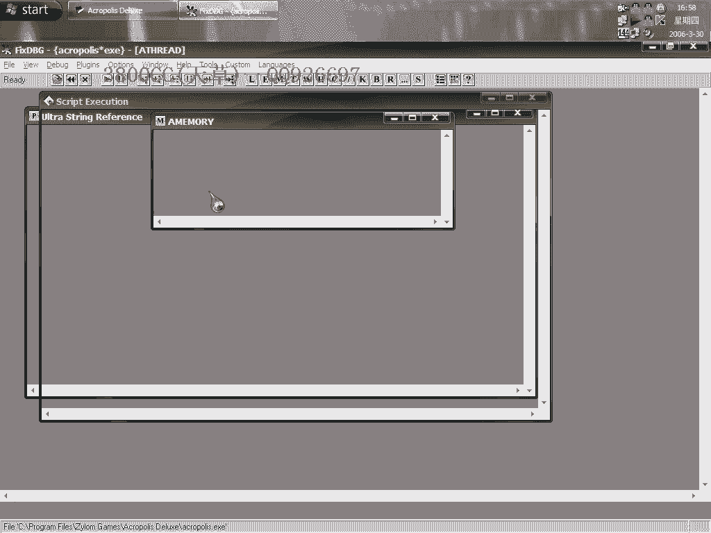

# 天草中级班 - P22：第22课 - 白嫖无双 - BV1qx411k7kd 🛡️

在本节课中，我们将学习如何对一个名为“Lineage”的国外小游戏进行破解。该游戏在试用版中存在时间限制。我们将通过分析其程序结构，定位并脱壳核心的DLL文件，最终绕过这一限制。

## 程序结构与初步分析 🧐

首先运行游戏。启动游戏后，会弹出一个提示框，显示试用版剩余时间：“You can play for 59 minutes in the trial version”。

细心观察任务管理器中的进程列表，会发现程序载入后，除了主EXE文件，还有一个DLL文件在运行。这表明游戏的主要逻辑可能封装在DLL中，而EXE程序只是一个启动外壳。

从文件大小也能佐证这一点：EXE文件约为396KB，而DLL文件超过700KB。

## 使用调试器定位DLL 🛠️

对于这类程序，我们可以使用调试器（如OD）进行分析。首先，用OD载入游戏的EXE文件。

为了让程序运行起来并将DLL的所有资源释放到内存中，我们需要下一个特定的断点。这个断点是 `LoadLibraryA` 或 `LoadLibraryExA`。其作用是拦截程序加载动态链接库的行为。

在OD中下好断点后，按 `Shift + F9` 运行程序。此时，EXE外壳程序界面会出现。点击“开始游戏”。

随后，程序会中断在断点处。观察OD的寄存器窗口（例如EAX），其值会发生变化。连续按 `Shift + F9` 运行并中断几次，直到寄存器值不再变化，且鼠标光标恢复正常。这通常意味着DLL已完全解码并加载到内存中。

## 从内存中提取DLL文件 💾

当确认DLL已完整加载后，我们需要将其从进程内存中提取（脱壳）出来。

打开LordPE工具，在进程列表中找到游戏进程。右键选择该进程，然后点击“完整转储”。在保存时，将文件后缀名从默认的 `.dll` 改为 `.exe`。

接着，结束原游戏进程。尝试运行我们刚转储出来的新文件。此时可能会发现程序无法运行。

## 解决转储文件无法运行的问题 🔧

程序无法运行可能有多种原因。我们需要返回OD，重新进行调试和转储操作。

重新载入EXE，下相同的断点。关键在于中断后需要按 `Shift + F9` 运行**三次**（具体次数需通过调试跟踪确定，本例中为三次）。在第三次中断后，DLL才处于完全解压、可被正确转储的状态。

再次使用LordPE进行完整转储，并保存为 `.exe` 文件。如果仍然失败，可以尝试使用LordPE的“用PID打开进程”功能，或检查程序是否带有反调试机制。有时，转储工具的不同（如使用PETools）也可能影响结果。

如果转储成功，运行新文件，原先要求注册的启动框将不再出现，意味着时间限制已被移除。

## 核心步骤与注意事项总结 📝

本节课我们一起学习了针对“外壳EXE+核心DLL”结构程序的破解流程。

1.  **分析结构**：通过进程列表和文件大小，识别出核心逻辑在DLL中。
2.  **调试拦截**：在OD中对 `LoadLibraryA` 等API下断点，使程序中断在DLL完全加载的时刻。
3.  **内存转储**：使用LordPE等工具，从进程内存中将完整的DLL转储为可执行文件。
4.  **调试技巧**：关键点是找到正确的转储时机（例如，本例中需在中断后运行三次）。这需要耐心调试和观察。
5.  **工具与反调试**：不同的转储工具可能效果不同。程序可能含有反调试措施，导致过程不稳定，需要多次尝试。

**核心操作代码/命令示意**：
*   下断点：`bp LoadLibraryA`
*   运行至断点：`Shift + F9`
*   转储内存：使用LordPE的“完整转储”功能。

最终，通过提取并修复内存中的DLL映像，我们成功移除了该游戏的试用时间限制。如果不成功，请检查断点位置、转储时机，并多尝试几次。