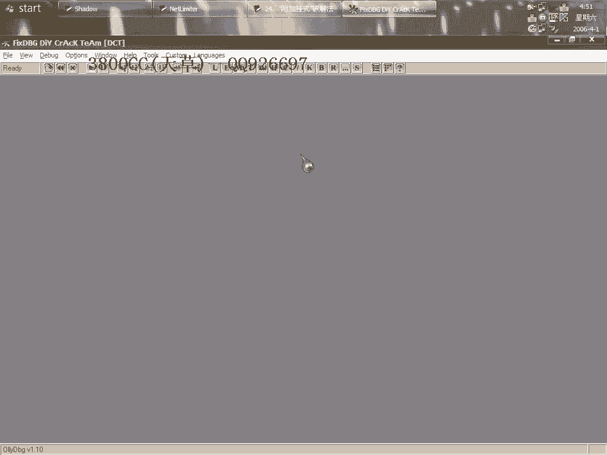

# 天草中级班 - P24：第24课 - 白嫖无双 - BV1qx411k7kd 🔓

在本节课中，我们将要学习一种名为“附加挂式”的破解方法。这是一种通过附加到已运行进程进行动态调试的技术，尤其适用于某些无法直接用调试器（如OD）启动的程序。我们将通过一个具体的软件实例，演示如何定位关键校验点，并使用两种修改方法实现破解。

---

## 概述与问题引入


首先，我们遇到了一个目标软件。该软件本身没有加壳，但存在一个特殊现象：当它在任务栏中已有实例运行时，如果我们尝试用OD直接载入并运行第二个实例，程序会无故退出，导致动态调试无法进行。



上一节我们介绍了调试的基本概念，本节中我们来看看如何应对这种“无法直接调试”的情况。

为了复现问题并达到教学效果，我们需要先运行一个软件实例，并确保它留在任务栏（即进程仍在运行）。此时，再用OD载入同一个程序，会发现程序立即退出，无法正常调试。

---

## 静态分析与关键点定位

既然动态调试受阻，我们首先尝试静态分析，寻找软件注册验证的关键逻辑。

用OD载入程序，直接运行并尝试注册，会弹出一个错误提示。我们的目标是找到判断注册是否成功的关键跳转。

以下是寻找关键跳转的步骤：

1.  在OD中搜索可能的字符串，例如“Register”或错误提示文本。
2.  通过字符串引用，定位到相关的代码区域。
3.  在代码区域分析条件跳转指令，找到决定注册成功与否的判断点。

在本例中，我们找到了一个关键位置。该处代码逻辑是：测试`AL`寄存器的值，如果等于`0`则跳转（显示注册失败），反之则继续（注册成功）。

**核心判断逻辑可以用以下汇编伪代码描述：**
```assembly
TEST AL, AL
JZ   Label_Registration_Failed
```
因此，破解的直接思路是让`AL`的值不等于`0`，或者修改跳转指令，使其必然不跳向失败分支。

然而，简单修改此处可能无效。因为该软件进行了**两次校验**。第一次校验时若修改跳转，可能导致第二次校验逻辑错误。我们需要一个更稳妥的方法。

---

## “附加挂式”动态破解法

当程序无法直接用OD启动调试时，我们可以采用“附加挂式”方法。其核心思路是：将OD附加到已经运行在系统中的目标程序进程上，进行动态调试和修改。

以下是具体操作步骤：

1.  首先，确保目标程序的一个实例已经在运行（并最小化到任务栏）。
2.  打开OD，不要直接载入文件，而是使用 **“附加”** 功能。
3.  在进程列表中选择正在运行的目标程序进程。
4.  附加时，OD可能会弹出一些警告或程序看似退出，这通常是正常的。观察OD的状态栏，会发现程序已中断在系统模块（如`ntdll`）中。
5.  在之前静态分析找到的关键地址处下断点。
6.  按`F9`让程序继续运行，然后在软件界面进行注册操作，触发断点。

成功附加并中断后，我们就能够在动态环境中观察和修改程序逻辑。

---

## 两种破解修改方法

在动态调试环境中中断到关键点后，我们可以实施修改。以下是两种有效的修改方案：

**方法一：修改判断条件**
将决定跳转的`TEST AL, AL`指令修改为`TEST EAX, EAX`或其他确保结果非零的操作，或者直接将条件跳转`JZ`改为无条件跳转`JMP`或相反条件`JNZ`。
```assembly
; 原指令
TEST AL, AL
JZ   XXXXXX

; 修改后（示例1，强制AL为非零值）
MOV  AL, 1
NOP
JZ   XXXXXX

; 修改后（示例2，反转跳转条件）
TEST AL, AL
JNZ  XXXXXX ; 或直接 JMP XXXXXX
```

**方法二：绕过校验逻辑**
直接修改指令，将`AL`的值设置为`1`（或其他非零值），然后继续执行。
```assembly
; 原指令
... (某些操作影响了AL)
TEST AL, AL


; 修改后
MOV AL, 1
NOP ; 或跳过原操作
TEST AL, AL
```


在本次实例中，我们分别尝试了这两种方法，均成功实现了注册。


---

## 方法总结与练习要点

本节课我们一起学习了“附加挂式”破解法。这种方法的核心价值在于处理那些对调试器敏感、无法直接运行调试的程序。


**总结关键点如下：**
*   **适用场景**：程序无法用OD直接启动调试时（如进程冲突、反调试等）。
*   **核心步骤**：先运行程序，再用OD的“附加”功能连接其进程进行调试。
*   **破解逻辑**：结合静态分析找到关键点，在动态附加后修改校验逻辑（如`AL`寄存器值或跳转指令）。

**课后练习时请注意：**
为了模拟真实场景，请先运行目标程序并关闭其窗口（确保进程仍在后台），此时任务栏应有其图标。然后再用OD尝试打开或附加，你将重现“直接运行即退出”的问题。请使用本节课教授的附加方法进行破解练习。

这是一种重要的思路，许多现代软件都采用了类似的保护机制，使直接调试变得困难。掌握附加调试技术能有效应对此类情况。


---
**本节课中，我们一起学习了“附加挂式”破解法的原理、操作步骤和两种具体的修改实现方法。**