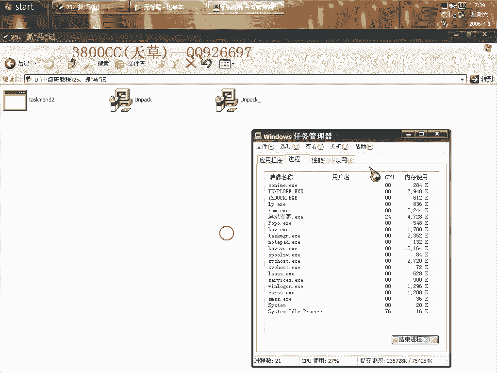
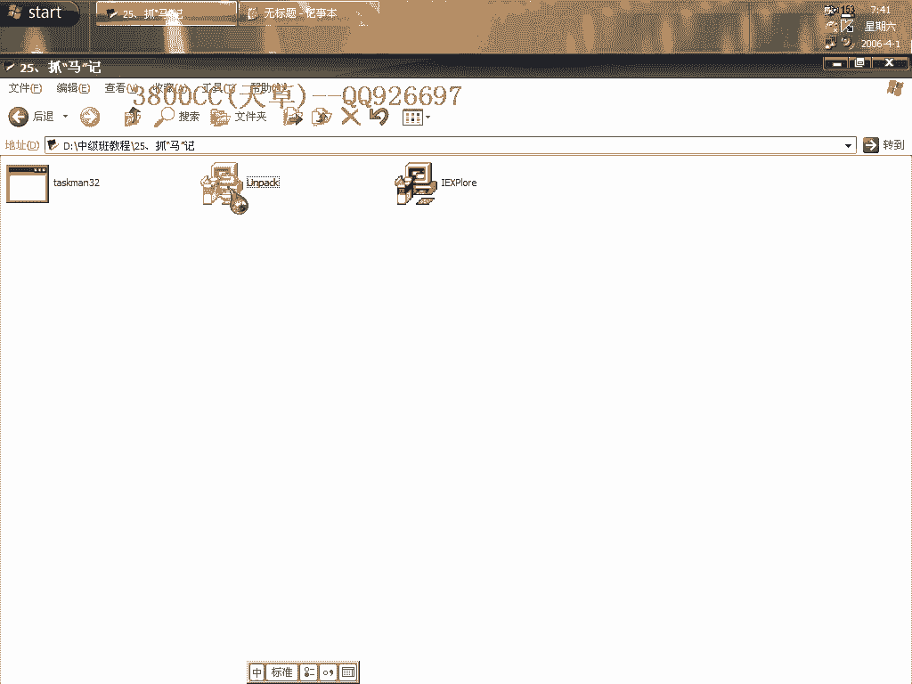
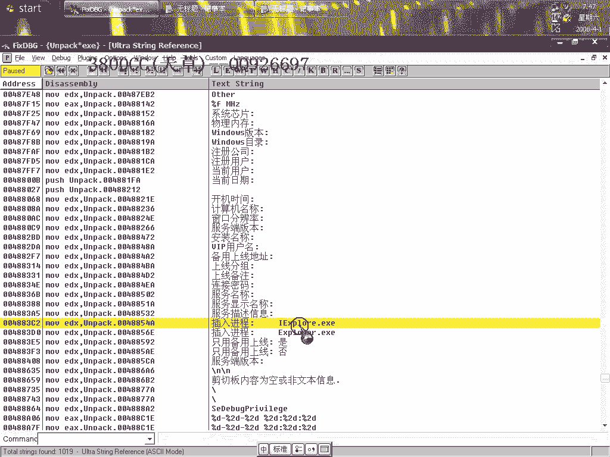
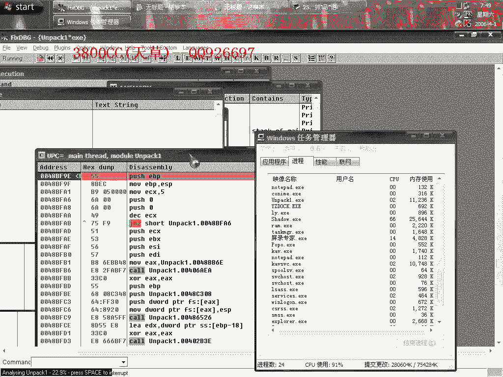

# 天草中级班 - P25：第25课 - 白嫖无双 - BV1qx411k7kd

大家好，剛剛發現機器中了一個灰格子，然後就抓來了，就是這麼一個東西，我們來看一下，運行它，反正中病毒了，反正已經中了，已經中了我就玩一下，多出這麼一個現成的，然後這個現成馬上就退出，我們結束調查。

顯示為不知道一個什麼，這一個鬼東西，不知道什麼殼，我們來脫殼，首先忽略所有的異常，先單步跟一下，它這個路口一看就知道是偽裝的，它這裡直接F4快一點，F4，大家看到了，它這裡要往回跳，我們看一下。

看一下它要跳到哪裡去，回跳多遠，要回跳到這裡，這個地方加了還算是，這個殼非常強，你看我的卡8開著，關鍵是卡8對它一點用都沒有，等一下脫掉了之後，人員也殺不出來，不知道我的卡8是有問題還是怎麼樣。

還是回跳，一直在這個地方處於循環，但是我們在這個地方F4的話，F4不行，你看OD下方程序說退出了，它現在開始直接運行了，直接運行了，我們來用另外的方法看一下，它這個地方F2，它不走，F4，大家看到。

有這麼兩個東西，在這裡會出現這麼兩個，我們等一下可以看一下，在這裡刪除，在這裡也出現了這個，F4，看這裡的一個特徵，有點像北斗，但是前面估計是加了兩層殼，看樣子是加了兩層殼，或者是添加了很多畫質。

這裡呢，跳到這裡來，這裡就是OEP了，這裡就是我們的OEP，我們來脫殼，OEP 8BF91，點自動搜索IAT，再點這個，發現沒有任何IAT可查，說明IAT需要我們自己手動，我們在這個Core裡面進去。

看到這麼一個，跳向API的一個東西，這個時候我們可以來看一下，往上面找，往上面找，就是這裡了，這裡是IAT的起始位置，我們就在這個地方取，這個位置，000，那大小了我們就直接填1000，後面這些無效的。

都是因為我填了1000而造成的，現在我們來運行看一下，脫殼成功，大家看一下脫殼之後，這個圖樣就變了，我們把這個打開，大家看到了，就是我這個卡把開著，脫了殼之後還是不行，載入這麼一個進程了。

現在開始載入這個進程，我們把它刪掉，我們就稍微來分析一下。

分析一下這個脫殼後的文件，在這個地方直接F4吧。

大家看到了，這是我們現在的這個名字，然後呢這個是這個名字，這裡把兩個進行比較了，兩個名字進行比較，AL是0，這裡就跳轉了，那我們可以來改一下，我們把這個改一下，這個名字呢，改成這個，我們再來跟蹤看一下。

直接F4，兩個名字一樣了，一樣的話這裡就沒有跳，大家看到了，F6，直接運行了，Hotkey+9看一下，我們看一下這個裡面的，這樣不方便我們調試，這樣不方便我們調試，我們還是把名字改回來吧，把這個刪掉。

大家自己要是一個想。

自己試一下的話，把那個網絡斷開，把網絡斷開，大家看一下，他把這兩個進行比較了，不想等就跳了，大家看到了，這裡呢，他就會自動在這個裡面，再生成這個，好我們到這個裡面去看一下，在此之前。

大家要把這裡面設置一下，不然看不到，因為他是隱藏的，顯示所有文件和文件夾，然後呢把這個，把這個勾也去掉，把這個勾也去掉，好，卡住了，我們繼續，這是我們的一個路徑，這個東西路徑，但是這個是實際的路徑。

他要求的一個路徑，沒反應了，不管了先不管他，大家仔細看一下這裡，仔細看一下這裡，這個不知道是什麼東西，這裡因為我不玩揮鴿子的，不玩揮鴿子，這些東西我就不知道，什麼東西了，這裡，這裡他就跳了。

剛才大家看到了，就是說他生成了，那麼一個進程之後，生成了一個進程之後，自己就退出來了，這個肯定是也是要自己退出來的，咱們就是大概跟一下，copy，大家看到copy file，copy file new。

我們來找一下，這個是copy file的那個，他的一個語法，MSDN裡面的一個語法，他跟這個是相對應的，獲取他了，獲取他，這個大家自己看一下，好，這是sleep，sleep就是緩衝，緩衝一秒鐘，一秒鐘。

大家看一下這裡，network，網絡，網絡中心，就是開始監視了，text監視，這裡開始載入了，這裡生成進程，生成了，生成之後，生成之後，大家看一下，這裡的一個是一個註冊表像，如果中了回歸格子的話。

每一次啟動，每一次啟動，他都會，他都會自動啟動的，就是因為他寫入註冊表了，在這個註冊表裡面，而且他不單單是寫入，這一個註冊表非常多，等一下我們可以看得到的，好，這裡開始退出，退出了。

就是說這個主進程退出，主進程退出，我們來查找一下，我下面拿一下看一下，嗯，下載上傳，大家看一下，他會都會在這些都會在這些裡面，這些註冊表裡面設置的，所以說歸格子非常非常麻煩的，大家可以自己看一下。

自己看一下，遠程打開成功，打開失敗，這些東西，還有這些，這些都是獲取我，獲取我機器的，獲取我機器，就是獲取這些東西的，幫開機時間，這些鬼東西，用戶名，用戶名，這兩個，插入這兩個進程，大家就是說。

在自己要是自己弄弄回歸格子的話，一般啊，他都會歸格子，他都是主動插入，首先就是說插入這個這兩個進程，然後顯示的是這麼一個進程。

當然大家在修改的時候，可以這個樣子去修改，比如說啊這麼一個東西，插入進程這麼一個進程啊，大家可以自己修改一下，做出來，做了生成了自己的客戶端之後，自己修改，比如說修改插入了一個進程內。

一般系統服務裡面這個進程比較多，SV，CHOS，好色，空格，電，EXE，EXE，啊，這裡用00來代替，copy一下，我們，我們可以來看一下，我們可以來看一下啊，啊，現在載入他這個分析一下吧，看一下啊。

這裡，這個也是啊，這個也是也改一下，這樣吧，這個是21，這裡符號一定要對啊，21，雖然說我們眼睛看的21和和那個21和我們這個點，大家可以看我打一個點，是一樣的啊，0020，0000，就覆蓋保存啊。

改成我這個名字就是為了方便方便我們看一下到底修改修改好了沒有。

關掉他，打開他吧，上去，還是生成這個鬼程序啊，有些東西啊，有些東西，兼容啊，兼容，說，這東西就退出了，退出了，好像像這樣修改不對啊，不行，這樣修改不行，嗯，當我們這個修改這個名字是是這個名字啊。

你要是修改一個系統服務的名字，試一下這個樣子，大家都可以試一下，試一下，這個木啊，大家可以自己看一下能不能修改為自己修改，你留著給自己用啊，留著自己用，這另外啊，他那個，會在這個裡面就生成啊，這個裡面。

tax，tax，t，就這麼一個東西啊，他現在是，圖標變了圖標變了，我剛才修改了之後，怎麼修改成這樣啊，直接是修改成那個，就是這裡面的東西啊，把它刪掉就可以了，啊，一般會各自木馬會在三十二裡面生成。

這就是在這個裡面生成啊，這個裡面生成，當你有時候在我們的一個正常模式下看不到，然後你就進那個，安全模式，就安全模式，啊。

今天這個課程就到這兒，再見，再見。