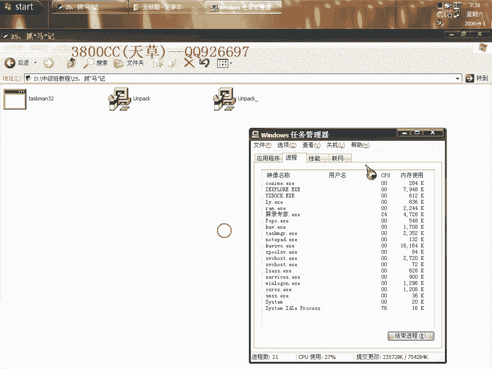
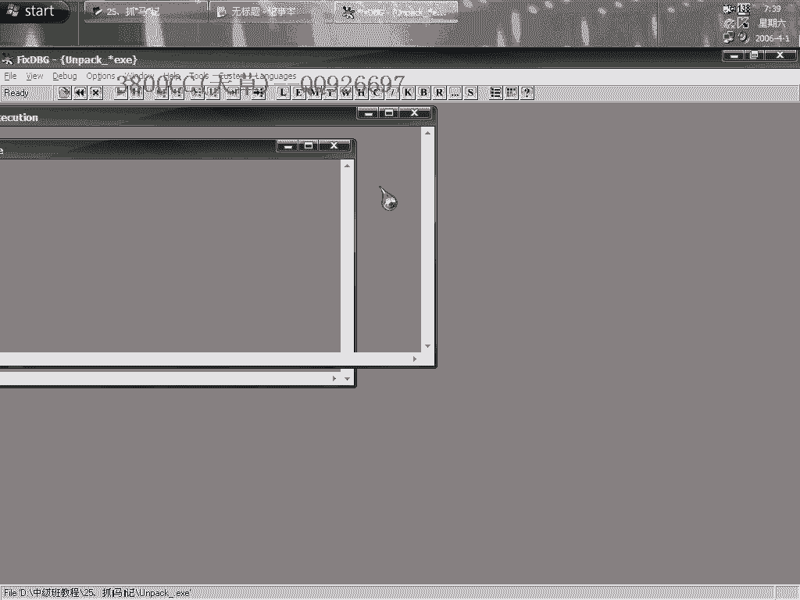
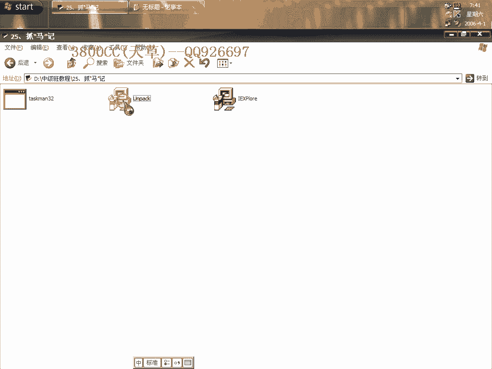
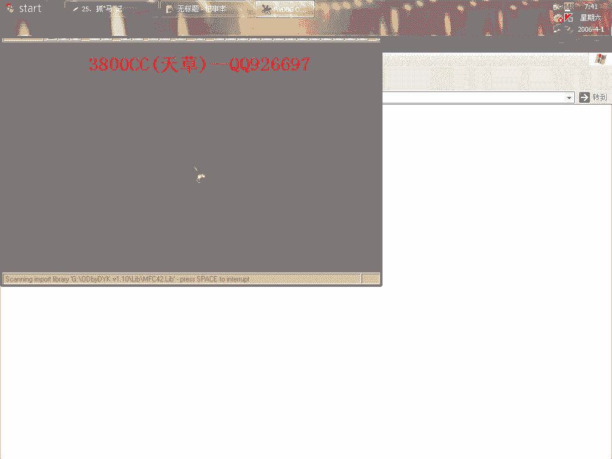
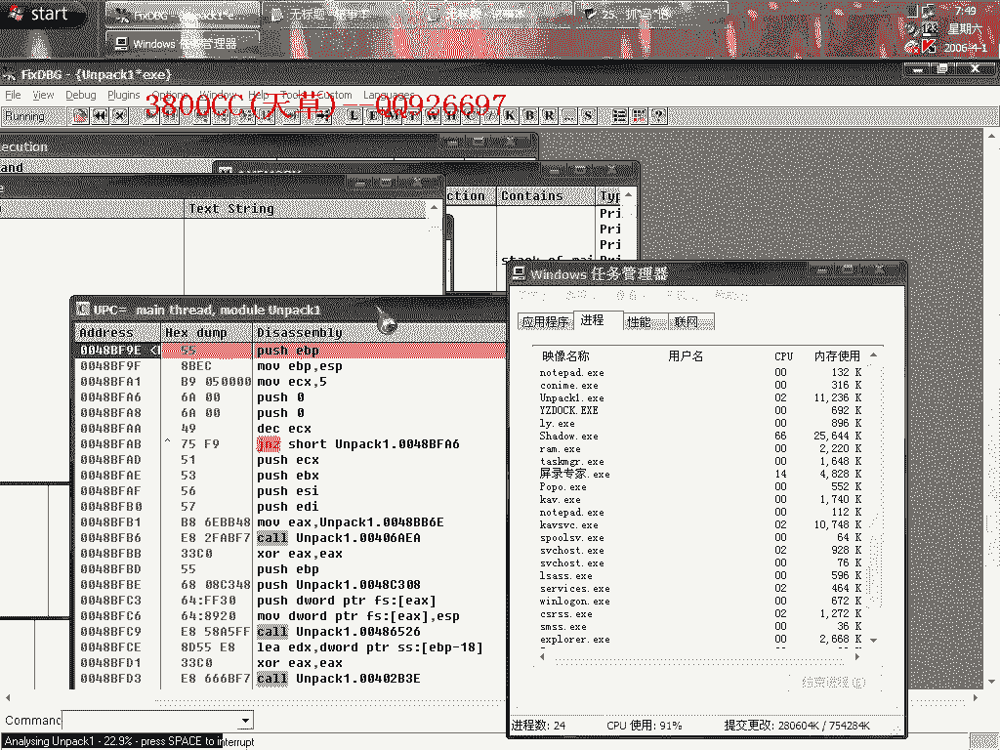
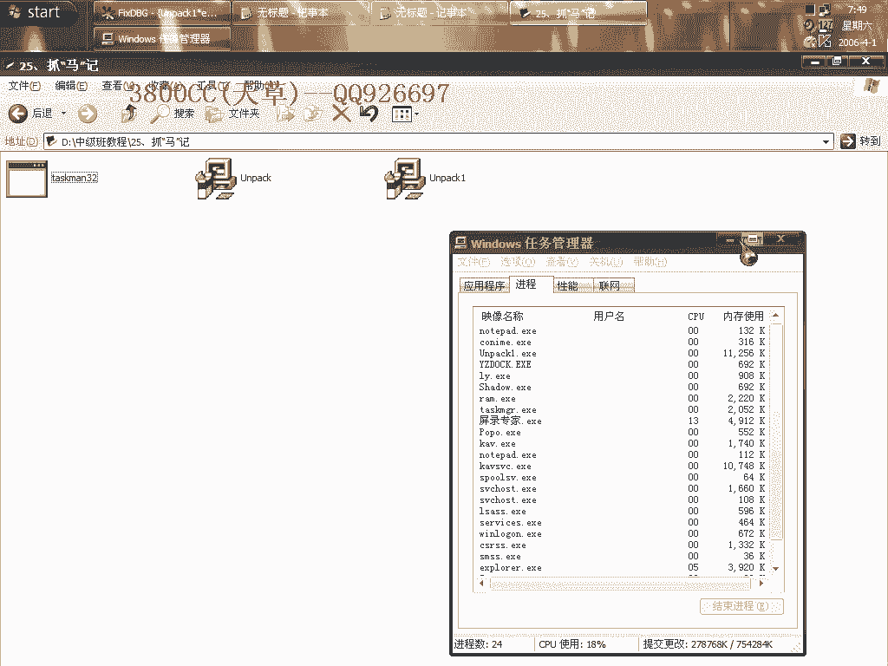
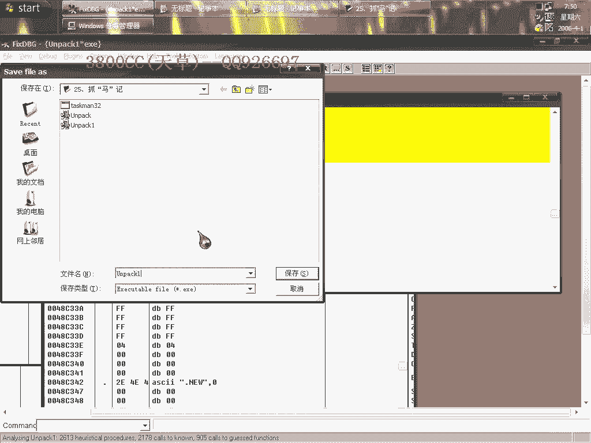
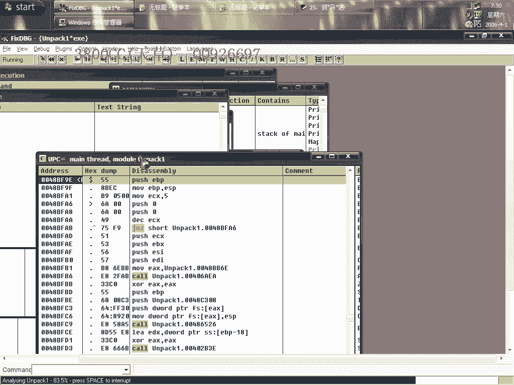
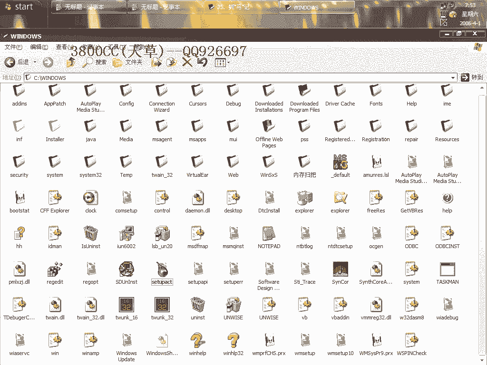

# 天草中级班 - P25：第25课 - 灰鸽子木马分析与手动脱壳 🕵️♂️

在本节课中，我们将学习如何分析一个被多层壳保护的“灰鸽子”木马样本，并手动完成脱壳过程。课程将涵盖从识别入口点、手动修复导入地址表到初步分析木马行为的关键步骤。

---

## 发现与初始运行

上一节我们介绍了课程目标，本节中我们来看看样本的初始状态。

运行样本后，发现系统出现异常。一个未知进程生成后立即退出，这提示我们可能中了病毒。

---



## 脱壳过程：定位与循环



由于样本被加壳，我们首先需要使用调试器进行分析。以下是初步分析步骤：

1.  使用OllyDbg载入样本，忽略所有异常。
2.  单步跟踪时，发现入口点被伪装。使用`F4`（运行到所选）快速执行。
3.  程序出现回跳，在一个地址范围内循环，这是壳的典型特征。



---



## 寻找原始入口点

上一节我们遇到了壳的循环，本节中我们来看看如何突破它。

直接使用`F4`可能导致程序直接运行。我们尝试其他方法。

1.  在关键跳转处下断点（`F2`），但程序不执行。
2.  再次使用`F4`，观察到两个特征点出现，其模式类似北斗壳，但前面可能加了两层壳或混淆代码。
3.  跟随跳转，最终到达一个地址`8BF91`，这里被认为是原始入口点。

---

## 手动修复导入地址表

成功定位OEP后，下一步是修复程序的导入函数表。

1.  尝试使用脱壳工具的“自动搜索IAT”功能，但未发现有效IAT，说明需要手动修复。
2.  在代码段中向上查找，找到一个跳向API函数的指令，此处是IAT的起始位置。
3.  记录起始地址（例如`00000000`），并设置一个足够大的大小（如`1000`）进行抓取。后续产生的无效指针是因大小设置过大造成的。
4.  完成转储，生成脱壳后的文件。脱壳成功后，程序图标发生变化。

---


## 初步行为分析

脱壳完成后，我们可以开始分析木马的核心逻辑。以下是关键代码片段分析：





1.  **进程名检查**：程序比较当前进程名与一个特定名称。若不同（`AL=0`），则发生跳转。我们可以修改此处进行测试。
    ```assembly
    CMP [eax], ebx  ; 比较两个名称
    JNZ somewhere   ; 如果不相等则跳转
    ```
2.  **网络与文件操作**：分析发现`CopyFile`、`Sleep`等函数调用，以及网络活动监控代码。
3.  **持久化机制**：木马会向多个注册表路径写入键值，实现开机自启动。清理非常麻烦。
4.  **进程注入**：木马倾向于将自身注入到`svchost.exe`或`explorer.exe`等系统关键进程中。

---





## 尝试修改与清理

基于以上分析，我们可以尝试进行一些修改，例如改变其注入的进程名。但需注意，直接修改字符串可能因长度和校验问题导致程序无法运行。

清理此类木马的建议：
1.  在安全模式下进行操作。
2.  检查并清理注册表中的多个自启动项。
3.  在文件系统中显示所有隐藏文件和文件夹，查找并删除在`System32`等目录下生成的恶意文件。

---



本节课中我们一起学习了如何手动为一个多层壳保护的木马样本脱壳，并初步分析了其核心行为，包括进程检查、文件复制、注册表持久化和进程注入。掌握这些步骤对于理解和应对复杂恶意软件至关重要。