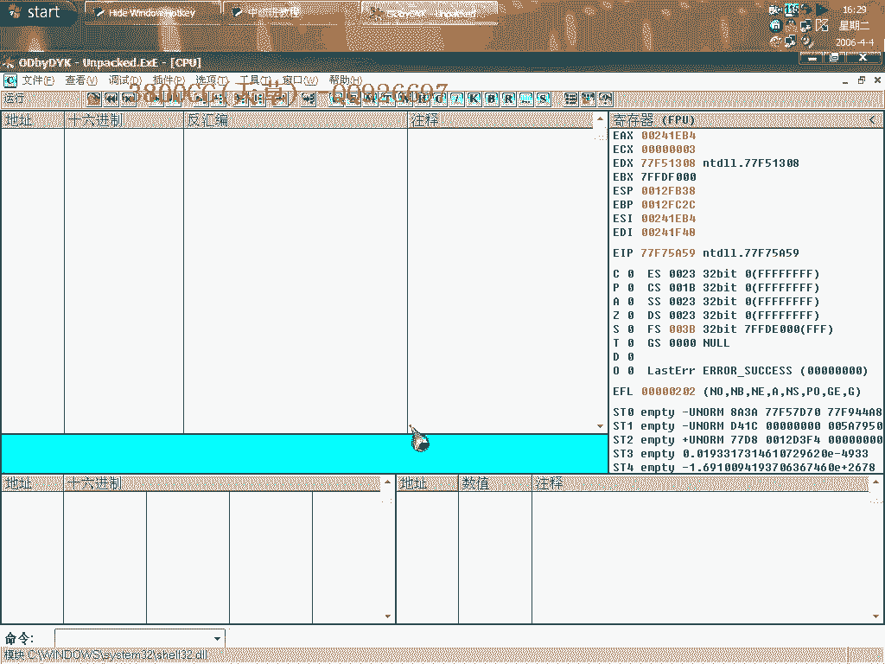
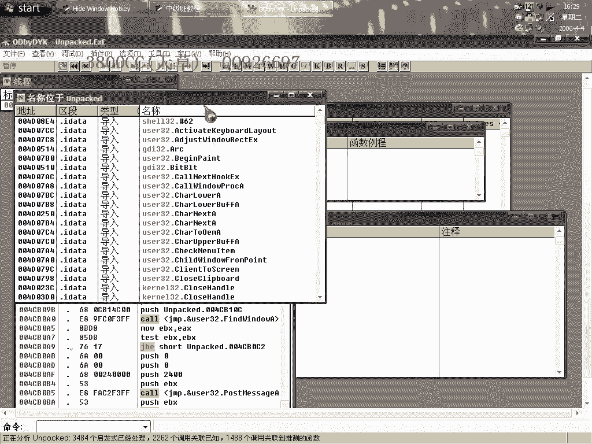
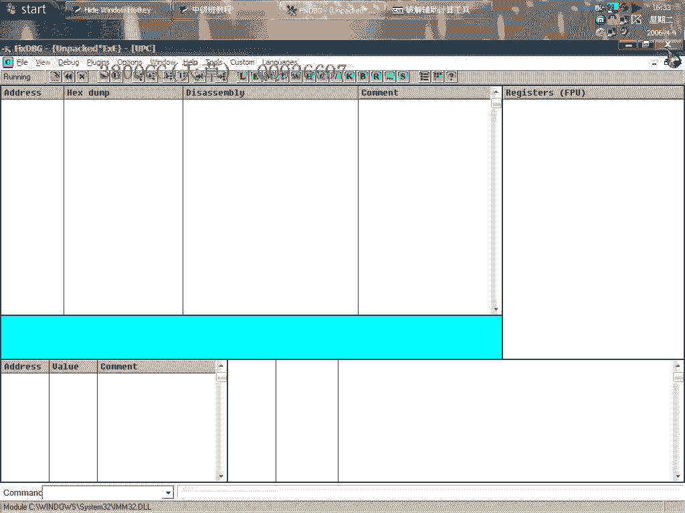
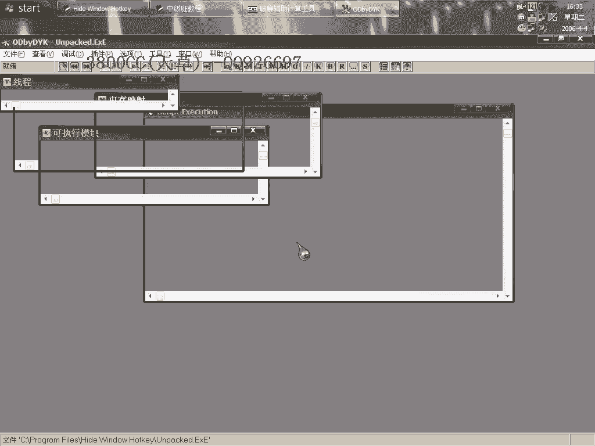
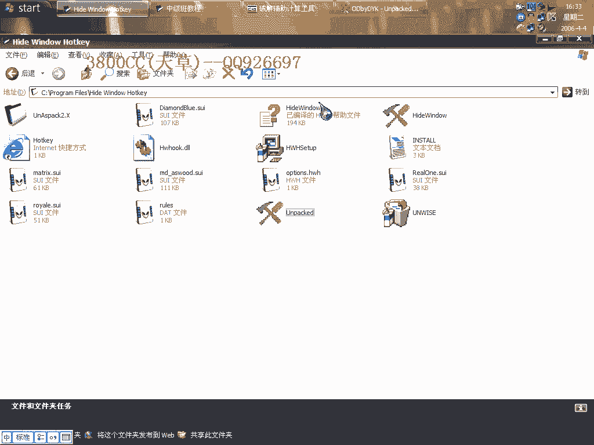
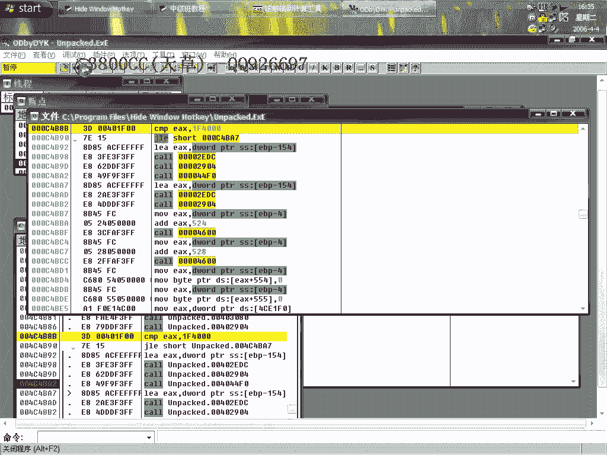
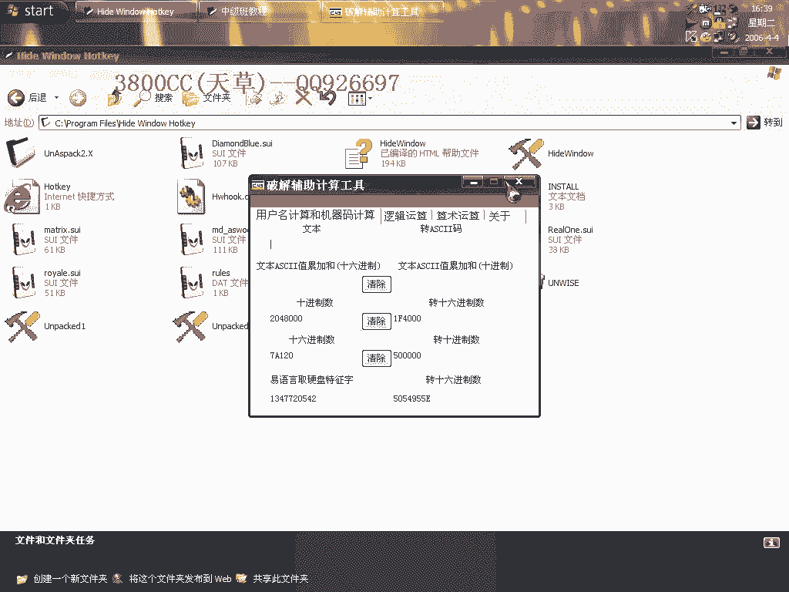

# 天草中级班 - P26：第26课 - 白嫖无双 - BV1qx411k7kd

大家好，这期课我们来讲一个，去资料页，就这么一个软件，这么一个软件，是，SprocTek，我们今天，来一把吧，来一把吧，用，我们用TALK工具来吧，我们用TALK工具来吧，我们用TALK工具来吧。

这个的一个TALK工具是非常好用的一个，这个的一个TALK工具是非常好用的一个，这个的一个TALK工具是非常好用的一个，而且TALK的非常干净，当然可以的，那我们来运行看一下，那我们来运行看一下。

鼠标一转，就没了，明显是有指教键的，原版是可以运行的，好，那我们现在来，用新的方法，这前面给大家就是说是，这前面给大家就是说是。

同时开两个，两个OD，然后呢，慢慢的比较，这是我们用比较快速的一个方法，这是我们用比较快速的一个方法，大家要知道，程序它启动之后然后推出，我会调用一个函数，什么函数呢，EXE。

EXE，这个函数，我们选，在这个在每个参考，上设置断点，或者呢，是这样，按进去，然后消耗断点，好，消耗断点之后，消耗断点之后，我们F9运行，好，中断在这里了，好，中断在这里了，大家看到啊，对战里面显示。

Return to Gate Code 为0，返回至为0，好，既然这里，既然这里就是一个，推出程序段，那我们看一下断首，找一下断首，这里，找到这里了，因为大家要知道，就是说程序它。

推出肯定是一个call，调用，一个call调用，调用到这里来之后，然后再慢慢执行，下去就推出了，那我们大家看到啊，选这里之后啊，这个Load Call，from 这里啊，四个地址。

我们再用另外的方法找的比较快一点，好，这里，查找参考对象，选择命令，这样四个就全部在这里了，我们分别下断，好，重新，载一下，重新载一下，F9运行，调用到这里了，也就是说，它这里会调用到，这里会调用到。

大家看一下啊，大家看到了啊，直接就调用到这里来了，那我们来看一下啊，那我们来看一下啊，它这里是怎么样一个比较，这个比较啊，这个比较，那这里也调用到了，这里也调用到了，就这里，首先调用，大家看一下。

还有呢，咱们既然是终端在这里，线终端在这里，咱们就不管了，其他三个就先不管了，大家看一下这个，7A120，是什么，但是我们先来看一下原神车的大小，有点卡，原神车的大小，把这个设一下吧，这样看的方便一点。

这个程序好像就是在这个地方，我在这里刚才啊，首先呢，我在自己调试的时候也是这个样子啊，就查看属性的时候，它会死掉啊，会死掉，好，会死掉，好，这样，先来看一下啊，它原神车本身是这么一个大小，我们接下来。

重新载入，现在我们用计算器来看一下，计算器，时间值，6100，这个原神车是这么一个啊，诶，断点没下好吗，错了错了。

应该用这一个了，刚才那个断点是在。

用这个下的，它这里是7A120，7A120，咱们再来，也来转换一下，50，50000，就是说最多啊，最多不超过这个是多少的，这个是440K，它这里是最多不超过500，500K，但是我们现在大小啊。

现在这个文件大小，已经是一点几兆了啊。

明显是超过了啊，超过了之后啊，它这个就没有跳了，就没有跳，所以就直接就，直接就，直接就退出，调用退出了，好，我们这个地方把它改成这样，跳过去，这样啊，跳过去了，我们来，保存一下，或者我们再用另外的思路。

来看一下，把这个比较，两兆啊，我们来转换一下，两兆会是多大呢，嗯，两兆的话，4。560，这个，这个，这个，十进制的两兆，1024，2048，20480，20480，不对啊，1K，1K=1024。

1024*1024，1024，0，2048，2048，好，我们来试一下，好，现在来看一下。

这是我们改了一个jump，改jump可以，然后我们来看一下改这个大小的，也是可以的，当然我们这里可以改更大，可以改更大，这个大家就是随便，随便去改了，只要比这个，比这个，要大就可以了，比这个大。

就是把这个加大，大过你的一个托克文件的大小，大过你托克文件的大小，就可以了，我们至于破解，我来说一下，大概的说一下吧，我们直接来运行看一下，再占掉用，这个不太方便，哪一个，这个，咱们先这个样子。

这样就找得近一点，好，就是这里了，我们在这里下段点，就可以了，就可以了，咱们不走了，在这里要看到，刚才这里是取我们的，取我们的用户名，然后取了之后，在EX里面填充6，我们刚才的，WY NY，是6位。

大家看一下，这里明显不行了，就是小于8位的话，小于等于8位，都不可以，大家看一下，等于8位行不行，00，这是8位了，在这里下段吧，免得就是有一个麻烦，点于可以，点于8位可以，但他这里是，J1。

这个有点怪，应该是说等于不行的，他这就是说，大于，点于8位就可以，小于8位就不行了，8位可以的，然后再走，取名字，大家继续看一下，继续往下面看，把，ED，EX为8，EDI为2，这里呢，取注册码。

取注册码了，大家要知道，取了注册码就应该，关键就在附近了，这里还是有错误，大家看到了，这里还是有错误，这个非常简单，大家自己下去跟，我就是给大家提一下，用户名，用户名要大于点于8位，今天这个课程就到这。

大家自己要下去念手了，再见。

