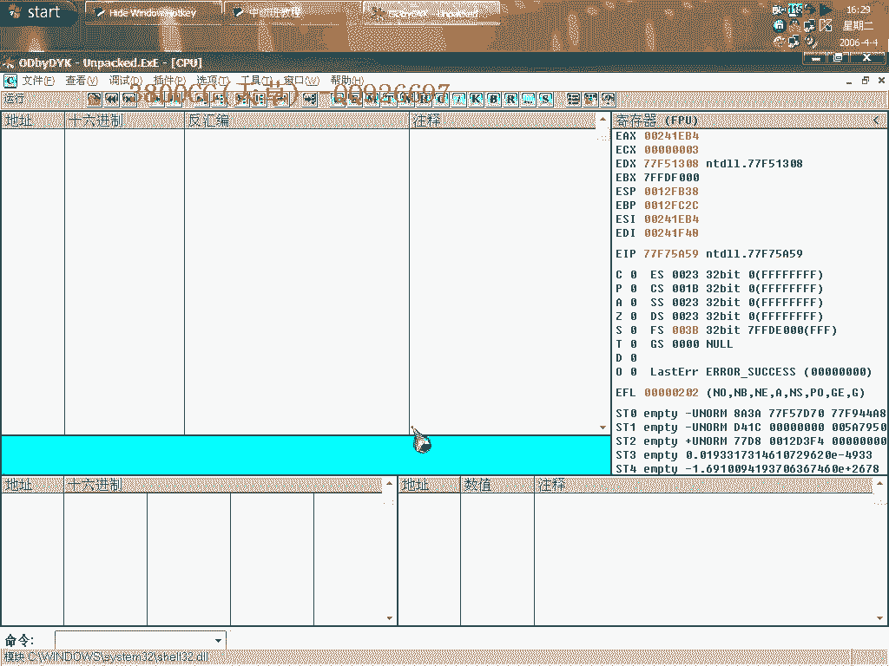
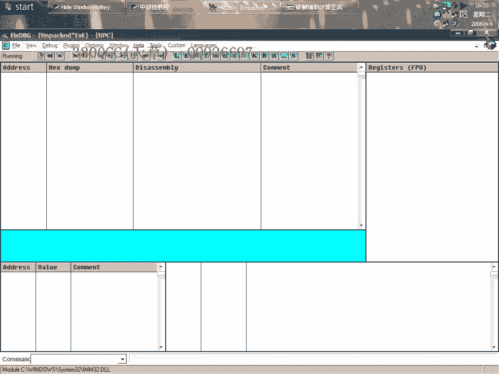
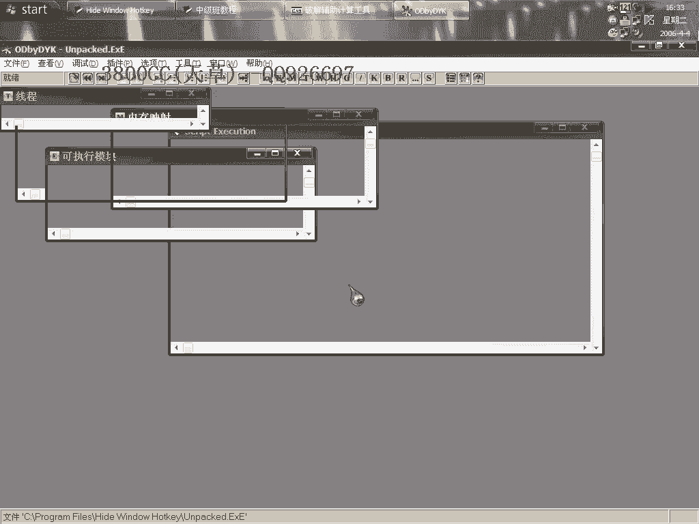
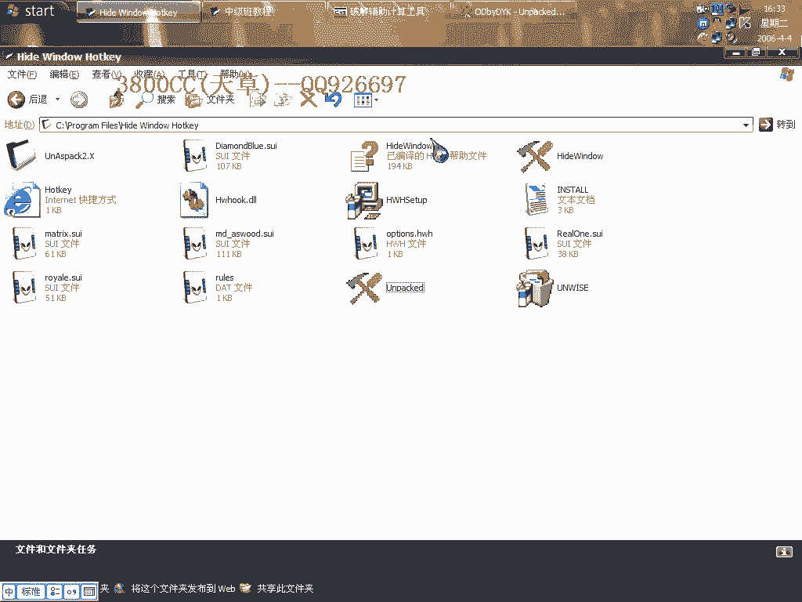
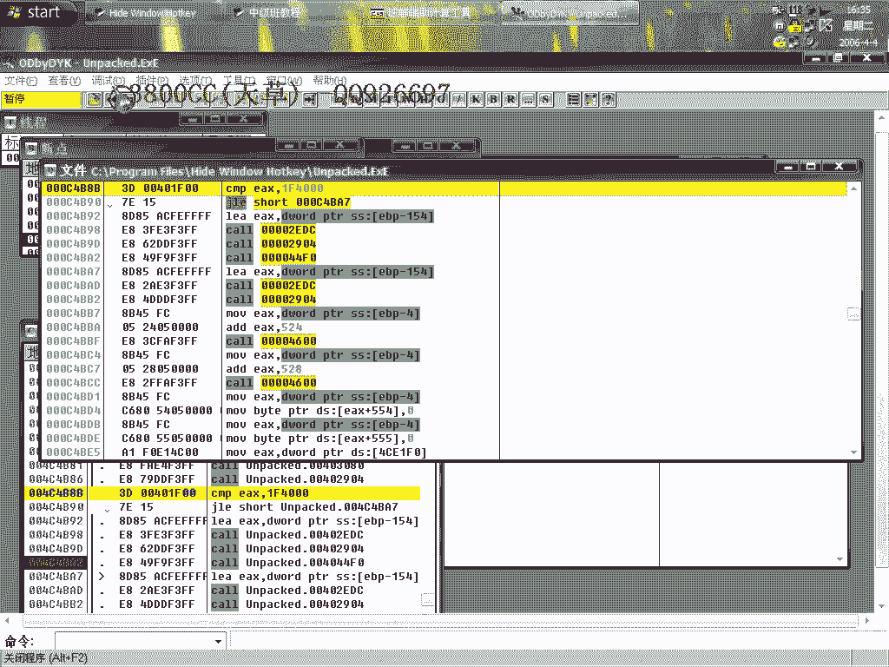

# 天草中级班 - P26：第26课 - 白嫖无双 - BV1qx411k7kd 🔓

在本节课中，我们将学习如何分析并修改一个名为“SprocTek”的软件。我们将使用OD（OllyDbg）工具，通过对比分析、定位关键函数和修改关键跳转等方法，来了解其运行机制并尝试进行修改。

---

## 工具准备与初步分析 🛠️



上一节我们介绍了课程目标，本节中我们来看看具体的操作步骤。首先，我们使用OD工具载入目标程序。


运行程序后，发现程序窗口一闪而过，这表明程序可能存在自校验或退出机制。原版程序可以正常运行，因此我们将采用对比分析的方法。

以下是具体步骤：
1.  同时打开两个OD，分别载入原版程序和待分析程序。
2.  通过对比两者在启动和退出时的行为差异，快速定位关键代码。

程序启动后退出，通常会调用退出函数。我们关注 **`ExitProcess`** 函数。

---

## 定位退出函数与关键调用 🔍

上一节我们启动了对比分析，本节中我们来看看如何定位导致退出的具体代码。

在OD中，对 **`ExitProcess`** 函数的每个调用参考处设置断点。或者，可以跟进该函数内部，然后在函数头部下断点。

下断点后，按F9运行程序，程序会中断在 **`ExitProcess`** 的调用处。此时，观察堆栈，可以看到返回地址。

既然这里调用了退出函数，那么其调用者就是导致退出的关键代码段。我们需要向上查找这个调用发生的函数首部。

程序退出通常是一个 **`call`** 指令调用的结果。执行到这个调用后，程序便会逐步退出。

在调用 **`ExitProcess`** 的代码附近，利用OD的“查找参考”功能（选择“命令”），可以快速找到所有调用此地址的代码位置。



以下是操作流程：
1.  对找到的几处调用地址分别下断点。
2.  重新载入程序，按F9运行。
3.  程序会中断在其中一个调用处，这里就是导致退出的关键逻辑所在。



---

## 分析校验逻辑与修改方案 ⚙️



上一节我们定位到了关键调用点，本节中我们来看看此处的具体校验逻辑。

程序中断后，我们观察周围的代码。这里存在一个比较操作，可能是文件大小校验。

首先，查看原版程序的文件大小。然后，在调试器中查看校验值。例如，代码中可能出现一个类似 **`cmp`** 的指令，将某个值与固定值（如 `0x7A120`）进行比较。

使用计算器将十六进制值 `0x7A120` 转换为十进制，得到 500,000 字节（约500KB）。这意味着程序可能设定了文件大小上限。



而当前待分析的文件大小已超过这个限制，因此校验失败，程序走向退出流程。

修改方案有两种：
1.  **修改关键跳转**：找到校验失败后的跳转指令（如 `je` 或 `jne`），将其改为无条件跳转（`jmp`），绕过退出。
2.  **修改比较值**：直接修改代码中的比较值（如将 `0x7A120` 改为一个更大的值，例如 `0x200000` 代表2MB），使其大于当前文件大小。

修改完成后保存文件，即可尝试运行。

---

## 破解思路延伸与总结 💡

上一节我们解决了文件大小校验，本节中我们简单延伸一下注册验证的破解思路。

在修改了文件校验后，程序可能还会进行用户名和注册码验证。我们可以继续在OD中跟踪相关代码。

通常在获取用户名后，程序会进行长度判断。例如，可能要求用户名长度大于或等于8位。相关汇编代码可能如下：
```assembly
cmp eax, 8
jl  exit_label ; 如果小于8则跳转到退出
```
之后，程序会获取并验证注册码，这里包含核心的算法比较。我们可以通过分析比较前后的数据变化，或者尝试修改关键跳转来绕过验证。

本节课中我们一起学习了使用OD进行软件分析的基本流程：
1.  通过双OD对比和定位 **`ExitProcess`** 调用，快速找到程序退出点。
2.  分析退出点附近的校验逻辑（如文件大小比较）。
3.  掌握两种常见的修改方法：**修改跳转** 和 **修改关键数据**。
4.  初步了解了用户名/注册码验证的跟踪思路。


关键点在于耐心跟踪、理解汇编指令的含义，并大胆尝试修改。请大家课后自行练习，巩固所学知识。