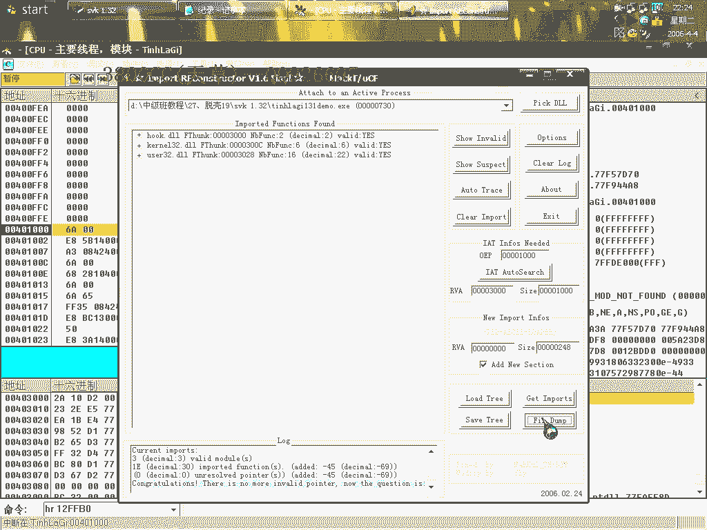

# 天草中级班 - P27：第27课 - SVKP壳手动脱壳与IAT修复教程 🔧

在本节课中，我们将学习如何手动脱掉SVKP壳，并修复其导入地址表。这是一个相对少见但有一定强度的壳，课程将重点讲解手动查找IAT和修复的方法，这是逆向工程中的一项基础且重要的技能。

## 概述 📋

本节课是倒数第二课，我们将处理一个SVKP加壳的程序。由于自动脱壳工具可能无法完美修复其IAT，因此需要掌握手动查找和修复IAT的技术。我们将从忽略异常开始，逐步定位OEP，并最终完成程序的修复。

---

## 第一步：忽略异常并定位OEP

首先，我们需要使用OllyDbg载入加壳程序。程序运行时会产生异常，这是壳的保护机制之一。

以下是处理异常的步骤：

1.  运行程序后，OD会提示异常。在OD下方的异常提示框中，将这个异常添加到忽略列表。这是一个基础操作。
2.  使用 `Shift+F9` 让程序继续运行并中断在异常处理代码处。这个异常可能会出现两到三次，持续按 `Shift+F9` 即可。
3.  程序中断后，删除所有硬件断点，然后按 `Alt+F9` 执行到返回，即可来到程序的原始入口点附近。

成功到达后，界面应类似上图。我们可以看到一个明显的 `push` 指令，这是OEP的常见特征。此时，我们已经成功定位到程序的原始入口点。

---

## 第二步：手动查找IAT

上一节我们找到了OEP，本节中我们来看看如何手动查找被加密的导入地址表。SVKP壳会加密IAT，使其无法被自动工具识别。

以下是查找IAT的步骤：

1.  在OEP处，使用 `Ctrl+B` 搜索十六进制序列 `FF 25`。`FF 25` 是IAT中 `jmp [地址]` 指令的机器码，是IAT的起始标志之一。
2.  搜索后，我们会找到一些 `FF 25` 的调用。其中，有些地址已被OD识别为API函数名，而有些则显示为数字地址，这表明它们被加密了。
3.  记录下这些未被识别的地址，例如 `402010` 和 `402014`。它们就是我们需要修复的IAT项。

尝试使用Import REC的“等级1”自动修复，通常会失败，因为壳修改了IAT的结构。这引出了我们下一步需要的手动修复技术。

---

## 第三步：手动修复IAT项

由于自动修复失败，我们必须手动找出每个加密地址对应的真实API函数。这是本节课的核心手动技巧。

以下是手动修复单个IAT项的通用方法：

1.  **重新载入程序**，并在记录下的加密地址（如 `402010`）上设置**内存写入断点**。
2.  运行程序 (`Shift+F9`)，程序会在壳向该地址写入数据时中断。
3.  中断后，单步跟踪 (`F7/F8`)，观察是哪个函数被写入到了这个地址。通常，会看到一个 `CALL` 或 `JMP` 指令将API函数的地址移动到目标位置。
4.  记下这个API函数的名称或地址。
5.  对另一个加密地址（如 `402014`）重复上述过程。

通过这种方法，我们可以逐个找出所有被加密的IAT项所对应的真实API。

---

## 第四步：使用Import REC进行最终修复

在手动获取了所有加密IAT项的真实API信息后，我们就可以使用Import REC来完成最终的修复工作。

以下是修复步骤：

1.  在OD中，确保程序停留在OEP。记下OEP的地址（例如 `00401000`）。
2.  打开Import REC，选择正在调试的进程。
3.  在Import REC中填入正确的OEP地址，然后点击“自动查找IAT”。通常效果不佳，直接点击“获取输入表”。
4.  在出现的函数列表中，找到那些显示为“无效”或“未知”的项，它们对应着我们之前手动找到的加密地址。
5.  双击这些无效项，在弹出的窗口中，手动填入正确的API函数名称（RVA）。
6.  所有无效项都修正后，点击“修复转储”，选择之前从OD中脱壳出来的程序文件。
7.  Import REC会生成一个修复后的新文件（通常名为 `*_dumped.exe`）。

修复完成后，运行新生成的文件，测试程序功能是否正常。如果修复正确，程序应能正常运行。

---

## 总结与注意事项 🎯

本节课中我们一起学习了手动脱壳SVKP并修复其IAT的完整流程。关键点在于**手动定位加密的IAT地址**，并通过**内存写入断点**追踪其真实的API函数。

核心公式与概念：
*   **定位IAT**：在OEP附近搜索 `FF 25` (jmp [iat_entry])。
*   **手动修复**：对加密地址下`内存写入断点`，跟踪并记录真实的API地址。

**注意事项**：
1.  调试过程中，某些软件（如屏幕录像专家）可能会干扰OD的调试，导致返回地址错误或行为异常。若遇问题，可尝试关闭可能冲突的软件。
2.  手动查找IAT是一项基础且通用的技能，在面对未知壳或强壳时非常有用。
3.  修复后的程序若运行报错，需检查是否所有必要的IAT项都已正确修复，或是否存在其他反调试机制。

通过本课的学习，你掌握了应对IAT加密壳的一种有效方法。请多加练习，以熟练运用这项重要的逆向工程技术。