# 天草中级班 - P28：第28课 - 白嫖无双 - BV1qx411k7kd

好，现在来进行我们这个中级班的一个最后一节课，总结课，我这里呢只是把这些说中级班的一些内容，就是稍微的总结一下，这个还是需要大家去把每一节课的方法，思路总结一下。

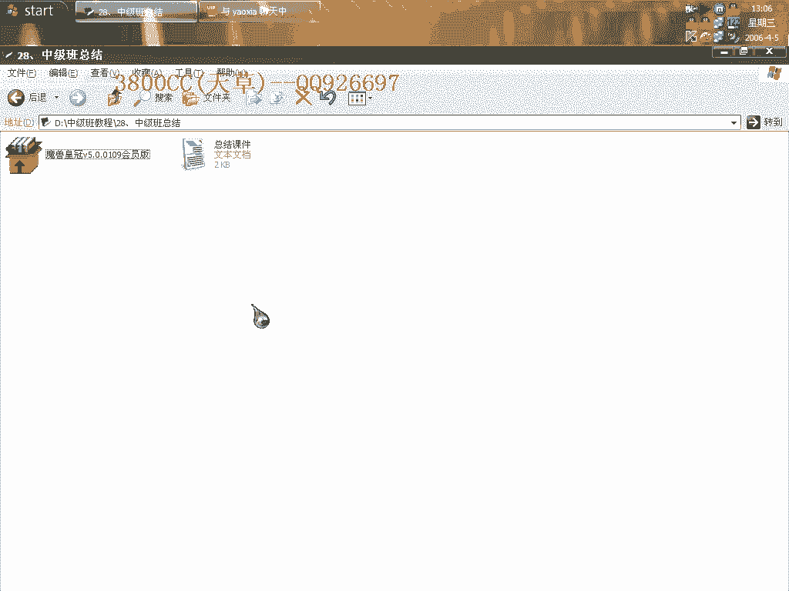

好，第一个呢就是说穿山甲的一个课。

就是说现今很强的一些课，就是说应用比较广泛的，就是穿山甲，还有就是说一些其他的一些课，我们这节课呢就是讲的一些现今比较流行的一些课，而且都是一些强课，穿山甲的一个课呢，有单进程，双进程。

标准版和非标准版的，这个大家可以上看学论坛上面找一下我的那篇文章，叫做穿山甲的总结，穿山甲总结，那个我只是大概的讲了一下有四片实例吧，首先呢它是有一个单进程，单进程这个简单，就是两次断点。

或者用一次断点，这样啊，这一次断点，另外一次断点呢，这是第二次，或者呢，这次断点用在0040100那一段下内存断点就可以了，当然并不是所有软件都可以通过下那个0040那一段啊，扣的断，下断可以的啊。

用这个是比较保险的，双进程的，双进程的就是无非就是在前面要用到一个，要用到一个双进程的标准版，要用到一个双进程转单进程的，好，标准版就是这些结合起来，非标准版呢，就是我在课程里面有讲到的。

课程里面有讲到的，第14课里面有讲到的，这个非标准版的拖法比较多，拖法比较多，一个就是我在14课里面讲到的那种方法，第二个呢，它关于它的一些修复啊，修复要用到这个啊，当然这个也算是一种方法。

我在第14课讲的那种方法是比较容易懂的，比较容易操作的，还有其他更麻烦的啊，我也试过操作到我有点发毛那种的，好，穿墙甲在辨认啊，辨认可以通过这个来辨认，有经验啊，有经验也就也很好判断啊。

不用这个东西也可以判断得出来。

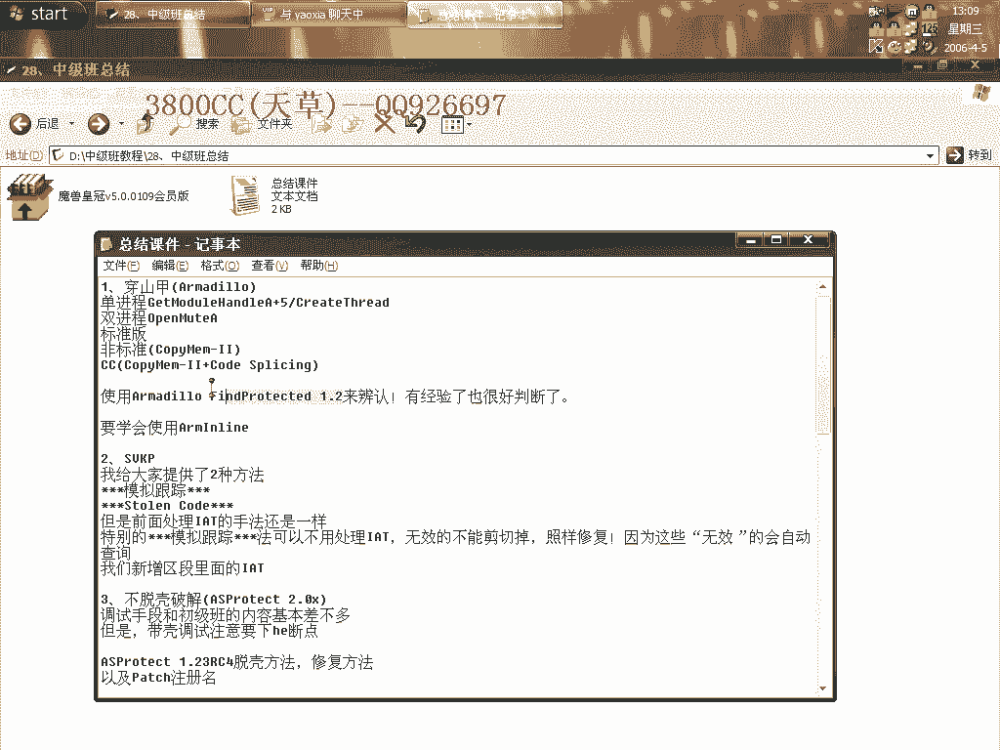

这个就是穿墙甲的一个课，大概就是说穿墙甲的一些类型我都讲了。

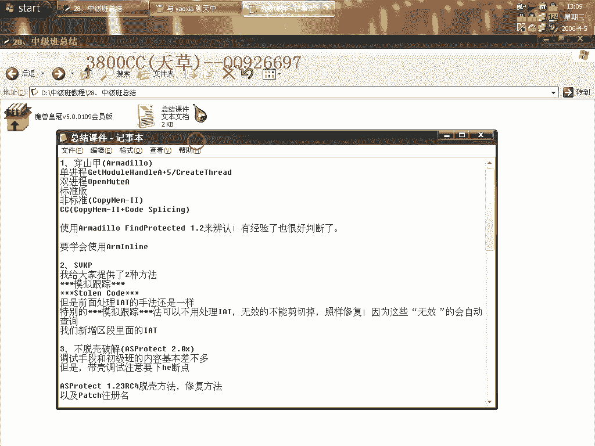

在一些处理技巧上面我也讲了一些啊，讲了一些，这个得大家自己去摸索啊，穿墙甲的一些脱壳文章是非常非常多啊，满天飞的那种。

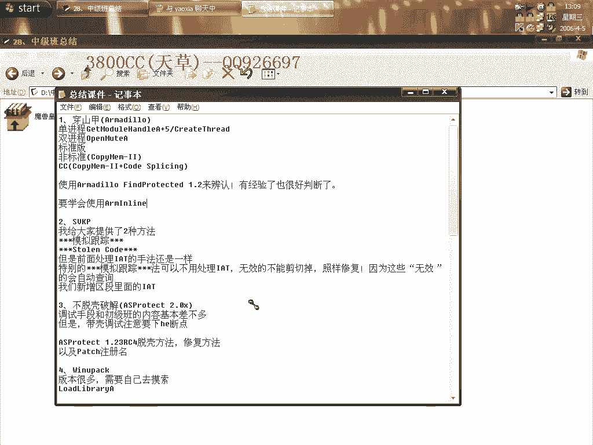

那关于SVKP呢，SVKP迄今为止啊，迄今为止网上应该只有6篇啊，只有6篇，因为它的一个StoneCode啊，处理是非常非常麻烦的啊，我在这里给大家介绍了两种方法，希望大家就是说这两种方法不要流传。

自己留着用就可以了，就是说以后你们要收徒弟啊，或者是怎么样的啊，自己也可以，在国内啊，就是这个样子，没办法，技术保留啊，迄今为止只有6篇啊，我统计了一下，而且6篇只有2篇，只有其中2篇是比较好的啊。

其中2篇是比较好的，就是说前面处理IIT的这两种方法，前面处理IIT的一个手段还是一样的啊，特别的也就是说，模拟跟踪的方法，模拟跟踪这个方法可以不用处理IIT，无效的也不能减掉啊，无效的也不能减掉。

照样修复，因为这些无效的指针啊，无效的指针会自动查询我们新增的啊，新增的那两个区段里面的IIT。

这个不劳我们费神啊，它会自动的，自动去查询的。

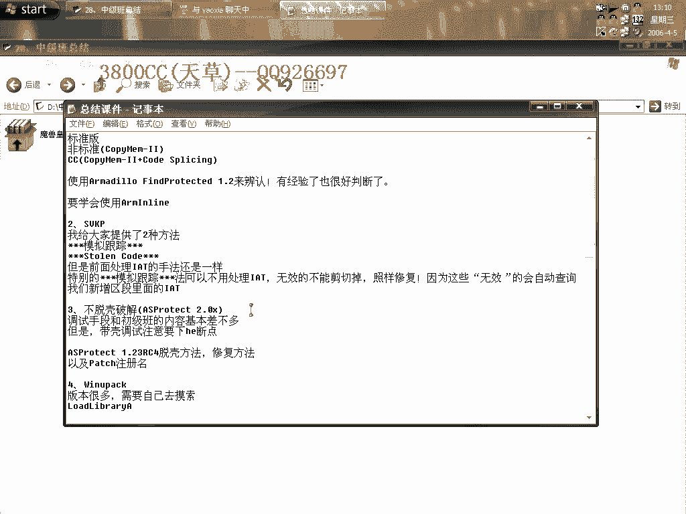

第三个啊，就是不脱口破解里面的啊，不脱口破解里面的，这个OSPRO TAC 2。X的啊，这个差不多的啊，差不多，后面在高级版里面啊，也会着重的讲到OSPRO TAC 2。X的一个不脱口破解的方法。

调试手段呢，和初级版的内容都是差不多的啊，差不多，但是大家要注意的就是代可调试啊，代可调试，要用H1，H1是什么端点，我不说，你自己去看，不要问我啊，这个是非常非常基础的。

好，这就是OSPRO TAC 1。23RC4的这一个呢，是非常好玩，非常有趣的一个软件，大家可以多找一些，多找一些试一下，非常好玩，它的一个脱口方法和修复方法呢，这个大家要掌握啊，脱口方法和修复方法。

而且它最后一次异常里一个特征就是，一个停在XOR，XOR异祸，然后下面紧跟着两个介意啊，紧跟着两个介意，最后呢，有一个RAND，最好玩的当然就是一个派系注册名了啊，脱口之后马上派系注册名。

关于这个派系注册名，这里我也讲过啊，我也讲了，就是说第二次硬盘指纹的时候下在code段啊，004010这一段下FL，然后返回，然后就是中断下来之后啊，中断下来之后，EX放入啊。

就是说EX放到哪个地址里面去，那个地址里面就是我们的一个派系地址，这是one unpack，这个呢，应该算是一个新的可，一个新可啊，就是说，因为现在最高版本好像是0。39吧。

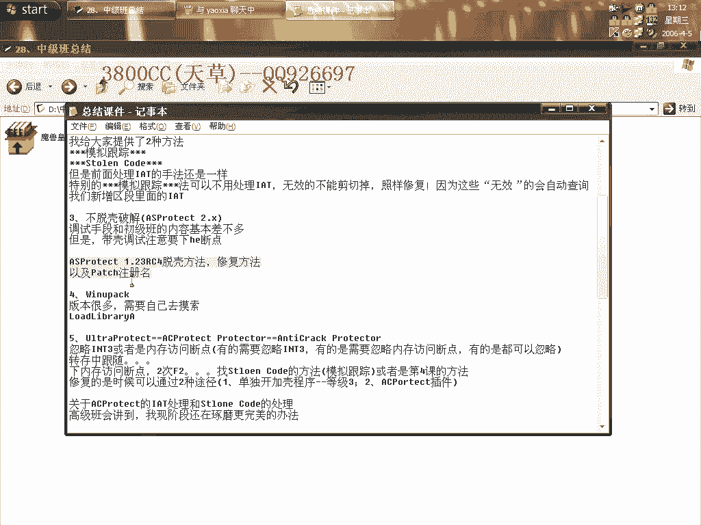

这个版本啊，它就是说加可了之后啊，会把那个什么PE头给改掉啊，PE头改掉，我们就是说对自然编辑的时候有些问题，其中啊，这种啊，就是我们要自己手动把PE头改回来啊，现在还没有什么好的方法，没什么好的方法。

至于脱口的办法呢，大家自己去试，应该就是说，这个断点，node library A这一个断点下两次返回，就可以，就是说可以到OEP，跳向OEP附近了，当然我这个系统的这个node library这个。

有一点问题啊，下不了啊，下不了，这就是这个Aceprotect，这三个都是一样的啊。

这是一个老名字啊，老的名字啊，这个是Aceprotect的，这是一个最新的，就是说最新的一个正式名称，这个呢，就是也是一样的啊，就是说，它就是只是在Aceprotect的基础上做了一些修改。

有一个小小的分支而已，方法就是一个忽略int3或者是内存访问断点，有的是需要忽略int3，有的是需要忽略内存访问断点，有的是都可以忽略啊，这个大家去试。

就是说如果你忽略int3不能到达最后一次int3断点的话，那你就忽略内存访问断点啊，然后转成中跟随啊，然后下内存访问断点，两次F2啊，两次F2，找System Conol的方法呢，模拟跟踪。

或者是第四颗的方法，这个大家自己去看，修复的时候可以通过两种啊，一个是单独打开jack程序，等级3，然后再就是用这个插件，这个插件是非常好用的一个插件啊。

再就是还有一个就是它Aceprotect会对maxboxa这一个指针进行处理，在user32的指针函数列表里面啊，就是说如果你发现了maxbp那个下面那个断点无效的话，那它就肯定是maxboxa了啊。

关于Aceprotect的IAT的处理和System Conol的处理方法呢，高级班会讲到，我先阶段啊，先琢磨更完美的方法，IAT的一个处理啊，这个处理啊，就是说它的一个方法啊，我已经弄出来了。

但是System Conol的一个完美处理方法就是大家在操作上面更好使的话，这个我还在琢磨，已经非常有眉目了啊，好，这另外第六点就是这么一个课啊，这么一个课啊，应用的不是很多，应用的不是很多。

迄今为止我就是碰到几个，但是它也算是加密强度蛮强的一个加密课了啊。

大家在这一节课里面要学到的就是色中茶藻函数的一个方法啊，下六成访问断点，就是这个我在这一节课里面也有大家说一下啊，关于一些历届的版本大家可以自行去摸索，都是差不多，都差不多，因为可的种类是非常非常多啊。

我要是完全给你讲完的话不太可能，因为基本上每一天啊，都会有一些新的版本的一些可出来。

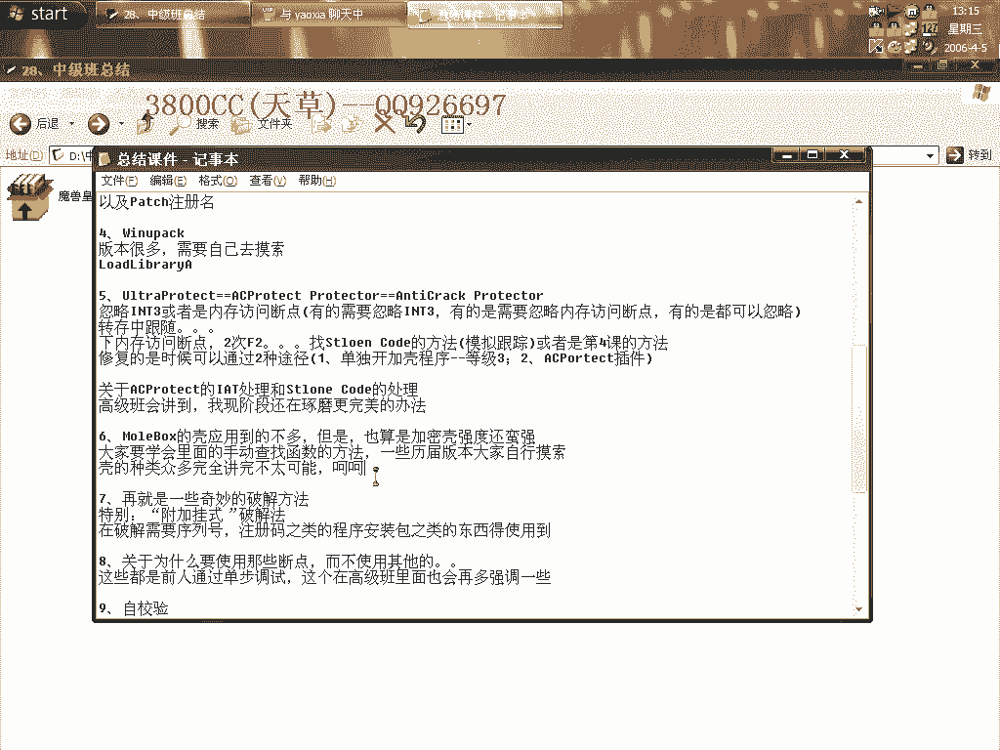

好，这就是一些奇妙的破解方法啊，特别是一个挂饰破解，这个方法在应用到就是说破解一些需要序列号，注册码之类的安装程序包啊，安装程序包，程序安装包之类的东西要使用到啊。

就是有的一些程序包需要你输入一些注册码这个样子的啊。

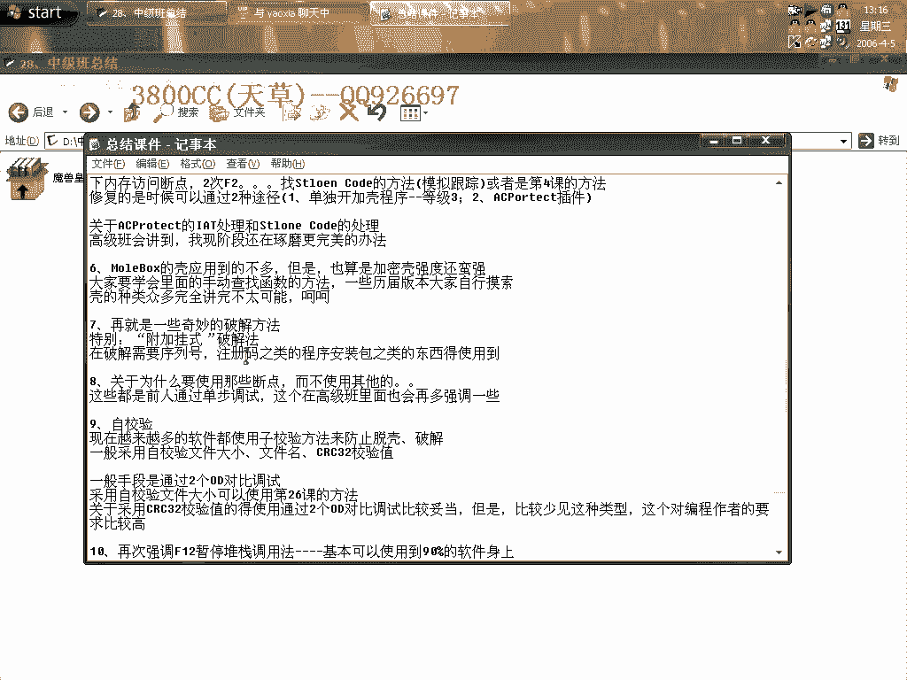

好，这还其他一些方法大家自己要掌握啊，关于为什么要使用那些断点啊，而不使用其他的呢，这些都是一些我现在只能给大家这样说啊，这些都是一些前人通过单步跟踪啊，单步调试啊，得到的一些规律。

这个我在有节课里面也说过啊，也有也就是说给大家带一下那样的，因为在跳进OEP附近会出现一个什么，出现一些啊，一些函数这个样子，我们可以通过啊，下那个函数断点啊，得到就是说快速的得到啊。

快速的到达那一个位置，这个呢，在高级版里头会多强调一些，因为这个毕竟是一些基础啊，冰机是一些基础，这就是自教验啊，现在一些软件啊，都是都使用了一些自教验方法啊，很多都是使用啊，很多都使用啊。

一般都采用什么教验文件名呢，还有文件大小啊，还有CRC32教验值啊，或者MD5教验值之类的啊，教验值就说教验值啊，教验值就说教验值吧，它这个因为教验值种类非常多啊，非常多啊，或者是MD5之类的。

一般的手段啊，是通过就是说两个OD对比调试，这个就需要用到这么一个断点了啊，就需要用到这么一个断点了啊，采用自教验啊，文件大小啊，可以通过第26个的方法啊，这个是比较常见的，比较常见的。

然后关于采用CRC32的呢，因为通过就是说两个OD对比调试，这个样子比较好啊，比较好一点。

但是这种比较少见啊，比较少见，因为这个对编程作者的要求比较高了，就是说它软件本身啊，就是软件本身需要对整个软件所有代码进行一些教验啊，教验，这个就是对作者啊，对编程作者要求比较高，第十点。

就是你最后一点，就是说再次强调F42对战暂停这个调用方法啊，基本上可以使用到90%以上的啊，90%以上的软件身上啊，而且非常非常多的外挂都可以使用到的。

其实呢，破解外挂的很多方法我在这个初级版和中级版里面都会提到啊，只是大家一些思路不够开阔，基础没有打好，一些原理啊，一些思想啊，用不到上面去啊，用不到上面去，这就是说多上一些论坛啊，多上一些论坛看看啊。

推荐国内的话就推荐这么一个，只有这一个啊，然后再一个，这个，就是留给大家做练习的，大家用上面两种方法来拖它啊。

最后需要说明一点，脱壳比破解要深奥，现在大家就是说只能记每一种壳的脱壳方法，记，只能记，等基础强了，基础强了有些东西你会自然而然会明白的啊。

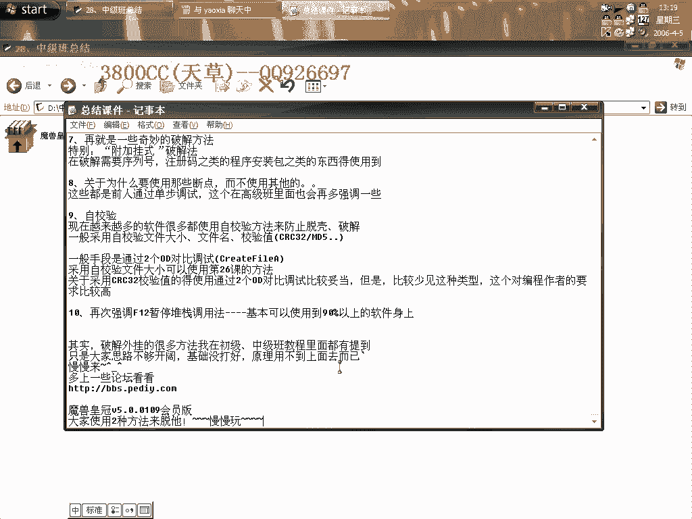

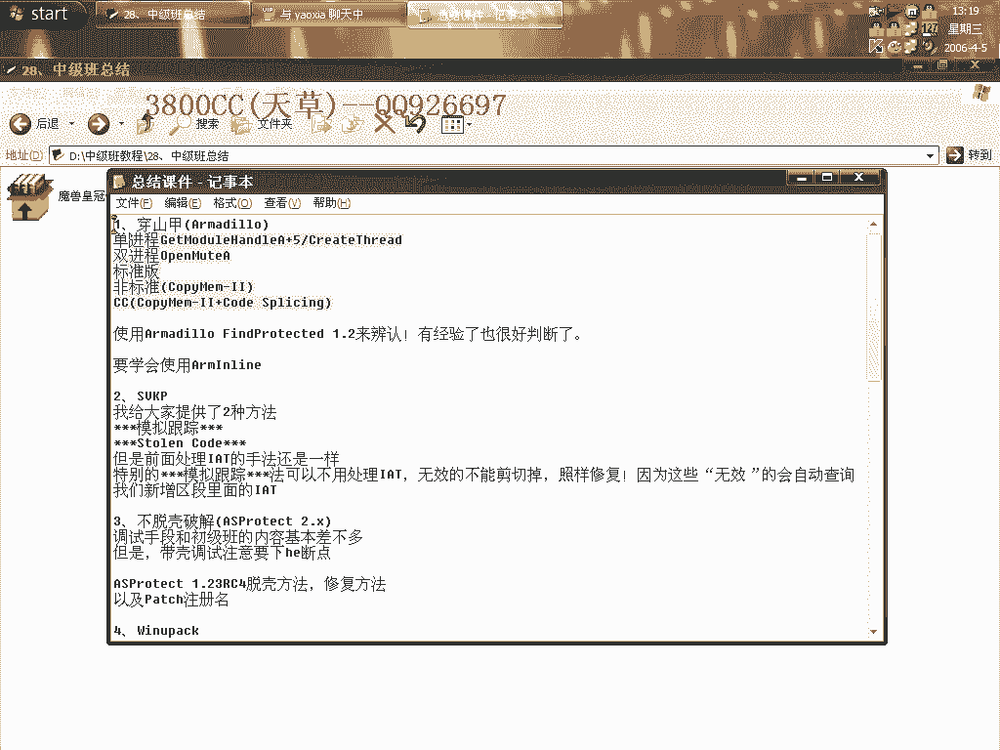

那这就课程啊，就总结这么多，我只是大概的就是说把一些思路提一下，注意的地方提一下啊，再见啊。

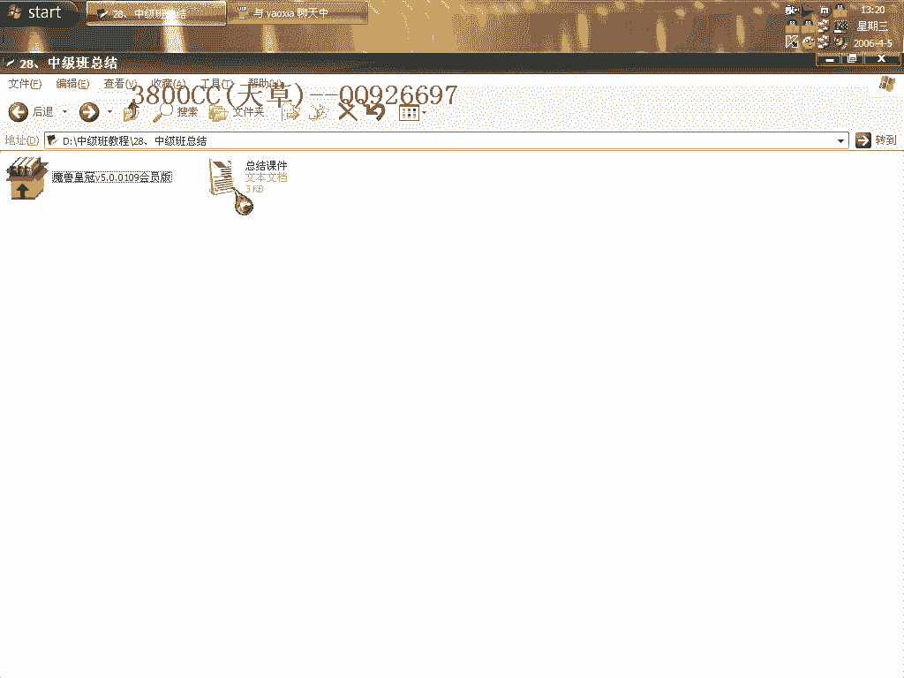

下次见。