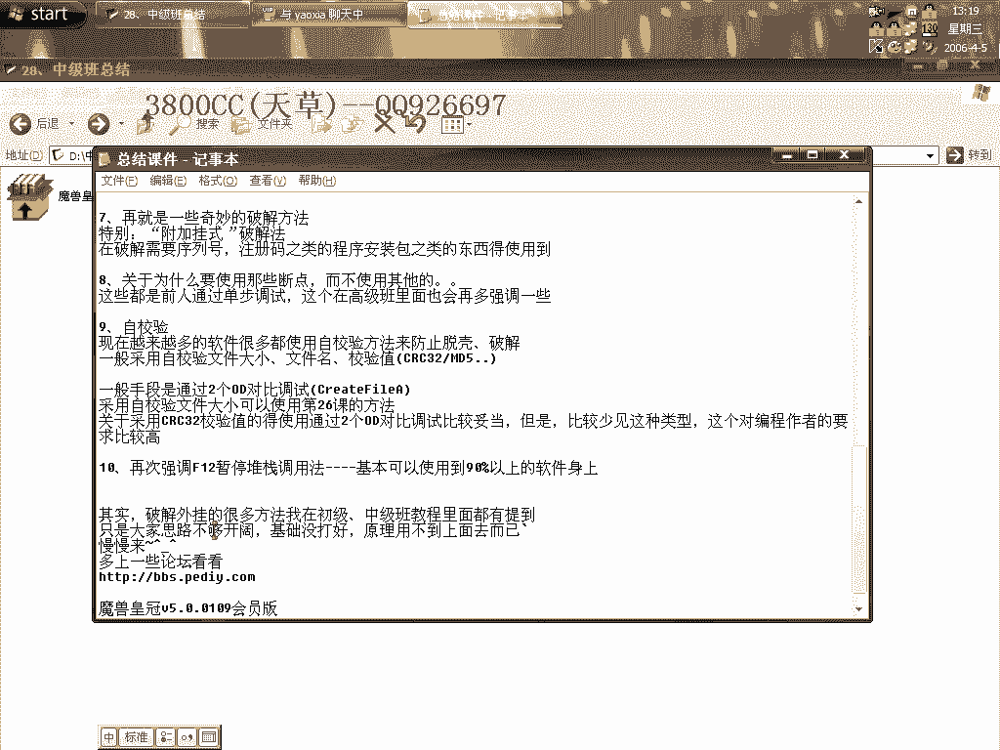
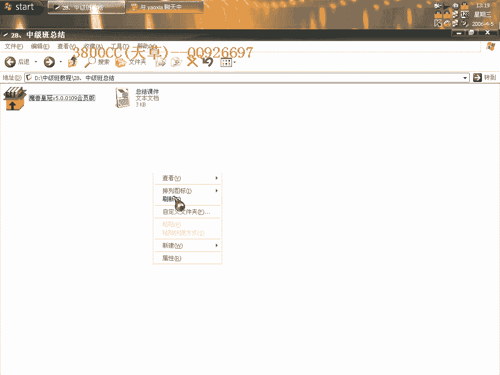

# 天草中级班 - P28：第28课 - 课程总结 🎓

在本节课中，我们将对天草中级班系列课程的核心内容进行回顾与总结。我们将梳理所学的几种主流强壳的脱壳方法、关键技巧以及一些通用的破解思路，帮助你巩固知识体系。

## 1. 穿山甲壳总结 🐢

上一节我们介绍了课程的整体结构，本节中我们来看看第一个重点：穿山甲壳。这是一种应用非常广泛的强壳。

穿山甲壳主要分为单进程版和双进程版，同时各有标准与非标准变种。

以下是穿山甲壳的主要类型与应对思路：

*   **单进程版**：脱壳相对简单。通常可以采用**两次断点法**，或一次断点在`00401000`代码段下内存访问断点的方法。但并非所有软件都适用`00401000`段下断。
*   **双进程版**：核心在于处理双进程转单进程的过程。标准版有固定的结合模式。
*   **非标准版**：脱壳手法多样。例如在第14课中讲解的方法较为易懂。修复时可能需要使用特定工具。

在辨认穿山甲壳时，可以依靠经验判断，网上也有大量相关的脱壳文章可供参考。

## 2. SVKP壳的处理 🔐

接下来，我们探讨一个处理起来非常麻烦的壳：SVKP。由于其StoneCode的保护，网上公开的有效处理方法极少。

本课程介绍了两种处理SVKP壳的方法，请务必技术保留。处理IAT（导入地址表）的前期手段是固定的。

以下是SVKP壳的关键点：

*   **模拟跟踪法**：此方法可以绕过对IAT的繁琐处理。即使存在无效指针也无需手动剔除，因为它们会自动查询到我们新增区段中的IAT数据。

## 3. 不脱壳破解与OSProtect 🛡️

本节我们聚焦于不脱壳破解技术，以OSProtect为例。其调试手段与初级班内容相似，但需特别注意代可调试。

以下是OSProtect相关要点：

*   **调试基础**：进行代可调试时，需使用`h`（单步步入）断点。这是非常基础的操作。
*   **OSProtect 1.23RC4**：这是一个非常有趣的软件，建议多练习。其脱壳与修复方法需要掌握。
    *   **特征**：最后一次异常通常会停在`XOR`（异或）指令，后跟两个`JMP`（跳转），最后是`RETN`（返回）。
    *   **破解注册名**：脱壳后可立即破解注册名。方法是在第二次硬盘指纹校验时，在代码段（`00401000`）下`F2`断点，返回后观察`EAX`寄存器存放的地址，该地址即指向注册名。

## 4. AceProtect 及其变种 🎭

现在，我们来看AceProtect及其变种壳。这类壳会修改PE头，给手动修复带来一些麻烦。

以下是AceProtect系列壳的脱壳思路：

*   **脱壳方法**：尝试在`LoadLibraryA`函数上下两次断点并返回，通常可到达OEP（原始入口点）附近。
*   **通用技巧**：主要方法是**忽略异常**。根据情况选择忽略`INT3`中断或内存访问异常，然后通过“中跟随”并下内存访问断点（按两次`F2`）来定位。
*   **寻找系统调用**：可采用模拟跟踪或第14课的方法。
*   **修复工具**：修复时，可单独用`ImportREC`（等级3），或使用特定插件，后者非常好用。
*   **指针处理**：AceProtect会对`MessageBoxA`等指针进行处理。如果在`user32`的函数列表中下断无效，则很可能是`MessageBoxA`被处理了。

关于AceProtect的IAT和系统调用的完美处理方法，将在高级班中深入讲解。

## 5. 其他强壳与技巧 💡

除了上述主流壳，课程还涉及其他一些加密强度较高的壳。

在这一部分，你需要掌握的是**色中查找函数**的方法，即下内存访问断点。不同版本思路类似，但壳的种类日新月异，需要持续学习。

## 6. 奇妙的破解方法 🪄

本节介绍一些特殊的破解思路，特别是**挂式破解法**。

这种方法适用于破解那些需要输入序列号或注册码的安装程序包。其核心思想是利用程序包的验证机制进行旁路。

## 7. 断点选择与规律 📏

你可能会问，为什么选择某些特定断点？这并非随意而为。

以下是断点选择的依据：

*   **经验规律**：这些是前人通过大量单步跟踪和调试总结出的有效规律。
*   **快速定位**：在跳往OEP附近时，常会出现特定函数调用。通过在这些函数上下断，可以快速到达关键位置。高级班将更加强调这些基础。

## 8. 自校验的应对 🔍

现代软件普遍采用自校验来防止修改。常见校验包括文件名、文件大小、CRC32或MD5校验值等。

以下是应对自校验的常见手段：

*   **双OD对比调试**：这是非常有效的方法，需要用到特定的断点技巧。
*   **文件大小校验**：可采用第26课讲解的方法处理，这很常见。
*   **CRC32等校验**：同样推荐使用双OD对比调试。这类校验对作者编程能力要求较高，因此相对少见。

## 9. 核心调用追踪法 🎯

最后，再次强调`F12`暂停法配合调用栈回溯的重要性。

此方法可应用于**90%以上**的软件，对于破解外挂尤其有效。破解外挂的许多思路已在初、中级班提及，关键在于开阔思路、打好基础，并将原理灵活运用。

## 10. 练习与进阶 🚀

理论需结合实践。课程提供了练习样本，请尝试用所学方法进行脱壳。

需要说明的是，脱壳比普通破解更为深奥。现阶段，你需要记忆各种壳的脱壳方法。随着基础不断牢固，许多原理自然会融会贯通。

建议多上技术论坛交流学习，推荐关注国内的相关安全论坛。

---

**本节课总结**：我们一起回顾了天草中级班的核心内容，涵盖了穿山甲、SVKP、OSProtect、AceProtect等主流强壳的脱壳思路、关键技巧以及自校验应对、调用追踪等通用方法。记住，技术之路在于持续练习与思考，将知识转化为解决问题的能力。再见，下次课见！