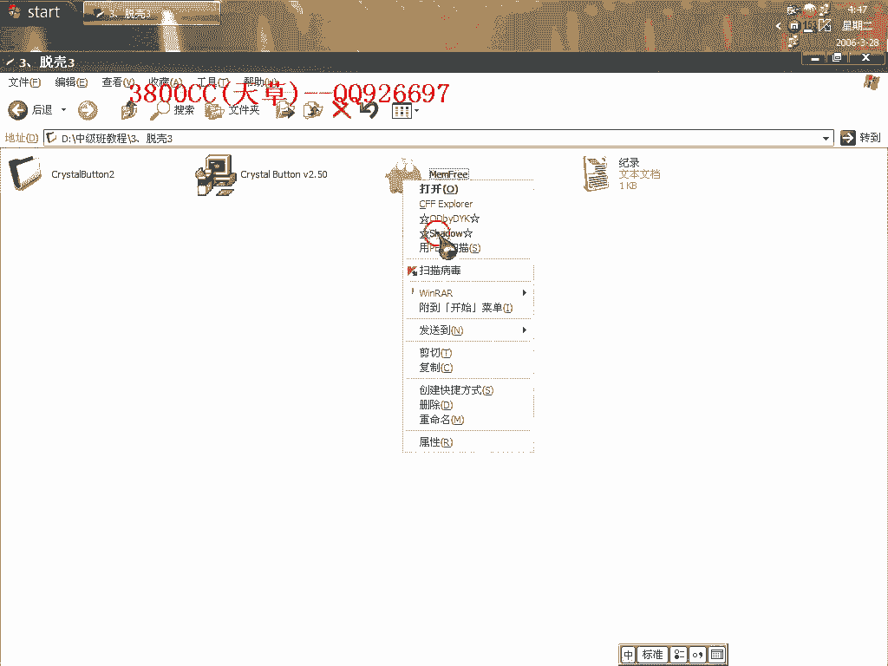
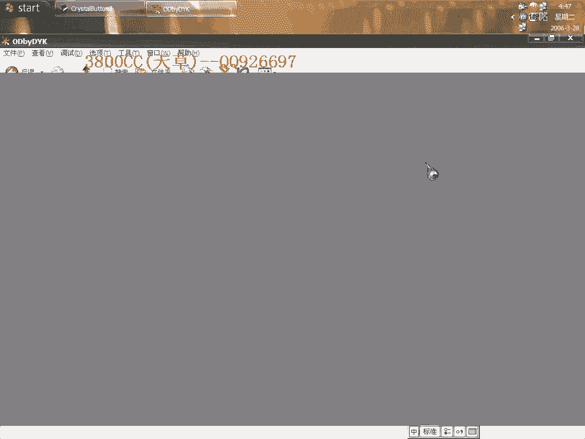
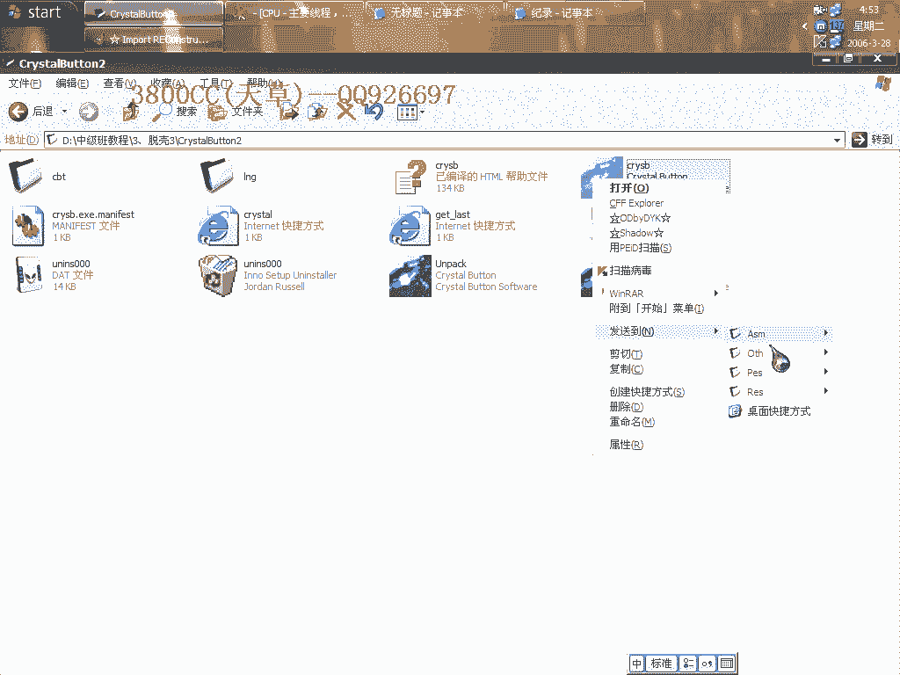
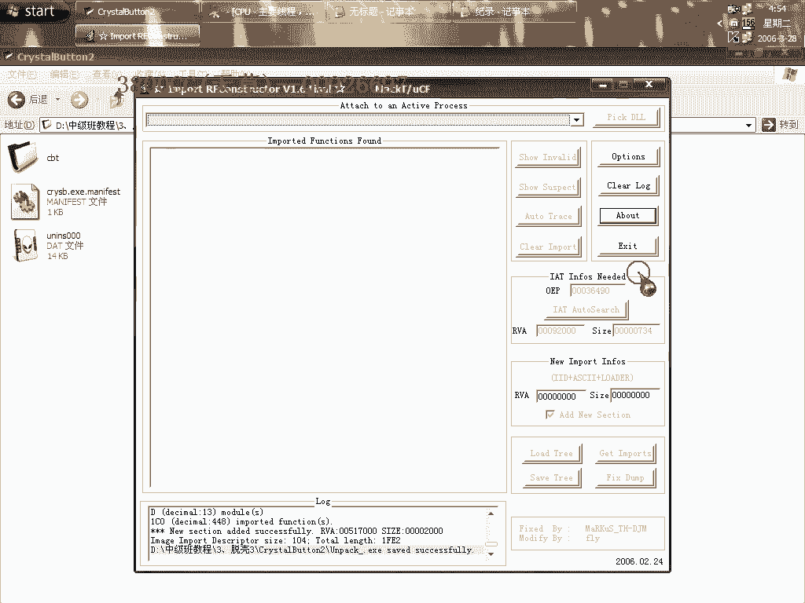
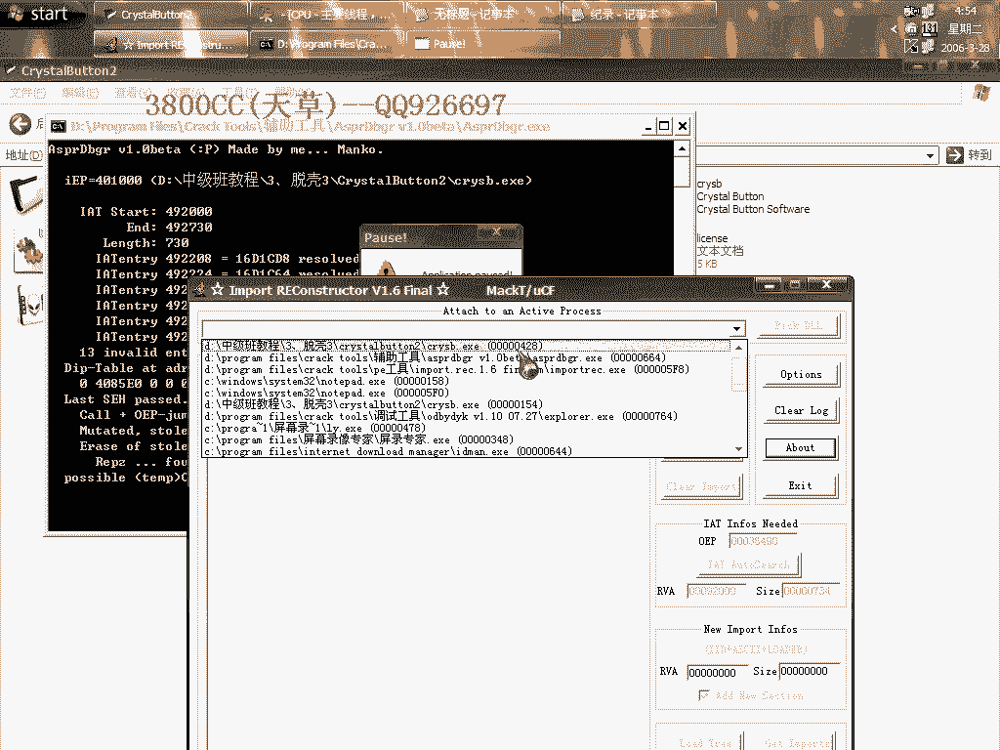
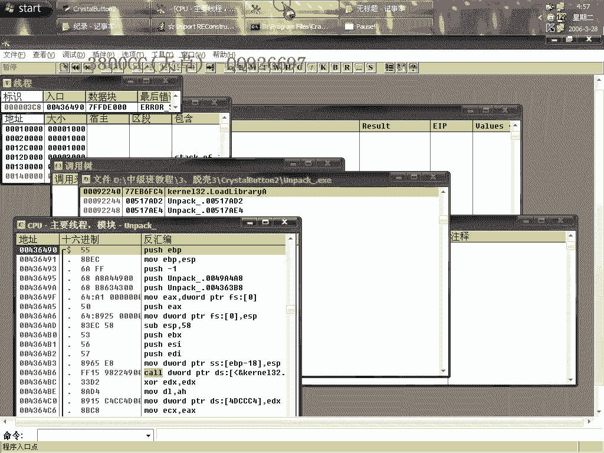
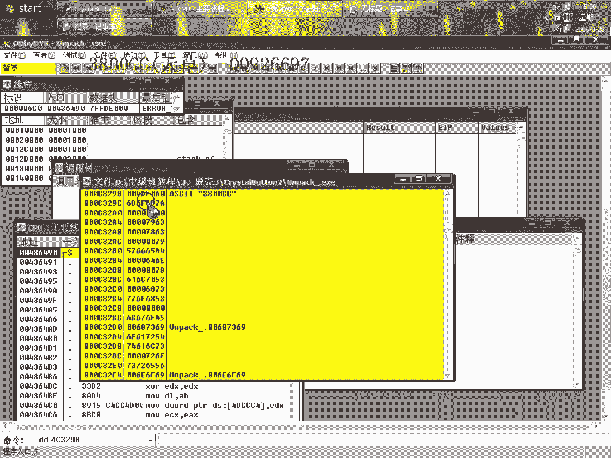
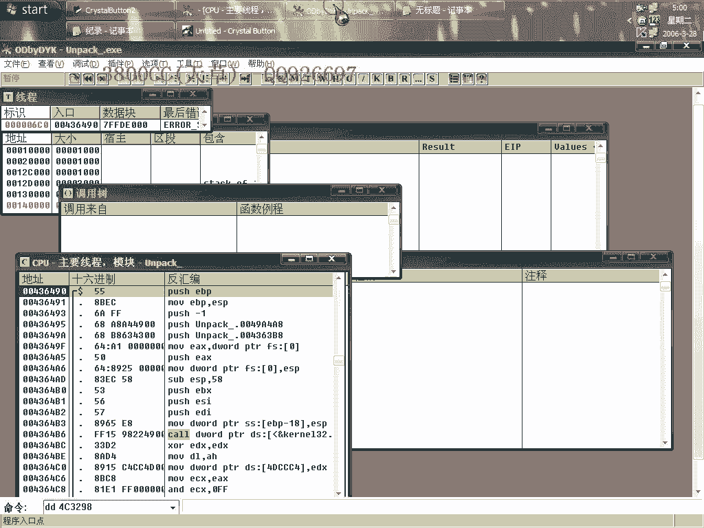
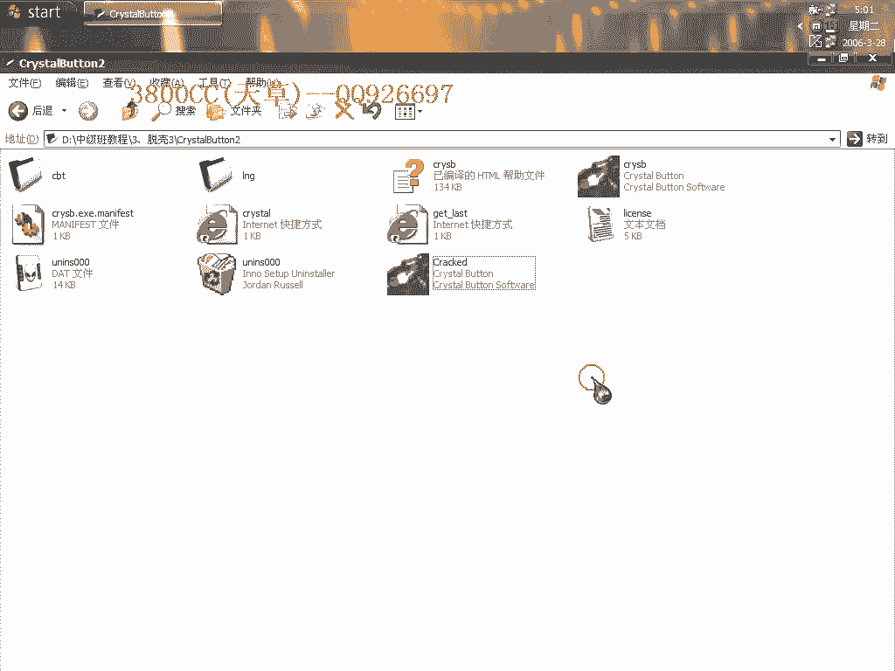

# 天草中级班 - P3：第03课 - 白嫖无双 🛡️

在本节课中，我们将学习如何对目标程序 **Sproc 1.23RC4** 进行脱壳与破解。这是一个非常经典的版本，脱壳过程较为复杂，一步出错就可能需要重来。课程将详细演示脱壳步骤，并介绍两种修复导入表的方法，最后还会讲解一种不脱壳直接破解的思路。

---

## 程序特征与准备 🔍



上一节我们介绍了程序的基本特征，本节中我们来看看目标程序的具体表现。

目标程序是 **Sproc 1.23RC4**。这是一个经典版本，在 Sproc 发展史上是一个重要的转折点。程序具有被抽取代码的特征，即 **Stolen Code**。



通过观察程序入口点，可以确认它是一个 VC 编译的程序头。


---

## 定位最后一次异常 🎯

现在，我们开始进行脱壳操作。

首先，在调试器中设置异常选项。忽略除内存访问之外的所有异常，目的是运行到程序的最后一次异常处。


按 **F9** 运行程序，直到触发最后一次异常。**Sproc 1.23RC4** 的最后一次异常有一个典型特征：连续出现两个 `retn` 指令。看到这个特征即可确认位置。

在第二个 `retn` 指令处下断点，再次按 **F9** 运行到此处。

---

## 寻找原始程序入口点（OEP） 🧭

程序中断后，观察堆栈窗口。取地址 `0012FF68`（此为标志性地址，即堆栈中第二个 `retn` 下方的第二个地址）。

对该地址设置硬件执行断点（命令：`hr 0012FF68`）。

按 **F9** 运行，程序会中断在另一个位置。此时删除硬件断点。

从这里开始，使用 **F7** 进行单步跟踪。需要仔细寻找被抽取的 **Stolen Code** 片段。



以下是寻找过程中可能遇到的代码特征示例：
```
// 示例代码特征 1
mov eax, dword ptr [ebp-0x4]
// 示例代码特征 2
push ebx
```

一路使用 **F7** 单步，直到走过一个 `popad` 指令。之后继续单步，会发现大量代码被虚拟机（VM）保护，呈现被抽取的状态。我们需要记录下这些代码片段的地址，以便后续修复。


---

## 修复导入表（方法一） 🔧


上一节我们找到了OEP和需要修复的代码位置，本节中我们来看看如何修复被破坏的导入表。


首先，在OEP处（例如 `00401000`）新建一个EIP（`new origin here`）。

然后使用 **LordPE** 工具完全转存（dump）当前进程。



以下是使用 **ImportREC** 工具进行修复的步骤：


1.  附加到OD载入的进程（本例中进程ID为 `154`）。
2.  在 **ImportREC** 中填入OEP地址（例如 `00001000`）。
3.  点击“自动查找IAT”，然后点击“获取输入表”。
4.  此时会看到许多无效的指针。**注意**：先不要勾选“使用有效指针”等选项。
5.  首先尝试使用“等级1”修复，这可以修复大部分指针。
6.  对于剩余的无效指针（例如6个），可以使用 **Sproc 1.22** 版本的专用插件进行修复。
7.  修复完成后，点击“转储到文件”，选择刚才dump出的文件进行修复覆盖。



此方法修复后的程序通常可以正常运行。

---

## 修复导入表（方法二） ⚙️

除了常规方法，还有一种针对 **Sproc 1.23RC4及以下版本** 的特殊修复方法。


使用一个特定的辅助工具（如脚本或插件）载入加壳程序。



1.  在工具中选择OD所在的进程线程（如 `154`）。
2.  填入OEP地址。
3.  点击修复。理论上，此方法可以一次性将所有指针修复为有效状态。

**但是**，在本例演示中，第二种方法修复后出现了问题：它将一个连续的指针数据（如 `92 40 92 240`）从中间错误地截断了，导致修复不完整。因此，我们最终仍采用了第一种更稳定的方法。


---

## 不脱壳破解思路 💡

如果脱壳过程复杂，我们也可以尝试不脱壳直接破解程序。


关键在于定位程序验证注册信息的关键点。



1.  运行加壳程序，在调试器中注意堆栈数据。
2.  第一次会出现“硬盘指纹”信息。
3.  第二次会出现用户名相关的数据。
4.  在代码段 `00401000` 附近下断点，按 **Alt+F9** 执行到返回。
5.  观察堆栈，找到一个关键地址（例如 `0012FFC0`），该地址用于存放或比较用户名。
6.  在内存中找一个空白区域（例如 `003800CC`），将我们希望的注册名写入该地址。
7.  通过补丁（Patch），将原程序指向用户名的指针改写到我们写入的地址（`003800CC`）。这样，程序读取到的就是我们指定的“正确”用户名，从而达到破解目的。


其核心逻辑可以用以下伪代码表示：
```
// 原程序逻辑
if (输入用户名 == 正确用户名) {
    注册成功;
}
// Patch后逻辑
if (内存地址[003800CC] == 正确用户名) { // 该地址已被我们写入期望的用户名
    注册成功;
}
```





---

## 总结 📝

本节课中我们一起学习了针对 **Sproc 1.23RC4** 的完整脱壳流程：
1.  通过特征定位最后一次异常和原始入口点（OEP）。
2.  使用 **ImportREC** 配合等级修复及专用插件修复导入表（方法一）。
3.  了解了一种针对低版本的特殊修复方法及其可能存在的问题（方法二）。
4.  最后，探讨了一种不脱壳直接通过内存补丁修改关键数据来实现破解的思路。


这是一个非常经典且有趣的壳，后续课程可能还会对其不同方面进行深入讲解。