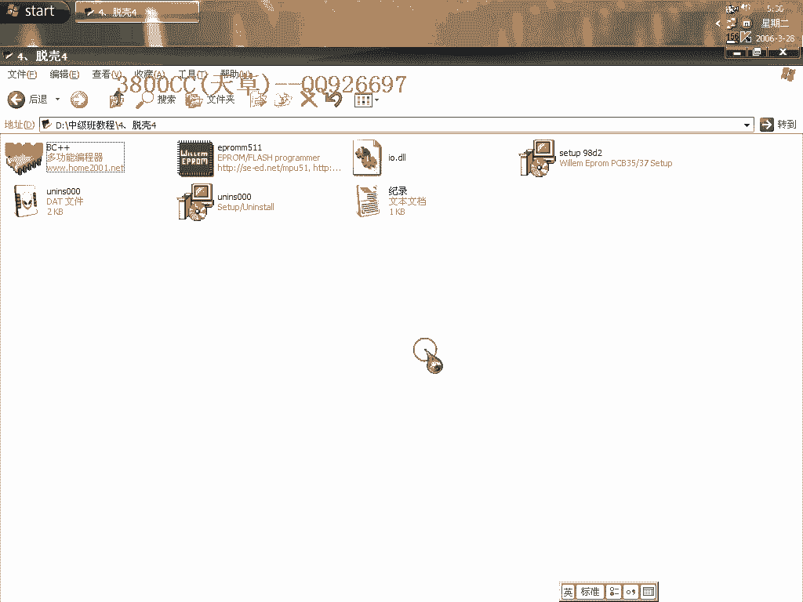

# 天草中级班 - P4：第04课 - 白嫖无双 - BV1qx411k7kd 🛡️


在本节课中，我们将要学习如何对一个高版本（1.41）的程序进行脱壳分析。我们将使用OD（OllyDbg）作为主要工具，通过ESP定律等方法定位OEP（原始入口点），并修复脱壳后的程序文件。整个过程会涉及识别程序结构、分析关键代码以及使用修复工具。


---

## 工具载入与初步分析 🔍

首先，使用OD载入目标程序。


每次载入程序，OD都会进行分析。为了避免繁琐，我们可以采用之前学过的方法：忽略分析，直接中断载入。在最后一次异常后，在指定位置按`F2`设置断点，然后删除该断点并按`F4`运行到此处。这样可以直接跳转到OEP附近进行观察。


观察程序结构，可以判断这是一个BC++（Borland C++）编写的程序。为了确认，我们可以与已知的BC++程序入口特征进行对比。打好基础，熟悉各种语言的入口特征非常重要。


我已经强调过多次，必须牢记这些入口特征。


大家可以看到，特征非常明显。我们将这段特征代码复制下来以备对照。

---

## 定位Stolen Code（被窃取的代码） 🧩

上一节我们识别了程序类型，本节中我们来看看如何找到被壳偷走并隐藏的代码（Stolen Code）。这与之前低版本的方法有所不同。

对于这个高版本壳，我们依然采用“忽略一次内存访问异常”的策略。隐藏OD后，程序运行。此时应用ESP定律：在栈指针（ESP）发生变化后下硬件访问断点。

单步执行并删除不必要的断点后，程序会停在关键代码处。

以下是需要找到的Stolen Code结构：
```
前三条指令
...
后两条指令（地址待定）
```

通过对比分析，可以确定前三条指令是固定的。我们需要找到的就是后面两条指令对应的地址。

---

## 到达OEP并分析关键值 🎯

为了找到缺失的两条指令地址，我们需要先到达程序的原始入口点（OEP）。

我们可以使用另一种方法：在代码段（.text）设置硬件写入断点，运行程序（F9），断下后删除断点，并在附近下`F2`断点。继续运行即可到达OEP。

到达OEP后，让OD进行分析。接下来分析关键值X和Y，它们对应着缺失的两条指令。

在代码中，可以看到类似以下结构的指令：
```
MOV EDI, [地址A]
MOV ECX, [地址B]
CMP EDI, ECX
```

这里，EDI和ECX寄存器中的值就是我们需要找的X和Y。通过单步执行并观察寄存器窗口，可以很容易地获取这两个地址。

有时代码会被混淆，需要仔细分析。如果单步错过了，可以重新运行程序并快速断在OEP附近。

最终，我们得到了完整的Stolen Code，包括所有五条指令。

---

## 修复脱壳文件 🛠️

现在，我们开始修复脱壳后的程序文件。

首先，在修复工具中填入OEP地址。然后处理导入表（Import Table）。将基址（ImageBase）修改为`0`，并将大小（Size）设置为`1000`。

点击“获取输入表”后，可能会发现很多无效的指针。使用插件的“无效 - 切割”功能进行处理。注意，有一个指针需要特殊处理，它指向`MaxDbox`相关函数，必须保留。

修复完成后，剪切掉无效指针并再次修复。

---

## 测试与优化 📊

运行修复后的程序，可能会出现错误提示，但程序基本可以运行。错误源于脱壳过程中未对某些代码进行特殊处理。

观察导入表函数，可以发现它们按名称顺序排列（如`i`开头的在一起，`K`开头的在一起）。我们可以尝试选择不同的函数指针作为起点进行测试，但某些选择仍会报错。

选择`timeout`相关的指针进行修改后，程序运行可能不再有错误提示。

但是，为了更彻底，我们用OD载入脱壳后的文件进行验证。尝试使用`F12`暂停法调用堆栈，程序可能会拦截并阻止OD调试。这说明我们的修复方法还不够完美，某些代码仍未完全解码。

我们也可以尝试手动修改未解码区域的指针。观察可知，这些指针的排列有一定规律。

最后，处理文件体积。原始脱壳文件可能很大。使用`LordPE`等工具的重建功能，并勾选所有压缩选项，可以将文件体积显著减小（例如压缩到原来的10%），而不影响功能。

需要注意的是，这是程序的安装包。在首次运行于新系统时，可能会报错且退出异常，需要在任务管理器中结束进程。第二次运行即可正常。



---

## 总结 📝

本节课中，我们一起学习了针对高版本壳的脱壳与修复流程。

我们首先使用OD和ESP定律定位OEP，并分析了BC++程序的入口特征。接着，我们找到了被窃取的代码（Stolen Code）并确定了其完整结构。然后，我们使用工具修复了导入表，并测试了修复效果。最后，我们还探讨了如何优化脱壳后文件的体积。

关键操作可以总结为以下步骤：
1.  **载入与分析**：OD载入，忽略分析，快速定位。
2.  **定位Stolen Code**：使用ESP定律，对比分析找到完整代码块。
3.  **到达OEP**：利用内存写入断点快速到达原始入口。
4.  **修复文件**：填写正确OEP，修复导入表，处理无效指针。
5.  **测试与压缩**：运行测试，使用重建功能压缩文件体积。


掌握这些步骤，你就能应对许多类似的加壳程序了。