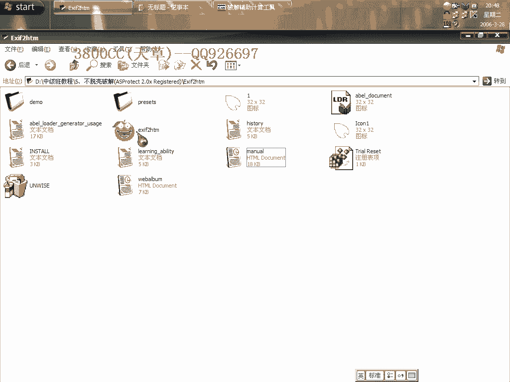
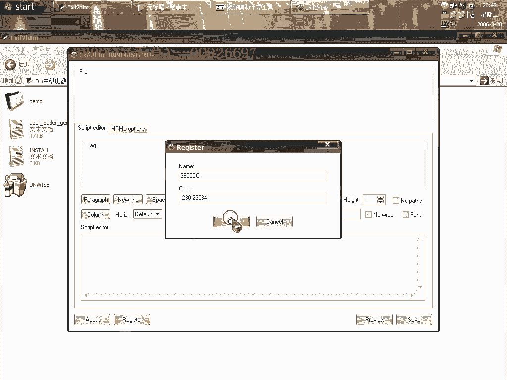

# 天草中级班 - P5：第05课 - 白嫖无双 - BV1qx411k7kd

现在来进行我们这个第五课，终极版的第五课，我这里呢，就是说，这个课，是OSPROC 2。0那课，我们来不拖课破解，不拖课破解，好，因为像他这种课，要拖起来非常非常麻烦，非常非常的麻烦。

而且他还有这个什么教验啊，CRC教验，内存教验，直接运行啊，提示还剩下多少题啊，这里呢，3800CC啊，提示这个啊。

我们现在要把它对对对进去分析一下啊，分析一下，这个要再来找一个参考文本啊，大家来看一下，有这个，我们搜索这个吧。

seo。dus，好，就这里了。

大家来看一下。

大家再看一下上面啊，这个好像是注册成功啊，注册成功，然后呢，这里，我们在这个地方，这是关键，关键call了，下硬件执行端点啊，是硬件执行端点啊，再点OK。

大家来看一下啊，进去啊，进去，可以看一下算法，看一下有没有算法啊，这里呢，就是算法了，大家看到，这里是把3800CC啊，放入ECX啊，ECX，然后呢，EDX首先除值为1啊，首先的除值为1，现在变为2了。

变为2，因为刚才循环了一次的啊，然后呢，大家看一下，取8，大家看到，看清楚啊，EDX-1，EDX-1=1，等于1呢，然后再ECX啊，ECX就取它的第二位，取它的第二位，然后呢，相加，就是第一个3嘛。

第一个3把它变为20卡嘛，就是33，加上第二个38，加起来之后，放入ESI，ESI里面，然后再循环，此时啊，EDX+1啊，EDX+1，然后呢，EAX就减1，就是说，它从EX是从第六位啊，就这里。

第六位开始往左边循环的，然后EDX呢，是往右边，从左往右，EX是从右往左，这个样子进行循环。

因为它这个会控制着这个JNG啊，大家再看清楚，原本是这样相加，就是把每一位，把每一位的20卡码值进行相加，好，现在呢，是EAX和ESI相乘，大家看到，放到EX里面去，那EX就是B459，那接下来。

B459是等于多少呢，等下看下，是不是46169啊，46169，等下就可以看得到啊，它变成就是说，这里还有X，肯定这里进去，还有另外一个算法，变成23084了啊，23084，这里啊。

大家看清楚对战和计存器啊，现在开始取注册码了啊，取注册码，好，这里取了两个啊，两个，好，这里呢，EDX，我们来看下EDX里面是什么值啊，EDX是121954，没有啊，没有，6放到EDX里面去啊。

6放到EDX54，也就是这个，好，继续单步走，好，这个它就跳了啊，这个跳了，我们现在来看一下，现在来看一下，把这个硬件断点给删掉先，好，注册码。

人员错误，那我们来继续来看一下啊，继续来看一下是哪里有问题啊。

我们继续进去看一下啊，这里我们就循环过去吧，这里我们还可以进去看一下啊，C，C，ISI，减去4，C，这里呢，有一个4CC啊，4CC，大家看到这是第二部分算法了，第二部分算法，ECX为A，就是EAX。

EAX除以A，除以ECX，那咱们来计算器算一下啊，904，904除以A，16，我们来看一下是不是16。

是16啊，16了然后，这个ESI呢，ESI就减1嘛，ESI减1，然后DL啊，DL是多少，是08，大家看到就是EDX的后面最低两位，相加就等于38，然后38呢，就与DL相比较啊，DL和3A进行比较。

就说这里啊，38，这里38，然后38放ESI里面去，ESI其实这里是一个对战的值啊，是一个对战值，并不是这里面所显示的值，看清楚，好，就是84，就变成84了啊，84是之一了啊，是之一，然后继续循环啊。

这同样的啊，84变为之一，这里呢，是11啊，11了。

好，084啊，好，384，大家看到了啊，这个是我们取的这个，这个是怎么变换过来的啊。

怎么变换过来的啊，取的就是这个了，23084，大家看到了，算法了。

好，返回了，啊，他刚才获取这个的位数是5啊，EAX就为5了，然后EDX呢，EDX也是5啊，相减就变为0，相减变为0，然后ECX呢，ECX是0啊，把5放到ECX里面去，现在呢，是把这个这一部分啊。

这部分放到EX里面去，继续啊，大家看到这是我们的一个注册码啊，刚才输入了一个假的注册码，好，大家看到了，他这个就是说，是怎么样的回事啊，他现在啊，把这个-2308啊，-2308。

就是-2308，这里，他现在又把这个当成5位了啊，当成5位了，这后面的呢，这前面是5位，这呢，是5位啊，这里是5位，好，2308，这里我们也记录一下啊，也记录一下，他把这个符号啊，当成5位了，好。

那我们现在就可以知道啊，他居然把这个，就是说把这个符号也当成5位，那我们这里看一下，把前面的啊，去掉，大家看到了啊，这成功了，因为他这是把这个啊，因为他这是把这个，这个斜杠号啊，也当成5位。

那我们把前面给去掉啊，前面去掉一个1之后啊，去掉一个1之后，就是这里的，而且呢，还有一个很奇怪的一个问题。

就是说，大家看到，如果注册成功的话，注册成功的话，他会生成这么一个K文件，大家看到啊，已经生成了。

已经生成了这个K文件了，已经注册成功了啊。

obot 3800cc，而且大家再看一下，这前面的1啊，前面的4个1，是我们放的那个，我们输入了一个假码，刚才输入的是23，输入的是这么一个注册码，输入了这么一个注册码，他就变成了。

变成了这样的一个注册码，这样的，我们来看一下这个注册码能不能注册成功，而且呢，这里只是4位啊，只要4位，至于是去掉哪一位，我们来看一下，把这个删掉。

好，错了，错了，然后我们去掉8看一下，大家看到了吧。

注册成功了，这个，也就是说这个软件啊，他这个注册码，后面的一部分呢，是由我们的一个注册名来组成的，那前面的呢，是我们输入了一个假码，输入了假码来取的。

假注册码来取的，很清楚了，然后呢，还有一个，大家看到，我把那个给剪走，他就没有注册成功。

那我们这个样子试一下，如果注册成功了的话，他就生成这么一个文件，那我们来伪造一个这个文件，看一下放进去，看一下能不能，不行啊，不行，大家看到了哈，注册码，那我们伪造这么一个文件呢。

大家看到了啊，可以，因为啊，这后面的这个是我们的用户名编来的，前面呢，是注册码，注册码是随便的啊，我们可以，二二三，但是必须要试味啊，看一下我们的猜想是否正确，没错，就这么奇怪啊，就这么奇怪，好了。

今天这个内容就这么多，今天这个内容就这么多，再见，东西都在这儿，大家在自己下去念一下。

